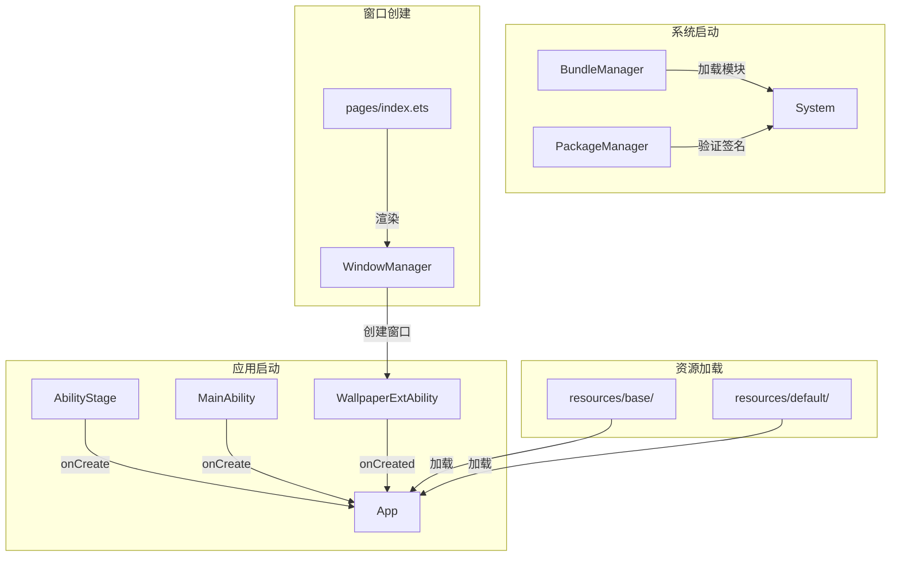
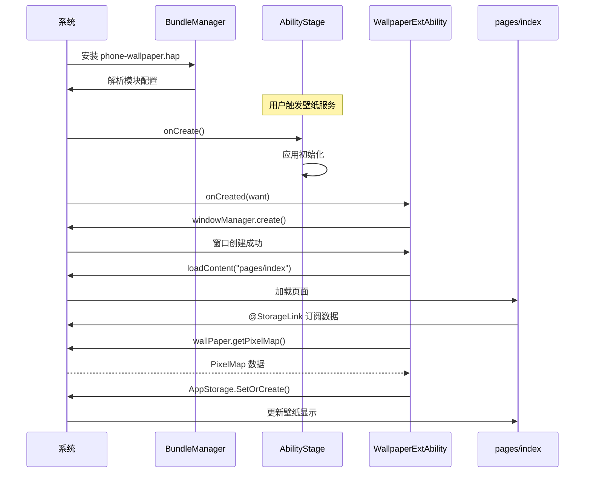

# 编译产物

> 本章档说明本项目的编译产物清单、安装路径和运行时加载关系。

## 产物清单

### 最终产物

| 产物名称 | 类型 | 模块 | 设备类型 |
|----------|------|------|----------|
| `phone-wallpaper.hap` | Hap 包 | phone-wallpaper | phone |
| `pad-wallpaper.hap` | Hap 包 | pad-wallpaper | pad |

### 产物结构

```
phone-wallpaper.hap
├── module.json5              # 模块配置
├── resources/                # 资源文件
│   ├── base/
│   │   ├── element/         # 字符串资源
│   │   ├── media/           # 图片资源
│   │   └── profile/         # 页面配置
│   └── default/             # 默认资源
├── ets/                      # 字节码文件
│   └── ...                  # 编译后的 ArkTS 字节码
└── signature/               # 签名信息（如有）
```

## 安装路径

### 系统预置路径

| 产物 | 预置路径 | 说明 |
|------|----------|------|
| phone-wallpaper.hap | `/system/app/phone_wallpaper/` | 系统预置应用目录 |
| pad-wallpaper.hap | `/system/app/pad_wallpaper/` | 系统预置应用目录 |

### 沙箱路径

| 路径 | 用途 |
|------|------|
| `/data/app/<bundleName>/<userId>/` | 用户数据目录 |
| `/cache/<bundleName>/` | 缓存目录 |

## 运行时加载关系

### 应用启动加载流程



### 模块加载时序



## 依赖加载顺序

### 静态依赖

| 依赖项 | 加载时机 | 说明 |
|--------|----------|------|
| **@ohos.wallpaper** | 运行时按需加载 | 系统服务代理 |
| **@ohos.window** | 运行时按需加载 | 系统窗口管理 |
| **@ohos.WallpaperExtension** | 编译时链接 | 基类定义 |
| **@ohos.application.Ability** | 编译时链接 | 基类定义 |
| **@ohos.application.AbilityStage** | 编译时链接 | 基类定义 |

### 动态依赖

| 依赖项 | 加载时机 | 说明 |
|--------|----------|------|
| **WindowManager** | 调用 create() 时 | 创建窗口实例 |
| **wallPaper** | 调用 getPixelMap() 时 | 获取壁纸数据 |

## 资源加载

### 资源类型

| 资源类型 | 路径 | 加载方式 |
|----------|------|----------|
| **字符串** | `resources/base/element/string.json` | $string:xxx |
| **图片** | `resources/base/media/*` | $media:xxx |
| **页面配置** | `resources/base/profile/main_pages.json` | $profile:xxx |

### 资源打包

- 所有资源编译到 `.hap` 包内
- 资源按设备类型分拣（phone/pad）
- 签名信息嵌入 `.hap` 包

## 版本信息

| 属性 | 值 | 位置 |
|------|-----|------|
| **Version Code** | `1000000` | AppScope/app.json5 |
| **Version Name** | `1.0.0` | AppScope/app.json5 |
| **Bundle Name** | `com.ohos.wallpaper` | AppScope/app.json5 |
| **Module Type** | feature | module.json5 |

## 相关文档

- [构建配置](06_Build.md)
- [架构说明](03_Architecture.md)
- [安全评审](08_Security.md)
