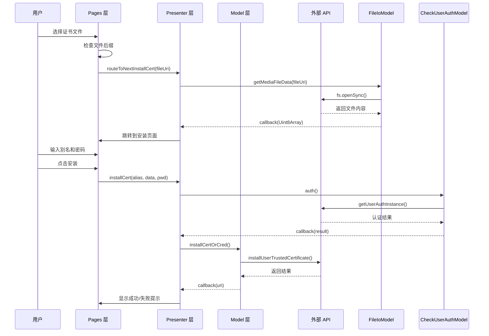
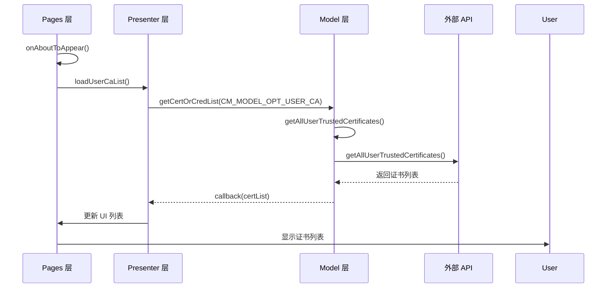
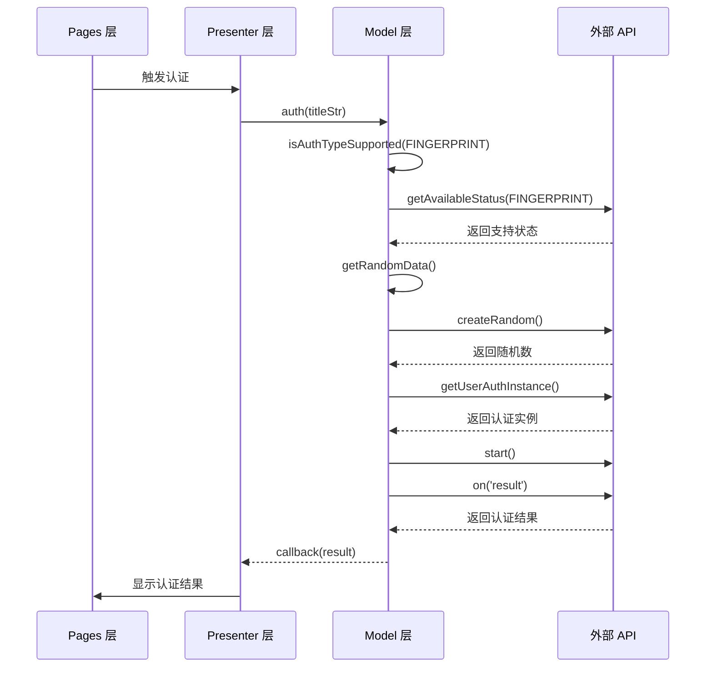

# 架构设计

> 本文档描述用户证书管理部件的架构设计、数据流和时序图

---

## 目的

本文档帮助架构师和开发者理解应用的整体架构、模块间交互和数据流向。

## 适用范围

- OpenHarmony 架构师
- 需要深入理解系统的开发者
- 技术负责人

## 关键结论

1. **分层架构**: Model-Presenter-Page (MVP) 分层，单向依赖
2. **模块化**: 功能模块清晰分离，便于维护和扩展
3. **事件驱动**: 用户操作通过事件传递到 Presenter，再到 Model
4. **全局状态**: 使用 GlobalContext 管理跨模块状态
5. **单例模式**: 关键模块使用单例模式，保证全局唯一性

## 相关跳转

- [02_Directory_Structure.md](wiki/02_Directory_Structure.md) - 目录结构
- [05_Internal_API.md](wiki/05_Internal_API.md) - 内部接口
- [appendix/Callgraphs.md](wiki/appendix/Callgraphs.md) - 调用链

---

## 1. 整体架构

### 1.1 分层架构图

```mermaid
graph TB
    subgraph Pages["Pages 层 (UI)"]
        P1[主页面<br/>certManagerFa.ets]
        P2[安装页面<br/>certInstallFromStorage.ets]
        P3[详情页面<br/>detail/*.ets]
        P4[选择器页面<br/>picker/*.ets]
    end

    subgraph Presenters["Presenter 层 (页面逻辑)"]
        R1[CmFaPresenter<br/>主页面逻辑]
        R2[CmInstallPresenter<br/>安装页面逻辑]
        R3[CmShow*Presenter<br/>列表管理逻辑]
    end

    subgraph Models["Model 层 (业务逻辑)"]
        M1[CertMangerModel<br/>证书管理核心]
        M2[CheckUserAuthModel<br/>用户认证]
        M3[BundleModel<br/>包信息获取]
        M4[FileIoModel<br/>文件 I/O]
        M5[PreventScreenshotsModel<br/>防截屏]
    end

    subgraph Common["Common 层 (公共组件)"]
        C1[GlobalContext<br/>全局上下文]
        C2[constants/<br/>常量定义]
        C3[components/<br/>公共组件]
        C4[utils/<br/>工具函数]
    end

    subgraph External["外部 API (系统服务)"]
        E1[@ohos.security.certManager<br/>证书管理服务]
        E2[@ohos.userIAM.userAuth<br/>用户认证]
        E3[@ohos.bundle.bundleManager<br/>包管理]
        E4[@ohos.file.fs<br/>文件系统]
    end

    P1 --> R1
    P2 --> R2
    P3 --> R3
    P4 --> R1

    R1 --> M1
    R1 --> M4
    R1 --> M2
    R2 --> M1
    R2 --> M2
    R3 --> M1
    R3 --> M3

    M1 --> E1
    M2 --> E2
    M3 --> E3
    M4 --> E4

    P1 --> C1
    R1 --> C1
    M2 --> C1
```

**证据位置**: `certmanager/src/main/ets/` 目录结构, `certmanager/src/main/ets/model/*.ets` (import 语句)

---

## 2. 模块交互

### 2.1 Model 层职责

| 模块 | 职责 | 依赖 |
|------|--------|------|
| `CertMangerModel` | 封装证书/凭据管理逻辑 | `@ohos.security.certManager` |
| `CheckUserAuthModel` | 封装用户认证逻辑 | `@ohos.userIAM.userAuth` |
| `BundleModel` | 封装包信息获取逻辑 | `@ohos.bundle.bundleManager` |
| `FileIoModel` | 封装文件 I/O 逻辑 | `@ohos.file.fs` |
| `PreventScreenshotsModel` | 封装防截屏逻辑 | `@ohos.window` |

**证据位置**: `certmanager/src/main/ets/model/*.ets`

### 2.2 Presenter 层职责

| 模块 | 负责页面 | 依赖的 Model |
|------|----------|-------------|
| `CmFaPresenter` | 主页面、文件选择 | `CertMangerModel`, `FileIoModel`, `CheckUserAuthModel` |
| `CmInstallPresenter` | 安装页面 | `CertMangerModel`, `CheckUserAuthModel` |
| `CmShowUserCaPresenter` | 用户 CA 列表 | `CertMangerModel` |
| `CmShowSysCaPresenter` | 系统 CA 列表 | `CertMangerModel` |
| `CmShowAppCredPresenter` | 用户凭据列表 | `CertMangerModel`, `BundleModel` |
| `CmShowSysCredPresenter` | 系统凭据列表 | `CertMangerModel` |
| `CmAppCredAuthPresenter` | 授权应用管理 | `CertMangerModel`, `BundleModel` |

**证据位置**: `certmanager/src/main/ets/presenter/*.ets` (import 语句)

---

## 3. 数据流

### 3.1 证书安装流程



**证据位置**: `certmanager/src/main/ets/model/CertMangerModel.ets:287-317`, `certmanager/src/main/ets/model/CheckUserAuthModel.ets:61-117`, `certmanager/src/main/ets/presenter/CmFaPresenter.ets:64-93`

---

### 3.2 证书列表加载流程



**证据位置**: `certmanager/src/main/ets/model/CertMangerModel.ets:90-118`, `certmanager/src/main/ets/model/CertMangerModel.ets:423-453`

---

### 3.3 用户认证流程



**证据位置**: `certmanager/src/main/ets/model/CheckUserAuthModel.ets:31-117`

---

## 4. 线程模型

### 4.1 异步操作

| 操作 | 异步方式 | 说明 |
|------|---------|------|
| 证书安装 | async/await | 避免阻塞 UI |
| 证书删除 | async/await | 避免阻塞 UI |
| 证书查询 | async/await | 避免阻塞 UI |
| 用户认证 | async/callback | 避免阻塞 UI |
| 文件读取 | sync | 小文件读取 |
| 包信息获取 | async/await | 避免阻塞 UI |

**证据位置**: `certmanager/src/main/ets/model/*.ets` (async/await 关键字)

### 4.2 线程安全

| 模块 | 线程安全策略 |
|------|-------------|
| `GlobalContext` | 单例模式，无并发问题 |
| `PwdStore` | 封装在 GlobalContext 中 |
| `CertMangerModel` | 每次操作独立，无共享状态 |
| `CheckUserAuthModel` | 每次认证独立，无共享状态 |

**证据位置**: `certmanager/src/main/ets/common/GlobalContext.ts:36-52`, `certmanager/src/main/ets/model/CertMangerModel.ets:89-834`

---

## 5. 状态管理

### 5.1 全局状态

```typescript
// GlobalContext 管理的全局状态
interface GlobalState {
  context: UIAbilityContext;      // Ability 上下文
  want: Want;                     // 启动参数
  pwdStore: PwdStore;              // 密码存储
  session: UIExtensionContentSession;  // 会话对象
  flag: Boolean;                   // 标记位
}
```

**用途**:
- `context`: 跨模块访问 Ability 上下文
- `want`: 传递启动参数
- `pwdStore`: 临时存储密码（安装流程中）
- `session`: 访问会话对象（用于半模态窗口）
- `flag`: 控制页面行为

**证据位置**: `certmanager/src/main/ets/common/GlobalContext.ts:40-92`

### 5.2 临时状态

| 状态 | 存储位置 | 生命周期 |
|------|----------|---------|
| 密码 | `PwdStore.certPwd` | 安装流程中 |
| 会话对象 | `GlobalContext.session` | Session 存活期间 |
| 启动参数 | `GlobalContext.want` | Ability 存活期间 |

**证据位置**: `certmanager/src/main/ets/common/GlobalContext.ts:42-44, `certmanager/src/main/ets/MainAbility/CertPickerUiExtAbility.ets:57-60`

---

## 6. 事件处理

### 6.1 页面生命周期事件

| 事件 | 处理位置 | 用途 |
|------|----------|------|
| `onAboutToAppear()` | Presenter 层 | 页面即将显示，初始化数据 |
| `aboutToDisappear()` | Presenter 层 | 页面即将消失，清理资源 |

**证据位置**: `certmanager/src/main/ets/presenter/CmFaPresenter.ets:40-45`

### 6.2 用户交互事件

| 事件 | 处理位置 | 用途 |
|------|----------|------|
| 文件选择 | `CmFaPresenter.ets:64-93` | 触发证书/凭据安装 |
| 证书点击 | Pages 层 | 显示证书详情 |
| 安装按钮点击 | `CmInstallPresenter.ets` | 执行安装操作 |
| 授权切换 | `CmAppCredAuthPresenter.ets` | 切换应用访问权限 |

**证据位置**: `certmanager/src/main/ets/presenter/*.ets`, `certmanager/src/main/ets/pages/*.ets`

---

## 7. 扩展机制

### 7.1 UI Extension

**类型**: sys/commonUI

**入口点**: `CertPickerUiExtAbility.ets`

**支持页面类型**:
1. 证书选择器 (默认)
2. 证书安装 (PAGE_CA_INSTALL = 5)
3. 授权页面 (PAGE_REQUEST_AUTHORIZE = 6)
4. UKey 认证 (PAGE_UKEY_AUTH = 7)

**证据位置**: `certmanager/src/main/ets/MainAbility/CertPickerUiExtAbility.ets:22-24, `certmanager/src/main/ets/MainAbility/CertPickerUiExtAbility.ets:75-94`

### 7.2 半模态窗口

**用途**: 作为其他应用的子窗口显示，不阻塞主应用

**实现方式**:
- 使用 `session.loadContent()` 加载内容
- 使用 `session.setWindowPrivacyMode()` 设置隐私模式

**证据位置**: `certmanager/src/main/ets/MainAbility/CertPickerUiExtAbility.ets:48-72`

---

## 8. 资源管理

### 8.1 资源加载

```
系统启动
  ↓
加载 app.json
  ↓
加载 module.json
  ↓
加载 main_pages.json
  ↓
加载字符串资源 (base/en_US/zh_CN)
  ↓
加载媒体资源
  ↓
应用就绪
```

**证据位置**: `AppScope/app.json`, `certmanager/src/main/module.json`, `certmanager/src/main/resources/base/profile/main_pages.json`

### 8.2 多语言支持

| 语言 | 目录 | 加载优先级 |
|------|------|------------|
| 默认 | `base/` | 最高 |
| 英语 | `en_US/` | 第二 |
| 简体中文 | `zh_CN/` | 第三 |

**证据位置**: `certmanager/src/main/resources/` 目录结构

---

## 9. 设计模式

### 9.1 单例模式

| 模块 | 实现方式 |
|------|----------|
| `GlobalContext` | 静态方法 `getInstance()` |
| `CmFaPresenter` | 静态方法 `getInstance()` |
| `CmInstallPresenter` | 静态方法 `getInstance()` |
| `PreventScreenshotsModel` | 静态方法 `getInstance()` |

**证据位置**: `certmanager/src/main/ets/common/GlobalContext.ts:47-52`, `certmanager/src/main/ets/presenter/*.ets` (getInstance 方法)

### 9.2 模型-视图- Presenter (MVP) 模式

```
Model (数据层)
  ↓ 提供 API
Presenter (业务逻辑层)
  ↓ 处理业务逻辑
Page (视图层)
  ↓ 展示 UI
  ↓ 接收用户输入
```

**优势**:
- 职责分离
- 易于测试
- 易于维护

**证据位置**: `certmanager/src/main/ets/` 目录结构

### 9.3 回调模式

大量使用回调函数进行异步操作：

```typescript
// Model 层定义接口
someMethod(params, callback: Function): void {
  // ...
  callback(result);
}

// Presenter 层调用
model.someMethod(params, (result) => {
  // 处理结果
});
```

**证据位置**: `certmanager/src/main/ets/model/CertMangerModel.ets:90-118`

---

**END OF 03_Architecture.md**
