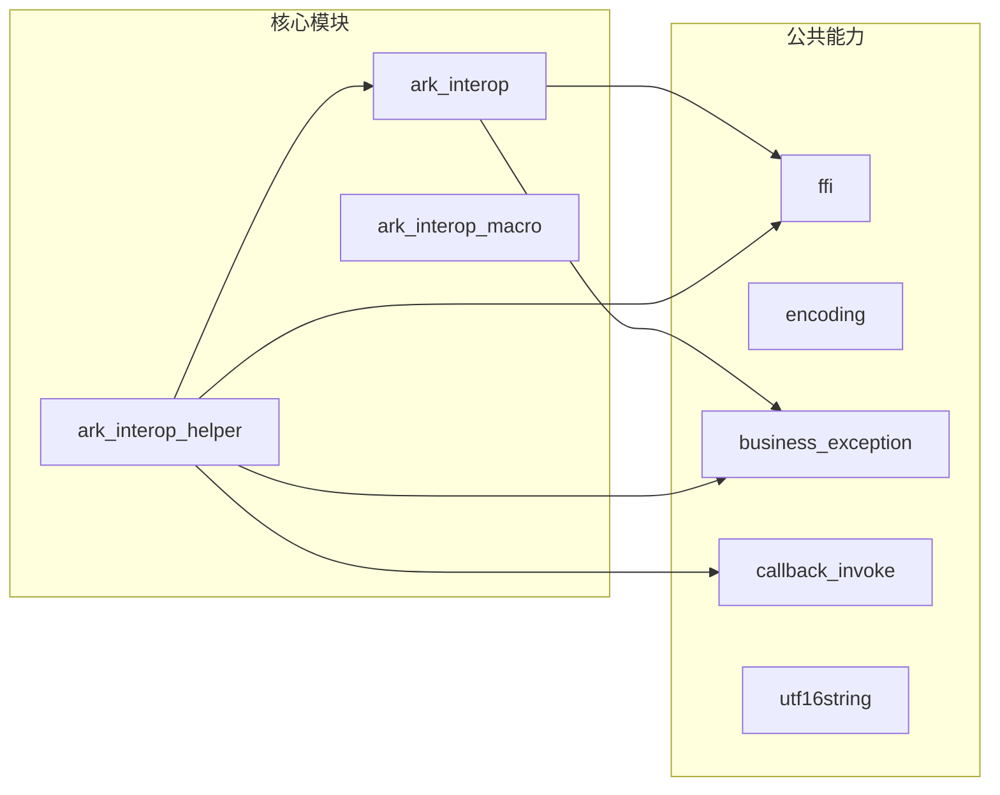
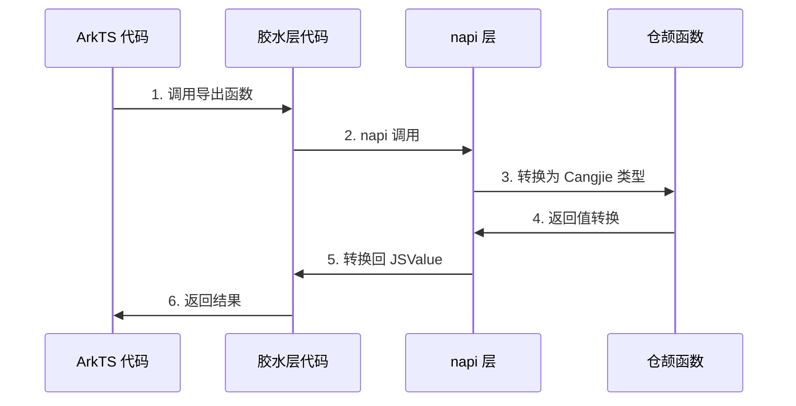
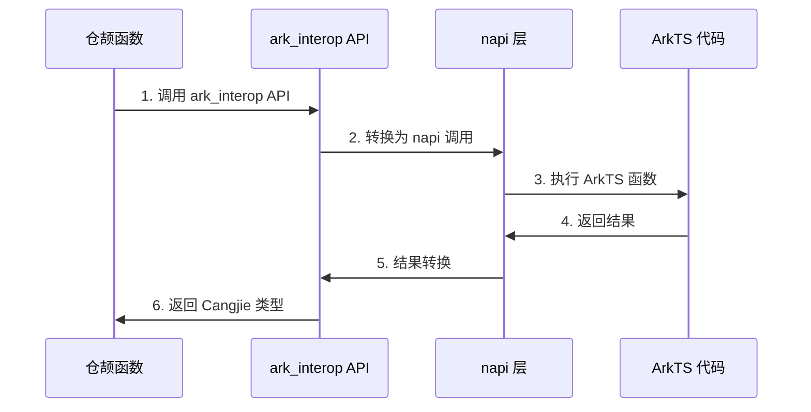

# 内部架构

本文档描述 cangjie_ark_interop 的内部架构设计，包括模块职责、数据流、线程模型等。

> **文档版本**: v1.1
> **最后更新**: 2025-02-07
> **主要变更**: 添加 Mermaid 架构图

## 架构概览

### 分层架构图

```mermaid
flowchart TB
    subgraph Application["应用层"]
        ArkTS["ArkTS 代码"]
        Cangjie["仓颉 代码"]
    end

    subgraph InteropMacro["声明式互操作层"]
        Macro["@Interop[ArkTS] 宏"]
    end

    subgraph Core["核心互操作层"]
        AI["ark_interop\n核心互操作库"]
        AH["ark_interop_helper\n互操作工具"]
    end

    subgraph NAPI["N-API 层"]
        NAPI["napi 层\n调用 ArkTS 虚拟机接口"]
    end

    subgraph Runtime["运行时层"]
        ART["ArkTS Runtime\nArkTS 引擎"]
        CRT["Cangjie Runtime\n仓颉 引擎"]
    end

    ArkTS --> Macro
    Cangjie --> Macro
    Macro --> AI
    Macro --> AH
    AI --> NAPI
    AH --> NAPI
    NAPI --> ART
    NAPI --> CRT
```

### 模块依赖关系



> **证据来源**: `ohos/BUILD.gn`, `bundle.json:29-40`

## 模块职责

### ohos.ark_interop (核心互操作库)

**职责**: 提供 ArkTS 运行时的直接访问能力

| 子模块 | 职责 |
|--------|------|
| `js_runtime.cj` | JSRuntime 管理、引擎创建/销毁 |
| `jscontext.cj` | JSContext 管理、全局对象访问 |
| `js_module.cj` | ArkTS 模块加载与导出 |
| `js_*.cj` | JSValue 类型封装与转换 |

**关键依赖**:
- `napi:ark_interop` - ArkTS 虚拟机接口
- `ohos.labels` - API 版本标签
- `ohos.business_exception` - 异常定义

### ohos.ark_interop_helper (互操作工具)

**职责**: 提供高级互操作 API 和工具函数

| 子模块 | 职责 |
|--------|------|
| `ark_api_call.cj` | ArkTS 函数同步调用 |
| `ark_api_call_async.cj` | ArkTS 函数异步调用 (Promise) |
| `console.cj` | Console 对象注入 |
| `timer.cj` | 定时器支持 |

**关键依赖**:
- `ohos.ark_interop` - 核心互操作能力
- `ohos.ffi` - C 互操作能力
- `ability_runtime:ark_interop_helper_ffi` - 动态库加载

### ohos.ark_interop_macro (互操作宏)

**职责**: 编译时生成互操作代码

| 子模块 | 职责 |
|--------|------|
| `ark_idl_*.cj` | IDL 解析与代码生成 |

**关键能力**:
- `@Interop[ArkTS]` 注解处理
- 自动生成 ArkTS 接口声明 (.d.ts)
- 自动生成 C/C++ 胶水层代码

### ohos.ffi (C 互操作库)

**职责**: 提供 C 语言 FFI 绑定能力

| 子模块 | 职责 |
|--------|------|
| `ffi_callback.cj` | C 回调函数封装 |
| `ffi_data.cj` | FFI 数据结构 |
| `remote_data_lite.cj` | 远程数据管理 |

**关键依赖**:
- `napi:cj_bind_ffi` - FFI 绑定

### utf16string (C++ 原生库)

**职责**: 高性能 UTF-16 字符串处理

**关键能力**:
- 引用计数内存管理
- Latin1/UTF16 编码转换
- 字符串操作 (substr, split, replace 等)

## 数据流

### 场景一: ArkTS 调用仓颉



**调用链**:
1. ArkTS 调用导出函数
2. 胶水层代码接收参数
3. 转换为 Cangjie 类型
4. 调用仓颉函数
5. 返回值转换回 JSValue

> **证据来源**: `ohos/ark_interop/js_func.cj:54` (JSCallInfo 参数获取)

### 场景二: 仓颉调用 ArkTS



**调用链**:
1. 仓颉代码调用 ark_interop API
2. 转换为 napi 调用
3. 执行 ArkTS 函数
4. 结果转换回 Cangjie 类型

> **证据来源**: `ohos/ark_interop_helper/ark_api_call.cj`

## 线程模型

### 仓颉线程模型

```mermaid
flowchart TB
    subgraph UserThreads["用户态线程 (Cangjie)"]
        F1["Fiber 1"]
        F2["Fiber 2"]
        F3["Fiber 3"]
        FN["Fiber N"]
    end

    subgraph Scheduler["Runtime 调度"]
        Scheduler["系统线程调度"]
    end

    subgraph RuntimeThreads["运行时线程"]
        ART["ArkTS Runtime\n绑定线程"]
        Other["其他系统线程\n非 ArkTS"]
    end

    F1 --> Scheduler
    F2 --> Scheduler
    F3 --> Scheduler
    FN --> Scheduler

    Scheduler --> ART
    Scheduler --> Other

    note1["仓颉线程调度到系统线程\nRuntime 负责调度"]
    note2["互操作必须在 ArkTS 线程执行\n约束: checkLifecycleAndThread()"]
```

### 线程协同

**关键约束**: 跨语言互操作逻辑必须运行在 ArkTS 运行时绑定的系统线程上。

> **证据来源**: `ohos/ark_interop/jscontext.cj`

```cangjie
// 线程切换示例
context.postJSTask {
    // 此代码块会在 ArkTS 线程执行
    let result = someJSFunction()
}
```

**线程检查机制**:

```cangjie
// 在 js_func.cj 中
context.checkLifecycleAndThread()  // 检查当前线程
```

**异常**:
- `34300004`: Thread mismatch - 线程不匹配
- **证据来源**: `ohos/ark_interop/js_func.cj:140`

## 生命周期管理

### JSValue 生命周期

```
┌─────────────────────────────────────────────────────────────┐
│                     JSValue 引用计数                         │
│                                                              │
│  创建           使用              释放                       │
│   │              │                │                         │
│   ▼              ▼                ▼                         │
│  JSValue ──► 引用计数+1  ──►  引用计数-1  ──►  被回收       │
│                                                              │
└─────────────────────────────────────────────────────────────┘
```

### 作用域管理

```cangjie
// 打开作用域
let scope = context.openScope()

// 在作用域内创建 JSValue
let value = context.createObject()

// 关闭作用域
context.closeScope(scope)
```

## 异常传播

### ArkTS → 仓颉

```
ArkTS 异常 (未捕获)
        │
        ▼
  转换为 BusinessException (34300002)
        │
        ▼
  传播到仓颉侧
```

### 仓颉 → ArkTS

```
仓颉异常 (未捕获)
        │
        ▼
  转换为 JS 异常
        │
        ▼
  传播到 ArkTS 侧
```

## 依赖关系

```
ohos.ark_interop
    ├── napi:ark_interop (外部依赖)
    ├── ohos.labels (内部依赖)
    └── ohos.business_exception (内部依赖)

ohos.ark_interop_helper
    ├── ohos.ark_interop (内部依赖)
    ├── ohos.ffi (内部依赖)
    ├── ohos.business_exception (内部依赖)
    ├── ability_runtime:ark_interop_helper_ffi (外部依赖)
    └── ability_runtime:abilitykit_native (外部依赖)

ohos.ark_interop_macro
    └── (编译时依赖，无运行时依赖)

ohos.ffi
    ├── napi:cj_bind_ffi (外部依赖)
    └── hiviewdfx_cangjie_wrapper:ohos.hilog (外部依赖)

utf16string (C++)
    └── 无运行时依赖
```
