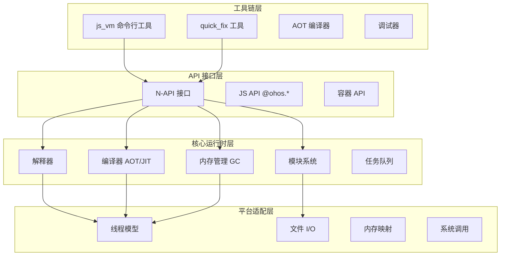
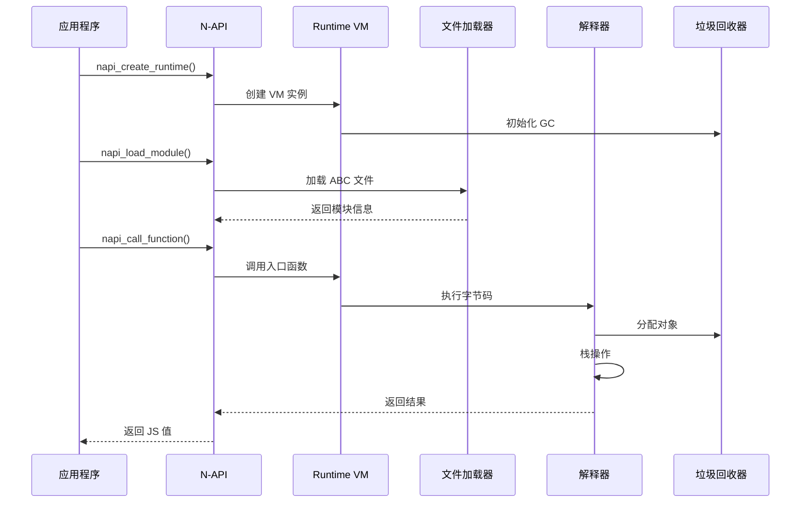
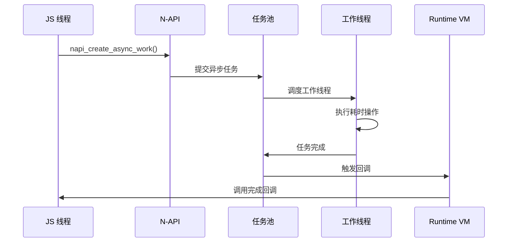
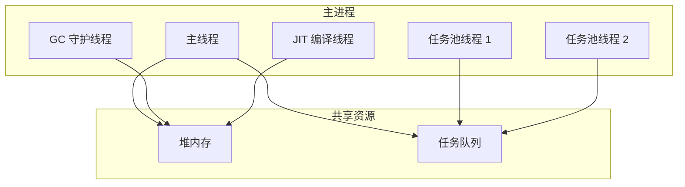

# 架构说明

本文档描述 ArkCompiler ETS Runtime 的整体架构，包括组件图、数据流、线程模型和关键时序。

## 架构概述

ArkCompiler ETS Runtime 采用分层架构设计，从下至上包括：平台适配层、核心运行时层、API 接口层和工具链层。

### 架构分层图



## 核心组件

### 1. 字节码解释器

解释器是运行时的核心组件，负责逐条执行 ABC 字节码指令。它采用栈式虚拟机架构，支持 ECMAScript 标准定义的所有操作码。

**组件职责**：
- 指令分发与执行
- 栈帧管理
- 操作数解析
- 异常抛出与处理

**关键文件**：
- `ecmascript/interpreter/interpreter.cpp` - 解释器主逻辑
- `ecmascript/interpreter/frame_handler.cpp` - 栈帧管理

### 2. 编译器

编译器负责将字节码编译为机器码，包括 AOT 静态编译和 JIT 运行时编译两种模式。

**组件职责**：
- 字节码解析与优化
- 中间表示（IR）生成
- 机器码生成
- 去优化支持

**关键文件**：
- `ecmascript/compiler/` - 编译器实现
- `ecmascript/jit/` - JIT 编译器

### 3. 内存管理

内存管理模块负责 JavaScript 对象的分配、回收和内存布局管理。

**组件职责**：
- 堆内存分配
- 垃圾回收
- 内存泄漏检测
- 内存碎片整理

**关键文件**：
- `ecmascript/mem/heap.cpp` - 堆管理
- `ecmascript/mem/gc_*.cpp` - 各类 GC 实现

### 4. N-API 接口

N-API 是运行时对外暴露的 C++ 编程接口，为原生模块提供稳定的绑定能力。

**组件职责**：
- JavaScript 值操作
- 对象创建与属性访问
- 异步回调支持
- 错误处理

**关键文件**：
- `ecmascript/napi/jsnapi.cpp` - N-API 实现
- `ecmascript/napi/include/jsnapi.h` - API 头文件

## 数据流

### 字节码加载与执行流程



### 异步操作数据流



## 线程模型

ArkCompiler ETS Runtime 采用多线程架构，主要包括以下线程类型：

### 1. 主线程（Main Thread）

主线程负责执行 JavaScript 代码、解释字节码和处理同步操作。

**职责**：
- JavaScript 代码执行
- 字节码解释
- 同步 N-API 调用
- 用户交互处理

### 2. GC 线程（Garbage Collection Thread）

GC 线程负责垃圾回收操作，与主线程并发执行以减少暂停时间。

**职责**：
- 并发标记
- 对象回收
- 内存整理

**关键文件**：
- `ecmascript/daemon/daemon_thread.cpp` - GC 守护线程

### 3. JIT 编译线程

JIT 编译器在独立线程中执行热点代码编译。

**职责**：
- 热点代码识别
- 机器码生成
- 代码缓存管理

**关键文件**：
- `ecmascript/jit/jit_thread.cpp` - JIT 线程

### 4. 任务池线程

任务池提供通用的工作线程池，用于执行异步任务。

**职责**：
- 异步工作执行
- 任务调度
- 线程复用

**关键文件**：
- `common_components/taskpool/taskpool.cpp`

### 线程关系图



## 内存布局

### 堆内存结构

```
┌─────────────────────────────────────────────────────────────┐
│                      堆内存布局                              │
├─────────────────────────────────────────────────────────────┤
│  ┌─────────────────────────────────────────────────────┐   │
│  │  Young Generation（年轻代）                          │   │
│  │  ├─ Nursery（新生区）：新创建的对象                   │   │
│  │  └─ SemiSpace（半空间）：短生命周期对象               │   │
│  └─────────────────────────────────────────────────────┘   │
│  ┌─────────────────────────────────────────────────────┐   │
│  │  Old Generation（老年代）                            │   │
│  │  ├─ MarkSpace（标记空间）：老对象                     │   │
│  │  └─ HugeSpace（大对象空间）：大对象                    │   │
│  └─────────────────────────────────────────────────────┘   │
│  ┌─────────────────────────────────────────────────────┐   │
│  │  Code Area（代码区域）                               │   │
│  │  ├─ JIT 编译的机器码                                 │   │
│  │  └─ 内联缓存                                         │   │
│  └─────────────────────────────────────────────────────┘   │
│  ┌─────────────────────────────────────────────────────┐   │
│  │  Meta Space（元数据区）                              │   │
│  │  ├─ 类信息                                           │   │
│  │  ├─ 方法常量池                                       │   │
│  │  └─ 虚函数表                                         │   │
│  └─────────────────────────────────────────────────────┘   │
└─────────────────────────────────────────────────────────────┘
```

## 相关文档

- [项目概览](01_Project_Overview.md)
- [目录结构](02_Directory_Structure.md)
- [N-API 参考](04_NAPI_Reference.md)
- [内部 API](05_Inner_API.md)
