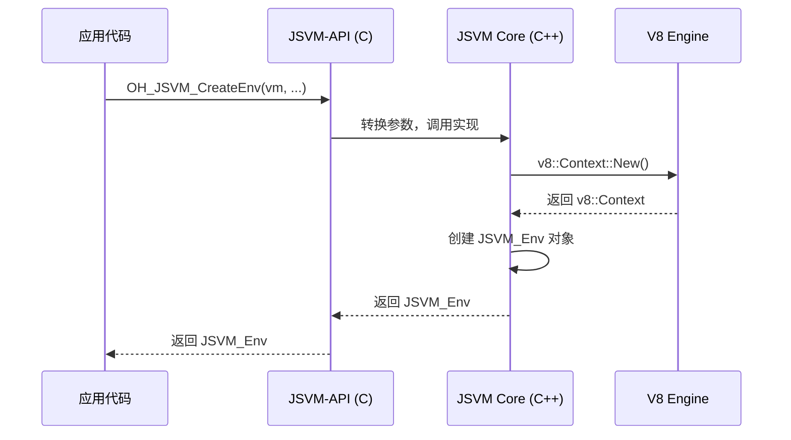
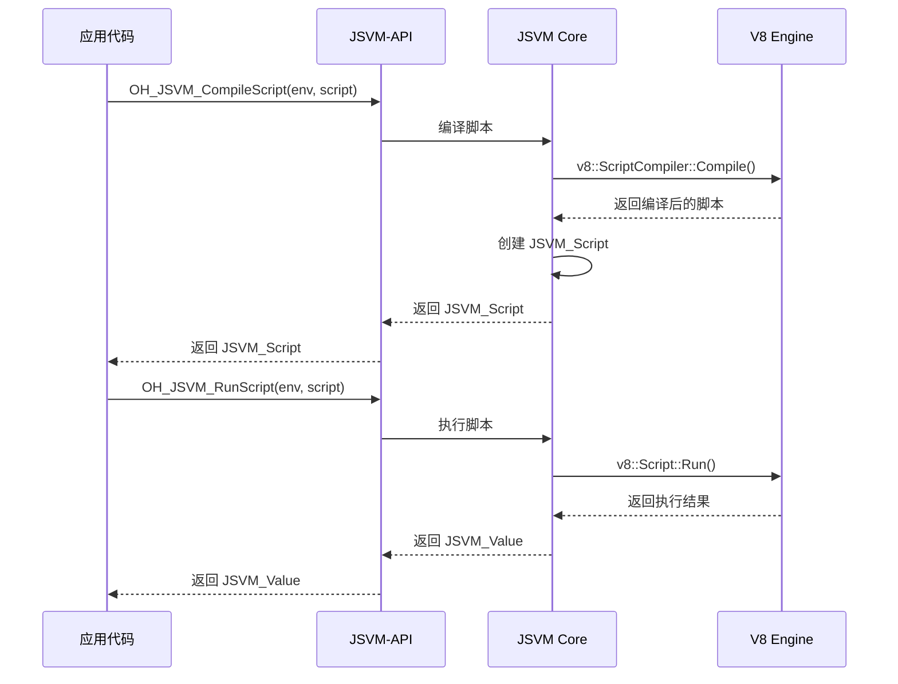
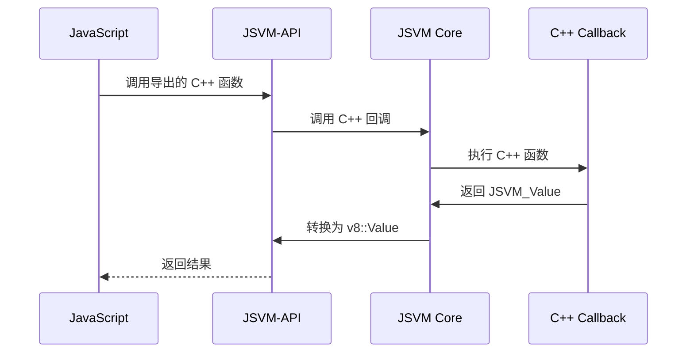
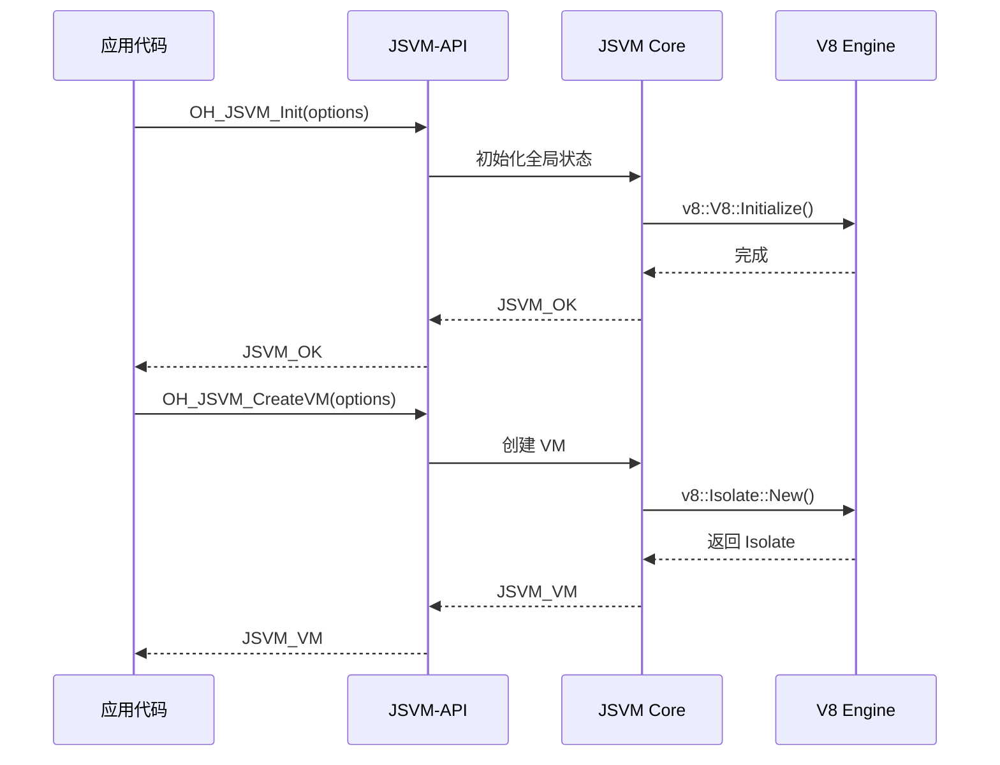
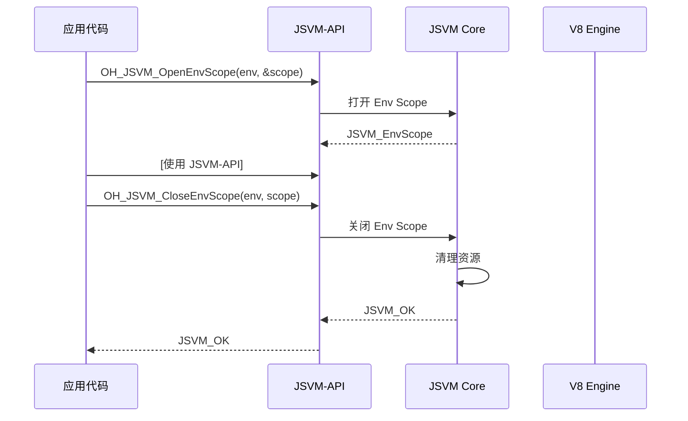

# 架构说明

> 组件图、数据流、线程模型、关键时序

## 目的与适用范围

### 目的
本文档描述 JSVM 的架构设计，包括组件关系、数据流、线程模型等关键方面。

### 适用范围
- 需要理解系统架构的开发者
- 需要进行性能优化的开发者
- 需要进行安全评审的开发者

---

## 架构分层

### 整体架构

JSVM 采用分层架构设计：

```
┌─────────────────────────────────────────────┐
│         应用层（Application）              │
│   (使用 JSVM-API 的 C/C++ 应用)          │
└─────────────────┬───────────────────────────┘
                  │
┌─────────────────▼───────────────────────────┐
│       JSVM-API 层（C Interface）         │
│   (interface/kits/jsvm.h)                  │
│   - 提供稳定的 C 语言接口                  │
│   - 管理 VM 生命周期                      │
│   - 提供 JS/C++ 互操作                     │
└─────────────────┬───────────────────────────┘
                  │
┌─────────────────▼───────────────────────────┐
│      JSVM Core 层（C++ Implementation）   │
│   (src/js_native_api_v8.cpp)                │
│   - 实现 JSVM-API 到 V8 的桥接            │
│   - 管理 Environment、Scope               │
│   - 实现引用计数                          │
└─────┬───────────┬───────────┬────────────┘
      │           │           │
┌─────▼─────┐ ┌─▼────────┐ ┌─▼────────────┐
│ Inspector  │ │ Platform │ │   V8 Engine  │
│  Module   │ │  Layer   │ │   (第三方）   │
│ (调试支持） │ │（平台抽象）│ │              │
└───────────┘ └──────────┘ └──────────────┘
```

**证据位置**:
- `interface/kits/jsvm.h` - JSVM-API 层
- `src/js_native_api_v8.cpp` - JSVM Core 层
- `src/inspector/` - Inspector 模块
- `src/platform/` - Platform 层

---

## 核心组件

### 1. VM（Virtual Machine）

**职责**: 代表一个独立的 JavaScript 虚拟机实例。

**关键特性**:
- 管理 V8 Isolate
- 管理内存堆（Heap）
- 管理全局上下文（Global Context）
- 支持快照（Snapshot）

**数据结构**:
```cpp
typedef struct JSVM_VM__* JSVM_VM;
```

**证据位置**:
- `interface/kits/jsvm_types.h:66` - 类型定义
- `src/js_native_api_v8.cpp` - VM 实现

### 2. Environment（执行环境）

**职责**: 代表 VM 内的一个执行上下文。

**关键特性**:
- 管理 V8 Context
- 管理 Handle Scope
- 提供实例数据（Instance Data）
- 支持异常处理

**数据结构**:
```cpp
typedef struct JSVM_Env__* JSVM_Env;
```

**证据位置**:
- `interface/kits/jsvm_types.h:94` - 类型定义
- `src/jsvm_env.cpp` - Environment 实现

### 3. Scope（作用域）

**职责**: 管理 JavaScript 值的生命周期。

**类型**:
- **VM Scope**: 管理 VM 生命周期
- **Env Scope**: 管理 Environment 生命周期
- **Handle Scope**: 管理 JSVM_Value 生命周期（RAII）
- **Escapable Handle Scope**: 允许将值逃逸到外层作用域

**数据结构**:
```cpp
typedef struct JSVM_VMScope__* JSVM_VMScope;
typedef struct JSVM_EnvScope__* JSVM_EnvScope;
typedef struct JSVM_HandleScope__* JSVM_HandleScope;
typedef struct JSVM_EscapableHandleScope__* JSVM_EscapableHandleScope;
```

**证据位置**:
- `interface/kits/jsvm_types.h:73,80,129,136` - 类型定义
- `interface/kits/jsvm.h:762-811` - Handle Scope API

### 4. Inspector Module

**职责**: 提供调试支持，集成 Chrome DevTools。

**关键特性**:
- WebSocket 服务器（Inspector 协议）
- V8 Inspector 集成
- 支持断点、单步执行等

**关键类**:
- `InspectorSocket` - WebSocket 连接管理
- `InspectorSocketServer` - WebSocket 服务器
- JSVM Inspector API

**证据位置**:
- `src/inspector/inspector_socket.cpp` - InspectorSocket
- `src/inspector/inspector_socket_server.cpp` - InspectorSocketServer
- `src/inspector/js_native_api_v8_inspector.cpp` - Inspector API

### 5. Platform Layer

**职责**: 提供平台抽象，封装操作系统特定的功能。

**关键特性**:
- 线程管理
- 定时器
- 文件 I/O
- 网络 I/O

**关键类**:
- `Platform` - 抽象接口
- `OhosPlatform` - OpenHarmony 实现

**证据位置**:
- `src/platform/platform.h` - Platform 抽象
- `src/platform/platform_ohos.cpp` - OpenHarmony 实现

---

## 数据流

### 1. API 调用流程



**证据位置**:
- `interface/kits/jsvm.h:433-436` - `OH_JSVM_CreateEnv()` 声明
- `src/js_native_api_v8.cpp:1174-1232` - `OH_JSVM_CreateEnv()` 实现

### 2. JavaScript 代码执行流程



**证据位置**:
- `interface/kits/jsvm.h:501-507` - `OH_JSVM_CompileScript()` 声明
- `interface/kits/jsvm.h:581` - `OH_JSVM_RunScript()` 声明
- `src/js_native_api_v8.cpp:1274-1549` - 编译与执行实现

### 3. JS/C++ 函数调用流程



**证据位置**:
- `interface/kits/jsvm_types.h:157-167` - JSVM_Callback 定义
- `src/js_native_api_v8.cpp` - 函数调用实现

---

## 线程模型

### 单线程模型

JSVM **默认采用单线程模型**，所有 API 调用必须在创建 Environment 的线程中执行。

**关键约束**:
- JSVM_Value 不能跨线程传递（除非使用引用计数）
- Environment 不能跨线程共享
- V8 Isolate 绑定到创建线程

**证据位置**: `interface/kits/jsvm.h:433-436` - `OH_JSVM_CreateEnv()` 创建 Env

### 异步操作支持

虽然 JSVM 本身是单线程的，但提供了异步操作支持：

#### Microtasks

JSVM 支持 Microtask 调度，默认策略是自动调度。

**API**:
- `OH_JSVM_SetMicrotaskPolicy()` - 设置 Microtask 策略
- `OH_JSVM_PerformMicrotaskCheckpoint()` - 手动执行 Microtask checkpoint

**证据位置**:
- `interface/kits/jsvm.h:344` - `OH_JSVM_SetMicrotaskPolicy()`
- `interface/kits/jsvm_types.h:741-748` - JSVM_MicrotaskPolicy

#### Promise

JSVM 支持 Promise，可以处理异步操作。

**API**:
- `OH_JSVM_CreatePromise()` - 创建 Promise
- `OH_JSVM_ResolvePromise()` / `OH_JSVM_RejectPromise()` - 解决/拒绝 Promise

**证据位置**: `interface/kits/jsvm.h`（Promise 相关 API）

### 多线程支持

JSVM 通过以下方式支持多线程：

#### Platform Layer

Platform Layer 提供线程管理抽象，可以在其他线程执行任务。

**证据位置**: `src/platform/platform_ohos.cpp` - 线程管理实现

#### Worker Threads

TODO: 需确认 JSVM 是否支持 Worker Threads。

---

## 内存管理

### 引用计数

JSVM 使用引用计数管理 JavaScript 对象的生命周期。

**机制**:
- JSVM_Value 是局部句柄，超出作用域后自动释放
- JSVM_Ref 是强引用，延长对象生命周期
- 引用计数为 0 时，对象可被 GC 回收

**API**:
- `OH_JSVM_CreateReference()` - 创建引用
- `OH_JSVM_ReferenceRef()` - 增加引用计数
- `OH_JSVM_ReferenceUnref()` - 减少引用计数
- `OH_JSVM_DeleteReference()` - 删除引用

**证据位置**:
- `interface/kits/jsvm.h:823-904` - 引用管理 API

### V8 GC 集成

JSVM 集成 V8 的 GC 机制：

#### Handle Scope

Handle Scope 使用 RAII 机制自动管理生命周期：

```cpp
OH_JSVM_OpenHandleScope(env, &scope);
// ... 使用 JSVM_Value
OH_JSVM_CloseHandleScope(env, scope); // 自动释放所有 handle
```

**证据位置**:
- `interface/kits/jsvm.h:762-773` - Handle Scope API

#### GC 回调

JSVM 支持 GC 回调，可以在 GC 前后执行自定义逻辑。

**API**:
- `OH_JSVM_AddGCCallback()` - 添加 GC 回调
- `OH_JSVM_RemoveGCCallback()` - 移除 GC 回调

**证据位置**:
- `interface/kits/jsvm_types.h:881-941` - GC 回调相关类型

---

## 关键时序

### VM 初始化时序



**证据位置**:
- `interface/kits/jsvm.h:323` - `OH_JSVM_Init()`
- `interface/kits/jsvm.h:333` - `OH_JSVM_CreateVM()`
- `src/js_native_api_v8.cpp:1059-1132` - VM 初始化实现

### Environment 创建与销毁时序



**证据位置**:
- `interface/kits/jsvm.h:466-476` - Env Scope API

---

## Inspector 架构

### Inspector 协议栈

```
┌─────────────────────────────┐
│  Chrome DevTools Frontend   │
└────────────┬────────────────┘
             │ WebSocket
┌────────────▼────────────────┐
│   InspectorSocketServer     │  (WebSocket 服务器）
├────────────┬────────────────┤
│   InspectorSocket          │  (单个连接）
└────────────┬────────────────┘
             │ Inspector Protocol
┌────────────▼────────────────┐
│   V8 Inspector            │  (V8 Inspector API）
└────────────┬────────────────┘
             │
┌────────────▼────────────────┐
│   JSVM Core              │  (JSVM Inspector API）
└───────────────────────────┘
```

**证据位置**:
- `src/inspector/inspector_socket_server.cpp` - WebSocket 服务器
- `src/inspector/js_native_api_v8_inspector.cpp` - JSVM Inspector API

---

## 相关链接

- [对外 API 总览](./03_Public_API_Overview.md) - API 分类
- [对外 API 详细文档](./05_Public_API_Details.md) - API 清单
- [目录结构与模块职责](./02_Directory_Structure.md) - 模块职责
- [附录：调用链图](./appendix/Callgraphs.md) - 详细调用链
