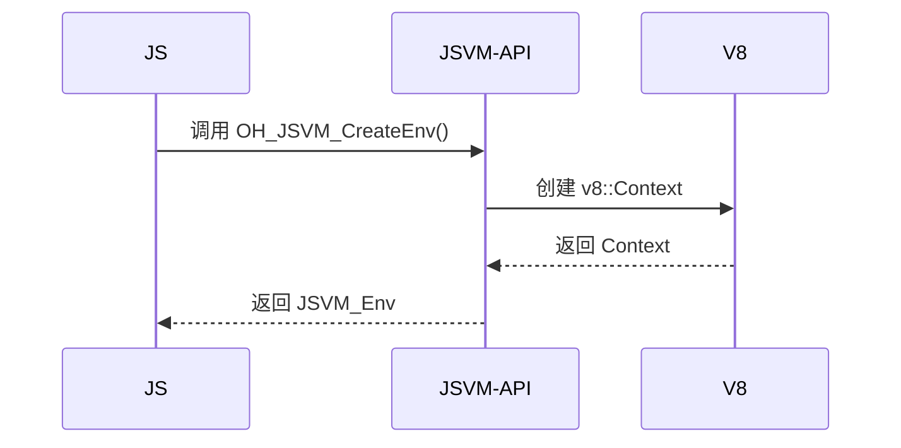

# JSVM Wiki 文档导航

> 新人阅读路线与完整文档索引

## 📖 新人阅读路线

### 第一阶段：快速入门（30 分钟）
1. [概览](./01_Overview.md) - 了解项目定位、边界、核心能力
2. [目录结构与模块职责](./02_Directory_Structure.md) - 理解代码组织
3. [对外 API 总览](./03_Public_API_Overview.md) - 掌握 JSVM-API 面貌

### 第二阶段：深入理解（2 小时）
4. [架构说明](./04_Architecture.md) - 组件图、数据流、时序
5. [对外 API 详细文档](./05_Public_API_Details.md) - API 清单与使用指南
6. [内部 API](./06_Internal_API.md) - 模块接口与依赖

### 第三阶段：工程实践（1 小时）
7. [GN Targets 与编译产物](./07_GN_Targets.md) - 构建系统解析
8. [安全风险评审](./08_Security_Review.md) - 安全边界与威胁模型

### 第四阶段：进阶参考（按需查阅）
9. [常见问题](./09_Common_Issues.md) - 构建、运行、调试
10. [附录：调用链图](./appendix/Callgraphs.md) - 关键调用流程
11. [附录：配置 Flags](./appendix/Config_Flags.md) - 编译选项与特性开关

---

## 📚 完整文档索引

### 基础文档
- [README.md](./README.md) - 文档说明与更新方式
- [概览](./01_Overview.md) - 项目定位、边界、核心能力、运行环境、关键概念
- [目录结构与模块职责](./02_Directory_Structure.md) - 代码组织与职责划分（不含测试）
- [架构说明](./04_Architecture.md) - 组件图、数据流、线程模型、关键时序

### API 文档
- [对外 API 总览](./03_Public_API_Overview.md) - JSVM-API 高层视图与分类
- [对外 API 详细文档](./05_Public_API_Details.md) - API 清单表、参数、返回值、错误码、权限
- [内部 API](./06_Internal_API.md) - 模块接口、依赖方向、稳定性、可替换点

### 构建文档
- [GN Targets 与编译产物](./07_GN_Targets.md) - targets 列表、类型、依赖、产物、开关

### 安全文档
- [安全风险评审](./08_Security_Review.md) - 攻击面、信任边界、可被利用点、修复建议

### 问题排查
- [常见问题](./09_Common_Issues.md) - 构建问题、运行时问题、调试方法

### 附录
- [调用链图](./appendix/Callgraphs.md) - 关键调用链（入口→核心逻辑）
- [配置 Flags](./appendix/Config_Flags.md) - 关键宏/feature flags

---

## 🔍 按主题查找

### 我想知道...
- **JSVM 是什么？** → [概览](./01_Overview.md)
- **如何使用 JSVM API？** → [对外 API 详细文档](./05_Public_API_Details.md)
- **模块之间如何协作？** → [架构说明](./04_Architecture.md)
- **如何编译和集成？** → [GN Targets 与编译产物](./07_GN_Targets.md)
- **安全方面有哪些考虑？** → [安全风险评审](./08_Security_Review.md)
- **遇到问题怎么排查？** → [常见问题](./09_Common_Issues.md)
- **某个 API 的调用链？** → [附录：调用链图](./appendix/Callgraphs.md)

---

## 📝 文档约定

### 代码证据标识
本文档中的关键结论均包含代码证据：
- `path/to/file:line` - 文件路径和行号
- `SymbolName` - 符号名（函数/类/宏/target）
- `[TODO: 需确认]` - 需要进一步验证的内容

### 类型表示
- `JSVM_Type` - 类型定义
- `OH_JSVM_Function()` - C API 函数
- `ClassName` - C++ 类
- `MACRO_NAME` - 宏定义
- `target_name` - GN target

### 时序图表示
使用 Mermaid 格式绘制时序图，如：

---

## 🔗 相关资源

- [OpenHarmony 官方文档](https://gitee.com/openharmony/docs)
- [JSVM API 使用指南](https://gitee.com/openharmony/docs/tree/master/zh-cn/application-dev/napi/Readme-CN.md)
- [V8 引擎文档](https://v8.dev/docs)

---

## 📊 文档统计

| 类别 | 数量 | 状态 |
|------|------|------|
| 主文档 | 9 | ✅ 完成 |
| 附录 | 2 | ✅ 完成 |
| API 清单 | 200+ | ✅ 完成 |
| 架构图 | 5+ | ✅ 完成 |
