# 架构说明

## 总体架构

ArkCompiler Runtime Core 采用分层架构设计，实现语言无关的运行时核心能力：

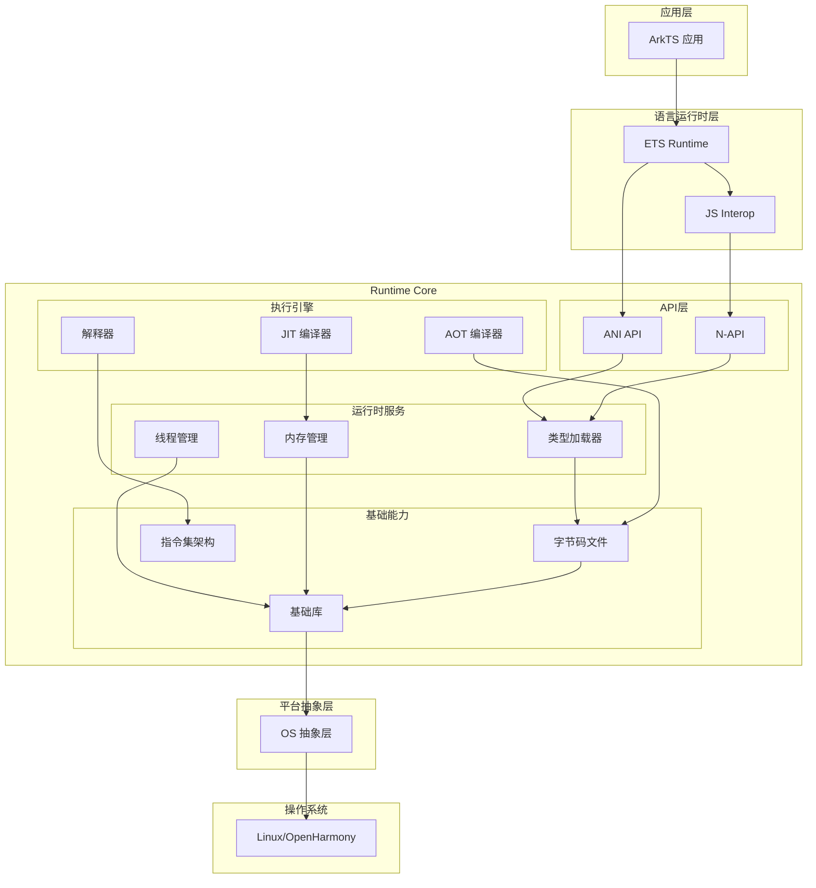

## 组件架构

### 1. 字节码文件子系统

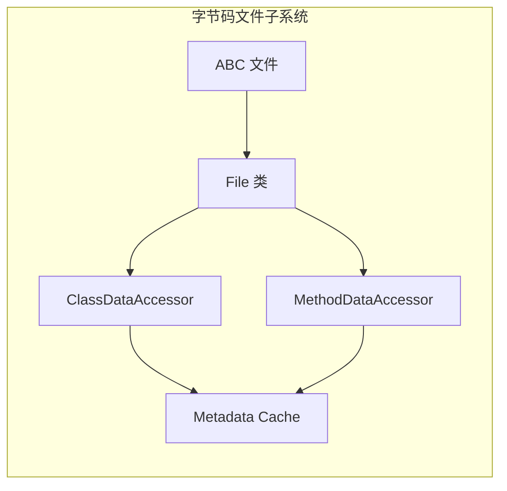

**职责**:
- 加载和解析 .abc 文件
- 提供类、方法、字段的元数据访问
- 管理常量池和字符串表

**关键类**:
- `panda_file::File` - 字节码文件表示
- `panda_file::ClassDataAccessor` - 类数据访问
- `panda_file::MethodDataAccessor` - 方法数据访问

### 2. 内存管理子系统

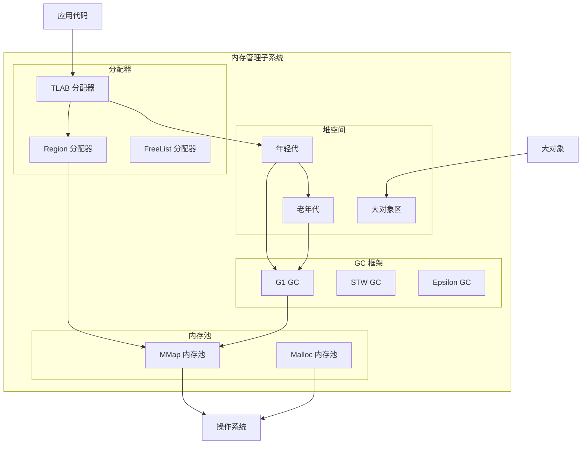

**职责**:
- 托管内存分配与回收
- GC 策略实现
- 内存屏障管理

**关键类**:
- `HeapManager` - 堆管理器
- `GC` - GC 基类
- `G1GC` - G1 垃圾收集器
- `PoolManager` - 内存池管理器

### 3. 线程管理子系统

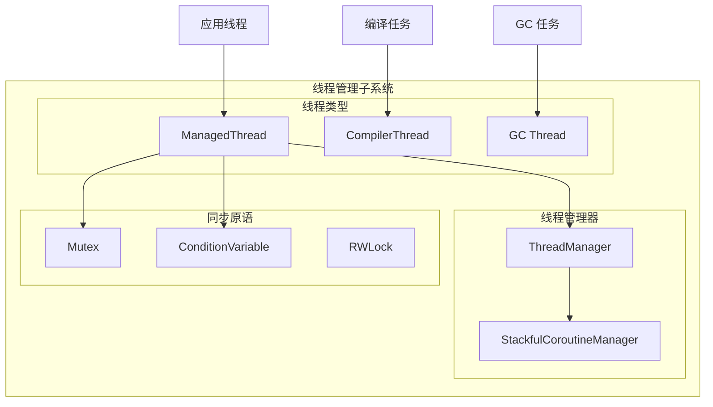

**职责**:
- 托管线程生命周期管理
- 线程状态转换
- 协程支持

**关键类**:
- `Thread` - 线程基类
- `ManagedThread` - 托管线程
- `ThreadManager` - 线程管理器
- `CoroutineManager` - 协程管理器

### 4. 执行引擎子系统

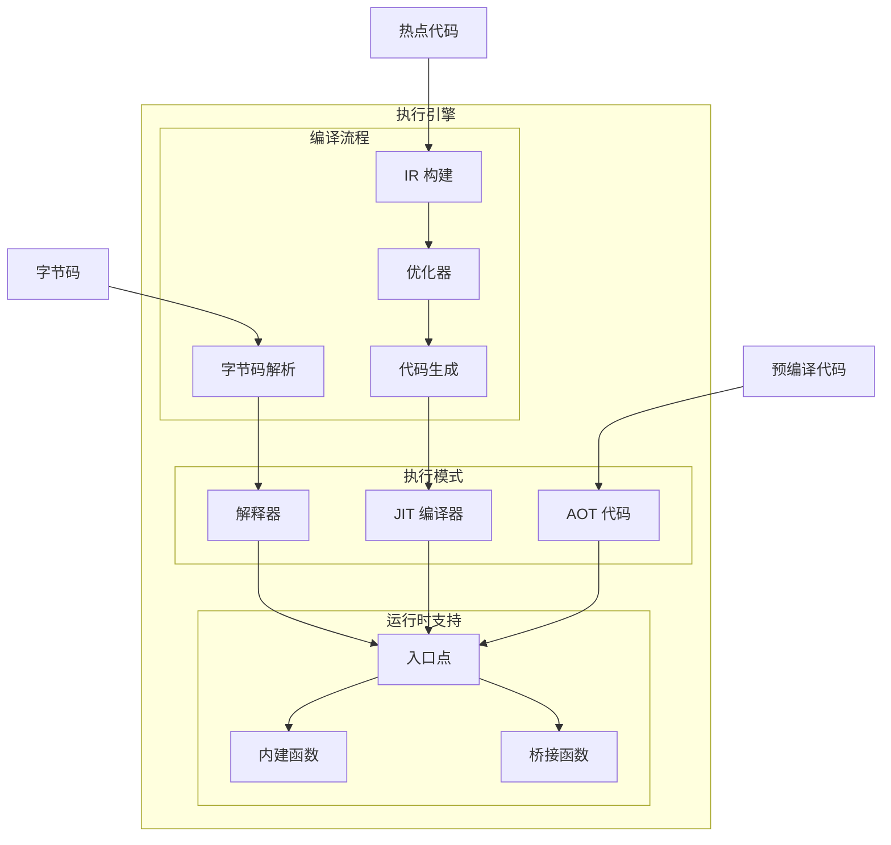

**职责**:
- 字节码解释执行
- JIT 热点编译
- AOT 预编译执行

**关键类**:
- `Interpreter` - 解释器
- `Compiler` - 编译器
- `Graph` - IR 图
- `CodeGenerator` - 代码生成器

## 数据流

### 类加载数据流

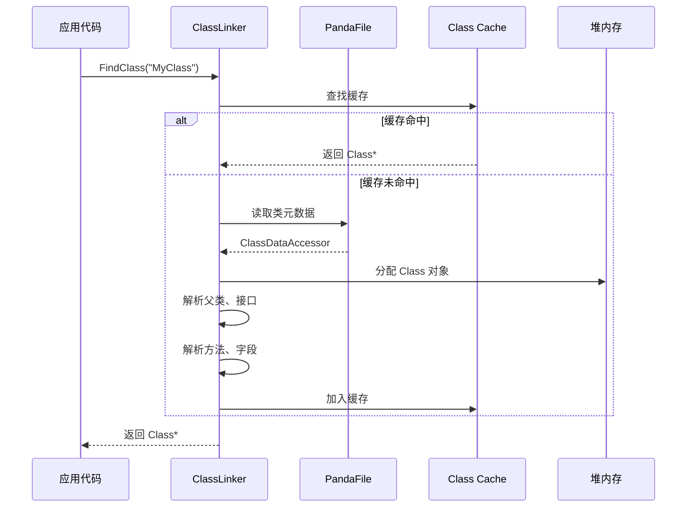

### 方法调用数据流

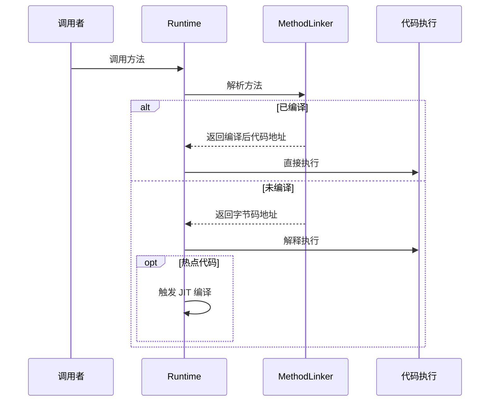

### 内存分配数据流

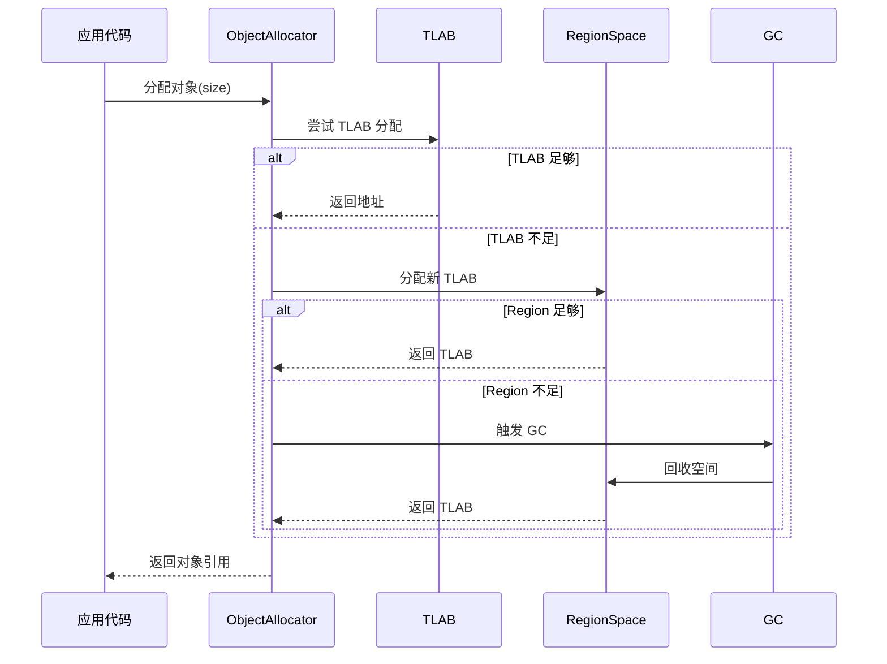

## 线程模型

### 托管线程状态机

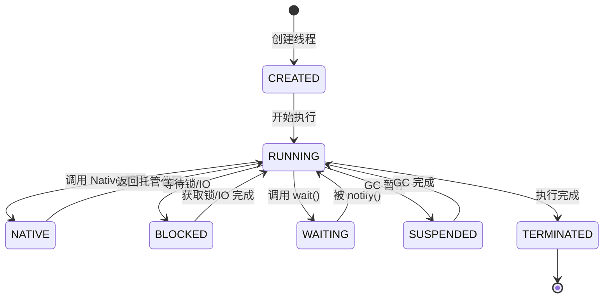

**状态说明**:
- **RUNNING**: 执行托管代码
- **NATIVE**: 执行原生代码（不受 GC 暂停影响）
- **BLOCKED**: 阻塞等待
- **WAITING**: 等待通知
- **SUSPENDED**: 被 GC 暂停

### GC 线程交互

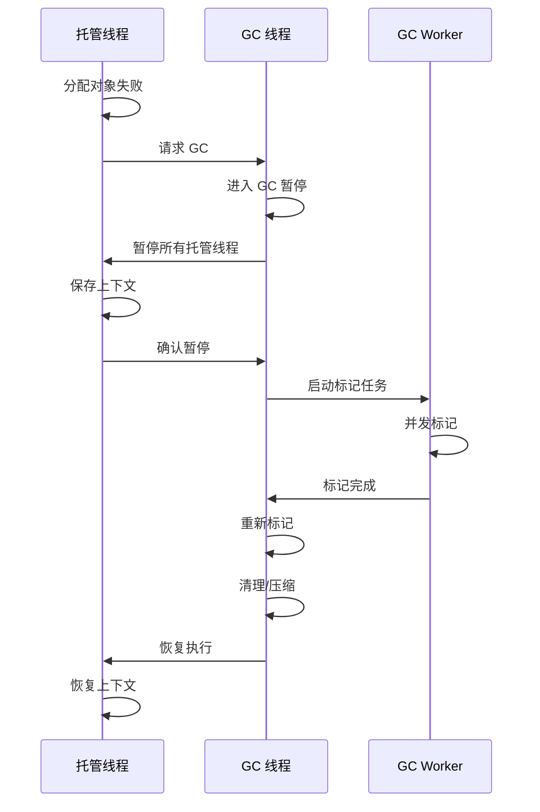

## 关键时序

### 运行时启动时序

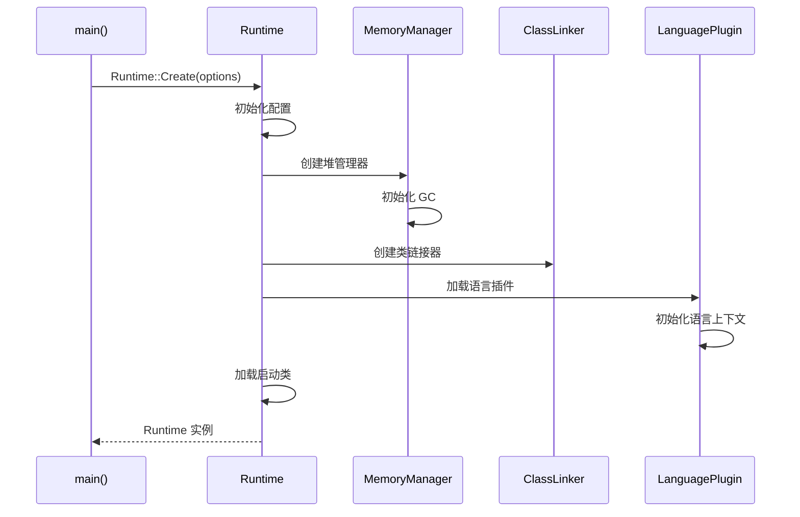

### 应用启动时序

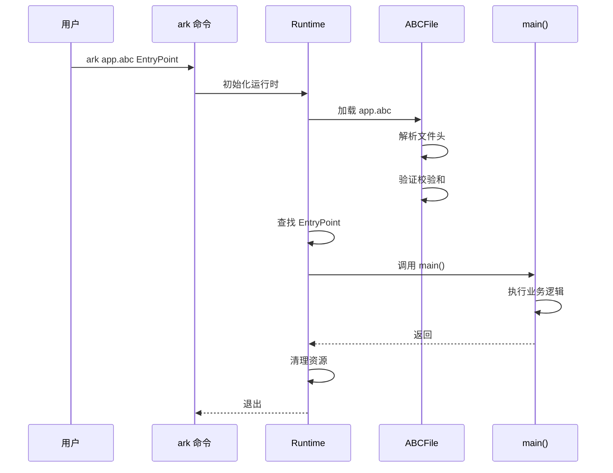

## 模块依赖关系

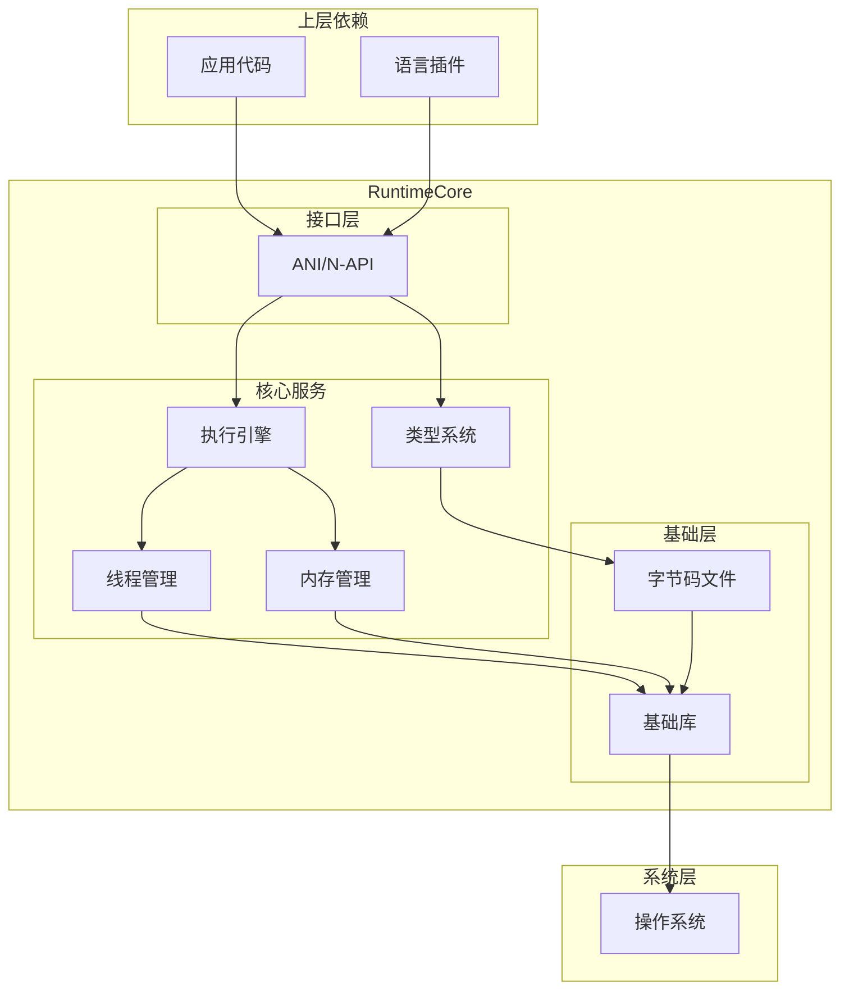

## 下一步

- 了解 [对外 API](04_Public_API.md) 进行 Native 开发
- 深入 [内部 API](05_Inner_API.md) 理解模块接口
- 查看 [GN 构建目标](06_GN_Targets.md) 了解构建系统
