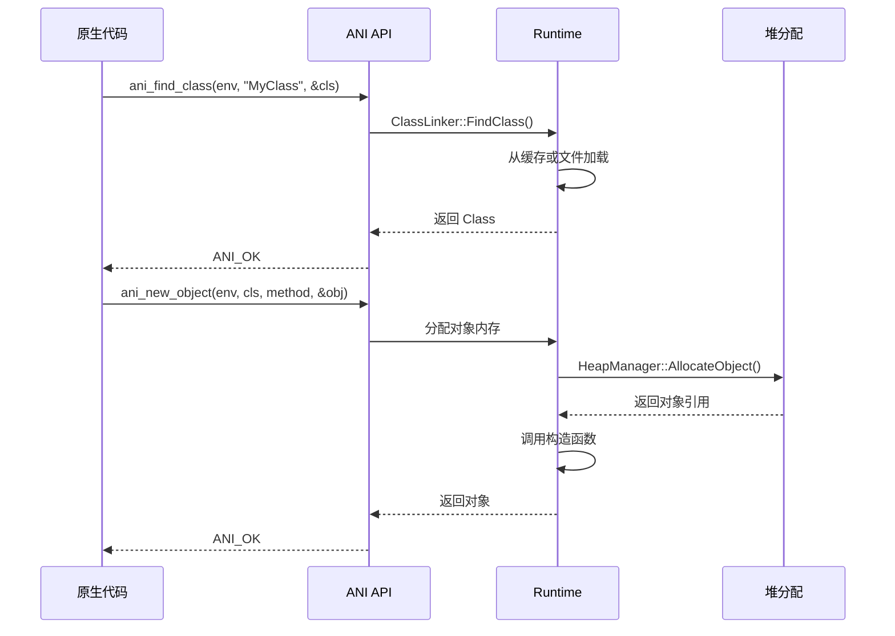
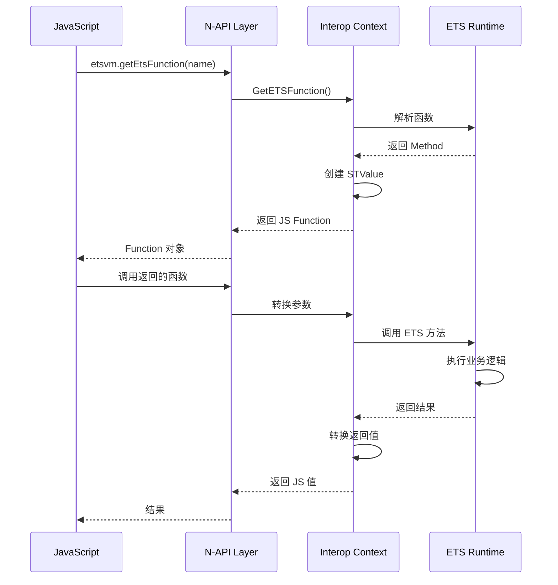

# 对外 API

## 概述

ArkCompiler Runtime Core 提供两种主要的对外接口：

1. **ANI (Ark Native Interface)** - 原生 C/C++ 接口，用于开发原生扩展
2. **N-API (Node-API)** - 与 JavaScript 互操作的接口

```
API 层次结构:
┌─────────────────────────────────────────┐
│           应用层 (ArkTS/JS)              │
├─────────────────────────────────────────┤
│  ┌─────────────┐    ┌─────────────┐    │
│  │  ArkTS API  │    │   JS API    │    │
│  └──────┬──────┘    └──────┬──────┘    │
├─────────┼──────────────────┼───────────┤
│         │                  │           │
│    ┌────▼────┐        ┌────▼────┐      │
│    │   ANI   │        │  N-API  │      │
│    │  (C/C++)│        │  (C/C++)│      │
│    └────┬────┘        └────┬────┘      │
├─────────┴──────────────────┴───────────┤
│         Runtime Core 内部              │
└─────────────────────────────────────────┘
```

## ANI (Ark Native Interface)

### 头文件位置

- **主头文件**: `static_core/plugins/ets/runtime/ani/ani.h`
- **辅助头文件**: 
  - `static_core/plugins/ets/runtime/ani/ani_helpers.h`
  - `static_core/plugins/ets/runtime/libani_helpers/`

### 核心概念

ANI 提供了一组 C API，允许原生代码与 ArkTS 运行时交互：

```c
// VM 和环境句柄
typedef struct __ani_vm ani_vm;      // VM 实例
typedef struct __ani_env ani_env;    // 环境句柄（线程本地）

// 引用类型（不透明指针）
typedef __ani_ref *ani_ref;          // 通用引用
typedef __ani_object *ani_object;    // 对象引用
typedef __ani_string *ani_string;    // 字符串引用
typedef __ani_class *ani_class;      // 类引用
typedef __ani_method *ani_method;    // 方法引用
```

### 错误码

```c
typedef enum {
    ANI_OK = 0,                    // 成功
    ANI_ERROR,                     // 通用错误
    ANI_INVALID_ARGS,              // 无效参数
    ANI_INVALID_TYPE,              // 无效类型
    ANI_INVALID_DESCRIPTOR,        // 无效描述符
    ANI_INCORRECT_REF,             // 无效引用
    ANI_PENDING_ERROR,             // 有待处理异常
    ANI_NOT_FOUND,                 // 未找到
    ANI_ALREADY_BINDED,            // 已绑定
    ANI_OUT_OF_REF,                // 引用不足
    ANI_OUT_OF_MEMORY,             // 内存不足
    ANI_OUT_OF_RANGE,              // 越界
    ANI_BUFFER_TO_SMALL,           // 缓冲区太小
    ANI_NO_MODIFICATION_ALLOWED,   // 不允许修改
    ANI_NUMERIC_CONVERSION_ERROR,  // 数值转换错误
    ANI_STRING_ENCODING_ERROR,     // 字符串编码错误
    ANI_INVALID_OPERATION,         // 无效操作
    ANI_FATAL_ERROR,               // 致命错误
} ani_status;
```

### VM 生命周期 API

```c
// 创建 VM
ani_status ani_create_vm(ani_vm **vm, const ani_option *options, ani_size num_options);

// 销毁 VM
ani_status ani_destroy_vm(ani_vm *vm);

// 获取 VM 版本
ani_int ani_get_version(ani_vm *vm);
```

**代码位置**: `static_core/plugins/ets/runtime/ani/ani_vm_api.cpp`

### 环境 API

```c
// 获取环境
ani_status ani_get_env(ani_vm *vm, ani_env **env);

// 检查异常
ani_status ani_exception_check(ani_env *env, ani_boolean *result);

// 清除异常
ani_status ani_exception_clear(ani_env *env);

// 抛出异常
ani_status ani_throw(ani_env *env, ani_error error);
```

**代码位置**: `static_core/plugins/ets/runtime/ani/ani_interaction_api.cpp`

### 类操作 API

```c
// 查找类
ani_status ani_find_class(ani_env *env, const char *name, ani_class *result);

// 获取父类
ani_status ani_get_super_class(ani_env *env, ani_class cls, ani_class *result);

// 获取类名
ani_status ani_get_class_name(ani_env *env, ani_class cls, const char **name);
```

### 方法调用 API

```c
// 查找方法
ani_status ani_find_method(ani_env *env, ani_class cls, const char *name, 
                          const char *signature, ani_method *result);

// 调用实例方法（变参）
ani_status ani_call_method(ani_env *env, ani_object obj, ani_method method, 
                          ani_value *result, ...);

// 调用静态方法
ani_status ani_call_static_method(ani_env *env, ani_class cls, ani_static_method method,
                                 ani_value *result, ...);
```

### 字段访问 API

```c
// 查找字段
ani_status ani_find_field(ani_env *env, ani_class cls, const char *name,
                         const char *signature, ani_field *result);

// 获取实例字段
ani_status ani_get_field(ani_env *env, ani_object obj, ani_field field, ani_value *result);

// 设置实例字段
ani_status ani_set_field(ani_env *env, ani_object obj, ani_field field, const ani_value *value);
```

### 字符串操作 API

```c
// 创建字符串
ani_status ani_create_string(ani_env *env, const char *utf8, ani_size length, ani_string *result);

// 获取字符串长度
ani_status ani_get_string_length(ani_env *env, ani_string str, ani_size *result);

// 获取字符串内容
ani_status ani_get_string_utf8(ani_env *env, ani_string str, char *buffer, ani_size buffer_size,
                               ani_size *result);
```

### 数组操作 API

```c
// 创建数组
ani_status ani_create_array(ani_env *env, ani_size length, ani_array *result);

// 获取数组长度
ani_status ani_get_array_length(ani_env *env, ani_array array, ani_size *result);

// 获取数组元素
ani_status ani_get_array_element(ani_env *env, ani_array array, ani_size index, ani_ref *result);

// 设置数组元素
ani_status ani_set_array_element(ani_env *env, ani_array array, ani_size index, ani_ref value);
```

### 全局引用 API

```c
// 创建全局引用
ani_status ani_create_global_ref(ani_env *env, ani_ref ref, ani_ref *result);

// 删除全局引用
ani_status ani_delete_global_ref(ani_env *env, ani_ref ref);

// 创建弱全局引用
ani_status ani_create_weak_global_ref(ani_env *env, ani_ref ref, ani_wref *result);

// 删除弱全局引用
ani_status ani_delete_weak_global_ref(ani_env *env, ani_wref ref);
```

### 完整 API 列表

ANI 完整 API 约 200+ 个函数，按功能分类：

| 类别 | 函数数量 | 主要功能 |
|------|----------|----------|
| VM 管理 | ~5 | 创建、销毁、版本 |
| 环境管理 | ~10 | 异常处理、检查点 |
| 类操作 | ~15 | 查找、继承、接口 |
| 方法操作 | ~20 | 查找、调用（多种变体） |
| 字段操作 | ~15 | 查找、读写 |
| 对象操作 | ~10 | 创建、类型检查 |
| 字符串 | ~10 | 创建、转换 |
| 数组 | ~15 | 创建、访问 |
| 引用管理 | ~10 | 全局/局部引用 |
| 类型转换 | ~20 | 各种类型转换 |
| 异步 | ~10 | Promise、回调 |

## N-API (Node-API)

### 概述

N-API 用于 ETS 与 JavaScript 之间的互操作，允许：
- ETS 调用 JS 函数
- JS 调用 ETS 函数
- 数据类型转换

### 注册点

**代码位置**: `static_core/plugins/ets/runtime/interop_js/ets_vm_plugin.cpp:354`

```cpp
// N-API 模块注册
NAPI_MODULE(ETS_INTEROP_JS_NAPI, ark::ets::interop::js::Init)
```

### 导出方法

ETS VM 向 JS 环境导出的主要方法：

```cpp
// ets_vm_plugin.cpp

// 获取版本
static napi_value Version(napi_env env, napi_callback_info info)

// 获取 ETS 函数
static napi_value GetEtsFunction(napi_env env, napi_callback_info info)

// 获取 ETS 类
static napi_value GetEtsClass(napi_env env, napi_callback_info info)

// 创建 ETS 对象
static napi_value CreateEtsObject(napi_env env, napi_callback_info info)
```

### 数据类型映射

| JS 类型 | ETS 类型 | 转换函数 |
|---------|----------|----------|
| number | int/double | 自动转换 |
| string | string | `GetString()` / `CreateString()` |
| boolean | boolean | 自动转换 |
| object | object | `STValue` 包装 |
| array | array | `GetArray()` / `CreateArray()` |
| function | function | `GetFunction()` / `CreateFunction()` |

### STValue 机制

`STValue`（Shared Type Value）是 ETS 与 JS 之间共享对象的包装：

```cpp
// st_value/ets_vm_STValue.h
class STValue {
    // 包装 ETS 对象供 JS 访问
    // 包装 JS 对象供 ETS 访问
};
```

**代码位置**: 
- `static_core/plugins/ets/runtime/interop_js/st_value/ets_vm_STValue.cpp`
- `static_core/plugins/ets/runtime/interop_js/st_value/ets_vm_STValue_wrap.cpp`
- `static_core/plugins/ets/runtime/interop_js/st_value/ets_vm_STValue_unwrap.cpp`

## API 调用链示例

### ANI 调用链：创建对象



### N-API 调用链：JS 调用 ETS



## 参数校验与错误处理

### ANI 参数校验

ANI API 对参数进行严格校验：

```c
// 示例：ani_find_class 的参数校验
ani_status ani_find_class(ani_env *env, const char *name, ani_class *result) {
    // 1. 检查 env 是否有效
    if (env == nullptr) {
        return ANI_INVALID_ARGS;
    }
    
    // 2. 检查 name 是否为空
    if (name == nullptr) {
        return ANI_INVALID_ARGS;
    }
    
    // 3. 检查 result 指针是否有效
    if (result == nullptr) {
        return ANI_INVALID_ARGS;
    }
    
    // 4. 检查类名格式
    if (!IsValidClassName(name)) {
        return ANI_INVALID_DESCRIPTOR;
    }
    
    // ... 执行查找
}
```

### 错误码处理建议

```c
// 良好的错误处理实践
ani_status status = ani_find_class(env, "MyClass", &cls);
if (status != ANI_OK) {
    // 根据错误码处理
    switch (status) {
        case ANI_NOT_FOUND:
            // 类不存在
            break;
        case ANI_OUT_OF_MEMORY:
            // 内存不足，可能需要 GC
            break;
        default:
            // 其他错误
            break;
    }
    return status;
}
```

## 权限与前置条件

### 调用权限

- **ANI API**: 需要原生代码执行权限
- **N-API**: 需要在 JS/ETS 互操作上下文中调用

### 前置条件

| API | 前置条件 | 检查方式 |
|-----|----------|----------|
| ani_create_vm | 无 | - |
| ani_get_env | VM 已创建 | 内部检查 |
| ani_find_class | 类已加载 | 自动加载 |
| ani_call_method | 对象已创建 | 引用有效性检查 |

## 下一步

- 了解 [内部 API](05_Inner_API.md) 深入运行时开发
- 查看 [安全风险](08_Security.md) 了解 API 安全约束
- 参考 `static_core/plugins/ets/runtime/ani/ani.h` 获取完整 API 定义
