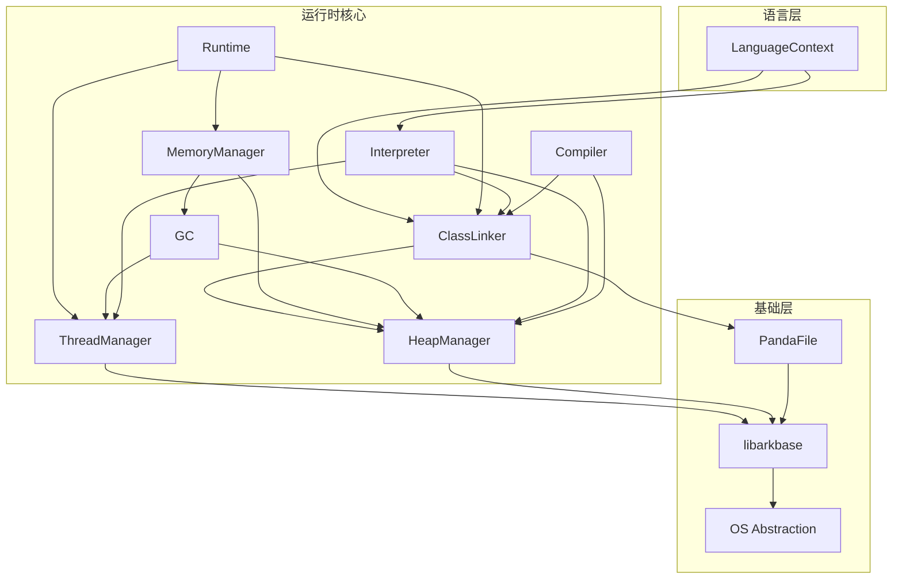

# 内部 API

## 概述

本文档描述 ArkCompiler Runtime Core 内部模块之间的接口，适用于参与运行时开发的工程师。

```
内部模块关系:
┌─────────────────────────────────────────┐
│           Language Plugin               │
│         (ETS / EcmaScript)              │
└─────────────────┬───────────────────────┘
                  │ LanguageContext
┌─────────────────▼───────────────────────┐
│              Runtime                    │
│  ┌─────────┐ ┌─────────┐ ┌─────────┐   │
│  │  Class  │ │  Thread │ │   GC    │   │
│  │ Linker  │ │ Manager │ │         │   │
│  └────┬────┘ └────┬────┘ └────┬────┘   │
│       │           │           │         │
│  ┌────▼───────────▼───────────▼────┐   │
│  │         Memory Manager          │   │
│  └─────────────────────────────────┘   │
└─────────────────────────────────────────┘
```

## 核心模块接口

### 1. Runtime 模块

**头文件**: `static_core/runtime/include/runtime.h`

**核心类**: `Runtime`

```cpp
class Runtime {
public:
    // 创建/销毁运行时实例
    static bool Create(const RuntimeOptions &options);
    static void Destroy();
    static Runtime *GetCurrent();
    
    // 获取子系统
    ClassLinker *GetClassLinker() const;
    ThreadManager *GetThreadManager() const;
    MemoryManager *GetMemoryManager() const;
    
    // 语言上下文
    LanguageContext GetLanguageContext(panda_file::SourceLang lang) const;
    
    // VM 列表管理
    void AddVM(PandaVM *vm);
    void RemoveVM(PandaVM *vm);
};
```

**稳定性**: 稳定接口，向后兼容

### 2. ClassLinker 模块

**头文件**: `static_core/runtime/include/class_linker.h`

**核心类**: `ClassLinker`

```cpp
class ClassLinker {
public:
    // 类加载
    Class *GetClass(const panda_file::File *pf, panda_file::File::EntityId id);
    Class *GetClass(const panda_file::File *pf, panda_file::File::EntityId id, 
                    ClassLinkerContext *context);
    
    // 从描述符加载
    Class *GetClass(const char *descriptor, bool *err = nullptr);
    
    // 数组类加载
    Class *GetArrayClass(Class *component_class);
    
    // 类初始化
    bool InitializeClass(ManagedThread *thread, Class *klass);
    
    // 添加/移除类链接器上下文
    void AddContext(ClassLinkerContext *ctx);
    void RemoveContext(ClassLinkerContext *ctx);
};
```

**稳定性**: 稳定接口

**依赖方向**: 
- 依赖: `panda_file`, `mem`, `thread`
- 被依赖: `LanguageContext`, `Interpreter`

### 3. Thread 模块

**头文件**: `static_core/runtime/include/thread.h`, `managed_thread.h`

**核心类**: `Thread`, `ManagedThread`

```cpp
class Thread {
public:
    // 线程状态
    enum ThreadStatus {
        CREATED,
        RUNNING,
        NATIVE,
        BLOCKED,
        WAITING,
        SUSPENDED,
        TERMINATED
    };
    
    // 获取当前线程
    static Thread *GetCurrent();
    
    // 线程状态管理
    void SetStatus(ThreadStatus status);
    ThreadStatus GetStatus() const;
    
    // 栈管理
    Frame *GetCurrentFrame() const;
    void SetCurrentFrame(Frame *frame);
};

class ManagedThread : public Thread {
public:
    // 对象句柄存储
    HandleStorage *GetHandleStorage() const;
    
    // 局部根集合
    void VisitGCRoots(const GCRootVisitor &visitor);
    
    // 异常处理
    ObjectHeader *GetException() const;
    void SetException(ObjectHeader *exception);
    void ClearException();
};
```

**稳定性**: 稳定接口

**线程安全**: 线程本地存储，无需额外同步

### 4. MemoryManager / HeapManager 模块

**头文件**: 
- `static_core/runtime/mem/memory_manager.h`
- `static_core/runtime/mem/heap_manager.h`

**核心类**: `MemoryManager`, `HeapManager`

```cpp
class MemoryManager {
public:
    // 创建/销毁
    static MemoryManager *Create(const RuntimeOptions &options);
    void Destroy();
    
    // 获取子系统
    HeapManager *GetHeapManager() const;
    GC *GetGC() const;
    
    // 全局根集合
    void VisitGCRoots(const GCRootVisitor &visitor);
};

class HeapManager {
public:
    // 对象分配
    ObjectHeader *AllocateObject(size_t size, const Class *klass);
    ObjectHeader *AllocateObjectInYoung(size_t size, const Class *klass);
    
    // 数组分配
    ObjectHeader *AllocateArray(size_t size, const Class *array_class, 
                                size_t num_elements);
    
    // 大对象分配
    ObjectHeader *AllocateHugeObject(size_t size, const Class *klass);
    
    // TLAB 管理
    TLAB *GetTLAB(ManagedThread *thread);
    void ResetTLAB(ManagedThread *thread);
    
    // GC 触发
    void TriggerGC(GCTaskCause cause);
};
```

**稳定性**: 内部接口，可能变化

**依赖方向**:
- 依赖: `GC`, `PoolManager`, `Thread`
- 被依赖: `Runtime`, `ObjectAllocator`

### 5. GC 模块

**头文件**: `static_core/runtime/mem/gc/gc.h`

**核心类**: `GC` (基类), `G1GC`, `StwGC`, `EpsilonGC`

```cpp
class GC {
public:
    // GC 类型
    enum class GCType {
        EPSILON_GC,
        STW_GC,
        G1_GC,
        EPSILON_G1_GC,
        CMC_GC
    };
    
    // 触发 GC
    void TriggerGC(GCTaskCause cause);
    
    // 等待 GC 完成
    void WaitForGC(GCTaskCause cause);
    
    // 堆遍历
    void VisitObjects(const ObjectVisitor &visitor);
    
    // 获取 GC 统计
    const GCStats *GetStats() const;
};

// G1 GC 特有接口
class G1GC : public GC {
public:
    // 年轻代 GC
    void YoungGC();
    
    // 混合 GC
    void MixedGC();
    
    // 全 GC
    void FullGC();
};
```

**稳定性**: 内部接口

**GC Barrier 接口**:

```cpp
class GCBarrierSet {
public:
    // 写屏障
    static void WriteBarrier(ObjectHeader *obj, ObjectHeader *value);
    
    // 读屏障（用于并发 GC）
    static ObjectHeader *ReadBarrier(ObjectHeader *obj);
    
    // 预写屏障
    static void PreWriteBarrier(ObjectHeader *obj);
};
```

### 6. PandaFile 模块

**头文件**: `static_core/libarkfile/include/file.h`

**核心类**: `File`, `ClassDataAccessor`, `MethodDataAccessor`

```cpp
class File {
public:
    // 打开文件
    static std::unique_ptr<File> Open(const std::string &filename);
    static std::unique_ptr<File> OpenFromMemory(std::vector<uint8_t> &&data);
    
    // 获取类信息
    ClassDataAccessor GetClassDataAccessor(EntityId id) const;
    MethodDataAccessor GetMethodDataAccessor(EntityId id) const;
    FieldDataAccessor GetFieldDataAccessor(EntityId id) const;
    
    // 获取字符串
    const char *GetStringData(EntityId id, size_t *length = nullptr) const;
    
    // 获取代码
    const uint8_t *GetMethodCode(EntityId id) const;
};

class ClassDataAccessor {
public:
    // 类基本信息
    const char *GetDescriptor() const;
    uint32_t GetAccessFlags() const;
    
    // 父类
    EntityId GetSuperClassId() const;
    
    // 接口
    void EnumerateInterfaces(const std::function<void(EntityId)> &callback) const;
    
    // 方法
    void EnumerateMethods(const std::function<void(MethodDataAccessor &)> &callback) const;
    
    // 字段
    void EnumerateFields(const std::function<void(FieldDataAccessor &)&callback) const;
};
```

**稳定性**: 稳定接口

### 7. Interpreter 模块

**头文件**: `static_core/runtime/interpreter/` (实现细节，无统一头文件)

**核心功能**: 字节码解释执行

```cpp
// 解释器入口（概念性）
class Interpreter {
public:
    // 执行方法
    static void Execute(ManagedThread *thread, const Method *method, 
                       const uint8_t *pc, Frame *frame);
    
    // 调用入口点
    static void InvokeMethod(ManagedThread *thread, const Method *method, 
                            ObjectHeader *this_obj, Value *args, size_t nargs);
};
```

**实现位置**:
- `static_core/runtime/interpreter/interpreter.cpp`
- `static_core/runtime/interpreter/interpreter-inl.h`

**稳定性**: 内部实现细节

### 8. Compiler 模块

**头文件**: `static_core/compiler/` 目录下多个头文件

**核心类**: `Compiler`, `Graph`, `CodeGenerator`

```cpp
class Compiler {
public:
    // 编译方法
    bool CompileMethod(const Method *method, CompilationMode mode);
    
    // 检查是否已编译
    bool IsCompiled(const Method *method) const;
    
    // 获取编译后代码
    CodeInfo GetCompiledCode(const Method *method) const;
};

// IR 图
class Graph {
public:
    // 基本块操作
    BasicBlock *CreateBasicBlock();
    void RemoveBasicBlock(BasicBlock *block);
    
    // 指令操作
    Inst *CreateInst(Opcode opcode);
    void RemoveInst(Inst *inst);
    
    // 优化 Pass
    void RunPass(Pass *pass);
    void RunOptimizations();
};
```

**稳定性**: 内部接口，频繁变化

## 模块依赖图



## 接口稳定性分级

| 等级 | 说明 | 接口示例 |
|------|------|----------|
| **稳定** | 向后兼容，可长期使用 | `Runtime::GetCurrent()`, `ClassLinker::GetClass()` |
| **半稳定** | 可能扩展，基本行为不变 | `GC::TriggerGC()`, `HeapManager::AllocateObject()` |
| **不稳定** | 可能随时变化 | `Compiler::CompileMethod()`, `Graph::RunPass()` |
| **内部** | 仅模块内部使用 | 实现细节，头文件中未暴露 |

## 可替换点

Runtime Core 设计了以下可替换/可扩展点：

### 1. GC 可替换

通过模板参数选择 GC 实现：

```cpp
// 在 LanguageConfig 中指定
template<GCType type>
class AllocConfig {
    using GCType = G1GC;  // 或其他 GC
};
```

**可替换实现**:
- `G1GC` - 分代 GC
- `StwGC` - 停止世界 GC
- `EpsilonGC` - 无操作 GC

### 2. 语言插件可替换

通过插件机制支持多语言：

```cpp
// LanguageContext 接口
class LanguageContext {
public:
    virtual void Initialize() = 0;
    virtual void Finalize() = 0;
    // ...
};
```

### 3. 平台抽象可替换

通过平台目录实现多平台支持：

```cpp
// platforms/unix/, platforms/windows/, platforms/ohos/
class OS {
public:
    static void *MMap(size_t size);
    static void MUnmap(void *addr, size_t size);
    // ...
};
```

## 下一步

- 了解 [GN 构建目标](06_GN_Targets.md) 构建模块
- 查看 [安全风险](08_Security.md) 了解内部安全约束
- 阅读源码 `static_core/runtime/include/` 获取完整接口定义
