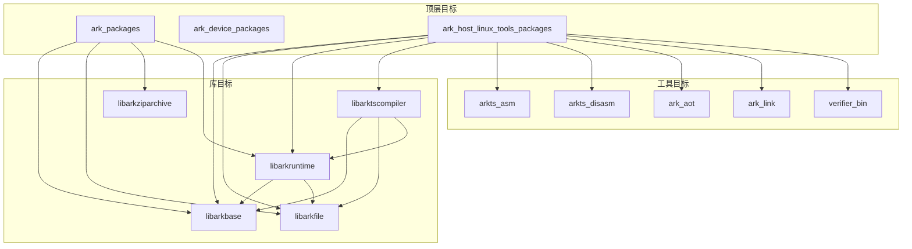

# GN 构建目标梳理

## 概述

ArkCompiler Runtime Core 使用 GN (Generate Ninja) 构建系统。本文档梳理关键构建目标、类型、依赖关系和配置选项。

## 根构建文件

### BUILD.gn（根目录）

**路径**: `/Volumes/lexar/code/d/work/oh/arkcompiler/runtime_core/BUILD.gn`

**主要目标**:

| Target | 类型 | 说明 |
|--------|------|------|
| `arkcompiler_params` | group | 编译器参数配置 |
| `ark_device_packages` | group | 设备端产物包 |
| `ark_packages` | group | 基础库包 |
| `ark_host_linux_tools_packages` | group | Linux 主机工具包 |
| `ark_host_windows_tools_packages` | group | Windows 主机工具包 |
| `ark_host_mac_tools_packages` | group | Mac 主机工具包 |
| `ark_config` | config | 编译配置 |
| `ark_public_config` | config | 公共头文件配置 |

### static_core/BUILD.gn

**路径**: `static_core/BUILD.gn`

**主要目标**:

| Target | 类型 | 说明 |
|--------|------|------|
| `ark_packages` | group | 静态核心包集合 |
| `ark_host_linux_tools_packages` | group | Linux 工具集合 |
| `ark_host_windows_tools_packages` | group | Windows 工具集合 |
| `ark_host_mac_tools_packages` | group | Mac 工具集合 |
| `ark_common_config` | config | 通用编译配置 |
| `ark_config` | config | 运行时配置 |
| `ark_host_config` | config | 主机工具配置 |

## 关键模块构建目标

### 1. libpandabase（基础库）

**构建文件**: `libpandabase/BUILD.gn`

| Target | 类型 | 输出 | 说明 |
|--------|------|------|------|
| `libarkbase` | shared_library | libarkbase.so | 共享库 |
| `libarkbase_static` | static_library | libarkbase_static.a | 静态库 |
| `libarkbase_frontend_static` | static_library | libarkbase_frontend_static.a | 前端静态库 |
| `arkbase_public_headers` | ohos_shared_headers | - | 头文件导出 |
| `arkbase_header_deps` | group | - | 头文件依赖 |

**关键配置**:
```gn
config("arkbase_public_config") {
  include_dirs = [
    "$ark_root/libpandabase/",
    "$ark_root/libpandabase/include",
    "$ark_root/platforms",
  ]
}
```

### 2. libpandafile（字节码文件库）

**构建文件**: `libpandafile/BUILD.gn`

| Target | 类型 | 输出 | 说明 |
|--------|------|------|------|
| `libarkfile` | shared_library | libarkfile.so | 共享库 |
| `libarkfile_static` | static_library | libarkfile_static.a | 静态库 |
| `arkfile_header_deps` | group | - | 头文件依赖 |

### 3. static_core/libarkbase（新版基础库）

**构建文件**: `static_core/libarkbase/BUILD.gn`

| Target | 类型 | 输出 | 说明 |
|--------|------|------|------|
| `libarktsbase` | shared_library | libarktsbase.so | 共享库 |
| `libarktsbase_package` | group | - | 包集合 |

### 4. static_core/libarkfile（新版字节码文件库）

**构建文件**: `static_core/libarkfile/BUILD.gn`

| Target | 类型 | 输出 | 说明 |
|--------|------|------|------|
| `libarktsfile` | shared_library | libarktsfile.so | 共享库 |
| `libarktsfile_package` | group | - | 包集合 |
| `libarkfileExt` | static_library | - | 扩展库 |
| `libarksupport` | static_library | - | 支持库 |

### 5. static_core/runtime（运行时）

**构建文件**: `static_core/runtime/BUILD.gn`

| Target | 类型 | 输出 | 说明 |
|--------|------|------|------|
| `libarkruntime` | shared_library | libarkruntime.so | 运行时共享库 |
| `runtime_headers` | source_set | - | 头文件集合 |
| `runtime_gen_headers` | group | - | 生成头文件 |

### 6. static_core/compiler（编译器）

**构建文件**: `static_core/compiler/BUILD.gn`

| Target | 类型 | 输出 | 说明 |
|--------|------|------|------|
| `libarktscompiler` | shared_library | libarktscompiler.so | 编译器共享库 |
| `libarkcompiler_frontend_static` | static_library | - | 前端静态库 |
| `compiler_headers` | source_set | - | 头文件集合 |

**AOT 相关**:

| Target | 类型 | 输出 | 说明 |
|--------|------|------|------|
| `libarkaotmanager` | static_library | - | AOT 管理器 |
| `ark_aot` | executable | ark_aot | AOT 编译器 |

**构建文件**: `static_core/compiler/tools/paoc/BUILD.gn`

### 7. static_core/assembler（汇编器）

**构建文件**: `static_core/assembler/BUILD.gn`

| Target | 类型 | 输出 | 说明 |
|--------|------|------|------|
| `libarktsassembler_package` | group | - | 包集合 |
| `arkts_asm` | executable | arkts_asm | 汇编器工具 |

### 8. static_core/disassembler（反汇编器）

**构建文件**: `static_core/disassembler/BUILD.gn`

| Target | 类型 | 输出 | 说明 |
|--------|------|------|------|
| `arktsdisassembler` | executable | arkts_disasm | 反汇编器工具 |

### 9. static_core/verification（验证器）

**构建文件**: `static_core/verification/verifier/BUILD.gn`

| Target | 类型 | 输出 | 说明 |
|--------|------|------|------|
| `verifier_bin` | executable | verifier_bin | 验证器工具 |
| `verifier.config` | generated_file | - | 验证器配置 |

### 10. abc2program（ABC 转换工具）

**构建文件**: `static_core/abc2program/BUILD.gn`

| Target | 类型 | 输出 | 说明 |
|--------|------|------|------|
| `arkts_abc2prog` | executable | arkts_abc2prog | 转换工具 |
| `arkts_abc2program` | executable | arkts_abc2program | 转换工具（别名） |

### 11. static_core/static_linker（静态链接器）

**构建文件**: `static_core/static_linker/BUILD.gn`

| Target | 类型 | 输出 | 说明 |
|--------|------|------|------|
| `ark_link` | executable | ark_link | 静态链接器 |

### 12. static_core/plugins/ets/runtime/ani（ANI 接口）

**构建文件**: `static_core/plugins/ets/runtime/ani/BUILD.gn`

| Target | 类型 | 输出 | 说明 |
|--------|------|------|------|
| `ani` | shared_library | libani.so | ANI 共享库 |

### 13. libabckit（ABC Kit）

**构建文件**: `libabckit/BUILD.gn`, `libabckit/src/BUILD.gn`

| Target | 类型 | 输出 | 说明 |
|--------|------|------|------|
| `abckit_packages` | group | - | ABC Kit 包集合 |

## 关键配置选项

### 根配置 (ark_config.gni)

```gn
# 构建模式
ark_standalone_build = false    # 是否独立构建
enable_static_vm = true         # 启用静态 VM
enable_codegen = true           # 启用代码生成
enable_irtoc = true             # 启用 IRTOC

# 平台配置
is_linux = true
is_ohos = false
is_mac = false
is_mingw = false

# 架构
current_cpu = "arm64"           # arm, arm64, x86, x64

# 特性开关
is_llvmbackend = false          # LLVM 后端
is_llvm_aot = false             # LLVM AOT
is_asan = false                 # Address Sanitizer
```

### 编译配置

```gn
# 在 BUILD.gn 中定义
config("ark_config") {
  cflags_cc = [
    "-std=c++17",
    "-pedantic",
    "-Wall",
    "-Wextra",
    "-Werror",
    "-fno-rtti",
    "-fno-exceptions",
  ]
  
  defines = [
    "PANDA_TARGET_MOBILE_WITH_MANAGED_LIBS=1",
  ]
}
```

### 平台相关定义

```gn
# Linux
if (is_linux) {
  defines += [
    "PANDA_TARGET_UNIX",
    "PANDA_TARGET_LINUX",
    "PANDA_WITH_BYTECODE_OPTIMIZER",
    "PANDA_WITH_COMPILER",
    "PANDA_USE_FUTEX",
  ]
}

# OpenHarmony
if (is_ohos) {
  defines += [
    "PANDA_TARGET_OHOS",
    "PANDA_TARGET_UNIX",
    "PANDA_USE_FUTEX",
  ]
}

# ARM64
if (current_cpu == "arm64") {
  defines += [
    "PANDA_TARGET_ARM64",
    "PANDA_TARGET_64",
    "PANDA_ENABLE_GLOBAL_REGISTER_VARIABLES",
  ]
}
```

## Target 依赖关系



## 构建命令示例

### 完整构建

```bash
# 标准系统构建
./build.sh --product-name rk3568 --build-target arkcompiler/runtime_core:ark_packages

# 主机工具构建
./build.sh --product-name rk3568 --build-target arkcompiler/runtime_core:ark_host_linux_tools_packages
```

### 单独构建模块

```bash
# 构建基础库
gn gen out
ninja -C out arkcompiler/runtime_core/libpandabase:libarkbase

# 构建运行时
ninja -C out arkcompiler/runtime_core/static_core/runtime:libarkruntime

# 构建编译器
ninja -C out arkcompiler/runtime_core/static_core/compiler:libarktscompiler

# 构建工具
ninja -C out arkcompiler/runtime_core/static_core/assembler:arkts_asm
ninja -C out arkcompiler/runtime_core/static_core/disassembler:arktsdisassembler
ninja -C out arkcompiler/runtime_core/static_core/compiler/tools/paoc:ark_aot
```

## Inner Kits 定义

在 `bundle.json` 中定义的 Inner Kits（内部接口导出）：

| Kit 名称 | 路径 | 头文件基础路径 |
|----------|------|----------------|
| libarkbase | `//arkcompiler/runtime_core/libpandabase:libarkbase` | `libpandabase` |
| libarkbase_static | `//arkcompiler/runtime_core/libpandabase:libarkbase_static` | `libpandabase` |
| libarkfile_static | `//arkcompiler/runtime_core/libpandafile:libarkfile_static` | `libpandafile` |
| libarkfile_runtime_static | `//arkcompiler/runtime_core/libpandafile:libarkfile_runtime_static` | `libpandafile` |
| libarkziparchive_static | `//arkcompiler/runtime_core/libziparchive:libarkziparchive_static` | `libziparchive` |
| libarkassembler_static | `//arkcompiler/runtime_core/assembler:libarkassembler_static` | `assembler` |
| libarkbytecodeopt_frontend_static | `//arkcompiler/runtime_core/bytecode_optimizer:libarkbytecodeopt_frontend_static` | `bytecode_optimizer` |
| libarkcompiler_frontend_static | `//arkcompiler/runtime_core/compiler:libarkcompiler_frontend_static` | `compiler` |
| libarkverifier | `//arkcompiler/runtime_core/verifier:libarkverifier` | `verifier` |
| libarkruntime | `//arkcompiler/runtime_core/static_core/runtime:libarkruntime` | `static_core/runtime` |
| ani | `//arkcompiler/runtime_core/static_core/plugins/ets/runtime/ani:ani` | `static_core/plugins/ets/runtime/ani` |
| ani_helpers | `//arkcompiler/runtime_core/static_core/plugins/ets/runtime/libani_helpers:ani_helpers` | `static_core/plugins/ets/runtime/libani_helpers` |

## 下一步

- 查看 [编译产物](07_Build_Artifacts.md) 了解输出文件
- 了解 [安全风险](08_Security.md) 中的构建安全考虑
- 参考 `ark_config.gni` 获取完整配置选项
