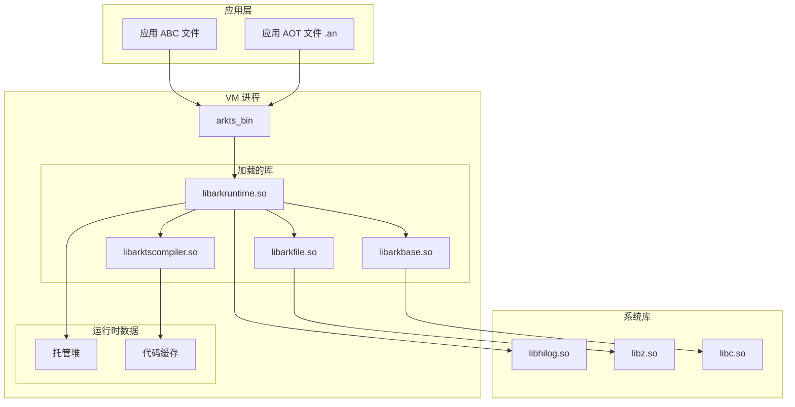

# 编译产物

## 概述

本文档梳理 ArkCompiler Runtime Core 的主要编译产物，包括库文件、可执行文件、配置文件等。

## 产物类型

```
编译产物分类:
┌─────────────────────────────────────────┐
│  库文件 (.so / .a)                      │
│  ├── 运行时库 (libarkruntime.so)        │
│  ├── 基础库 (libarkbase.so)             │
│  └── 编译器库 (libarktscompiler.so)     │
├─────────────────────────────────────────┤
│  可执行文件                             │
│  ├── VM (arkts_bin)                     │
│  ├── 汇编器 (arkts_asm)                 │
│  ├── 反汇编器 (arkts_disasm)            │
│  ├── AOT 编译器 (ark_aot)               │
│  └── 验证器 (verifier_bin)              │
├─────────────────────────────────────────┤
│  配置文件                               │
│  ├── 运行时配置                         │
│  └── 编译器选项                         │
└─────────────────────────────────────────┘
```

## 共享库 (.so)

### 1. libarkbase.so

**描述**: 基础运行时库

**来源**: `libpandabase/BUILD.gn` → `libarkbase`

**功能**:
- 内存管理（内存池、分配器）
- 同步原语（锁、条件变量）
- 日志系统
- 工具类（JSON、UTF、时间）

**安装路径**: `/system/lib64/libarkbase.so` (ARM64)

**依赖**:
- `libhilog.so` (如启用 hilog)
- `libc.so`

### 2. libarkfile.so

**描述**: 字节码文件处理库

**来源**: `libpandafile/BUILD.gn` → `libarkfile`

**功能**:
- ABC 文件解析
- 类/方法/字段元数据访问
- 常量池管理

**安装路径**: `/system/lib64/libarkfile.so`

**依赖**:
- `libarkbase.so`
- `libz.so`

### 3. libarkziparchive.so

**描述**: Zip 归档处理库

**来源**: `libziparchive/BUILD.gn`

**功能**:
- Zip 文件读取
- 压缩/解压支持

**安装路径**: `/system/lib64/libarkziparchive.so`

**依赖**:
- `libz.so`

### 4. libarkruntime.so (static_core)

**描述**: 核心运行时库（新版）

**来源**: `static_core/runtime/BUILD.gn` → `libarkruntime`

**功能**:
- 托管线程管理
- 内存管理（GC、堆）
- 解释器
- 类加载器
- 调试支持

**安装路径**: `/system/lib64/libarkruntime.so`

**依赖**:
- `libarktsbase.so`
- `libarktsfile.so`
- `libarktsziparchive.so`
- `libhilog.so`

### 5. libarktscompiler.so

**描述**: JIT/AOT 编译器库

**来源**: `static_core/compiler/BUILD.gn` → `libarktscompiler`

**功能**:
- IR 构建与优化
- 代码生成
- AOT 编译支持

**安装路径**: `/system/lib64/libarktscompiler.so`

**依赖**:
- `libarkruntime.so`
- `libarktsbase.so`
- `libarktsfile.so`

### 6. libani.so

**描述**: ANI (Ark Native Interface) 库

**来源**: `static_core/plugins/ets/runtime/ani/BUILD.gn` → `ani`

**功能**:
- 原生接口支持
- ETS 与原生代码互操作

**安装路径**: `/system/lib64/libani.so`

**依赖**:
- `libarkruntime.so`

## 静态库 (.a)

### 1. libarkbase_static.a

**描述**: 基础库静态版本

**来源**: `libpandabase/BUILD.gn` → `libarkbase_static`

**用途**: 静态链接到工具或测试

### 2. libarkfile_static.a

**描述**: 字节码文件库静态版本

**来源**: `libpandafile/BUILD.gn` → `libarkfile_static`

### 3. libarkfile_runtime_static.a

**描述**: 字节码文件库（运行时版本）

**来源**: `libpandafile/BUILD.gn` → `libarkfile_runtime_static`

### 4. libarktsbase.a (static_core)

**描述**: 新版基础库静态版本

**来源**: `static_core/libarkbase/BUILD.gn`

### 5. libarktsfile.a (static_core)

**描述**: 新版字节码文件库静态版本

**来源**: `static_core/libarkfile/BUILD.gn`

### 6. libarkcompiler_frontend_static.a

**描述**: 编译器前端静态库

**来源**: `compiler/BUILD.gn` → `libarkcompiler_frontend_static`

## 可执行文件

### 1. arkts_bin (ark)

**描述**: Ark VM 可执行文件

**来源**: `static_core/panda/BUILD.gn` → `arkts_bin`

**功能**:
- 执行 ABC 文件
- 支持解释执行和 JIT
- 支持加载 AOT 文件

**命令示例**:
```bash
arkts_bin --load-runtimes=ets --boot-panda-files=etsstdlib.abc app.abc EntryPoint
```

**安装路径**: `/system/bin/ark`

### 2. arkts_asm

**描述**: 汇编器

**来源**: `static_core/assembler/BUILD.gn` → `arkts_asm`

**功能**:
- 将 PA (Panda Assembly) 编译为 ABC

**命令示例**:
```bash
arkts_asm input.pa output.abc
```

**安装路径**: 主机开发工具

### 3. arkts_disasm (ark_disasm)

**描述**: 反汇编器

**来源**: `static_core/disassembler/BUILD.gn` → `arktsdisassembler`

**功能**:
- 将 ABC 反汇编为 PA
- 支持多种输出格式

**命令示例**:
```bash
arkts_disasm input.abc output.pa
```

**安装路径**: 主机开发工具

### 4. ark_aot

**描述**: AOT 编译器

**来源**: `static_core/compiler/tools/paoc/BUILD.gn` → `ark_aot`

**功能**:
- 将 ABC 编译为机器码 (.an 文件)

**命令示例**:
```bash
ark_aot --boot-panda-files=etsstdlib.abc --load-runtimes=ets \
        --paoc-panda-files=app.abc --paoc-output=app.an
```

**安装路径**: 主机开发工具

### 5. ark_aotdump

**描述**: AOT 文件分析工具

**来源**: `static_core/compiler/tools/aotdump/BUILD.gn` → `ark_aotdump`

**功能**:
- 查看 .an 文件内容
- 分析编译后代码

**安装路径**: 主机开发工具

### 6. verifier_bin (ark_verifier)

**描述**: 字节码验证器

**来源**: `verifier/BUILD.gn` → `ark_verifier`

**功能**:
- 验证 ABC 文件安全性
- 检查字节码合法性

**命令示例**:
```bash
ark_verifier --load-runtimes=ets --boot-panda-files=etsstdlib.abc app.abc
```

**安装路径**: 主机开发工具

### 7. ark_link

**描述**: 静态链接器

**来源**: `static_core/static_linker/BUILD.gn` → `ark_link`

**功能**:
- 静态链接多个 ABC 文件
- 生成单一可执行 ABC

**安装路径**: 主机开发工具

### 8. arkts_abc2prog

**描述**: ABC 到程序转换工具

**来源**: `static_core/abc2program/BUILD.gn` → `arkts_abc2prog`

**功能**:
- 将 ABC 转换为可读程序表示

**安装路径**: 主机开发工具

## 配置文件

### 1. runtime_options.yaml

**描述**: 运行时选项配置

**来源**: 合并生成自 `static_core/runtime/options.yaml` + 插件选项

**内容**: GC 参数、内存参数、编译器参数等

**安装路径**: `/system/etc/ark/` (可选)

### 2. app_static_runtime_enable_list.conf

**描述**: 应用静态运行时启用列表

**来源**: `static_core/ohos/app_static_runtime_enable_list.conf`

**安装路径**: `/system/etc/ark/app_static_runtime_enable_list.conf`

### 3. static_aot_methods_black_list.json

**描述**: AOT 方法黑名单

**来源**: `static_core/compiler/tools/paoc/static_aot_methods_black_list.json`

**安装路径**: `/system/etc/ark/static_aot_methods_black_list.json`

## 运行时加载关系



## 安装路径汇总

### 设备端路径 (OpenHarmony)

| 产物类型 | 路径 |
|----------|------|
| 共享库 | `/system/lib64/` (ARM64) |
| 可执行文件 | `/system/bin/` |
| 配置文件 | `/system/etc/ark/` |
| 标准库 ABC | `/system/usr/ark/` |

### 主机端路径 (开发工具)

| 产物类型 | 路径 |
|----------|------|
| 工具可执行文件 | `out/host/linux-x64/bin/` |
| 工具库 | `out/host/linux-x64/lib/` |
| 头文件 | `out/host/linux-x64/gen/` |

## 产物依赖关系

```
依赖层次（从上到下依赖下层）:

应用 ABC / AOT
    ↓
arkts_bin (VM)
    ↓
libarkruntime.so
    ↓
├── libarktscompiler.so (可选，用于 JIT)
├── libarktsfile.so
│   └── libarktsbase.so
├── libarktsziparchive.so
└── libhilog.so
    ↓
系统库 (libc, libz, ...)
```

## 下一步

- 了解 [安全风险](08_Security.md) 中的产物安全考虑
- 查看 [问题排查](09_Troubleshooting.md) 解决构建/运行问题
- 参考 `bundle.json` 获取完整产物定义
