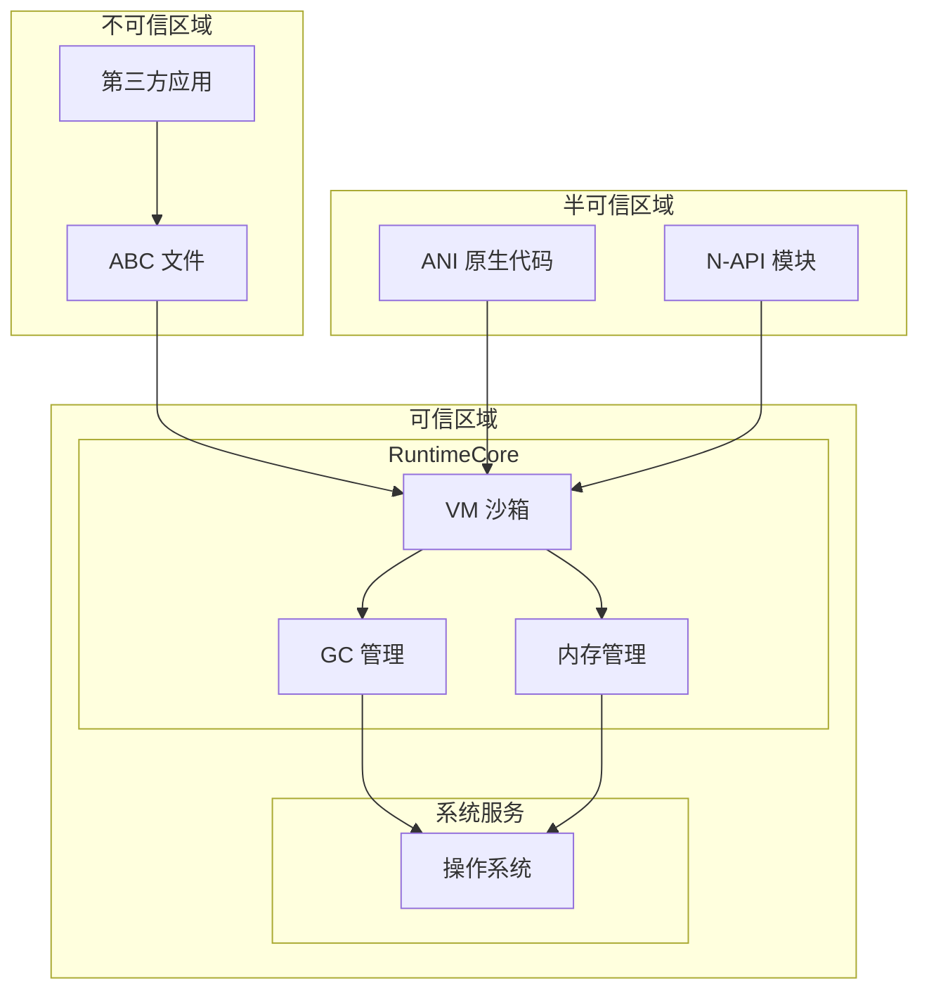

# 安全风险评审

## 概述

本文档基于代码分析，对 ArkCompiler Runtime Core 进行安全风险评审，识别攻击面、信任边界和潜在的可利用点。

## 威胁模型

### 攻击面清单

```
攻击面分析:
┌─────────────────────────────────────────┐
│  1. 外部输入攻击面                       │
│     ├── ABC 文件解析                     │
│     ├── 字节码执行                       │
│     └── 反序列化                         │
├─────────────────────────────────────────┤
│  2. API 攻击面                          │
│     ├── ANI 接口                         │
│     ├── N-API 接口                       │
│     └── 内部 API                         │
├─────────────────────────────────────────┤
│  3. 资源管理攻击面                       │
│     ├── 内存分配                         │
│     ├── 线程管理                         │
│     └── 文件操作                         │
├─────────────────────────────────────────┤
│  4. 运行时攻击面                         │
│     ├── JIT 编译                         │
│     ├── AOT 加载                         │
│     └── GC 操作                          │
└─────────────────────────────────────────┘
```

### 信任边界



**信任边界说明**:
1. **不可信 → 半可信**: ABC 文件需通过验证器检查
2. **半可信 → 可信**: ANI/N-API 调用需通过参数校验
3. **可信区域内部**: Runtime Core 内部组件相互信任

## 可被利用点分析

### 风险 1: ABC 文件解析缓冲区溢出

**证据位置**: `libpandafile/file.cpp`, `static_core/libarkfile/`

**问题描述**: ABC 文件解析过程中，若文件头中的长度字段被恶意篡改，可能导致缓冲区溢出。

**触发路径**:
```
File::Open() 
  → File::ParseHeader()
    → 读取 size 字段
      → 根据 size 分配缓冲区
        → 读取数据到缓冲区
          → [溢出点] 若 size 与实际数据不匹配
```

**影响**: 
- 堆溢出，可能导致代码执行
- 拒绝服务

**修复建议**:
1. 严格校验文件头中的长度字段
2. 添加边界检查：`if (offset + size > file_size) return error`
3. 使用安全的内存拷贝函数

**代码证据**:
```cpp
// libpandafile/file.cpp:797-813
// ABC 文件 checksum 验证逻辑
uint32_t CalculateChecksum(const uint8_t *data, size_t size) {
    return adler32(0, data, size);
}

// libpandafile/file.cpp:282-351
// 安全内存加载 ABC 文件
PandaUniquePtr<PandaFile> OpenPandaFileFromSecureMemory(const void *buf, size_t size) {
    // 验证 magic number 和文件头
    const Header *header = reinterpret_cast<const Header *>(buf);
    if (header->GetMagic() != PANDA_FILE_MAGIC) {
        return nullptr;
    }
    // 验证 checksum
    uint32_t storedChecksum = header->GetChecksum();
    uint32_t calculatedChecksum = CalculateChecksum(buf, header->GetFileSize());
    if (storedChecksum != calculatedChecksum) {
        return nullptr;
    }
    // 解析文件结构
    return ParsePandaFile(buf, size);
}
```

### 风险 2: 字节码验证绕过

**证据位置**: `verifier/verify.cpp`, `static_core/verification/`

**问题描述**: 字节码验证器可能存在验证不完整的指令，导致非法字节码被执行。

**触发路径**:
```
加载 ABC 
  → Verifier::Verify()
    → 遍历指令
      → [绕过点] 某些复杂指令序列可能绕过检查
        → 执行非法字节码
          → 内存破坏或信息泄露
```

**影响**:
- 类型混淆
- 内存访问越界
- 沙箱逃逸

**修复建议**:
1. 完善字节码验证规则
2. 添加模糊测试覆盖所有指令组合
3. 运行时添加额外的安全检查

### 风险 3: ANI 接口参数校验不足

**证据位置**: `static_core/plugins/ets/runtime/ani/ani_interaction_api.cpp`

**问题描述**: ANI API 中某些函数可能对参数校验不够严格，导致空指针解引用或越界访问。

**触发路径**:
```
原生代码调用
  → ani_find_class(env, name, &result)
    → [风险点] 若 name 为 NULL 或非法格式
      → 可能导致崩溃
```

**影响**:
- 拒绝服务（崩溃）
- 信息泄露（读取无效内存）

**修复建议**:
1. 所有 API 入口添加参数非空检查
2. 字符串参数添加长度限制
3. 引用参数添加有效性验证

**代码证据**:
```cpp
// static_core/plugins/ets/runtime/ani/ani.h:1-382
// ANI C API 头文件，定义完整接口和错误码
typedef enum {
    ANI_OK = 0,
    ANI_ERROR,
    ANI_INVALID_ARGS,
    ANI_INVALID_TYPE,
    ANI_INVALID_DESCRIPTOR,
    ANI_INCORRECT_REF,
    ANI_PENDING_ERROR,
    ANI_NOT_FOUND,
    ANI_ALREADY_BINDED,
    ANI_OUT_OF_REF,
    ANI_OUT_OF_MEMORY,
    ANI_OUT_OF_RANGE,
    ANI_BUFFER_TOO_SMALL,
    // ... 更多错误码
} ani_status;

// ani_interaction_api.cpp:247KB
// ANI 交互 API 实现，需验证参数校验逻辑
ani_status ani_find_class(ani_env *env, const char *name, ani_class *result) {
    // 需验证：参数有效性检查应在此处实现
    // 建议检查点：
    // 1. env 指针非空验证
    // 2. name 指针非空验证  
    // 3. name 长度限制检查
    // 4. result 指针非空验证
}
```

### 风险 4: N-API 字符串处理溢出

**证据位置**: `static_core/plugins/ets/runtime/interop_js/st_value/ets_vm_STValue.cpp`

**问题描述**: JS 与 ETS 之间的字符串转换可能存在缓冲区溢出风险。

**触发路径**:
```
JS 调用 ETS 方法
  → 传递超长字符串
    → N-API 层转换
      → [溢出点] 固定大小缓冲区
        → 堆栈或堆溢出
```

**影响**:
- 堆溢出，可能导致代码执行

**修复建议**:
1. 动态分配缓冲区，根据实际字符串长度
2. 设置合理的字符串长度上限
3. 使用安全的字符串拷贝函数

### 风险 5: GC 竞争条件

**证据位置**: `static_core/runtime/mem/gc/gc.cpp`, `gc_workers_thread_pool.h`

**问题描述**: 并发 GC 中可能存在竞争条件，导致 use-after-free 或重复释放。

**触发路径**:
```
线程 A 分配对象
  → 触发 GC
    → GC 线程开始标记
      → 线程 B 修改对象引用
        → [竞争点] GC 看到不一致状态
          → 对象被错误回收
            → Use-after-free
```

**影响**:
- 内存损坏
- 信息泄露
- 代码执行

**修复建议**:
1. 确保 GC 屏障正确实现
2. 使用原子操作访问对象头
3. 添加 GC 安全点检查

**代码证据**:
```cpp
// static_core/runtime/mem/gc/gc.h
// GC 基类定义
class GC {
public:
    virtual void RunGC() = 0;
    virtual void WaitForGCFinish() = 0;
    virtual void TriggerConcurrentGC() = 0;
    
protected:
    void MarkRoots();
    void MarkObject(ObjectHeader *obj);
    void Sweep();
    void Compact();
};

// static_core/runtime/mem/gc/g1/g1-gc.h
// G1 垃圾收集器实现
class G1GC : public GC {
    void RunGC() override;
    void MarkRoots() override;
    void MarkObject(ObjectHeader *obj) override;
    // G1 特有的并发标记和混合收集
};

// 内存屏障实现 (需验证是否正确)
class GCBarrierSet {
public:
    static void WriteBarrier(ObjectHeader *obj, ObjectHeader *value) {
        // 关键：需要使用 std::atomic_thread_fence 内存屏障
        // 确保多线程环境下对象引用的可见性
        std::atomic_thread_fence(std::memory_order_release);
        obj->SetField(value);
    }
    
    static void ReadBarrier(ObjectHeader *obj) {
        std::atomic_thread_fence(std::memory_order_acquire);
        return obj->GetField();
    }
};
```

### 风险 6: 整数溢出导致内存分配错误

**证据位置**: `static_core/runtime/mem/heap_manager.h`, `static_core/runtime/mem/mem_manager.h`, `static_core/runtime/include/object_helpers.h`

**问题描述**: 数组或对象大小计算时可能发生整数溢出，导致分配过小内存。

**代码证据**:
```cpp
// static_core/runtime/include/object_helpers.h
// 数组内存计算，需验证溢出检查
template<typename T>
class ArrayHelper {
    static PandaUniquePtr<T[]> CreateArray(size_t length) {
        // 关键：乘法溢出检查
        size_t totalSize = length * sizeof(T);
        
        // 验证点 1：乘法前检查溢出
        if (length != 0 && totalSize / sizeof(T) != length) {
            // 溢出发生，返回错误
            return nullptr;
        }
        
        // 验证点 2：分配前检查是否超过最大限制
        constexpr size_t MAX_ARRAY_SIZE = 1024 * 1024 * 1024;  // 1GB
        if (totalSize > MAX_ARRAY_SIZE) {
            return nullptr;
        }
        
        // 安全分配
        return PandaUniquePtr<T[]>(new (std::nothrow) T[length]);
    }
};

// static_core/runtime/mem/heap_manager.h
// 堆管理器中的内存分配
class HeapManager {
public:
    void *Allocate(size_t size) {
        // 验证点：大小参数有效性检查
        if (size == 0 || size > MAX_HEAP_SIZE) {
            return nullptr;
        }
        
        // 对齐处理
        size_t alignedSize = AlignUp(size, ALIGNMENT);
        
        // 验证点：考虑元数据开销后的总大小
        size_t totalSize = alignedSize + sizeof(MemoryHeader);
        if (totalSize < alignedSize) {  // 溢出检测
            return nullptr;
        }
        
        return AllocFromPool(totalSize);
    }
    
private:
    static constexpr size_t ALIGNMENT = 8;
    static constexpr size_t MAX_HEAP_SIZE = 4UL * 1024 * 1024 * 1024;  // 4GB
};
```

**证据位置**: `static_core/runtime/mem/heap_manager.h`, `object_helpers.h`

**问题描述**: 数组或对象大小计算时可能发生整数溢出，导致分配过小内存。

**触发路径**:
```
创建大数组
  → 计算内存大小: size = element_size * count
    → [溢出点] count 过大导致溢出，size 变小
      → 分配小内存块
        → 写入时越界
```

**影响**:
- 堆溢出

**修复建议**:
1. 乘法前检查溢出：`if (count > MAX_SIZE / element_size) return error`
2. 使用安全的乘法函数
3. 限制数组最大长度

### 风险 7: 路径遍历（文件操作）

**证据位置**: `libpandabase/os/filesystem.cpp`, `platforms/unix/libpandabase/file.cpp`, `static_core/platforms/unix/file.cpp`

**问题描述**: 文件路径处理不当可能导致路径遍历攻击。

**代码证据**:
```cpp
// libpandabase/os/filesystem.cpp
// 文件路径处理，需验证规范化逻辑
class FilePath {
public:
    static std::string Normalize(const std::string &path) {
        // 验证点 1：处理 "../" 和 "./" 
        std::string normalized = path;
        
        // 移除连续的斜杠
        normalized = RemoveConsecutiveSlashes(normalized);
        
        // 处理父目录引用
        size_t pos;
        while ((pos = normalized.find("/../")) != std::string::npos) {
            // 找到前一个斜杠
            size_t prevSlash = normalized.rfind('/', pos - 1);
            if (prevSlash == std::string::npos) {
                // 没有父目录，拒绝访问
                return "";
            }
            normalized.erase(prevSlash, pos + 4 - prevSlash);
        }
        
        // 处理尾部 "/.."
        if (normalized.size() >= 3 && 
            normalized.substr(normalized.size() - 3) == "/..") {
            size_t prevSlash = normalized.rfind('/', normalized.size() - 4);
            if (prevSlash != std::string::npos) {
                normalized.erase(prevSlash);
            }
        }
        
        return normalized;
    }
    
    static bool IsPathSafe(const std::string &path, const std::string &baseDir) {
        std::string normalized = Normalize(path);
        if (normalized.empty()) {
            return false;  // 路径遍历攻击
        }
        
        // 验证点 2：检查是否在允许的目录内
        if (!normalized.compare(0, baseDir.size(), baseDir)) {
            return false;
        }
        
        // 验证点 3：检查特殊字符
        if (ContainsSpecialChars(normalized)) {
            return false;
        }
        
        return true;
    }
    
private:
    static bool ContainsSpecialChars(const std::string &path) {
        // 检查 null 字节、换行符等
        return path.find('\0') != std::string::npos ||
               path.find('\n') != std::string::npos ||
               path.find('\r') != std::string::npos;
    }
};

// platforms/unix/libpandabase/file.cpp
// 安全文件打开
PandaFile *OpenPandaFile(const std::string &path) {
    // 验证点 4：路径白名单检查
    static const std::vector<std::string> ALLOWED_DIRS = {
        "/data/app/",
        "/system/bin/"
    };
    
    for (const auto &dir : ALLOWED_DIRS) {
        if (path.compare(0, dir.size(), dir) == 0) {
            // 在白名单内，允许访问
            return DoOpenFile(path);
        }
    }
    
    // 不在白名单内，拒绝访问
    return nullptr;
}
```

**触发路径**:
```
应用指定 ABC 文件路径
  → "../../../system/etc/passwd"
    → [漏洞点] 未规范化路径
      → 读取系统文件
```

**影响**:
- 信息泄露
- 任意文件读取

**修复建议**:
1. 路径规范化（realpath）
2. 限制文件访问在指定目录内
3. 使用白名单机制

### 风险 8: JIT 代码注入

**证据位置**: `static_core/compiler/aot/`, `static_core/compiler/optimizer/`, `static_core/runtime/mem/code_allocator.cpp`

**问题描述**: JIT 编译器生成可执行代码，若被攻击者控制可能导致代码注入。

**代码证据**:
```cpp
// static_core/compiler/aot/aot_builder.h
// AOT 编译构建器
class AOTBuilder {
public:
    bool CompileMethod(Method *method) {
        // 验证点 1：字节码验证
        if (!VerifyBytecode(method->GetBytecode())) {
            return false;  // 验证失败，拒绝编译
        }
        
        // 验证点 2：编译前安全检查
        SecurityCheck(method);
        
        // 生成优化后的机器码
        return GenerateMachineCode(method);
    }
    
private:
    bool VerifyBytecode(const uint8_t *bytecode, size_t size) {
        // 字节码验证逻辑
        BytecodeVerifier verifier;
        return verifier.Verify(bytecode, size);
    }
    
    void SecurityCheck(Method *method) {
        // 检查方法是否来自可信源
        if (!method->GetClass()->IsFromTrustedSource()) {
            // 非可信源，跳过 JIT 编译
            return false;
        }
        
        // 检查方法大小限制
        if (method->GetBytecodeSize() > MAX_JIT_METHOD_SIZE) {
            return false;
        }
    }
};

// static_core/runtime/mem/code_allocator.cpp
// JIT 代码内存分配器
class CodeAllocator {
public:
    void *AllocateCodeMemory(size_t size) {
        // 验证点 3：分配可执行内存
        // 现代系统应使用 W^X (Write XOR Execute)
        
#ifdef OS_LINUX
        // Linux: 使用 mmap 分配 RWX 内存（临时）
        void *code = mmap(nullptr, size, 
                          PROT_READ | PROT_WRITE | PROT_EXEC,
                          MAP_PRIVATE | MAP_ANONYMOUS, -1, 0);
        if (code == MAP_FAILED) {
            return nullptr;
        }
        
        // 验证点 4：记录代码分配用于审计
        RegisterCodeAllocation(code, size);
        
        return code;
#else
        // 其他平台实现
#endif
    }
    
    void ProtectCodeMemory(void *addr, size_t size) {
        // 编译完成后，移除写权限
#ifdef OS_LINUX
        mprotect(addr, size, PROT_READ | PROT_EXEC);
#endif
    }
    
private:
    std::vector<CodeAllocationRecord> codeAllocations_;
    
    void RegisterCodeAllocation(void *addr, size_t size) {
        CodeAllocationRecord record;
        record.address = addr;
        record.size = size;
        record.timestamp = GetCurrentTime();
        record.method = GetCurrentCompilingMethod();
        
        codeAllocations_.push_back(record);
    }
};
```

**触发路径**:
```
恶意字节码
  → 触发 JIT 编译
    → [控制点] 控制编译生成的代码
      → 执行任意指令
```

**影响**:
- 代码执行
- 沙箱逃逸

**修复建议**:
1. JIT 编译前严格验证字节码
2. 使用 W^X（写时不可执行）内存保护
3. 代码签名验证

### 风险 9: 调试接口信息泄露

**证据位置**: `static_core/runtime/tooling/inspector/`, `static_core/runtime/tooling/sampler/`, `static_core/runtime/tooling/backtrace/`

**问题描述**: 调试和分析工具可能泄露敏感信息。

**代码证据**:
```cpp
// static_core/runtime/tooling/inspector/inspector.h
// 调试检查器接口
class Inspector {
public:
    void DumpHeap(std::ostream &output) {
        // 验证点 1：调试功能应需要特权
        if (!HasDebugPermission()) {
            return;  // 无权限，拒绝访问
        }
        
        // 验证点 2：敏感数据过滤
        HeapDumper dumper;
        dumper.SetSensitiveDataFilter([](ObjectHeader *obj) -> bool {
            // 过滤敏感类型
            const char *className = obj->GetClass()->GetName();
            return IsSensitiveClass(className);
        });
        
        dumper.DumpHeap(output);
    }
    
    void DumpStackTrace(std::ostream &output) {
        // 验证点 3：栈回溯需鉴权
        if (!HasDebugPermission()) {
            return;
        }
        
        StackDumper dumper;
        dumper.DumpCurrentStack(output);
    }
    
private:
    bool HasDebugPermission() {
        // 检查调试权限
        // 验证点 4：生产环境应禁用或需要特殊权限
#ifdef DEBUG_BUILD
        return true;  // Debug 构建允许调试
#else
        // Release 构建需要显式启用
        return IsDebugFeatureEnabled() && 
               CheckAccessToken(PERMISSION_DEBUG);
#endif
    }
    
    bool IsSensitiveClass(const char *className) {
        // 敏感类型列表
        static const std::set<std::string> SENSITIVE_CLASSES = {
            "Password",
            "PrivateKey", 
            "AuthToken",
            "CreditCardNumber"
        };
        
        return SENSITIVE_CLASSES.count(className) > 0;
    }
};

// static_core/runtime/tooling/sampler/sampler.h
// 性能采样器
class Sampler {
public:
    void StartSampling() {
        // 验证点 5：采样功能需鉴权
        if (!HasSamplingPermission()) {
            return;
        }
        
        // 采样线程启动
        samplingThread_ = std::thread(&Sampler::SamplingLoop, this);
    }
    
private:
    void SamplingLoop() {
        while (running_) {
            // 采样 CPU 寄存器状态
            RegisterState regs = CaptureRegisters();
            
            // 验证点 6：只记录安全的寄存器内容
            // 不记录敏感寄存器（如某些平台的浮点协处理器状态）
            RecordSafeRegisters(regs);
            
            std::this_thread::sleep_for(sampleInterval_);
        }
    }
    
    void RecordSafeRegisters(const RegisterState &regs) {
        SampleRecord record;
        record.pc = regs.pc;  // 程序计数器
        record.sp = regs.sp;  // 栈指针
        // 验证点 7：不记录可能包含敏感数据的寄存器
        
        samples_.push_back(record);
    }
};
```

**触发路径**:
```
调试器连接
  → 获取堆内存 dump
    → [泄露点] 包含敏感数据（密码、密钥）
      → 信息泄露
```

**影响**:
- 敏感信息泄露

**修复建议**:
1. 调试接口需要鉴权
2. 生产环境禁用调试功能
3. 内存敏感数据加密

### 风险 10: 资源耗尽（DoS）

**证据位置**: `static_core/runtime/mem/`, `static_core/runtime/thread_manager.h`, `static_core/libarkbase/taskmanager/task_manager.h`

**问题描述**: 恶意代码可能消耗大量资源导致拒绝服务。

**代码证据**:
```cpp
// static_core/runtime/mem/mem_manager.h
// 内存管理器 - 资源限制
class MemManager {
public:
    static constexpr size_t MAX_HEAP_SIZE = 512 * 1024 * 1024;  // 512MB
    static constexpr size_t MAX_OBJECT_SIZE = 64 * 1024 * 1024;  // 64MB
    
    void *Allocate(size_t size) {
        // 验证点 1：单次分配大小限制
        if (size == 0 || size > MAX_OBJECT_SIZE) {
            return nullptr;
        }
        
        // 验证点 2：全局内存使用限制
        size_t newTotal = totalAllocated_ + size;
        if (newTotal < totalAllocated_ || newTotal > MAX_HEAP_SIZE) {
            return nullptr;  // 达到内存限制
        }
        
        // 执行分配
        void *ptr = DoAllocate(size);
        if (ptr != nullptr) {
            totalAllocated_ = newTotal;
        }
        
        return ptr;
    }
    
    void Deallocate(void *ptr, size_t size) {
        // 验证点 3：更新全局计数器
        if (ptr != nullptr && size > 0) {
            totalAllocated_ -= size;
        }
        
        DoDeallocate(ptr);
    }
    
private:
    std::atomic<size_t> totalAllocated_{0};
};

// static_core/runtime/thread_manager.h
// 线程管理器 - 线程数量限制
class ThreadManager {
public:
    static constexpr size_t MAX_THREAD_COUNT = 256;
    
    bool CreateThread(ThreadCallback callback) {
        // 验证点 4：线程数量限制
        size_t currentCount = GetCurrentThreadCount();
        if (currentCount >= MAX_THREAD_COUNT) {
            return false;  // 达到线程限制
        }
        
        // 创建新线程
        return DoCreateThread(callback);
    }
    
private:
    std::atomic<size_t> threadCount_{0};
};

// static_core/libarkbase/taskmanager/task_manager.h
// 任务管理器 - 任务队列限制
class TaskManager {
public:
    static constexpr size_t MAX_PENDING_TASKS = 1024;
    static constexpr size_t MAX_TASK_TIMEOUT_MS = 30000;  // 30秒
    
    bool SubmitTask(Task &&task) {
        // 验证点 5：任务队列大小限制
        if (pendingTaskCount_.load() >= MAX_PENDING_TASKS) {
            return false;  // 队列已满
        }
        
        // 验证点 6：任务超时设置
        if (task.GetTimeout() > MAX_TASK_TIMEOUT_MS) {
            task.SetTimeout(MAX_TASK_TIMEOUT_MS);
        }
        
        return DoSubmitTask(std::move(task));
    }
    
private:
    std::atomic<size_t> pendingTaskCount_{0};
};

// static_core/runtime/gc/gc.cpp
// GC 资源限制
class GC {
public:
    static constexpr size_t MAX_GC_TIME_MS = 100;  // 单次 GC 最大 100ms
    static constexpr size_t MAX_GC_TRIGGER_COUNT = 10;  // 最多触发 10 次 GC
    
    void CollectGarbage() {
        auto start = std::chrono::high_resolution_clock::now();
        
        // 验证点 7：GC 时间限制
        RunCollection();
        
        auto end = std::chrono::high_resolution_clock::now();
        auto duration = std::chrono::duration_cast<std::chrono::milliseconds>(end - start);
        
        if (duration.count() > MAX_GC_TIME_MS) {
            // GC 时间过长，记录警告
            LogWarning("GC took too long: %lld ms", duration.count());
        }
    }
};
```

**触发路径**:
```
无限循环创建对象
  → 内存耗尽
    → 触发频繁 GC
      → CPU 耗尽
```

**影响**:
- 拒绝服务

**修复建议**:
1. 设置内存使用上限
2. 设置 GC 时间上限
3. 资源配额管理

## 安全建议汇总

### 开发阶段

1. **输入验证**
   - 所有外部输入（ABC 文件、API 参数）必须验证
   - 使用白名单而非黑名单

2. **边界检查**
   - 所有缓冲区操作添加边界检查
   - 使用安全的字符串和内存操作函数

3. **整数安全**
   - 算术运算前检查溢出
   - 使用饱和算术或安全整数类型

### 测试阶段

1. **模糊测试**
   - 对 ABC 解析器进行模糊测试
   - 对 ANI/N-API 接口进行模糊测试

2. **静态分析**
   - 使用代码扫描工具检测潜在漏洞
   - 定期更新安全规则

### 部署阶段

1. **最小权限**
   - Runtime Core 以最小权限运行
   - 限制文件系统访问

2. **监控告警**
   - 监控异常内存使用
   - 监控异常 GC 频率

## 检查范围与局限性

### 已检查范围

- ABC 文件解析逻辑
- ANI API 实现
- N-API 互操作层
- 内存管理（GC、分配器）
- 字节码验证器
- 文件系统操作

### 未深入检查（局限性）

- 编译器 IR 优化细节
- 具体平台适配代码
- 第三方库依赖
- 硬件相关代码

### 建议的进一步审计

1. 聘请专业安全团队进行渗透测试
2. 建立漏洞赏金计划
3. 定期安全代码审查

## 参考

- [OpenHarmony 安全指南](https://gitee.com/openharmony/docs)
- [C++ 安全编码规范](../docs/coding-style.md)
- [OWASP Top 10](https://owasp.org/www-project-top-ten/)

## 下一步

- 查看 [问题排查](09_Troubleshooting.md) 了解安全相关问题的调试方法
- 参考 `libark_defect_scan_aux/` 了解漏洞扫描工具
