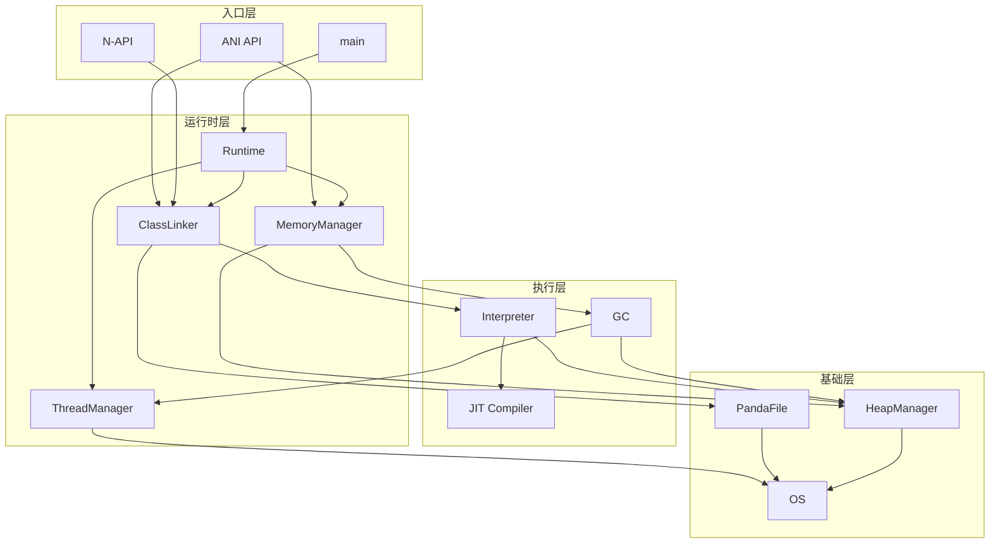

# 附录：关键调用链

## 概述

本文档记录 ArkCompiler Runtime Core 中从入口到核心逻辑的关键调用链，便于理解代码执行流程。

## 1. VM 启动调用链

```
main() [panda/panda.cpp]
  └── Runtime::Create() [runtime/include/runtime.h]
        ├── RuntimeOptions::Parse() 解析命令行参数
        ├── Logger::Initialize() 初始化日志
        ├── PoolManager::Create() 创建内存池管理器
        ├── MemoryManager::Create() 创建内存管理器
        │     ├── HeapManager::Create() 创建堆管理器
        │     └── GC::Create() 创建 GC
        ├── ThreadManager::Create() 创建线程管理器
        ├── ClassLinker::Create() 创建类链接器
        │     └── LoadBootPandaFiles() 加载启动 ABC 文件
        │           └── File::Open() 打开文件
        │                 └── ParseHeader() 解析文件头
        └── LanguageContext::Initialize() 初始化语言上下文
```

## 2. 类加载调用链

```
ClassLinker::GetClass(descriptor)
  └── ClassLinker::GetClass(pf, id, context)
        ├── LookupClassInCache() 在缓存中查找
        └── 如果未找到:
              └── ClassLinker::DefineClass()
                    ├── AllocateClass() 分配类对象内存
                    │     └── HeapManager::AllocateObject()
                    │           └── ObjectAllocator::Allocate()
                    ├── LoadClassData() 加载类数据
                    │     ├── ClassDataAccessor 访问类元数据
                    │     ├── LoadSuperClass() 加载父类
                    │     └── LoadInterfaces() 加载接口
                    ├── LoadMethods() 加载方法
                    │     └── Method::Create()
                    └── LoadFields() 加载字段
                          └── Field::Create()
```

## 3. 方法调用调用链（解释执行）

```
Interpreter::Execute()
  └── ExecuteImpl() [interpreter/interpreter.cpp]
        ├── FetchInstruction() 取指令
        ├── DecodeInstruction() 解码
        └── ExecuteInstruction() 执行指令
              └── 根据 opcode 分发:
                    ├── HANDLE_CALL() 方法调用
                    │     └── Method::Invoke()
                    │           └── 检查是否已编译:
                    │                 ├── 已编译: 跳转到机器码
                    │                 └── 未编译: 继续解释执行
                    ├── HANDLE_RETURN() 返回
                    ├── HANDLE_NEW() 创建对象
                    │     └── HeapManager::AllocateObject()
                    └── HANDLE_... 其他指令
```

## 4. JIT 编译调用链

```
Interpreter::Execute() 执行热点代码
  └── 触发 JIT 编译:
        └── Compiler::CompileMethod()
              ├── Graph::Create() 创建 IR 图
              ├── IRBuilder::Build() 构建 IR
              │     ├── BytecodeToIR() 字节码转 IR
              │     └── CreateInst() 创建指令节点
              ├── PassManager::Run() 运行优化 Pass
              │     ├── PassManager::RunPass<Inlining>() 内联
              │     ├── PassManager::RunPass<ConstantFolding>() 常量折叠
              │     └── PassManager::RunPass<...>() 其他优化
              └── CodeGenerator::Generate() 生成机器码
                    ├── Encoder::Encode() 编码指令
                    └── CodeAllocator::Allocate() 分配代码内存
```

## 5. GC 调用链（G1 GC）

```
HeapManager::AllocateObject() 分配失败
  └── MemoryManager::TriggerGC()
        └── G1GC::Trigger()
              ├── GC::PreGC() GC 前准备
              ├── SuspendAllThreads() 暂停所有托管线程
              │     └── ThreadManager::SuspendAll()
              ├── G1GC::Mark() 标记阶段
              │     ├── MarkRoots() 标记根集合
              │     │     ├── VisitGCRoots() 访问 GC 根
              │     │     └── MarkObject() 标记对象
              │     └── ConcurrentMark() 并发标记
              ├── G1GC::Evacuate() 复制阶段
              │     ├── SelectRegions() 选择要回收的区域
              │     └── CopyObjects() 复制存活对象
              ├── G1GC::UpdateRefs() 更新引用
              │     └── UpdateAllReferences()
              ├── G1GC::Sweep() 清理阶段
              │     └── FreeRegions() 释放区域
              └── ResumeAllThreads() 恢复线程
```

## 6. ANI 调用链（创建对象）

```
ani_new_object(env, cls, method, ...)
  └── ANI 实现层:
        ├── ValidateArgs() 参数校验
        ├── ClassLinker::GetClass() 获取类
        ├── HeapManager::AllocateObject() 分配对象
        │     ├── GetTLAB() 获取线程本地分配缓冲区
        │     └── AllocateFromTLAB() 从 TLAB 分配
        ├── Method::Invoke() 调用构造函数
        │     └── Interpreter::Execute() 或 JIT 代码
        └── CreateLocalRef() 创建局部引用
```

## 7. N-API 调用链（JS 调用 ETS）

```
JS 调用 etsvm.getEtsFunction()
  └── NAPI 层:
        ├── napi_get_cb_info() 获取回调信息
        ├── GetETSFunction() [ets_vm_plugin.cpp]
        │     ├── InteropCtx::GetETSFunction()
        │     │     ├── ResolvePackage() 解析包名
        │     │     ├── ClassLinker::GetClass() 获取类
        │     │     └── Class::GetMethod() 获取方法
        │     └── CreateSTValue() 创建 STValue 包装
        │           └── new STValue(obj)
        └── napi_define_properties() 导出方法
              └── 返回 JS Function 对象

后续 JS 调用返回的 Function:
  └── STValue::Call()
        ├── ConvertJSArgsToETS() 参数转换
        ├── Method::Invoke() 调用 ETS 方法
        │     └── Interpreter::Execute()
        └── ConvertETSResultToJS() 结果转换
              └── napi_create_string_...() 创建 JS 值
```

## 8. 异常处理调用链

```
抛出异常:
  └── Interpreter::Throw()
        ├── ObjectHeader::CreateException() 创建异常对象
        ├── ManagedThread::SetException() 设置线程异常状态
        └── FindCatchBlock() 查找 catch 块
              └── 如果找到: 跳转到 catch 块
              └── 如果没找到: 栈展开
                    └── UnwindStack()
                          └── 调用析构函数
                          └── 继续向上抛出
```

## 9. 线程创建调用链

```
Runtime::CreateThread()
  └── ThreadManager::CreateThread()
        ├── AllocateThread() 分配线程对象
        │     └── HeapManager::AllocateObject()
        ├── OS::CreateThread() 创建 OS 线程
        │     └── pthread_create()
        └── Thread::Start()
              └── Thread::Run()
                    └── ManagedThread::Execute()
                          └── 执行线程入口函数
```

## 10. 文件加载调用链

```
File::Open(filename)
  └── File::OpenFromFd() 或 File::OpenFromMemory()
        ├── ReadHeader() 读取文件头
        ├── ValidateMagic() 验证魔数
        ├── ValidateVersion() 验证版本
        ├── ValidateChecksum() 验证校验和
        └── ParseSections() 解析各段
              ├── ParseIndexSection() 解析索引段
              ├── ParseCodeSection() 解析代码段
              └── ParseDataSection() 解析数据段
```

## 调用链图



## 调试提示

在 GDB 中跟踪调用链:

```bash
# 设置断点在关键入口
(gdb) break Runtime::Create
(gdb) break ClassLinker::GetClass
(gdb) break Interpreter::Execute

# 使用 backtrace 查看调用栈
(gdb) bt

# 使用 finish 执行完当前函数
(gdb) finish

# 使用 step 单步进入
(gdb) step

# 使用 next 单步跳过
(gdb) next
```

## 参考

- [架构说明](03_Architecture.md)
- [内部 API](05_Inner_API.md)
- 源码目录：`static_core/runtime/`
