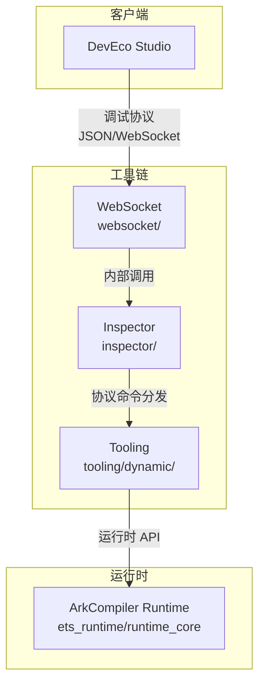
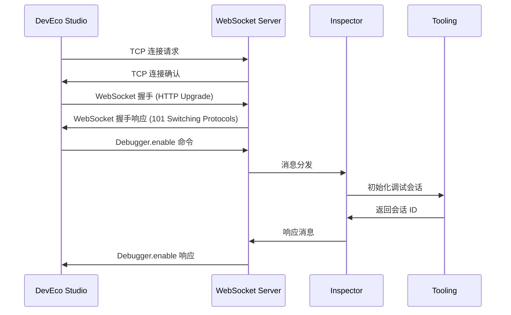
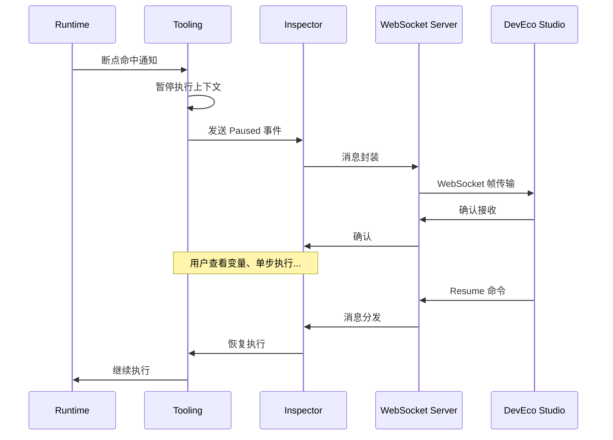

# 架构说明

本文档描述方舟工具链的架构设计，包括组件关系、数据流、线程模型和关键时序。

## 系统架构概览

方舟工具链采用分层架构设计，从上到下依次为：调试协议层（DevEco Studio）、通信层（WebSocket）、协议对接层（Inspector）和协议实现层（Tooling）。最底层是运行时层（Runtime），提供运行时信息支撑。

**核心架构证据** (`BUILD.gn:259-273`):
```gn
group("ark_toolchain_packages") {
  deps = [
    "./inspector:ark_debugger",           // Inspector 层
    "./inspector:connectserver_debugger", // 连接服务器
    "./tooling:libark_ecma_debugger",     // Tooling 动态调试
    "./websocket:libwebsocket_server",    // WebSocket 层
    "./tooling/dynamic/client/ark_cli:arkdb", // CLI 客户端
  ]
}
```



## 组件关系

### WebSocket 层

WebSocket 层提供可靠的全双工通信通道，是 DevEco Studio 与工具链之间的传输纽带。

**核心组件**:

| 组件 | 文件 | 功能 |
|------|------|------|
| WebSocket 服务器 | `websocket/server/websocket_server.cpp` | TCP/Unix Socket 服务器 |
| 协议基础 | `websocket/websocket_base.cpp` | 帧编解码、连接管理 |
| 帧构建 | `websocket/frame_builder.cpp` | WebSocket 帧构建 |
| 网络通信 | `websocket/network.cpp` | Socket 读写封装 |
| HTTP 握手 | `websocket/http.cpp` | HTTP Upgrade 处理 |

**关键类定义** (`websocket/server/websocket_server.h:25-155`):
```cpp
class WebSocketServer final : public WebSocketBase {
public:
    bool InitTcpWebSocket(int port, uint32_t timeoutLimit = 0);
    bool InitUnixWebSocket(const std::string& sockName, uint32_t timeoutLimit = 0);
    bool AcceptNewConnection();
    void Close();
private:
    std::atomic_bool serverUp_ {false};
    int32_t serverFd_ {-1};
};
```

该层输出 `libwebsocket_server` 静态库，被 inspector 模块直接依赖 (`inspector/BUILD.gn:33`):
```gn
deps = [ "../websocket:libwebsocket_server" ]
```

### Inspector 层

Inspector 层是调试协议的接入层，负责连接管理和消息转发。

**核心组件**:

| 组件 | 文件 | 功能 |
|------|------|------|
| Inspector 主类 | `inspector/inspector.cpp` | 调试会话管理、C API 导出 |
| WebSocket 封装 | `inspector/ws_server.cpp` | WebSocket 服务器包装 |
| 连接服务器 | `inspector/connect_server.cpp` | 多连接管理 |
| 静态初始化 | `inspector/init_static.cpp` | 静态库初始化入口 |
| 动态库加载 | `inspector/library_loader.cpp` | 运行时库加载 |

**C API 接口** (`inspector/inspector.h:41-74`):
```cpp
bool StartDebug(const std::string& componentName, void* vm, bool isDebugMode,
    int32_t instanceId, const DebuggerPostTask& debuggerPostTask, int port);
bool StartDebugForSocketpair(int tid, int socketfd, bool isHybrid = false);
void StopDebug(void* vm, bool isHybrid = false);
const char* GetJsBacktrace();
const char* OperateJsDebugMessage(const char* message);
```

**产物定义** (`inspector/BUILD.gn:57-73, 121-129`):
```gn
ohos_shared_library("ark_debugger") {
  output_name = "ark_inspector"  # 产物: ark_inspector.so
}

ohos_shared_library("connectserver_debugger") {
  output_name = "ark_connect_inspector"  # 产物: ark_connect_inspector.so
}
```

### Tooling 层

Tooling 层是调试调优协议的核心实现，分为四个功能域。

**Domain 实现列表**:

| Domain | 实现文件 | 核心类 | 功能 |
|--------|---------|--------|------|
| Debugger | `tooling/dynamic/agent/debugger_impl.cpp` | DebuggerImpl | 断点、单步、求值 |
| Profiler | `tooling/dynamic/agent/profiler_impl.cpp` | ProfilerImpl | CPU 采样分析 |
| HeapProfiler | `tooling/dynamic/agent/heapprofiler_impl.cpp` | HeapProfilerImpl | 堆内存快照 |
| Runtime | `tooling/dynamic/agent/runtime_impl.cpp` | RuntimeImpl | 运行时信息查询 |
| Tracing | `tooling/dynamic/agent/tracing_impl.cpp` | TracingImpl | 跟踪数据采集 |

**协议分发器** (`tooling/dynamic/dispatcher.cpp:37-77`):
```cpp
std::unique_ptr<PtJson> json = PtJson::Parse(message);
if (json == nullptr) {
    JsonParseError();
    return;
}
if (!json->IsObject()) {
    JsonFormatError(json);
    return;
}
// 解析 id, method, params
ret = json->GetInt("id", &callId);
ret = json->GetString("method", &wholeMethod);
ret = json->GetObject("params", &params);
```

**C API 导出** (`tooling/dynamic/debugger_service.h:41-61`):
```cpp
TOOLCHAIN_EXPORT void InitializeDebugger(EcmaVM *vm, const std::function<...> &onResponse);
TOOLCHAIN_EXPORT void OnMessage(const EcmaVM *vm, std::string &&message);
TOOLCHAIN_EXPORT DebugResponse GetCallFrames(const EcmaVM *vm);
TOOLCHAIN_EXPORT DebugResponse OperateDebugMessage(const EcmaVM *vm, const char* message);
```

**产物定义** (`tooling/BUILD.gn:16-32`):
```gn
ohos_shared_library("libark_ecma_debugger") {
  output_name = "libark_tooling"  # 产物: libark_tooling.so
}
```

## 数据流

### 调试请求处理流程

当开发者在 DevEco Studio 设置断点时，数据流如下：

1. DevEco Studio 发送断点设置协议消息（JSON 格式）
2. 消息通过 WebSocket 发送到工具链
3. Inspector 层接收消息并解析协议
4. 消息路由到 Tooling 层的 Debugger 域
5. Debugger 域调用运行时 API 设置断点
6. 运行时在适当位置暂停执行并返回确认
7. 确认消息通过原路径返回 DevEco Studio

### 协议消息格式

协议消息采用 JSON 格式，包含以下关键字段：

```json
{
    "id": 1,
    "method": "Debugger.enable",
    "params": {}
}
```

响应消息格式：

```json
{
    "id": 1,
    "result": {
        "debuggerId": "xxx"
    }
}
```

## 线程模型

工具链的线程模型需要考虑以下方面：

**主线程**负责 WebSocket 连接管理和消息分发，确保请求按顺序处理。

**工作线程**负责耗时操作（如采样数据处理、快照生成），避免阻塞主线程。

**运行时线程**是应用本身的执行线程，断点命中等事件在运行时线程触发。

### 线程同步机制

根据 `websocket/websocket_base.cpp` 的代码，存在锁保护的数据结构：

- `std::shared_mutex` 用于保护共享状态的并发访问
- 消息队列使用锁保证线程安全

具体实现细节需要结合源码进一步分析。

## 关键时序

### 连接建立时序



### 断点命中时序



---

*相关文档：[00_Overview.md](./00_Overview.md) | [01_Directory_Structure.md](./01_Directory_Structure.md) | [03_NAPI_Reference.md](./03_NAPI_Reference.md)*
