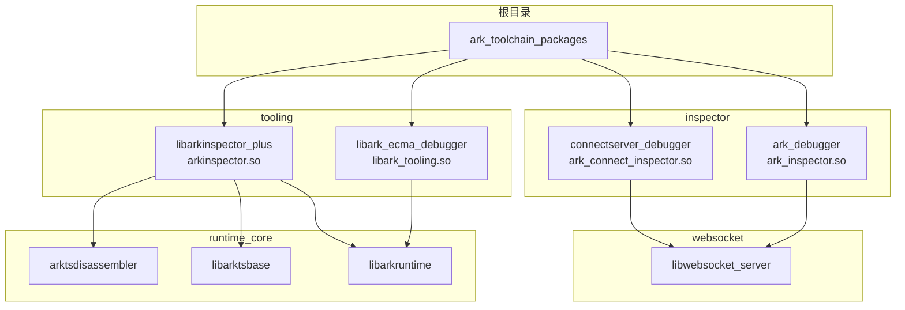

# GN 构建指南

本文档描述方舟工具链的 GN 构建配置，包括关键 Targets、依赖关系和编译产物映射。

## 根目录 BUILD.gn 概览

根目录 `BUILD.gn`（路径：`//arkcompiler/toolchain/BUILD.gn`）定义了以下配置：

### 配置定义

**ark_platform_config**：平台配置，根据目标平台设置相应的宏定义：
- `OHOS_PLATFORM` / `UNIX_PLATFORM` - OHOS 和 Unix 系统
- `LINUX_PLATFORM` - Linux 平台
- `WINDOWS_PLATFORM` - Windows 平台
- `ANDROID_PLATFORM` / `MAC_PLATFORM` / `IOS_PLATFORM` - 各移动平台

**ark_toolchain_common_config**：通用配置，包含：
- 编译选项：`-Wall`, `-Werror`, `-Wextra`, `-pedantic` 等
- 优化选项：根据 `is_debug` 和 `is_fastverify` 调整
- 平台相关宏：`PANDA_TARGET_UNIX`, `PANDA_TARGET_LINUX` 等
- CPU 架构相关宏：`PANDA_TARGET_ARM32`, `PANDA_TARGET_ARM64`, `PANDA_TARGET_AMD64` 等

**ark_toolchain_public_config**：公共配置，定义调试功能支持宏：
- `ECMASCRIPT_SUPPORT_CPUPROFILER` - CPU 分析器支持
- `ECMASCRIPT_SUPPORT_HEAPPROFILER` - 堆内存分析器支持
- `ECMASCRIPT_SUPPORT_DEBUGGER` - 调试器支持
- `ECMASCRIPT_SUPPORT_TRACING` - 追踪支持

## 关键 Targets 清单

### 根目录 Targets

| Target 名称 | 类型 | 依赖 | 输出产物 | 说明 |
|-------------|------|------|----------|------|
| `ark_toolchain_packages` | group | inspector、tooling 等 | - | 主产物包，包含所有可交付组件 |
| `ark_toolchain_unittest` | group | 各模块测试 | - | 设备端单元测试 |
| `ark_toolchain_host_unittest` | group | 各模块主机测试 | - | 主机端单元测试 |

### inspector 模块 Targets

| Target 名称 | 类型 | sources | deps | 输出产物 | 说明 |
|-------------|------|---------|------|----------|------|
| `ark_debugger_static` | ohos_source_set | inspector.cpp、ws_server.cpp、init_static.cpp、library_loader.cpp | websocket:libwebsocket_server | - | 静态库，作为 ark_debugger 的依赖 |
| `ark_debugger` | ohos_shared_library | - | ark_debugger_static | `ark_inspector.so` | 调试器服务器主库 |
| `connectserver_debugger_static` | ohos_source_set | connect_inspector.cpp、connect_server.cpp | websocket:libwebsocket_server | - | 连接服务器静态库 |
| `connectserver_debugger` | ohos_shared_library | - | connectserver_debugger_static | `ark_connect_inspector.so` | 连接服务器库 |

**关键依赖**：inspector 模块依赖 `websocket:libwebsocket_server`（静态库），并依赖 hiviewdfx 相关库（hilog、hitrace、faultloggerd）和 `bounds_checking_function:libsec_shared`。

### tooling 模块 Targets

| Target 名称 | 类型 | deps | 输出产物 | 说明 |
|-------------|------|------|----------|------|
| `libark_ecma_debugger` | ohos_shared_library | tooling/dynamic/:libark_ecma_debugger_static | `libark_tooling.so` | 调试调优协议实现库 |
| `libarkinspector_plus` | ohos_shared_library | tooling/static/:libarkinspector_plus_static | `arkinspector.so` | 静态分析增强库 |

**关键依赖**：`libarkinspector_plus` 依赖 runtime_core 的多个组件：
- `runtime_core:arktsdisassembler` - 字节码反汇编器
- `runtime_core:libarktsbase` - 基础运行时库
- `runtime_core:libarkruntime` - 运行时核心库

### websocket 模块 Targets

| Target 名称 | 类型 | sources | 输出产物 | 说明 |
|-------------|------|---------|----------|------|
| `websocket_base` | ohos_source_set | frame_builder.cpp、handshake_helper.cpp、http.cpp、network.cpp、websocket_base.cpp + platform source | - | WebSocket 基础库 |
| `libwebsocket_server` | ohos_static_library | server/websocket_server.cpp + websocket_base | - | WebSocket 服务器静态库 |
| `websocket_client` | ohos_source_set | client/websocket_client.cpp | - | WebSocket 客户端库 |

### tooling 子模块 Targets

| Target 名称 | 类型 | 位置 | 说明 |
|-------------|------|------|------|
| `libark_ecma_debugger_static` | ohos_source_set | tooling/dynamic/ | 动态分析静态库 |
| `libarkinspector_plus_static` | ohos_source_set | tooling/static/ | 静态分析静态库 |
| `libark_client` | ohos_shared_library | tooling/dynamic/client/ | 客户端库 |
| `arkdb` | executable | tooling/dynamic/client/ark_cli/ | 命令行调试工具 |
| `ark_multi` | executable | tooling/dynamic/client/ark_multi/ | 多目标调试工具 |

## 依赖关系图



## 编译配置开关

### 平台相关配置

```gn
# platform/unix/file.cpp 或 platform/windows/file.cpp
if (is_ohos) {
    defines += ["OHOS_PLATFORM", "UNIX_PLATFORM"]
} else if (is_linux) {
    defines += ["LINUX_PLATFORM", "UNIX_PLATFORM"]
} else if (is_mingw) {
    defines += ["WINDOWS_PLATFORM"]
}
```

### 功能开关

| 开关 | 定义位置 | 说明 |
|------|----------|------|
| `enable_hilog` | toolchain_config.gni | 启用日志输出，默认 true（OHOS/Mac/Windows） |
| `enable_dump_in_faultlog` | toolchain_config.gni | 启用故障日志输出，默认 true（OHOS 标准系统） |
| `enable_bytrace` | toolchain_config.gni | 启用调用链追踪，默认 true（OHOS 标准系统） |
| `enable_hitrace` | toolchain_config.gni | 启用 hiTrace，默认 true（OHOS 标准系统） |
| `toolchain_enable_cmc_gc` | toolchain_config.gni | 启用 CMC GC，默认 false |

### 调试/发布配置

```gn
if (is_fastverify) {
    cflags_cc += ["-O3", "-ggdb3", "-gdwarf-4", "-fno-omit-frame-pointer"]
} else if (is_debug) {
    cflags_cc += ["-O0", "-ggdb3", "-gdwarf-4"]
} else {
    defines += ["NDEBUG"]
}
```

---

*相关文档：[01_Directory_Structure.md](./01_Directory_Structure.md) | [06_Build_Artifacts.md](./06_Build_Artifacts.md) | [appendix/Config_Flags.md](./appendix/Config_Flags.md)*
