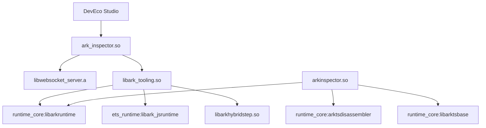

# 编译产物指南

本文档描述方舟工具链的编译产物清单、安装路径和运行时加载关系。

## 产物清单

### 共享库（.so/.dll/.dylib）

| 产物名称 | 输出名 | 源 Target | 路径 | 用途 |
|----------|--------|-----------|------|------|
| `libark_tooling.so` | `libark_tooling.so` | tooling:libark_ecma_debugger | `tooling/` | 调试调优协议核心库 |
| `arkinspector.so` | `arkinspector.so` | tooling:libarkinspector_plus | `tooling/` | 静态分析增强库 |
| `ark_inspector.so` | `ark_inspector.so` | inspector:ark_debugger | `inspector/` | 调试器服务器主库 |
| `ark_connect_inspector.so` | `ark_connect_inspector.so` | inspector:connectserver_debugger | `inspector/` | 连接服务器库 |
| `libark_client.so` | `libark_client.so` | tooling/dynamic/client:libark_client | `tooling/dynamic/client/` | 调试客户端库 |
| `libarkhybridstep.so` | `libarkhybridstep.so` | tooling/hybrid_step:arkhybridstep | `tooling/hybrid_step/` | 混合步进库 |

**跨平台扩展名**:
- Windows: `.dll`
- macOS: `.dylib`
- Linux/Android: `.so`

### 静态库（.a）

| 产物名称 | 源 Target | 路径 | 用途 |
|----------|-----------|------|------|
| `libwebsocket_server.a` | websocket:libwebsocket_server | `websocket/` | WebSocket 服务器静态库 |
| `libark_tooling.a` | tooling/dynamic:libark_ecma_debugger_static | `tooling/dynamic/` | 调试器静态库 |
| `libarkinspector_plus_static.a` | tooling/static:libarkinspector_plus_static | `tooling/static/` | 静态分析静态库 |

### 可执行文件

| 产物名称 | 源 Target | 路径 | 用途 |
|----------|-----------|------|------|
| `arkdb` | tooling/dynamic/client/ark_cli:arkdb | `tooling/dynamic/client/ark_cli/` | 命令行调试工具 |
| `ark_multi` | tooling/dynamic/client/ark_multi:ark_multi | `tooling/dynamic/client/ark_multi/` | 多线程 GC 测试工具 |

## 安装路径

### OHOS 标准系统

```gn
# 默认安装路径（基于 toolchain_config.gni 配置）
arkcompiler_relative_lib_path = "module/arkcompiler"

# 最终产物路径
/system/lib64/module/arkcompiler/
├── libark_tooling.so        # 调试调优协议库
├── arkinspector.so          # 静态分析库
├── ark_inspector.so         # 调试器服务器
└── ark_connect_inspector.so # 连接服务器
```

### 独立编译模式

独立编译模式下，产物输出到构建目录：

```bash
out/release/product_name/
├── ark_db/arkdb             # 命令行调试工具
├── libark_tooling.so        # 共享库
└── libark_client.so         # 客户端库
```

## 运行时加载关系

### 加载顺序图



### 动态库依赖关系

#### ark_inspector.so

```
ark_inspector.so
├── libwebsocket_server.a (静态链接)
│   ├── libuv:uv
│   ├── openssl:libcrypto_shared
│   └── bounds_checking_function:libsec_shared
├── hilog:libhilog (条件)
├── libark_tooling.so (运行时加载)
│   ├── ets_runtime:libark_jsruntime
│   └── runtime_core:libarkruntime
└── ffrt:libffrt (OHOS 标准系统)
```

#### arkinspector.so

```
arkinspector.so
├── runtime_core:arktsdisassembler
├── runtime_core:libarktsbase
├── runtime_core:libarkruntime
└── hiviewdfx 相关库
```

## 构建命令

### 构建所有产物

```bash
# 构建 ark_toolchain_packages 组
./build.sh --product-name <product> --build-target ark_toolchain_packages

# 或分别构建
./build.sh --product-name rk3568 --build-target ark_debugger
./build.sh --product-name rk3568 --build-target libark_ecma_debugger
./build.sh --product-name rk3568 --build-target libarkinspector_plus
```

### 构建测试

```bash
# 设备端测试
./build.sh --product-name rk3568 --build-target ark_toolchain_unittest

# 主机端测试
./build.sh --product-name <host> --build-target ark_toolchain_host_unittest
```

### 独立编译

```bash
# 启用独立编译
ark_standalone_build = true

# 构建
./build.sh --product-name <product> --build-target ark_toolchain_packages
```

## 版本与兼容性

### 产物版本

| 产物 | 版本信息 | 兼容性说明 |
|------|----------|------------|
| 组件版本 | 3.1 (`bundle.json`) | 随 OpenHarmony 版本更新 |
| 运行时兼容性 | ets_runtime, runtime_core | 需配套对应版本使用 |
| 协议版本 | Chrome DevTools Protocol v1.3 | 保持向后兼容 |

### 平台兼容性矩阵

| 产物 | OHOS | Linux | Android | macOS | Windows | iOS |
|------|------|-------|---------|-------|---------|-----|
| libark_tooling.so | ✓ | ✓ | ✓ | ✓ | ✗ | ✗ |
| arkinspector.so | ✓ | ✓ | ✓ | ✓ | ✗ | ✗ |
| ark_inspector.so | ✓ | ✓ | ✓ | ✓ | ✓ | ✗ |
| arkdb | ✓ | ✓ | ✓ | ✓ | ✗ | ✗ |

---

*相关文档：[05_GN_Build.md](./05_GN_Build.md) | [02_Architecture.md](./02_Architecture.md) | [08_Troubleshooting.md](./08_Troubleshooting.md)*
