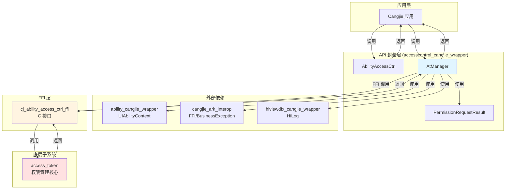
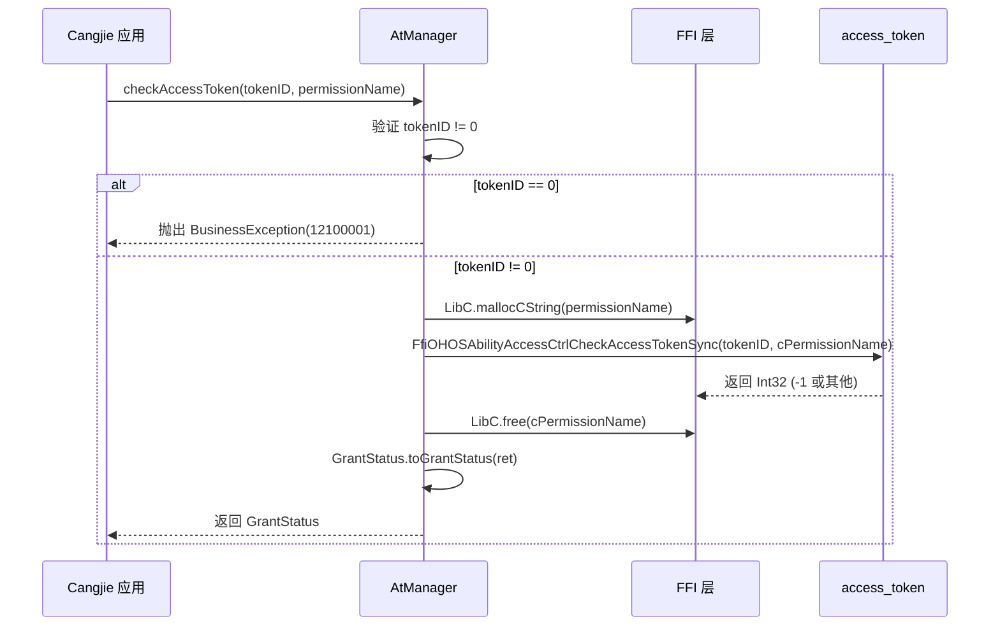
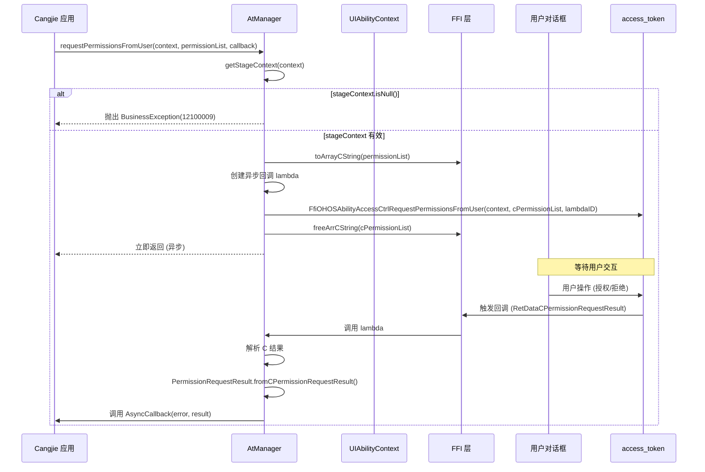

# 系统架构

## 目的

本文档描述 `accesscontrol_cangjie_wrapper` 项目的系统架构、组件依赖、数据流、线程模型等，帮助读者理解系统设计和运行机制。

## 适用范围

本文档适用于：
- 需要理解系统设计的架构师
- 需要分析性能和并发的开发者
- 需要进行二次开发的维护者

## 关键结论

1. **架构模式**: 分层架构，应用层 → API 封装层 → FFI 层 → 底层子系统
2. **组件依赖**: ability_access_ctrl → permission_request_result（内部），依赖 4 个外部组件
3. **数据流**: 单向流，从应用层到 access_token，通过异步回调返回结果
4. **线程模型**: checkAccessToken 同步（调用线程），requestPermissionsFromUser 异步（回调线程）
5. **资源管理**: C 内存通过 unsafe 块手动管理，需要在 FFI 调用前后分配/释放

## 相关跳转

- [目录结构](02_Directory_Structure.md) - 查看模块组织
- [对外 API](04_Public_API.md) - 了解 API 使用
- [内部 API](05_Internal_API.md) - 深入内部实现
- [工作笔记](wiki/_work/NOTES.md) - 查看代码证据索引

---

## 整体架构

### 分层架构图



证据：`README.md:7-32`, `ohos/ability_access_ctrl/BUILD.gn:31-39`

---

## 组件详细说明

### 1. AbilityAccessCtrl（工厂类）

**类型**: 静态工厂类

**职责**:
- 提供 `createAtManager()` 方法创建 AtManager 实例
- 作为 API 入口点

**代码位置**: `cj_ability_access_ctrl.cj:112-130`

```cangjie
@!APILevel[since: "22", syscap: "SystemCapability.Security.AccessToken"]
public class AbilityAccessCtrl {
    protected init() {}
    public static func createAtManager(): AtManager {
        return AtManager()
    }
}
```

---

### 2. AtManager（核心类）

**类型**: 主业务类

**职责**:
- `checkAccessToken()`: 同步权限检查
- `requestPermissionsFromUser()`: 异步权限请求
- 参数验证
- FFI 调用封装
- 异常处理

**代码位置**: `cj_ability_access_ctrl.cj:139-219`

**公开方法**:
- `checkAccessToken(tokenID: UInt32, permissionName: Permissions): GrantStatus`
- `requestPermissionsFromUser(context: UIAbilityContext, permissionList: Array<Permissions>, requestCallback: AsyncCallback<PermissionRequestResult>): Unit`

---

### 3. PermissionRequestResult（数据类）

**类型**: 数据传输对象（DTO）

**职责**:
- 存储权限请求结果
- 提供从 C 结构体转换的方法
- 管理 C 内存释放

**代码位置**: `permission_request_result.cj:34-128`

**属性**:
- `permissions: Array<String>` - 请求的权限列表
- `authResults: Array<Int32>` - 授权结果（0=granted, -1=denied, 2=invalid）
- `dialogShownResults: Array<Bool>` - 是否显示对话框
- `errorReasons: Array<Int32>` - 错误原因（内部）

**方法**:
- `fromCPermissionRequestResult(cRet: CPermissionRequestResult): PermissionRequestResult` - 从 C 结构体转换

---

### 4. 外部依赖组件

| 组件 | 作用 | 调用方式 | 代码位置 |
|------|------|---------|----------|
| **ability_cangjie_wrapper** | 提供 UIAbilityContext | import | `cj_ability_access_ctrl.cj:20` |
| **cangjie_ark_interop** | 提供 FFI 框架和异常类 | import | `cj_ability_access_ctrl.cj:21-22, 28` |
| **hiviewdfx_cangjie_wrapper** | 提供 HiLog 日志 | import | `cj_ability_access_ctrl.cj:24` |
| **access_token** | 提供 C FFI 接口 | external_deps | `BUILD.gn:39` |

---

## 数据流

### checkAccessToken 数据流（同步）



**关键点**:
- 同步调用，立即返回
- 内存分配/释放在 FFI 调用前后
- 参数验证（tokenID 非零）

证据：`cj_ability_access_ctrl.cj:158-169`

---

### requestPermissionsFromUser 数据流（异步）



**关键点**:
- 异步调用，通过 AsyncCallback 返回结果
- 涉及 UI 交互（权限请求对话框）
- C 内存需要在回调中释放

证据：`cj_ability_access_ctrl.cj:188-218`

---

## 线程模型

### checkAccessToken 线程模型

| 阶段 | 线程 | 说明 |
|------|------|------|
| **参数验证** | 调用线程 | 同步执行 |
| **FFI 调用** | 调用线程 | 阻塞等待 access_token 返回 |
| **内存分配/释放** | 调用线程 | unsafe 块内同步执行 |
| **结果转换** | 调用线程 | 同步执行 |

**结论**: checkAccessToken 是同步 API，在调用线程中执行。

---

### requestPermissionsFromUser 线程模型

| 阶段 | 线程 | 说明 |
|------|------|------|
| **参数验证** | 调用线程 | 同步执行 |
| **FFI 初始化** | 调用线程 | 同步执行 |
| **FFI 调用** | 调用线程 | 立即返回（非阻塞） |
| **UI 交互** | UI 线程 | 在 access_token 中执行 |
| **异步回调** | 回调线程 | 由 access_token 触发 |
| **结果转换** | 回调线程 | 在 AsyncCallback 中执行 |
| **内存释放** | 回调线程 | 在 fromCPermissionRequestResult 中执行 |

**结论**: requestPermissionsFromUser 是异步 API，调用立即返回，结果通过 AsyncCallback 在回调线程中返回。

证据：`cj_ability_access_ctrl.cj:196-212`

---

## 内存管理

### C 内存管理策略

**特点**:
- 使用 `unsafe` 块进行 C 内存操作
- 手动调用 `LibC.malloc()` 和 `LibC.free()`
- 需要在 FFI 调用前后配对分配/释放

**示例**: checkAccessToken 的内存管理

```cangjie
public func checkAccessToken(tokenID: UInt32, permissionName: Permissions): GrantStatus {
    if (tokenID == 0) {
        // ...
    }
    unsafe {
        let cPermissionName = LibC.mallocCString(permissionName)  // 分配
        let ret = FfiOHOSAbilityAccessCtrlCheckAccessTokenSync(tokenID, cPermissionName)
        LibC.free(cPermissionName)  // 释放
        return GrantStatus.toGrantStatus(ret)
    }
}
```

证据：`cj_ability_access_ctrl.cj:163-168`

**潜在风险**:
- 如果 FFI 调用抛出异常，free 可能不会执行
- 需要确保所有分配的内存都被释放
- permission_request_result 的 fromCPermissionRequestResult 负责批量释放

---

### C 数组转换

**permissionRequestResult.cj** 中的 C 数组到 Cangjie 数组转换：

```cangjie
protected static func fromCPermissionRequestResult(cRet: CPermissionRequestResult): PermissionRequestResult {
    let pSize = cRet.permissions.size
    let pPtr = cRet.permissions.head
    let permissionsArr = unsafe {
        Array<String>(pSize, { i =>
            let cString = pPtr.read(i)
            let permission = cString.toString()
            LibC.free(cString)  // 逐个释放
            permission
        })
    }
    unsafe { LibC.free<CString>(pPtr) }  // 释放数组指针
    // ... 对 authResults 和 dialogShownResults 同样处理
}
```

证据：`permission_request_result.cj:89-127`

---

## 错误处理

### 错误传播路径

```
C 层错误 → FFI 层 (Int32 错误码) → Cangjie 层 → BusinessException
```

### 错误码映射

| C 层返回值 | Cangjie 枚举 | 说明 |
|-----------|-------------|------|
| -1 | GrantStatus.PermissionDenied | 权限被拒绝 |
| 非 -1 | GrantStatus.PermissionGranted | 权限已授予 |

证据：`cj_ability_access_ctrl.cj:100-106`

### 异常抛出策略

**checkAccessToken**:
- tokenID == 0: 抛出 BusinessException(12100001, "The parameter is invalid.")
- FFI 返回错误: 通过 GrantStatus 枚举返回

**requestPermissionsFromUser**:
- context 无效: 抛出 BusinessException(12100009, "Common inner error.")
- FFI 返回错误: 通过 AsyncCallback 传递 BusinessException
- 内存分配失败: 抛出 BusinessException(12100008, "Out of memory.")

证据：`cj_ability_access_ctrl.cj:159-161, 191-192`, `permission_request_result.cj:93, 112`

---

## 安全边界

### 信任边界

```
┌─────────────────────────────────────┐
│  Cangjie 应用 (不可信任)            │  ← 输入: tokenID, permissionName, context
└─────────────┬───────────────────────┘
              │ 参数验证
              ↓
┌─────────────────────────────────────┐
│  accesscontrol_cangjie_wrapper     │  ← 信任边界：参数校验
└─────────────┬───────────────────────┘
              │ FFI 调用
              ↓
┌─────────────────────────────────────┐
│  access_token (可信任)             │  ← 核心权限管理
└─────────────────────────────────────┘
```

### 输入验证点

| 输入 | 验证位置 | 验证逻辑 | 证据 |
|------|---------|---------|------|
| **tokenID** | checkAccessToken | tokenID != 0 | `cj_ability_access_ctrl.cj:159` |
| **permissionName** | checkAccessToken | 无验证（代码层面） | - |
| **context** | requestPermissionsFromUser | !stageContext.isNull() | `cj_ability_access_ctrl.cj:191` |
| **permissionList** | requestPermissionsFromUser | 无显式验证 | - |

**安全风险**: permissionName 和 permissionList 缺少代码层面的格式和长度验证。

---

## 扩展点与限制

### 可扩展点

1. **新增 FFI 调用**: 已声明但未使用的 FFI 函数可以启用
   - `FfiOHOSAbilityAccessCtrlGrantUserGrantedPermission`
   - `FfiOHOSAbilityAccessCtrlRevokeUserGrantedPermission`
   - `FfiOHOSAbilityAccessCtrlRequestPermissionOnSetting`
   - `FfiOHOSAbilityAccessCtrlRequestGlobalSwitch`
   证据：`cj_ability_access_ctrl.cj:45-64`

2. **参数验证增强**: 可以在 FFI 调用前添加更多验证逻辑
   - permissionName 长度限制
   - permissionName 格式验证
   - permissionList 非空验证

3. **错误处理增强**: 可以扩展错误码映射和错误消息

### 设计限制

1. **无状态设计**: AtManager 是无状态的，不缓存任何数据
2. **FFI 依赖**: 所有功能依赖 access_token 的 C FFI 接口
3. **UI 依赖**: requestPermissionsFromUser 依赖 UIAbilityContext，纯后台环境无法使用
4. **单线程安全**: 没有显式的线程同步机制，假设调用线程安全

---

## 性能特征

### 时间复杂度

| 操作 | 时间复杂度 | 说明 |
|------|-----------|------|
| **checkAccessToken** | O(1) | 单次 FFI 调用，常数时间 |
| **requestPermissionsFromUser** | O(n) | n = permissionList.size，涉及 UI 交互 |

### 空间复杂度

| 操作 | 空间复杂度 | 说明 |
|------|-----------|------|
| **checkAccessToken** | O(1) | 临时 C 字符串 |
| **requestPermissionsFromUser** | O(n) | n = permissionList.size，C 字符串数组 |

### 性能瓶颈

1. **UI 交互**: requestPermissionsFromUser 需要等待用户响应，性能不可控
2. **FFI 调用**: 每次 FFI 调用都有跨语言调用开销
3. **内存分配**: C 内存分配/释放有一定开销

---

## 下一步

1. 查看 [对外 API](04_Public_API.md) 了解 API 使用方法
2. 参考 [内部 API](05_Internal_API.md) 深入内部实现
3. 阅读 [GN Targets](06_GN_Targets.md) 理解构建配置
