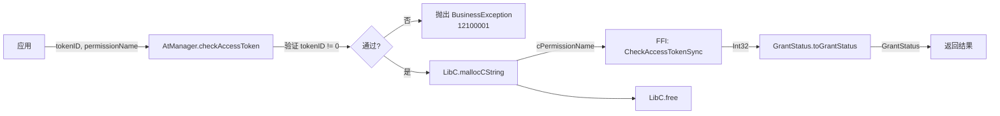
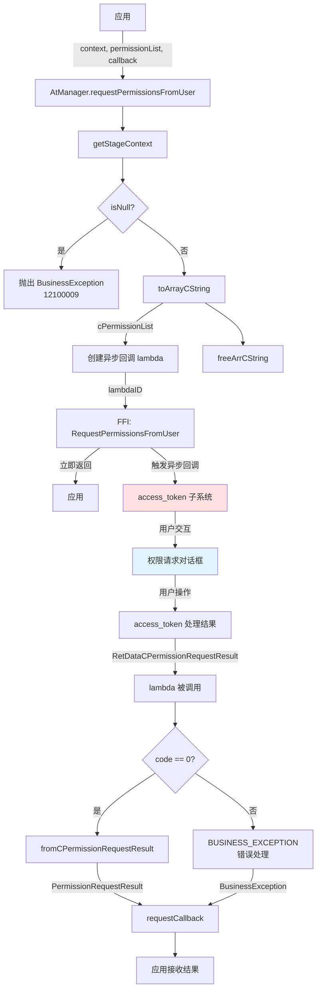

# 对外 API（Cangjie API）

## 目的

本文档详细列出 `accesscontrol_cangjie_wrapper` 的所有对外 Cangjie API，包括方法签名、参数说明、返回值、同步/异步模式、FFI 入口、错误码等。

## 适用范围

本文档适用于：
- 使用本 API 开发应用的 Cangjie 开发者
- 需要理解 API 行为的测试工程师
- 维护 API 兼容性的架构师

## 关键结论

1. **API 数量**: 1 个工厂方法 + 2 个主方法 = 3 个公开 API
2. **命名空间**: `ohos.ability_access_ctrl` 和 `ohos.security.permission_request_result`
3. **同步/异步**: checkAccessToken（同步），requestPermissionsFromUser（异步）
4. **错误处理**: 通过 `BusinessException` 抛出异常，或通过异步回调传递错误
5. **API 级别**: 从 API Level 22 开始支持，系统能力为 `SystemCapability.Security.AccessToken`

## 相关跳转

- [项目概览](00_Overview.md) - 了解项目全貌
- [架构说明](03_Architecture.md) - 理解数据流和线程模型
- [内部 API](05_Internal_API.md) - 深入内部实现
- [安全评审](08_Security_Review.md) - 了解安全注意事项
- [工作笔记](wiki/_work/NOTES.md) - 查看代码证据索引

---

## API 清单表

### ohos.ability_access_ctrl.AbilityAccessCtrl

| 方法名 | 参数 | 返回值 | 同步/异步 | FFI 入口 | 错误码 | 文件位置 |
|--------|------|--------|-----------|----------|--------|----------|
| createAtManager() | - | AtManager | 同步 | - | 无 | cj_ability_access_ctrl.cj:127 |

---

### ohos.ability_access_ctrl.AtManager

| 方法名 | 参数 | 返回值 | 同步/异步 | FFI 入口 | 错误码 | 文件位置 |
|--------|------|--------|-----------|----------|--------|----------|
| checkAccessToken() | tokenID: UInt32, permissionName: Permissions | GrantStatus | 同步 | FfiOHOSAbilityAccessCtrlCheckAccessTokenSync | 12100001 | cj_ability_access_ctrl.cj:158 |
| requestPermissionsFromUser() | context: UIAbilityContext, permissionList: Array<Permissions>, requestCallback: AsyncCallback<PermissionRequestResult> | Unit | 异步 | FfiOHOSAbilityAccessCtrlRequestPermissionsFromUser | 12100009, 其他通过回调传递 | cj_ability_access_ctrl.cj:188 |

---

### ohos.security.permission_request_result.PermissionRequestResult

| 属性 | 类型 | 说明 | 文件位置 |
|------|------|------|----------|
| permissions | Array<String> | 请求的权限列表 | permission_request_result.cj:42 |
| authResults | Array<Int32> | 授权结果 (0=granted, -1=denied, 2=invalid) | permission_request_result.cj:52 |
| dialogShownResults | Array<Bool> | 是否显示对话框 | permission_request_result.cj:62 |
| errorReasons | Array<Int32> | 错误原因（内部） | permission_request_result.cj:76 |

---

## API 详细说明

### 1. AbilityAccessCtrl.createAtManager()

**功能**: 获取 AtManager 实例

**签名**:
```cangjie
public static func createAtManager(): AtManager
```

**参数**:
- 无

**返回值**:
- `AtManager`: 权限管理器实例

**同步/异步**:
- 同步

**前置条件**:
- 无

**错误码**:
- 无

**使用示例**:
```cangjie
import ohos.ability_access_ctrl.*

let atManager = AbilityAccessCtrl.createAtManager()
```

**代码位置**: `cj_ability_access_ctrl.cj:127`

**调用链**:
```
应用 → AbilityAccessCtrl.createAtManager() → 返回 AtManager 实例
```

---

### 2. AtManager.checkAccessToken()

**功能**: 检查指定应用是否拥有指定权限

**签名**:
```cangjie
public func checkAccessToken(tokenID: UInt32, permissionName: Permissions): GrantStatus
```

**参数**:

| 参数 | 类型 | 必填 | 说明 |
|------|------|------|------|
| tokenID | UInt32 | 是 | 应用的 Token ID（32 位唯一标识符） |
| permissionName | Permissions (String) | 是 | 要验证的权限名称，例如 `ohos.permission.READ_CALENDAR` |

**参数校验**:

| 参数 | 校验规则 | 错误码 |
|------|---------|--------|
| tokenID | tokenID != 0 | 12100001 (The parameter is invalid.) |
| permissionName | 代码中未显式校验 | - |

**返回值**:

| 值 | 说明 |
|-----|------|
| GrantStatus.PermissionGranted | 权限已授予 |
| GrantStatus.PermissionDenied | 权限被拒绝 |

**同步/异步**:
- 同步（调用线程中执行）

**前置条件**:
- tokenID 有效（非零）
- permissionName 格式正确

**错误码**:

| 错误码 | 消息 | 触发条件 |
|--------|------|---------|
| 12100001 | The parameter is invalid. | tokenID == 0 |
| 12100002 | The specified tokenID does not exist. | TokenID 不存在（FFI 返回） |
| 12100003 | The specified permission does not exist. | 权限不存在（FFI 返回） |

**FFI 入口**:
- `FfiOHOSAbilityAccessCtrlCheckAccessTokenSync(tokenID: UInt32, cPermissionName: CString): Int32`

**代码位置**: `cj_ability_access_ctrl.cj:158`

**调用链**:



**使用示例**:

```cangjie
import ohos.ability_access_ctrl.*

let atManager = AbilityAccessCtrl.createAtManager()
let tokenID = 123456u32
let permission = "ohos.permission.READ_CALENDAR"

try {
    let status = atManager.checkAccessToken(tokenID, permission)
    if (status == GrantStatus.PermissionGranted) {
        print("权限已授予")
    } else {
        print("权限被拒绝")
    }
} catch (e: BusinessException) {
    print("错误: ${e.code} - ${e.message}")
}
```

**权限要求**:
- 无（本 API 不需要特殊权限）

**注意事项**:
- TokenID 为 0 会抛出异常
- permissionName 建议不超过 256 字符（文档声明，代码未强制）
- 跨平台场景下只能查询当前应用的权限

---

### 3. AtManager.requestPermissionsFromUser()

**功能**: 向用户请求权限授权

**签名**:
```cangjie
public func requestPermissionsFromUser(
    context: UIAbilityContext,
    permissionList: Array<Permissions>,
    requestCallback: AsyncCallback<PermissionRequestResult>
): Unit
```

**参数**:

| 参数 | 类型 | 必填 | 说明 |
|------|------|------|------|
| context | UIAbilityContext | 是 | 发起权限请求的上下文（必须属于应用自身） |
| permissionList | Array<Permissions> | 是 | 要请求的权限列表（不能为空或 null） |
| requestCallback | AsyncCallback<PermissionRequestResult> | 是 | 异步回调，接收权限请求结果 |

**参数校验**:

| 参数 | 校验规则 | 错误码 |
|------|---------|--------|
| context | !getStageContext(context).isNull() | 12100009 (Common inner error.) |
| permissionList | 代码中未显式校验 | - |
| requestCallback | 代码中未显式校验 | - |

**返回值**:
- Unit (无返回值，通过 AsyncCallback 返回结果)

**同步/异步**:
- 异步（调用立即返回，结果通过回调传递）

**前置条件**:
- context 有效且属于应用自身
- permissionList 不为空（建议）

**错误码**:

| 错误码 | 消息 | 触发条件 |
|--------|------|---------|
| 12100001 | The parameter is invalid. | 参数无效（通过回调传递） |
| 12100002 | The specified tokenID does not exist. | TokenID 不存在（通过回调传递） |
| 12100003 | The specified permission does not exist. | 权限不存在（通过回调传递） |
| 12100007 | Service is abnormal. | 服务异常（通过回调传递） |
| 12100008 | Out of memory. | 内存不足（通过回调传递） |
| 12100009 | Common inner error. | Context 无效（抛出异常） |

**FFI 入口**:
- `FfiOHOSAbilityAccessCtrlRequestPermissionsFromUser(context: StageContext, cPermissionList: CArrString, id: Int64): Unit`

**代码位置**: `cj_ability_access_ctrl.cj:188`

**调用链**:



**PermissionRequestResult 说明**:

| 属性 | 类型 | 说明 |
|------|------|------|
| permissions | Array<String> | 请求的权限列表（与输入相同） |
| authResults | Array<Int32> | 授权结果数组，与 permissions 一一对应<br/>0 = 已授予<br/>-1 = 被拒绝<br/>2 = 请求无效 |
| dialogShownResults | Array<Bool> | 是否显示对话框（true=显示，false=未显示） |
| errorReasons | Array<Int32> | 错误原因（内部字段，不对外暴露） |

**authResults 枚举值说明**:

| 值 | 说明 |
|----|------|
| 0 | 操作成功，权限已授予 |
| -1 | 权限被拒绝 |
| 2 | 请求无效（权限未声明或其他原因） |
| 1 | 权限名称无效 |
| 3 | 请求权限条件不满足 |
| 4 | 用户不同意隐私声明 |
| 5 | 权限不能通过弹窗请求 |
| 6 | 权限是手动设置权限，不能通过弹窗请求 |
| 12 | 服务异常 |

证据：`permission_request_result.cj:65-74`

**使用示例**:

```cangjie
import ohos.ability_access_ctrl.*
import ohos.app.ability.ui_ability.*

let atManager = AbilityAccessCtrl.createAtManager()
let context = getUIAbilityContext()  // 获取 UIAbilityContext
let permissions = [
    "ohos.permission.READ_CALENDAR",
    "ohos.permission.CAMERA"
]

atManager.requestPermissionsFromUser(
    context,
    permissions,
    { error, result =>
        if (error == None) {
            // 权限请求成功
            for (i in 0..result.permissions.size) {
                let permission = result.permissions[i]
                let authResult = result.authResults[i]
                let dialogShown = result.dialogShownResults[i]

                print("权限: $permission")
                print("结果: $authResult (0=授予, -1=拒绝, 2=无效)")
                print("显示对话框: $dialogShown")

                if (authResult == 0) {
                    print("权限已授予: $permission")
                } else if (authResult == -1) {
                    print("权限被拒绝: $permission")
                }
            }
        } else {
            // 权限请求失败
            print("错误: ${error.code} - ${error.message}")
        }
    }
)

print("权限请求已发起，等待用户响应...")
```

**权限要求**:
- 无（本 API 不需要特殊权限，但需要有效的 UIAbilityContext）

**注意事项**:
- context 必须属于应用自身，不能使用其他应用的上下文
- permissionList 建议不为空（空列表可能无意义）
- 异步回调可能在不同线程中执行，需要注意线程安全
- 用户可能会拒绝所有权限，需要正确处理拒绝情况
- 某些权限可能需要特殊处理（如 system_basic 级别权限）

---

## 错误码完整列表

### 公共错误码

| 错误码 | 消息 | 触发 API | 说明 |
|--------|------|---------|------|
| 12100001 | The parameter is invalid. | checkAccessToken, requestPermissionsFromUser | 参数无效 |
| 12100002 | The specified tokenID does not exist. | checkAccessToken, requestPermissionsFromUser | TokenID 不存在 |
| 12100003 | The specified permission does not exist. | checkAccessToken, requestPermissionsFromUser | 权限不存在 |
| 12100004 | The interface is not used together. | - | 接口未一起使用（未使用） |
| 12100005 | The number of listeners exceeds the limit. | - | 监听器数量超限（未使用） |
| 12100006 | The application is not allowed to be granted with the specified permission. | - | 应用不允许被授予权限（沙箱/远程设备） |
| 12100007 | Service is abnormal. | requestPermissionsFromUser | 服务异常 |
| 12100008 | Out of memory. | requestPermissionsFromUser, fromCPermissionRequestResult | 内存不足 |
| 12100009 | Common inner error. | requestPermissionsFromUser | 通用内部错误（Context 无效） |
| 12100010 | The request already exists. | - | 请求已存在（未使用） |
| 12100011 | All permissions in the permission list have been granted. | - | 所有权限已授予（未使用） |
| 12100012 | The permission list contains the permission that has not been revoked by the user. | - | 权限未被用户撤销（未使用） |
| 12100013 | The specific global switch is already open. | - | 全局开关已打开（未使用） |

证据：`cj_ability_access_ctrl_error.cj:27-42`

---

## 权限结果详细说明

### authResult 值含义

| 值 | 含义 | 处理建议 |
|----|------|---------|
| 0 | 权限已授予 | 可以继续使用该权限 |
| -1 | 权限被拒绝 | 引导用户到设置页面手动开启，或提示功能受限 |
| 1 | 权限名称无效 | 检查权限名称是否拼写正确 |
| 2 | 请求无效（权限未声明） | 检查 module.json5 中是否声明了该权限 |
| 3 | 请求权限条件不满足 | 检查应用配置和系统设置 |
| 4 | 用户不同意隐私声明 | 引导用户同意隐私声明 |
| 5 | 权限不能通过弹窗请求 | 引导用户到设置页面手动授予 |
| 6 | 权限是手动设置权限 | 引导用户到设置页面手动授予 |
| 12 | 服务异常 | 重试或联系支持 |

### dialogShown 含义

| 值 | 含义 |
|----|------|
| true | 向用户显示了权限请求对话框 |
| false | 未显示对话框（例如：用户已授予、权限级别不支持弹窗等） |

---

## API 使用建议

### 权限检查最佳实践

1. **启动时检查**: 在应用启动时检查关键权限，提前处理
2. **避免频繁检查**: 权限状态不会频繁变化，避免不必要的重复检查
3. **缓存结果**: 在适当场景下缓存权限检查结果
4. **优雅降级**: 权限被拒绝时提供降级功能，而非直接崩溃

### 权限请求最佳实践

1. **分批请求**: 避免一次性请求过多权限，分批请求提升用户体验
2. **说明用途**: 在请求权限前向用户说明为什么需要该权限
3. **处理拒绝**: 尊重用户拒绝权限的选择，引导到设置页面而非强制请求
4. **二次请求**: 首次拒绝后不要立即再次请求，等待合适的时机

---

## 下一步

1. 参考 [内部 API](05_Internal_API.md) 深入了解内部实现
2. 查看 [安全评审](08_Security_Review.md) 了解安全注意事项
3. 阅读 [故障排查](09_Troubleshooting.md) 解决常见问题
