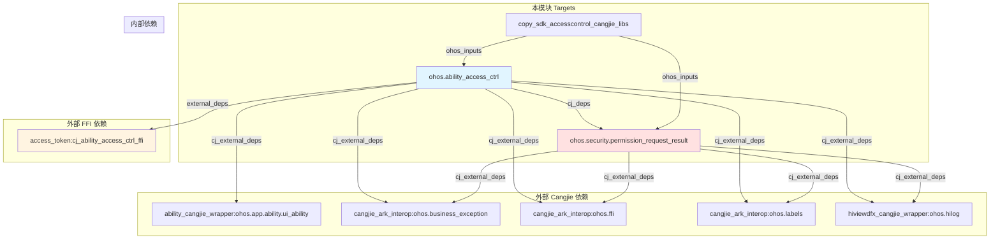
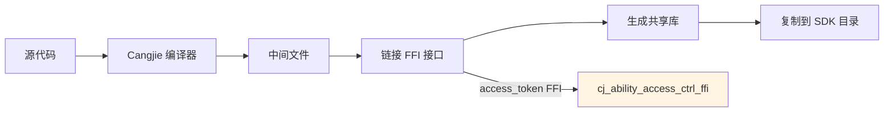

# GN Targets 与构建配置

## 目的

本文档详细列出 `accesscontrol_cangjie_wrapper` 项目的 GN 构建目标、依赖关系、编译配置，帮助开发者理解构建系统。

## 适用范围

本文档适用于：
- 需要理解构建系统的开发者
- 需要添加新模块的维护者
- 需要调试构建问题的开发者

## 关键结论

1. **构建模板**: 使用 Cangjie 编译模板 (`//build/templates/cangjie/cjc.gni`)
2. **目标类型**: 所有模块都是 `ohos_cangjie_shared_library`（共享库）
3. **子组件**: 2 个主组件 + 1 个 SDK 复制任务
4. **平台差异**: Windows/macOS 使用 Mock 实现
5. **外部依赖**: 依赖 4 个外部组件（access_token、ability_cangjie_wrapper、cangjie_ark_interop、hiviewdfx_cangjie_wrapper）

## 相关跳转

- [目录结构](02_Directory_Structure.md) - 查看源码组织
- [构建产物](07_Build_Artifacts.md) - 查看编译产物
- [工作笔记](wiki/_work/NOTES.md) - 查看代码证据索引

---

## GN Target 清单

### 根目录 Targets

| Target 名称 | 类型 | 路径 | 说明 |
|-------------|------|------|------|
| **copy_sdk_accesscontrol_cangjie_libs** | copy_ohos_cangjie_sdk_api_lib | `BUILD.gn:21` | 复制 Cangjie SDK 库 |

证据：`BUILD.gn:21-23`

---

### ohos/ability_access_ctrl/ Targets

| Target 名称 | 类型 | 路径 | 说明 |
|-------------|------|------|------|
| **ohos.ability_access_ctrl** | ohos_cangjie_shared_library | `ohos/ability_access_ctrl/BUILD.gn:18` | 权限管理共享库 |

证据：`ohos/ability_access_ctrl/BUILD.gn:18`

---

### ohos/security/permission_request_result/ Targets

| Target 名称 | 类型 | 路径 | 说明 |
|-------------|------|------|------|
| **ohos.security.permission_request_result** | ohos_cangjie_shared_library | `ohos/security/permission_request_result/BUILD.gn:18` | 权限结果共享库 |

证据：`ohos/security/permission_request_result/BUILD.gn:18`

---

## Target 详细说明

### 1. copy_sdk_accesscontrol_cangjie_libs

**完整配置**:

```gn
copy_ohos_cangjie_sdk_api_lib("copy_sdk_accesscontrol_cangjie_libs") {
  ohos_inputs = accesscontrol_cangjie_wrapper_packages_ohos
}
```

证据：`BUILD.gn:21-23`

**属性**:

| 属性 | 值 | 说明 |
|------|-----|------|
| **类型** | copy_ohos_cangjie_sdk_api_lib | 复制 Cangjie SDK API 库 |
| **ohos_inputs** | accesscontrol_cangjie_wrapper_packages_ohos | 输入的 Cangjie 库列表 |

**依赖列表**:

```gn
accesscontrol_cangjie_wrapper_packages_ohos = [
  "//base/accesscontrol/accesscontrol_cangjie_wrapper/ohos/ability_access_ctrl:ohos.ability_access_ctrl",
  "//base/accesscontrol/accesscontrol_cangjie_wrapper/ohos/security/permission_request_result:ohos.security.permission_request_result",
]
```

证据：`BUILD.gn:16-19`

**作用**:
- 将编译生成的 Cangjie 共享库复制到 SDK 目录
- 供其他 Cangjie 项目引用

---

### 2. ohos.ability_access_ctrl

**完整配置**:

```gn
ohos_cangjie_shared_library("ohos.ability_access_ctrl") {

  if (is_mingw || is_mac){
    sources = [ "../../mock/ohos.ability_access_ctrl.cj" ]
  } else {
    sources = [
      "cj_ability_access_ctrl.cj",
      "cj_ability_access_ctrl_error.cj",
    ]
  }

  cj_deps = [ "../security/permission_request_result:ohos.security.permission_request_result" ]

  cj_external_deps = [
    "ability_cangjie_wrapper:ohos.app.ability.ui_ability",
    "cangjie_ark_interop:ohos.business_exception",
    "cangjie_ark_interop:ohos.ffi",
    "cangjie_ark_interop:ohos.labels",
    "hiviewdfx_cangjie_wrapper:ohos.hilog",
  ]

  external_deps = [ "access_token:cj_ability_access_ctrl_ffi" ]

  subsystem_name = "accesscontrol"
  part_name = "accesscontrol_cangjie_wrapper"
}
```

证据：`ohos/ability_access_ctrl/BUILD.gn:18-43`

**属性详解**:

| 属性 | 值 | 说明 |
|------|-----|------|
| **类型** | ohos_cangjie_shared_library | Cangjie 共享库 |
| **subsystem_name** | accesscontrol | 子系统名称 |
| **part_name** | accesscontrol_cangjie_wrapper | 部件名称 |
| **sources** (Linux) | cj_ability_access_ctrl.cj, cj_ability_access_ctrl_error.cj | 源代码文件 |
| **sources** (Win/Mac) | ../../mock/ohos.ability_access_ctrl.cj | Mock 实现 |
| **cj_deps** | permission_request_result | Cangjie 内部依赖 |
| **cj_external_deps** | ability_cangjie_wrapper, cangjie_ark_interop, hiviewdfx_cangjie_wrapper | Cangjie 外部依赖 |
| **external_deps** | access_token:cj_ability_access_ctrl_ffi | 非 Cangjie 外部依赖（FFI） |

**sources 条件编译**:

| 平台 | 条件 | 源文件 | 说明 |
|------|------|--------|------|
| Linux | 非 (is_mingw \|\| is_mac) | cj_ability_access_ctrl.cj, cj_ability_access_ctrl_error.cj | 真实实现 |
| Windows | is_mingw | ../../mock/ohos.ability_access_ctrl.cj | Mock 实现 |
| macOS | is_mac | ../../mock/ohos.ability_access_ctrl.cj | Mock 实现 |

证据：`ohos/ability_access_ctrl/BUILD.gn:20-27`

**cj_deps (Cangjie 内部依赖)**:

```gn
cj_deps = [ "../security/permission_request_result:ohos.security.permission_request_result" ]
```

说明：依赖 permission_request_result 模块的编译产物

证据：`ohos/ability_access_ctrl/BUILD.gn:29`

**cj_external_deps (Cangjie 外部依赖)**:

| 依赖 | 说明 |
|------|------|
| ability_cangjie_wrapper:ohos.app.ability.ui_ability | 提供 UIAbilityContext |
| cangjie_ark_interop:ohos.business_exception | 提供 BusinessException 和 AsyncCallback |
| cangjie_ark_interop:ohos.ffi | 提供 FFI 类型 (CArrString, CArrUI32 等) |
| cangjie_ark_interop:ohos.labels | 提供 APILevel 和 Hide 注解 |
| hiviewdfx_cangjie_wrapper:ohos.hilog | 提供 HiLog 日志 |

证据：`ohos/ability_access_ctrl/BUILD.gn:31-37`

**external_deps (非 Cangjie 外部依赖)**:

| 依赖 | 说明 |
|------|------|
| access_token:cj_ability_access_ctrl_ffi | 提供 C FFI 接口实现 |

证据：`ohos/ability_access_ctrl/BUILD.gn:39`

---

### 3. ohos.security.permission_request_result

**完整配置**:

```gn
ohos_cangjie_shared_library("ohos.security.permission_request_result") {

  if (is_mingw || is_mac){
    sources = [ "../../../mock/ohos.security.permission_request_result.cj" ]
  } else {
    sources = [ "permission_request_result.cj" ]
  }

  cj_external_deps = [
    "cangjie_ark_interop:ohos.business_exception",
    "cangjie_ark_interop:ohos.ffi",
    "cangjie_ark_interop:ohos.labels",
    "hiviewdfx_cangjie_wrapper:ohos.hilog",
  ]

  subsystem_name = "accesscontrol"
  part_name = "accesscontrol_cangjie_wrapper"
}
```

证据：`ohos/security/permission_request_result/BUILD.gn:18-35`

**属性详解**:

| 属性 | 值 | 说明 |
|------|-----|------|
| **类型** | ohos_cangjie_shared_library | Cangjie 共享库 |
| **subsystem_name** | accesscontrol | 子系统名称 |
| **part_name** | accesscontrol_cangjie_wrapper | 部件名称 |
| **sources** (Linux) | permission_request_result.cj | 源代码文件 |
| **sources** (Win/Mac) | ../../../mock/ohos.security.permission_request_result.cj | Mock 实现 |
| **cj_external_deps** | cangjie_ark_interop, hiviewdfx_cangjie_wrapper | Cangjie 外部依赖 |

**cj_external_deps (Cangjie 外部依赖)**:

| 依赖 | 说明 |
|------|------|
| cangjie_ark_interop:ohos.business_exception | 提供 BusinessException |
| cangjie_ark_interop:ohos.ffi | 提供 FFI 类型 (CArrString, CArrI32, CArrBool) |
| cangjie_ark_interop:ohos.labels | 提供 APILevel 和 Hide 注解 |
| hiviewdfx_cangjie_wrapper:ohos.hilog | 提供 HiLog 日志 |

证据：`ohos/security/permission_request_result/BUILD.gn:26-31`

---

## 依赖关系图

### Target 依赖图



证据：各 BUILD.gn 文件的依赖声明

---

## 编译配置说明

### 构建模板导入

```gn
import("//build/templates/cangjie/cjc.gni")
```

所有 BUILD.gn 文件都导入了 Cangjie 编译模板。

证据：`BUILD.gn:14`, `ohos/ability_access_ctrl/BUILD.gn:16`, `ohos/security/permission_request_result/BUILD.gn:16`

### 平台判断

| 变量 | 说明 | 使用位置 |
|------|------|---------|
| is_mingw | 是否为 Windows (MinGW) | 条件编译 |
| is_mac | 是否为 macOS | 条件编译 |

证据：`ohos/ability_access_ctrl/BUILD.gn:20`, `ohos/security/permission_request_result/BUILD.gn:20`

### 子系统和部件信息

所有 Target 都声明了子系统名称和部件名称：

```gn
subsystem_name = "accesscontrol"
part_name = "accesscontrol_cangjie_wrapper"
```

证据：`ohos/ability_access_ctrl/BUILD.gn:41-42`, `ohos/security/permission_request_result/BUILD.gn:33-34`

---

## 编译产物

### 预期输出文件

| Target | 平台 | 预期输出文件 |
|--------|------|-------------|
| ohos.ability_access_ctrl | Linux | libohos.ability_access_ctrl.so |
| ohos.ability_access_ctrl | Windows | ohos.ability_access_ctrl.dll |
| ohos.ability_access_ctrl | macOS | libohos.ability_access_ctrl.dylib |
| ohos.security.permission_request_result | Linux | libohos.security.permission_request_result.so |
| ohos.security.permission_request_result | Windows | ohos.security.permission_request_result.dll |
| ohos.security.permission_request_result | macOS | libohos.security.permission_request_result.dylib |

**注意**: 输出文件名和扩展名根据平台和构建配置可能有所不同。

---

## 构建流程

### 完整构建流程



### 构建顺序

根据依赖关系，推荐的构建顺序：

1. **ohos.security.permission_request_result** (无内部依赖)
2. **ohos.ability_access_ctrl** (依赖 permission_request_result)
3. **copy_sdk_accesscontrol_cangjie_libs** (依赖以上两个)

---

## 如何添加新模块

### 步骤

1. **创建目录**:
   ```bash
   mkdir -p ohos/new_module
   ```

2. **编写源代码**:
   ```cangjie
   // ohos/new_module/new_module.cj
   package ohos.new_module

   public class NewClass {
       public func newMethod(): Unit {
           // 实现
       }
   }
   ```

3. **创建 BUILD.gn**:
   ```gn
   import("//build/templates/cangjie/cjc.gni")

   ohos_cangjie_shared_library("ohos.new_module") {
     sources = [ "new_module.cj" ]

     cj_external_deps = [
       "cangjie_ark_interop:ohos.business_exception",
     ]

     subsystem_name = "accesscontrol"
     part_name = "accesscontrol_cangjie_wrapper"
   }
   ```

4. **更新根 BUILD.gn**:
   ```gn
   accesscontrol_cangjie_wrapper_packages_ohos = [
     "//base/accesscontrol/accesscontrol_cangjie_wrapper/ohos/ability_access_ctrl:ohos.ability_access_ctrl",
     "//base/accesscontrol/accesscontrol_cangjie_wrapper/ohos/security/permission_request_result:ohos.security.permission_request_result",
     "//base/accesscontrol/accesscontrol_cangjie_wrapper/ohos/new_module:ohos.new_module",  // 新增
   ]
   ```

5. **更新 bundle.json** (如需导出):
   ```json
   "build": {
     "sub_component": [
       "//base/accesscontrol/accesscontrol_cangjie_wrapper/ohos/new_module:ohos.new_module",  // 新增
     ],
     "inner_kits": [
       {
         "name": "//base/accesscontrol/accesscontrol_cangjie_wrapper/ohos/new_module:ohos.new_module"  // 新增
       }
     ]
   }
   ```

6. **编译验证**:
   ```bash
   ./build.sh --product-name <product> --build-target ohos.new_module
   ```

---

## Mock 实现

### Mock 文件位置

| 模块 | Mock 文件 | 说明 |
|------|----------|------|
| ability_access_ctrl | mock/ohos.ability_access_ctrl.cj | Windows/macOS Mock |
| permission_request_result | mock/ohos.security.permission_request_result.cj | Windows/macOS Mock |

### Mock 使用条件

```gn
if (is_mingw || is_mac){
    sources = [ "../../mock/ohos.ability_access_ctrl.cj" ]
} else {
    sources = [
      "cj_ability_access_ctrl.cj",
      "cj_ability_access_ctrl_error.cj",
    ]
}
```

证据：`ohos/ability_access_ctrl/BUILD.gn:20-27`

### Mock 用途

- 在非 Linux 平台上提供编译通过能力
- 用于开发和测试（不依赖 access_token 子系统）
- 不提供真实功能（仅编译通过）

---

## 编译选项

### 未配置的选项

当前 BUILD.gn 文件中未显式配置以下选项：

| 选项 | 说明 |
|------|------|
| **defines** | 宏定义 |
| **configs** | 配置项 |
| **include_dirs** | 头文件包含目录（Cangjie 不需要） |
| **public_deps** | 公开依赖 |
| **cflags** | C 编译器标志（Cangjie 不需要） |
| **cflags_cc** | C++ 编译器标志（Cangjie 不需要） |

---

## 下一步

1. 查看 [构建产物](07_Build_Artifacts.md) 了解编译输出
2. 参考 [对外 API](04_Public_API.md) 学习 API 使用
3. 阅读 [故障排查](09_Troubleshooting.md) 解决构建问题
