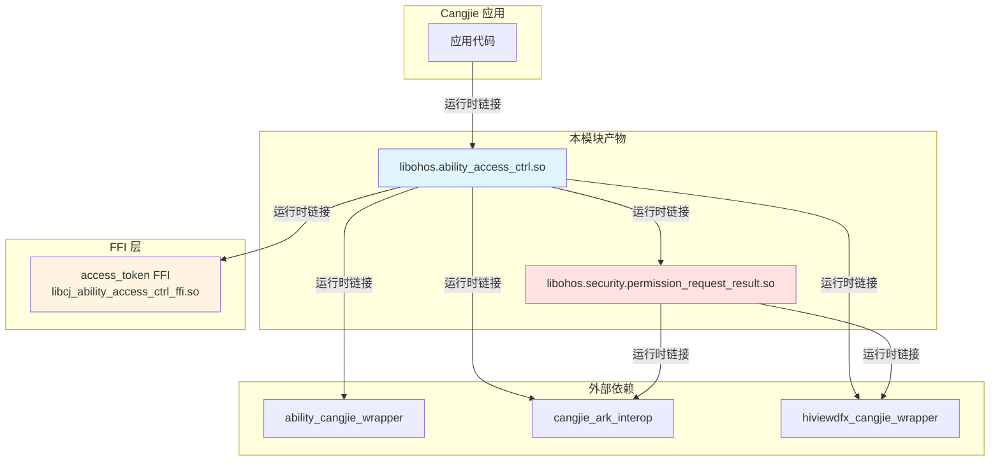

# 编译产物

## 目的

本文档描述 `accesscontrol_cangjie_wrapper` 项目的编译产物、安装路径、运行时加载关系，帮助开发者理解构建输出。

## 适用范围

本文档适用于：
- 需要了解编译输出的开发者
- 需要调试运行时问题的维护者
- 需要打包发布的项目经理

## 关键结论

1. **产物数量**: 2 个 Cangjie 共享库（.so）
2. **产物类型**: ohos_cangjie_shared_library
3. **安装位置**: 通过 copy_ohos_cangjie_sdk_api_lib 复制到 SDK 目录
4. **运行时加载**: 动态链接，依赖 4 个外部组件
5. **跨平台**: Windows/macOS 使用 Mock 实现（产物不同）

## 相关跳转

- [GN Targets](06_GN_Targets.md) - 查看构建目标
- [对外 API](04_Public_API.md) - 了解 API 使用
- [故障排查](09_Troubleshooting.md) - 解决加载问题
- [工作笔记](wiki/_work/NOTES.md) - 查看代码证据索引

---

## 编译产物清单

### 主产物

| Target 名称 | 平台 | 产物类型 | 预期文件名 | 说明 |
|-------------|------|---------|-------------|------|
| **ohos.ability_access_ctrl** | Linux | 共享库 | libohos.ability_access_ctrl.so | 权限管理库 |
| **ohos.security.permission_request_result** | Linux | 共享库 | libohos.security.permission_request_result.so | 权限结果库 |
| **ohos.ability_access_ctrl** | Windows | 动态库 | ohos.ability_access_ctrl.dll | 权限管理库 |
| **ohos.security.permission_request_result** | Windows | 动态库 | ohos.security.permission_request_result.dll | 权限结果库 |
| **ohos.ability_access_ctrl** | macOS | 动态库 | libohos.ability_access_ctrl.dylib | 权限管理库 |
| **ohos.security.permission_request_result** | macOS | 动态库 | libohos.security.permission_request_result.dylib | 权限结果库 |

### SDK 复制产物

| 任务 | 输出目录 | 说明 |
|------|---------|------|
| copy_sdk_accesscontrol_cangjie_libs | SDK/ohos/ | 复制两个库到 SDK 目录 |

证据：`BUILD.gn:21-23`

---

## 产物详细说明

### 1. ohos.ability_access_ctrl

**功能**: 提供权限管理 API

**包含的类**:
- `GrantStatus` (enum)
- `AbilityAccessCtrl`
- `AtManager`

**大小估算**:
- ROM: 约 162 KB（包含部分依赖）
- RAM: 约 180 KB（包含部分依赖）

证据：`bundle.json:22-23`

**导出符号**:
- AbilityAccessCtrl 类
- AtManager 类
- GrantStatus 枚举

**依赖的外部库**:
- ability_cangjie_wrapper:ohos.app.ability.ui_ability
- cangjie_ark_interop:ohos.business_exception
- cangjie_ark_interop:ohos.ffi
- cangjie_ark_interop:ohos.labels
- hiviewdfx_cangjie_wrapper:ohos.hilog
- access_token:cj_ability_access_ctrl_ffi (C FFI)

证据：`ohos/ability_access_ctrl/BUILD.gn:31-39`

---

### 2. ohos.security.permission_request_result

**功能**: 提供权限请求数据结构

**包含的类**:
- `PermissionRequestResult`
- `CPermissionRequestResult` (C 结构体，内部)
- `RetDataCPermissionRequestResult` (C 结构体，内部)

**大小估算**:
- 包含在 162 KB ROM 中（与 ability_access_ctrl 合计）

**导出符号**:
- PermissionRequestResult 类

**依赖的外部库**:
- cangjie_ark_interop:ohos.business_exception
- cangjie_ark_interop:ohos.ffi
- cangjie_ark_interop:ohos.labels
- hiviewdfx_cangjie_wrapper:ohos.hilog

证据：`ohos/security/permission_request_result/BUILD.gn:26-31`

---

## 安装路径

### SDK 目录结构

```
SDK/
├── ohos/
│   ├── libohos.ability_access_ctrl.so (Linux)
│   ├── libohos.security.permission_request_result.so (Linux)
│   ├── ohos.ability_access_ctrl.dll (Windows)
│   ├── ohos.security.permission_request_result.dll (Windows)
│   ├── libohos.ability_access_ctrl.dylib (macOS)
│   └── libohos.security.permission_request_result.dylib (macOS)
└── ...
```

### 设备安装路径

运行时，共享库通常安装在：

```
/system/lib64/           # 64 位系统库
/system/lib/             # 32 位系统库
/usr/lib/                # 用户库
```

**注意**: 实际安装路径取决于设备和构建配置。

---

## 运行时加载关系

### 运行时依赖图



### 动态链接过程

1. **应用启动**: Cangjie 运行时加载主应用二进制
2. **动态链接**: 加载 `libohos.ability_access_ctrl.so`
3. **传递加载**: 自动加载依赖的 `libohos.security.permission_request_result.so`
4. **外部依赖**: 加载所有声明的 `cj_external_deps` 和 `external_deps`
5. **FFI 初始化**: 链接到 `libcj_ability_access_ctrl_ffi.so`

---

## 产物版本信息

### 组件版本

| 属性 | 值 | 证据 |
|------|-----|------|
| **组件名称** | accesscontrol_cangjie_wrapper | `bundle.json:13` |
| **版本** | 6.1 | `bundle.json:4` |
| **子系统** | accesscontrol | `bundle.json:14` |
| **适配系统** | standard | `bundle.json:17-19` |
| **License** | Apache 2.0 | `bundle.json:5` |

### API Level

| 类/方法 | API Level | 系统能力 | 证据 |
|---------|-----------|-----------|------|
| AbilityAccessCtrl | 22 | SystemCapability.Security.AccessToken | `cj_ability_access_ctrl.cj:112-115` |
| createAtManager() | 22 | SystemCapability.Security.AccessToken | `cj_ability_access_ctrl.cj:123-126` |
| AtManager | 22 | SystemCapability.Security.AccessToken | `cj_ability_access_ctrl.cj:135-138` |
| checkAccessToken() | 22 | SystemCapability.Security.AccessToken | `cj_ability_access_ctrl.cj:153-157` |
| requestPermissionsFromUser() | 22 | SystemCapability.Security.AccessToken | `cj_ability_access_ctrl.cj:183-187` |
| GrantStatus | 22 | SystemCapability.Security.AccessToken | `cj_ability_access_ctrl.cj:76-79` |
| PermissionRequestResult | 22 | SystemCapability.Security.AccessToken | `permission_request_result.cj:30-33` |

---

## 产物验证

### 验证编译产物

**Linux 平台**:

```bash
# 查看库文件
ls -l out/<product>/lib64/libohos.ability_access_ctrl.so
ls -l out/<product>/lib64/libohos.security.permission_request_result.so

# 查看依赖的库
ldd out/<product>/lib64/libohos.ability_access_ctrl.so

# 查看导出的符号
nm -D out/<product>/lib64/libohos.ability_access_ctrl.so | grep AtManager
```

**Windows 平台**:

```powershell
# 查看库文件
ls out\<product>\ohos.ability_access_ctrl.dll
ls out\<product>\ohos.security.permission_request_result.dll

# 查看依赖的库
dumpbin /DEPENDENTS out\<product>\ohos.ability_access_ctrl.dll
```

**macOS 平台**:

```bash
# 查看库文件
ls -l out/<product>/libohos.ability_access_ctrl.dylib
ls -l out/<product>/libohos.security.permission_request_result.dylib

# 查看依赖的库
otool -L out/<product>/libohos.ability_access_ctrl.dylib
```

---

## Mock 实现产物

### Mock 文件

| 平台 | Mock 文件 | 说明 |
|------|----------|------|
| Windows | mock/ohos.ability_access_ctrl.cj | ability_access_ctrl Mock |
| Windows | mock/ohos.security.permission_request_result.cj | permission_request_result Mock |
| macOS | mock/ohos.ability_access_ctrl.cj | ability_access_ctrl Mock |
| macOS | mock/ohos.security.permission_request_result.cj | permission_request_result Mock |

证据：`ohos/ability_access_ctrl/BUILD.gn:20-22`

### Mock 产物特点

- 仅用于编译通过
- 不提供真实功能
- 不依赖 access_token 子系统
- 不能用于生产环境

---

## 产物分发

### SDK 包

产物被打包为 SDK 包，供其他项目使用：

```
ohos-package/
├── package.json5
├── ohos/
│   ├── libohos.ability_access_ctrl.so
│   └── libohos.security.permission_request_result.so
└── ...
```

### 发布到仓库

产物通过 `ohos-publish` 发布到 OpenHarmony 仓库：

```bash
ohos-publish publish --package @ohos/accesscontrol_cangjie_wrapper
```

---

## 运行时问题排查

### 常见加载失败问题

| 问题 | 原因 | 解决方案 |
|------|------|---------|
| 库文件不存在 | 编译未成功或产物未复制 | 重新编译，检查 BUILD.gn |
| 符号未找到 | FFI 接口不匹配 | 检查 access_token 版本 |
| 版本不兼容 | API Level 不匹配 | 检查设备 API Level |
| 依赖缺失 | 外部组件未安装 | 安装所有依赖组件 |

详见 [故障排查](09_Troubleshooting.md)。

---

## 下一步

1. 查看 [GN Targets](06_GN_Targets.md) 了解构建目标
2. 参考 [对外 API](04_Public_API.md) 学习 API 使用
3. 阅读 [故障排查](09_Troubleshooting.md) 解决常见问题
