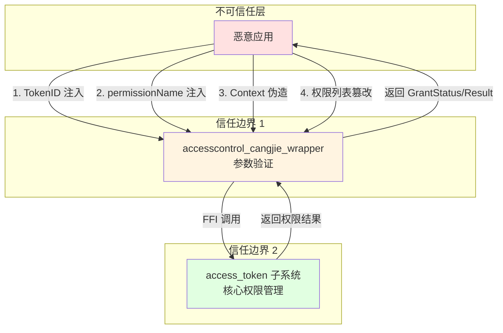

# 安全风险评审

## 目的

本文档分析 `accesscontrol_cangjie_wrapper` 项目的安全风险，包括攻击面、信任边界、可被利用点和修复建议，帮助开发者识别和缓解安全风险。

## 适用范围

本文档适用于：
- 需要了解安全风险的开发者
- 进行安全审计的安全工程师
- 进行风险评估的架构师

## 关键结论

1. **攻击面**: TokenID 注入、permissionName 注入、Context 伪造、内存安全问题
2. **信任边界**: 应用层（不可信任）→ API 封装层（参数验证）→ access_token（可信任）
3. **验证缺陷**: permissionName 和 permissionList 缺少代码层面的格式和长度验证
4. **内存风险**: FFI 调用中的 C 内存管理存在潜在的异常安全问题
5. **信息泄露**: 错误消息可能泄露敏感信息

**检查范围**: 仅覆盖 accesscontrol_cangjie_wrapper 源代码（约 400 行 Cangjie 代码）
**局限性**: 不覆盖 access_token 子系统内部、UIAbilityContext 实现、FFI 底层实现

## 相关跳转

- [对外 API](04_Public_API.md) - 查看 API 使用
- [内部 API](05_Internal_API.md) - 深入内部实现
- [架构说明](03_Architecture.md) - 理解信任边界
- [工作笔记](wiki/_work/NOTES.md) - 查看代码证据索引

---

## 威胁模型

### 数据流与攻击面



### 攻击面清单

| 攻击向量 | 攻击点 | 潜在影响 | 风险等级 |
|---------|--------|---------|---------|
| **TokenID 注入** | checkAccessToken 参数 | 绕过权限检查 | 高 |
| **permissionName 注入** | checkAccessToken 参数 | 信息泄露、越权 | 中 |
| **permissionList 注入** | requestPermissionsFromUser 参数 | 请求未授权权限 | 中 |
| **Context 伪造** | requestPermissionsFromUser 参数 | 窃取权限 | 高 |
| **内存破坏** | FFI 调用中的 unsafe 块 | 拒绝服务、代码执行 | 高 |
| **信息泄露** | 错误消息、日志 | 敏感信息泄露 | 低 |
| **竞态条件** | 异步回调 | 状态不一致 | 低 |

---

## 可被利用点

### 1. TokenID 参数验证不足（高风险）

**证据**: `cj_ability_access_ctrl.cj:159-161`

```cangjie
if (tokenID == 0) {
    ACCESS_LOG.error(getErrorInfo(ACCESS_INVALID_PARAM))
    throw BusinessException(ACCESS_INVALID_PARAM, getErrorInfo(ACCESS_INVALID_PARAM))
}
```

**问题**: 仅检查 `tokenID == 0`，未验证 TokenID 是否属于当前应用或有效应用。

**触发路径**:
1. 恶意应用调用 `atManager.checkAccessToken(otherAppTokenID, sensitivePermission)`
2. API 返回 `GrantStatus.PermissionGranted`
3. 应用得知其他应用拥有敏感权限

**影响**:
- 信息泄露：应用可以查询其他应用的权限状态
- 隐私侵犯：违反应用间隔离原则

**修复建议**:
```cangjie
// 方案 1: 限制只能查询当前应用的 TokenID
public func checkAccessToken(tokenID: UInt32, permissionName: Permissions): GrantStatus {
    let currentTokenID = getCurrentApplicationTokenID()  // 新增：获取当前应用 TokenID
    if (tokenID == 0 || tokenID != currentTokenID) {
        throw BusinessException(ACCESS_INVALID_PARAM, getErrorInfo(ACCESS_INVALID_PARAM))
    }
    // ...
}

// 方案 2: 在 access_token 层验证 TokenID 归属（推荐）
// 由 access_token 子系统验证 TokenID 是否属于调用方应用
```

**优先级**: 高

---

### 2. permissionName 长度未验证（中风险）

**证据**: `cj_ability_access_ctrl.cj:164-168`

```cangjie
public func checkAccessToken(tokenID: UInt32, permissionName: Permissions): GrantStatus {
    if (tokenID == 0) {
        // ...
    }
    unsafe {
        let cPermissionName = LibC.mallocCString(permissionName)  // 未验证长度
        let ret = FfiOHOSAbilityAccessCtrlCheckAccessTokenSync(tokenID, cPermissionName)
        LibC.free(cPermissionName)
        return GrantStatus.toGrantStatus(ret)
    }
}
```

**问题**: 文档声明权限名称不应超过 256 字符，但代码中未验证长度。

**触发路径**:
1. 恶意应用传入超长 permissionName（例如 10000 字符）
2. `LibC.mallocCString()` 分配大量内存
3. FFI 调用可能触发缓冲区溢出或拒绝服务

**影响**:
- 拒绝服务（DoS）：耗尽内存或触发底层溢出
- 潜在缓冲区溢出：如果 access_token 层未正确处理

**修复建议**:
```cangjie
public func checkAccessToken(tokenID: UInt32, permissionName: Permissions): GrantStatus {
    if (tokenID == 0) {
        // ...
    }

    // 添加长度验证
    if (permissionName.size > 256) {
        ACCESS_LOG.error(getErrorInfo(ACCESS_INVALID_PARAM))
        throw BusinessException(ACCESS_INVALID_PARAM, "Permission name too long (max 256 characters)")
    }

    unsafe {
        let cPermissionName = LibC.mallocCString(permissionName)
        let ret = FfiOHOSAbilityAccessCtrlCheckAccessTokenSync(tokenID, cPermissionName)
        LibC.free(cPermissionName)
        return GrantStatus.toGrantStatus(ret)
    }
}
```

**优先级**: 中

---

### 3. permissionList 未验证（中风险）

**证据**: `cj_ability_access_ctrl.cj:195-217`

```cangjie
public func requestPermissionsFromUser(context: UIAbilityContext, permissionList: Array<Permissions>,
    requestCallback: AsyncCallback<PermissionRequestResult>): Unit {
    let stageContext = getStageContext(context)
    if (stageContext.isNull()) {
        throw BusinessException(COMMON_INNER_ERROR, getErrorInfo(COMMON_INNER_ERROR))
    }
    unsafe {
        let cPermissionList = toArrayCString(permissionList)  // 未验证列表内容
        // ...
    }
}
```

**问题**:
1. 未验证 permissionList 是否为空或 null
2. 未验证列表中每个权限名称的格式和长度
3. 未验证权限列表大小（可能过载）

**触发路径**:
1. 恶意应用传入超大的 permissionList（例如 1000 个权限）
2. `toArrayCString()` 分配大量内存
3. 权限请求对话框显示异常

**影响**:
- 拒绝服务（DoS）：耗尽内存
- 用户体验问题：对话框无法正常显示

**修复建议**:
```cangjie
public func requestPermissionsFromUser(context: UIAbilityContext, permissionList: Array<Permissions>,
    requestCallback: AsyncCallback<PermissionRequestResult>): Unit {
    let stageContext = getStageContext(context)
    if (stageContext.isNull()) {
        throw BusinessException(COMMON_INNER_ERROR, getErrorInfo(COMMON_INNER_ERROR))
    }

    // 验证权限列表
    if (permissionList.isEmpty()) {
        throw BusinessException(ACCESS_INVALID_PARAM, "Permission list cannot be empty")
    }

    if (permissionList.size > 10) {  // 建议限制单次最多请求 10 个权限
        throw BusinessException(ACCESS_INVALID_PARAM, "Too many permissions (max 10)")
    }

    for (permission in permissionList) {
        if (permission.size > 256) {
            throw BusinessException(ACCESS_INVALID_PARAM, "Permission name too long (max 256 characters)")
        }
    }

    unsafe {
        let cPermissionList = toArrayCString(permissionList)
        // ...
    }
}
```

**优先级**: 中

---

### 4. FFI 异常时的内存泄漏（高风险）

**证据**: `cj_ability_access_ctrl.cj:163-168`

```cangjie
unsafe {
    let cPermissionName = LibC.mallocCString(permissionName)
    let ret = FfiOHOSAbilityAccessCtrlCheckAccessTokenSync(tokenID, cPermissionName)
    LibC.free(cPermissionName)
    return GrantStatus.toGrantStatus(ret)
}
```

**问题**: 如果 `FfiOHOSAbilityAccessCtrlCheckAccessTokenSync()` 抛出异常，`LibC.free()` 不会执行，导致内存泄漏。

**触发路径**:
1. 应用调用 `checkAccessToken()`
2. FFI 调用抛出异常（例如 access_token 崩溃）
3. `cPermissionName` 未被释放
4. 重复调用导致内存持续泄漏

**影响**:
- 内存泄漏：长期运行可能导致内存耗尽
- 拒绝服务（DoS）：系统内存不足

**修复建议**:
```cangjie
public func checkAccessToken(tokenID: UInt32, permissionName: Permissions): GrantStatus {
    if (tokenID == 0) {
        ACCESS_LOG.error(getErrorInfo(ACCESS_INVALID_PARAM))
        throw BusinessException(ACCESS_INVALID_PARAM, getErrorInfo(ACCESS_INVALID_PARAM))
    }

    let cPermissionName = unsafe { LibC.mallocCString(permissionName) }
    try {
        let ret = unsafe {
            FfiOHOSAbilityAccessCtrlCheckAccessTokenSync(tokenID, cPermissionName)
        }
        return GrantStatus.toGrantStatus(ret)
    } finally {
        unsafe {
            LibC.free(cPermissionName)  // 确保无论是否异常都会释放
        }
    }
}
```

**注意**: Cangjie 的 `try-finally` 语法需要确认，或者使用 RAII 模式。

**优先级**: 高

---

### 5. 异步回调异常处理不当（中风险）

**证据**: `cj_ability_access_ctrl.cj:196-212`

```cangjie
let wrapper = {
    value: RetDataCPermissionRequestResult => if (value.code == 0) {
        try {
            let data = PermissionRequestResult.fromCPermissionRequestResult(value.data)
            requestCallback(None, data)
        } catch (e: BusinessException) {
            requestCallback(e, None)
        }
    } else {
        try {
            // free memory
            PermissionRequestResult.fromCPermissionRequestResult(value.data)
            requestCallback(BusinessException(value.code, getErrorInfo(value.code)), None)
        } catch (e: BusinessException) {
            requestCallback(e, None)
        }
    }
}
```

**问题**:
1. 内部异常被捕获并转换为回调传递，可能掩盖严重错误
2. `fromCPermissionRequestResult()` 可能抛出异常（12100008），但错误处理不够清晰
3. 如果 `requestCallback` 抛出异常，可能导致回调线程崩溃

**影响**:
- 错误掩盖：开发者无法区分不同类型的错误
- 回调线程崩溃：异常向上传播

**修复建议**:
```cangjie
let wrapper = {
    value: RetDataCPermissionRequestResult => {
        // 统一错误处理
        let result: PermissionRequestResult? = None
        let error: BusinessException? = None

        try {
            result = Some(PermissionRequestResult.fromCPermissionRequestResult(value.data))
        } catch (e: BusinessException) {
            error = Some(e)
        }

        // 调用回调（安全地）
        try {
            match error {
                Some(err) => requestCallback(err, None)
                None => match result {
                    Some(r) => requestCallback(None, r)
                    None => requestCallback(BusinessException(12100008, "Failed to parse permission result"), None)
                }
            }
        } catch (e) {
            // 记录回调异常，但不向上传播
            ACCESS_LOG.error("AsyncCallback failed: ${e.message}")
        }
    }
}
```

**优先级**: 中

---

## 其他安全问题

### 6. 错误消息可能泄露敏感信息（低风险）

**证据**: `cj_ability_access_ctrl_error.cj:27-42`

```cangjie
let ERROR_CODE_MAP: HashMap<Int32, String> = HashMap<Int32, String>(
    (12100002, "The specified tokenID does not exist."),
    (12100003, "The specified permission does not exist."),
    // ...
)
```

**问题**: 错误消息可能泄露系统内部状态，例如 "TokenID does not exist" 暗示了 TokenID 的存在性。

**触发路径**:
1. 恶意应用枚举 TokenID
2. 根据错误消息判断 TokenID 是否存在
3. 获取系统中活跃应用的信息

**影响**:
- 信息泄露：枚举系统中应用

**修复建议**:
- 对错误消息进行脱敏处理
- 对于敏感错误，返回通用消息

**优先级**: 低

---

### 7. Mock 实现与真实实现不一致（低风险）

**证据**: `ohos/ability_access_ctrl/BUILD.gn:20-22`

```gn
if (is_mingw || is_mac){
    sources = [ "../../mock/ohos.ability_access_ctrl.cj" ]
}
```

**问题**: Mock 实现可能不包含真实实现的安全检查，导致开发环境测试通过但生产环境存在漏洞。

**影响**:
- 测试盲区：安全漏洞无法在开发环境发现

**修复建议**:
- Mock 实现应尽量模拟真实行为
- 在 CI/CD 中使用真实实现进行安全测试

**优先级**: 低

---

## 安全最佳实践建议

### 开发者层面

1. **不要信任 TokenID**: 假设 API 可能返回任意应用的权限状态
2. **验证权限名称**: 使用已知的权限名称列表，避免动态构造
3. **限制权限请求数量**: 单次请求不超过 10 个权限
4. **处理所有错误**: 不要忽略异常，正确处理回调错误
5. **使用最小权限原则**: 只请求必要的权限

### 实现者层面

1. **加强参数验证**:
   - TokenID 验证（归属检查）
   - permissionName 长度验证（<= 256）
   - permissionList 大小验证
   - Context 有效性验证

2. **改进内存管理**:
   - 使用 RAII 或 try-finally 确保 C 内存释放
   - 考虑使用智能指针（如果 Cangjie 支持）

3. **统一错误处理**:
   - 统一异常处理策略
   - 错误消息脱敏
   - 详细日志记录（仅用于调试）

4. **添加防御性检查**:
   - FFI 返回值验证
   - 指针空检查
   - 数组边界检查

---

## 安全测试建议

### 测试用例

| 测试场景 | 预期结果 |
|---------|---------|
| TokenID = 0 | 抛出 BusinessException(12100001) |
| TokenID = 超大值 | FFI 正确处理或返回错误 |
| permissionName = 空字符串 | FFI 返回错误（权限不存在） |
| permissionName = 10000 字符 | 抛出异常（长度超限） |
| permissionList = 空数组 | 抛出异常（列表为空） |
| permissionList = 1000 个权限 | 抛出异常（列表过大） |
| permissionName = 特殊字符 | FFI 正确处理 |
| Context = null | 抛出异常 |

### 模糊测试

建议对以下接口进行模糊测试：

1. **checkAccessToken()**:
   - TokenID: 随机值、边界值、负数、超大值
   - permissionName: 随机字符串、超长字符串、特殊字符、空字符串

2. **requestPermissionsFromUser()**:
   - permissionList: 空、超大、重复、特殊字符
   - Context: null、伪造、无效

---

## 安全审计建议

### 代码审计清单

- [ ] TokenID 验证是否完整（归属检查）
- [ ] permissionName 长度是否验证
- [ ] permissionList 是否验证（非空、大小）
- [ ] Context 有效性是否验证
- [ ] C 内存分配/释放是否配对
- [ ] 异常处理是否完整
- [ ] 错误消息是否脱敏
- [ ] 日志是否包含敏感信息
- [ ] Mock 实现是否模拟真实行为

### 依赖审计

定期审计以下外部依赖的安全更新：

- access_token
- ability_cangjie_wrapper
- cangjie_ark_interop
- hiviewdfx_cangjie_wrapper

---

## 合规性说明

### 权限管理合规

本组件遵循 OpenHarmony 权限管理规范：

- ✅ 权限检查需要明确的 TokenID 和权限名称
- ✅ 权限请求需要用户授权
- ✅ 权限结果透明返回
- ⚠️ TokenID 验证不完整（需要改进）

### 隐私保护

- ✅ 不存储用户数据
- ✅ 不收集用户信息
- ⚠️ 错误消息可能泄露信息（需要改进）

---

## 下一步

1. 参考 [对外 API](04_Public_API.md) 学习安全使用 API
2. 查看 [故障排查](09_Troubleshooting.md) 解决常见问题
3. 阅读 [工作笔记](wiki/_work/NOTES.md) 查看代码证据索引
