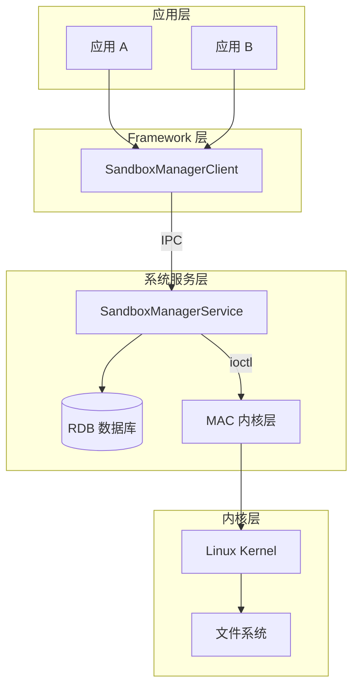
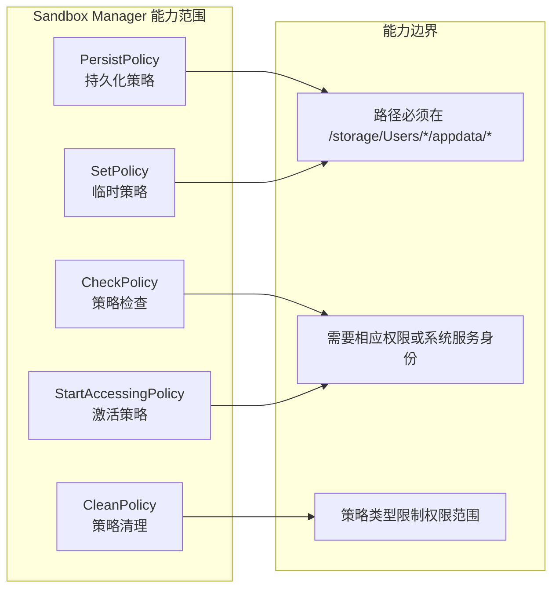
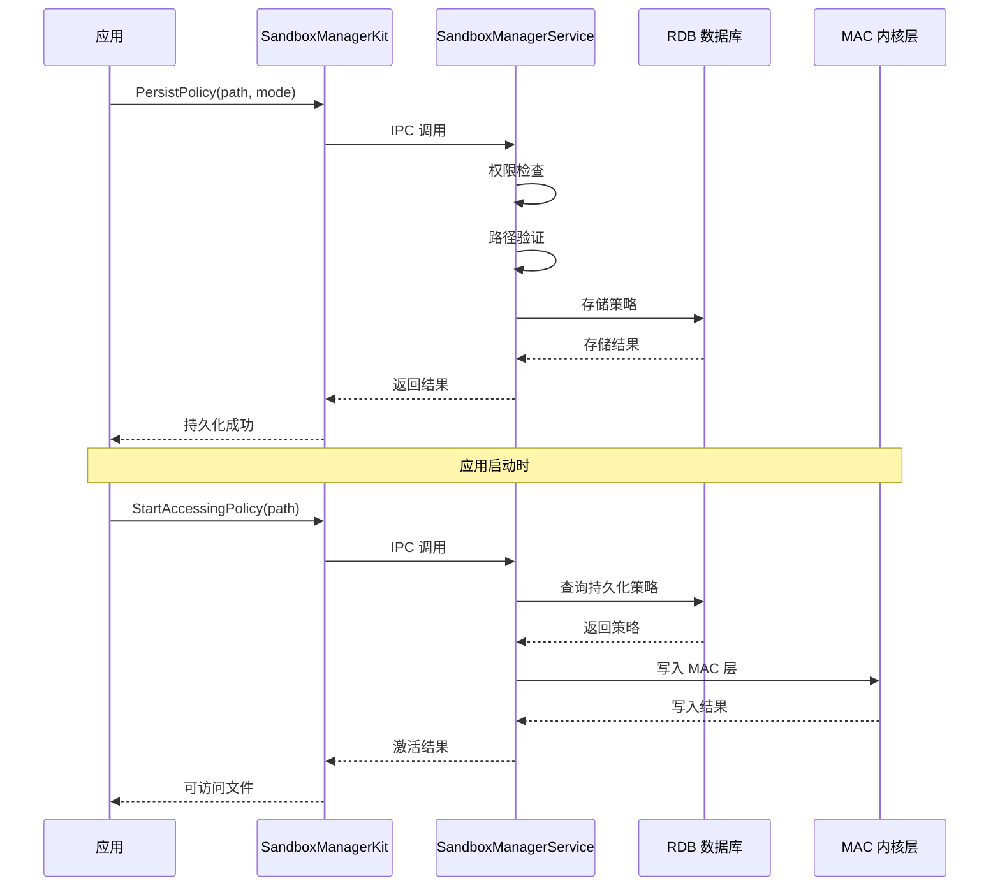
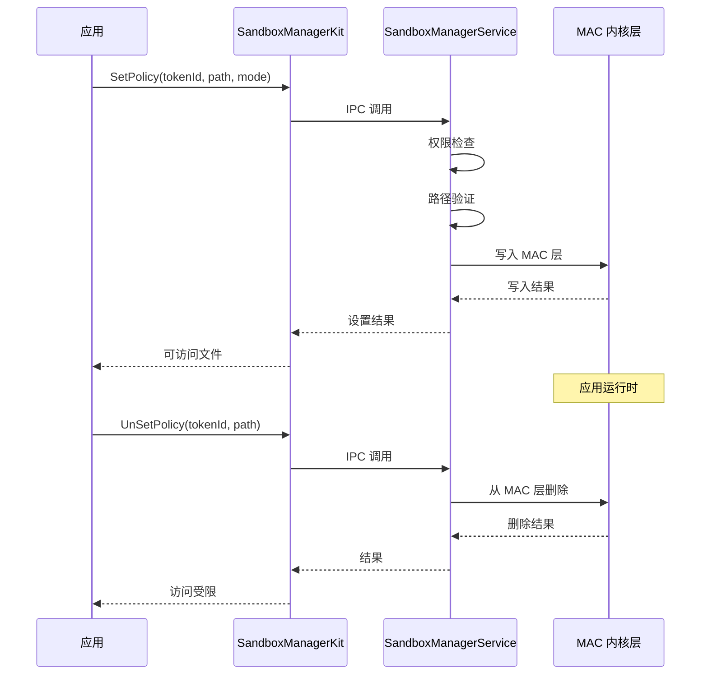

# 项目概览 (Overview)

> Sandbox Manager 核心概念、功能边界与快速开始指南

---

## 1.1 项目定位

### 一句话定义

**Sandbox Manager** 是 OpenHarmony 系统中负责管理应用沙箱（Sandbox）间文件共享策略的核心系统服务。它在应用层面实施细粒度的访问控制，确保应用只能访问被授权的文件路径。

### 解决的问题

在 OpenHarmony 系统中，每个应用都运行在独立的沙箱中，拥有自己的私有存储空间。Sandbox Manager 解决了以下问题：

| 问题 | 解决方案 |
|-----|---------|
| 应用间需要临时共享文件 | 提供临时策略（Temporary Policy），在应用生命周期内有效 |
| 应用间需要持久共享文件 | 提供持久策略（Persistent Policy），存储在数据库中直到应用卸载 |
| 需要控制文件访问权限 | 提供细粒度的读写创建删除权限控制 |
| 需要防止越权访问 | 依赖 MAC（Mandatory Access Control）内核层强制实施访问控制 |

### 在系统中的位置



**证据来源**：
- 服务入口：`services/sandbox_manager/main/cpp/src/service/sandbox_manager_service.cpp:54`
- 客户端代理：`frameworks/inner_api/sandbox_manager/src/sandbox_manager_client.cpp:323`
- 数据库模块：`services/sandbox_manager/main/cpp/src/database/sandbox_manager_rdb.cpp`
- MAC 适配器：`services/sandbox_manager/main/cpp/src/mac/mac_adapter.cpp`

---

## 1.2 能力边界

### 能做什么

| 能力 | 描述 | 策略类型 |
|-----|------|---------|
| **持久化策略管理** | 将文件访问策略存储到数据库，策略在应用卸载前一直有效 | Persistent |
| **临时策略管理** | 设置仅在当前应用生命周期内有效的访问策略 | Temporary |
| **策略检查** | 查询某个应用是否对某个路径拥有指定权限 | - |
| **批量清理** | 按路径、用户 ID、Token ID 清理策略 | - |
| **权限验证** | 验证调用者是否拥有执行操作的权限 | - |

### 不能做什么

| 限制 | 说明 |
|-----|------|
| 不能绕过系统权限检查 | 所有操作都需要相应的权限或系统服务身份 |
| 不能访问沙箱外的系统文件 | 策略路径必须符合 `/storage/Users/currentUser/appdata/` 格式 |
| 不能授予超出策略类型的权限 | SELF_PATH 不能授予对其他应用的访问权 |
| 不能动态修改已激活的持久策略 | 需要先停用再重新激活 |

### 能力边界图



---

## 1.3 运行环境

### 依赖的系统服务

| 服务 | 依赖类型 | 用途 |
|-----|---------|------|
| **samgr** | 强依赖 | System Ability Manager，服务注册和发现 |
| **relational_store** | 强依赖 | RDB 数据库，持久化存储策略 |
| **access_token** | 强依赖 | 权限验证，Token ID 验证 |
| **bundle_framework** | 强依赖 | Bundle 信息查询 |
| **ipc** | 强依赖 | 进程间通信框架 |

### 权限要求

调用 Sandbox Manager API 需要相应的权限：

| 权限名 | API | 说明 |
|-------|-----|------|
| `ohos.permission.SET_SANDBOX_POLICY` | SetPolicy, SetDenyPolicy | 设置策略 |
| `ohos.permission.CHECK_SANDBOX_POLICY` | CheckPolicy, CheckPersistPolicy | 检查策略 |
| `ohos.permission.FILE_ACCESS_PERSIST` | PersistPolicy, StartAccessingPolicy | 持久化操作 |
| `ohos.permission.FILE_ACCESS_MANAGER` | SetPolicyByBundleName | 批量策略设置 |

**证据来源**：`services/sandbox_manager/main/cpp/include/service/sandbox_manager_const.h:30-33`

```cpp
const std::string SET_POLICY_PERMISSION_NAME = "ohos.permission.SET_SANDBOX_POLICY";
const std::string CHECK_POLICY_PERMISSION_NAME = "ohos.permission.CHECK_SANDBOX_POLICY";
const std::string ACCESS_PERSIST_PERMISSION_NAME = "ohos.permission.FILE_ACCESS_PERSIST";
const std::string FILE_ACCESS_PERMISSION_NAME = "ohos.permission.FILE_ACCESS_MANAGER";
```

### 特权服务

某些操作仅限特定系统服务调用：

| 服务 | UID | 可执行操作 |
|-----|-----|----------|
| **Foundation** | 5523 | 通过指定 Token ID 持久化策略 |
| **Space Manager** | 7013 | 设置拒绝策略 |

**证据来源**：`services/sandbox_manager/main/cpp/include/service/sandbox_manager_const.h:35-36`

```cpp
const int32_t SPACE_MGR_SERVICE_UID = 7013;
const int32_t FOUNDATION_UID = 5523;
```

---

## 1.4 快速开始

### 最小使用示例

#### 添加头文件

```cpp
#include "sandbox_manager_kit.h"
#include "policy_info.h"
```

#### 持久化策略示例

```cpp
// 设置应用对某个路径的读权限（持久化）
int32_t SetPersistentReadPolicy()
{
    std::vector<PolicyInfo> policies;
    PolicyInfo policy;
    policy.path = "/storage/Users/100/appdata/com.example/data/shared";
    policy.mode = READ_MODE;  // 0x01
    policy.type = AUTHORIZATION_PATH;
    policies.push_back(policy);
    
    std::vector<uint32_t> results;
    int32_t ret = SandboxManagerKit::PersistPolicy(policies, results);
    
    if (ret == 0 && results[0] == OPERATE_SUCCESSFULLY) {
        // 策略持久化成功
    }
    return ret;
}
```

#### 临时策略示例

```cpp
// 设置临时写权限（应用生命周期内有效）
int32_t SetTemporaryWritePolicy(uint32_t tokenId)
{
    std::vector<PolicyInfo> policies;
    PolicyInfo policy;
    policy.path = "/storage/Users/100/appdata/com.example/temp";
    policy.mode = WRITE_MODE;  // 0x02
    policy.type = SELF_PATH;
    policies.push_back(policy);
    
    std::vector<uint32_t> results;
    int32_t ret = SandboxManagerKit::SetPolicy(tokenId, policies, 0, results);
    
    return ret;
}
```

#### 策略检查示例

```cpp
// 检查应用是否对某路径有读权限
int32_t CheckAccessPermission(uint32_t tokenId)
{
    std::vector<PolicyInfo> policies;
    PolicyInfo policy;
    policy.path = "/storage/Users/100/appdata/com.example/data";
    policy.mode = READ_MODE;
    policies.push_back(policy);
    
    std::vector<bool> results;
    int32_t ret = SandboxManagerKit::CheckPolicy(tokenId, policies, results);
    
    if (ret == 0 && results[0]) {
        // 拥有读权限
    }
    return ret;
}
```

**证据来源**：`interfaces/inner_api/sandbox_manager/include/sandbox_manager_kit.h`

---

## 1.5 核心数据结构

### PolicyInfo 结构

```cpp
struct PolicyInfo final {
    std::string path;        // 策略路径
    uint64_t mode;           // 操作模式 (READ_MODE, WRITE_MODE, etc.)
    PolicyType type;         // 策略类型 (SELF_PATH, AUTHORIZATION_PATH, OTHERS_PATH)
};
```

**证据来源**：`interfaces/inner_api/sandbox_manager/include/policy_info.h:32-37`

### PolicyType 枚举

| 枚举值 | 说明 | 使用场景 |
|-------|------|---------|
| `SELF_PATH` | 自有路径 | 应用访问自己的沙箱目录 |
| `AUTHORIZATION_PATH` | 授权路径 | 其他应用授权访问的目录 |
| `OTHERS_PATH` | 其他路径 | 访问第三方应用目录（高权限） |

**证据来源**：`interfaces/inner_api/sandbox_manager/include/policy_info.h:25-30`

### OperateMode 枚举

| 枚举值 | 值 | 描述 |
|-------|-----|------|
| `READ_MODE` | 0x01 | 读权限 |
| `WRITE_MODE` | 0x02 | 写权限 |
| `CREATE_MODE` | 0x04 | 创建权限 |
| `DELETE_MODE` | 0x08 | 删除权限 |
| `DENY_READ_MODE` | 0x20 | 拒绝读 |
| `DENY_WRITE_MODE` | 0x40 | 拒绝写 |

**证据来源**：`interfaces/inner_api/sandbox_manager/include/policy_info.h:58-67`

---

## 1.6 策略生命周期

### 持久化策略生命周期



### 临时策略生命周期



---

## 1.7 常见问题 (FAQ)

### Q1: 持久化策略和临时策略有什么区别？

| 特性 | 持久化策略 | 临时策略 |
|-----|-----------|---------|
| **存储位置** | RDB 数据库 | MAC 内核层（内存） |
| **生命周期** | 应用卸载前一直有效 | 应用生命周期内有效 |
| **激活方式** | 需调用 StartAccessingPolicy | 设置后立即生效 |
| **权限要求** | FILE_ACCESS_PERSIST 权限 | SET_SANDBOX_POLICY 权限 |

### Q2: 策略路径有什么限制？

**路径必须满足以下条件**：
1. 必须以 `/storage/Users/` 开头
2. 必须包含 `currentUser`（当前用户）
3. 必须在 `/storage/Users/currentUser/appdata/` 子目录下
4. SELF_PATH 类型需要与调用者的 bundle name 匹配

**证据来源**：`services/sandbox_manager/main/cpp/src/service/policy_info_manager.cpp:1289-1336`

### Q3: 如何调试策略问题？

1. **检查权限**：确认已申请相应权限
2. **检查路径格式**：使用 `AdjustPath()` 规范化路径
3. **检查策略状态**：使用 `CheckPolicy()` 查询策略是否存在
4. **查看日志**：通过 `hilog` 查看 SandboxManager 日志

---

*文档更新时间: 2025-02-07*
