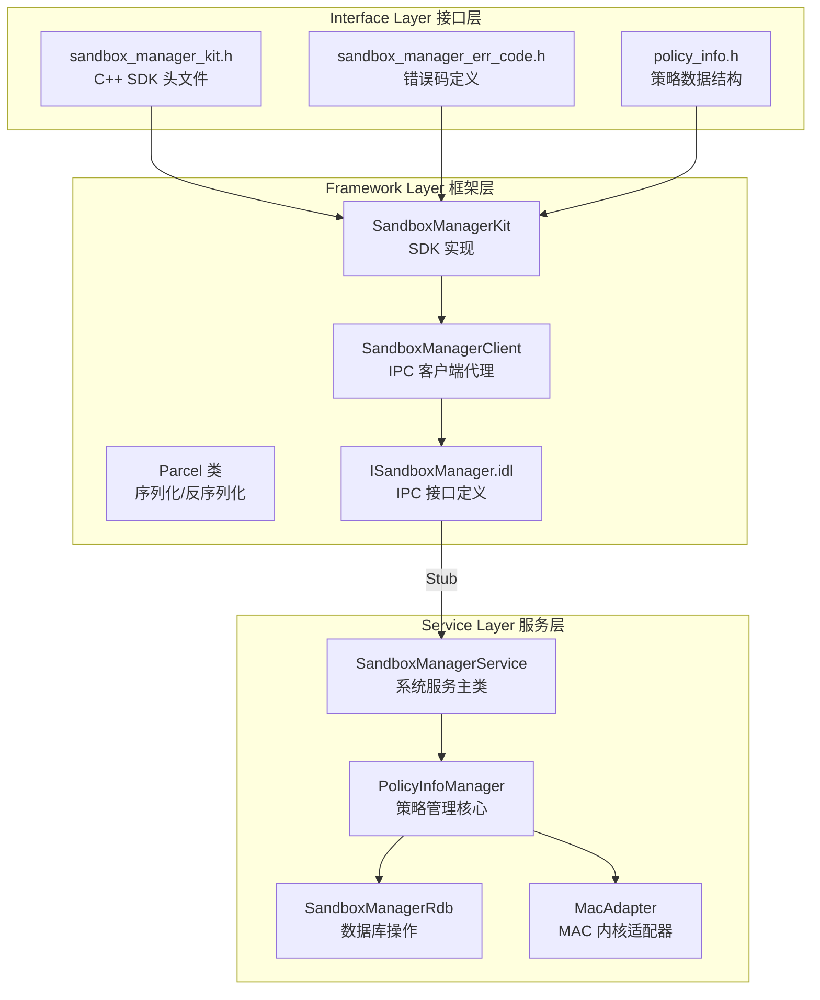
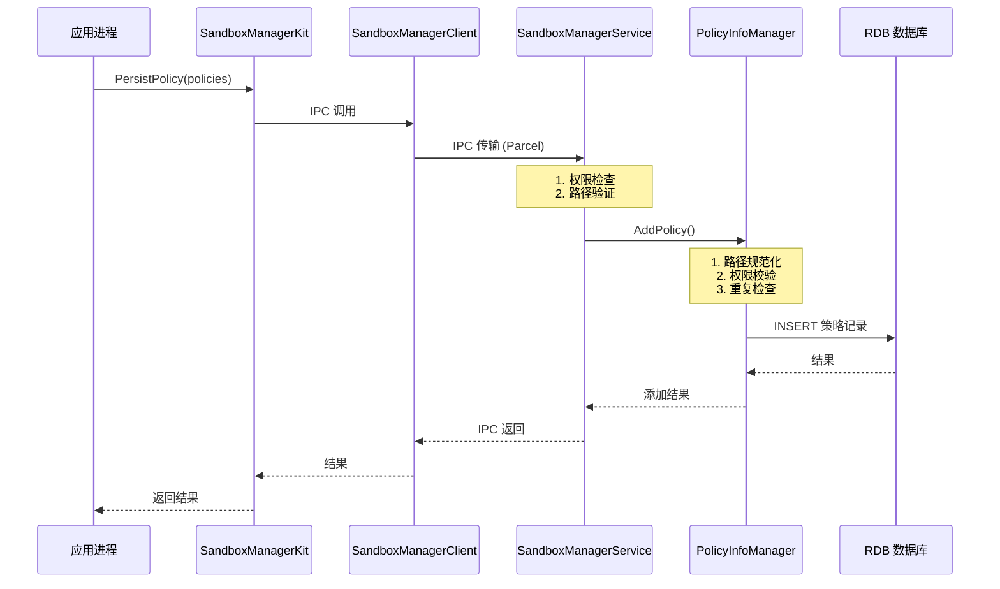
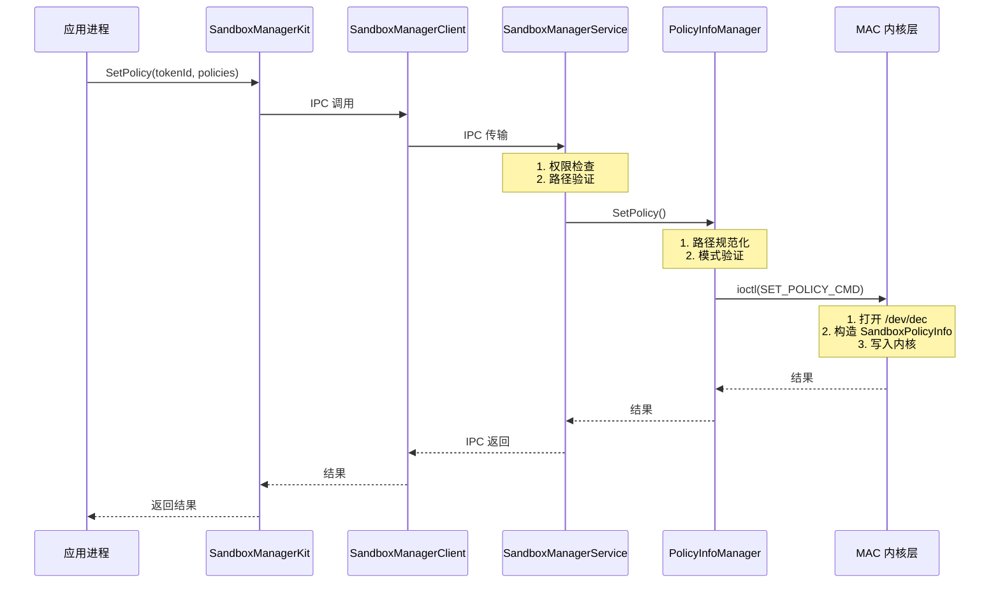
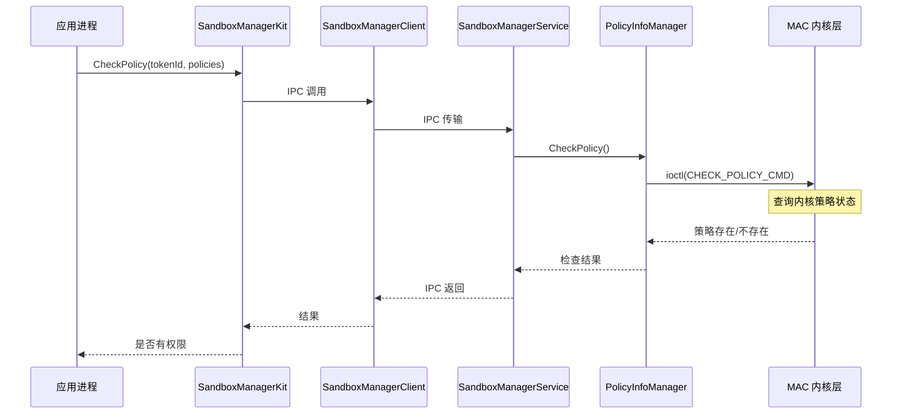
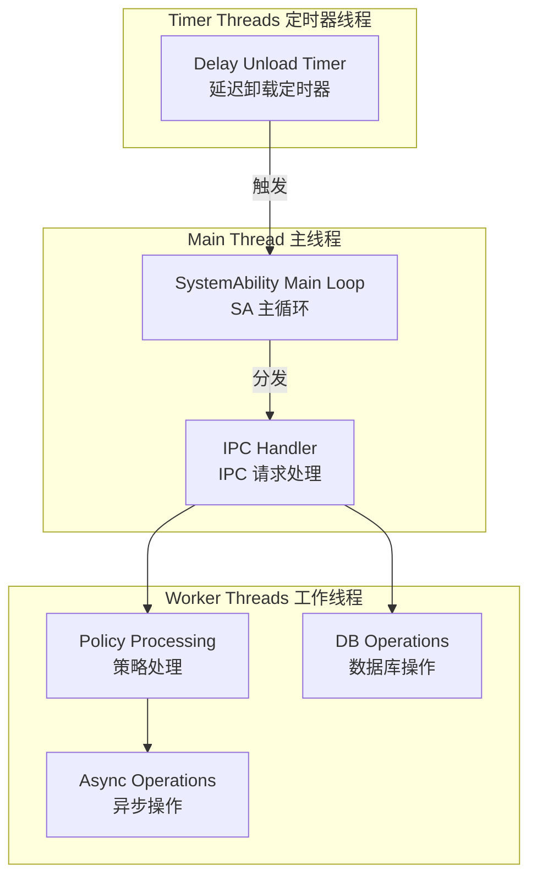
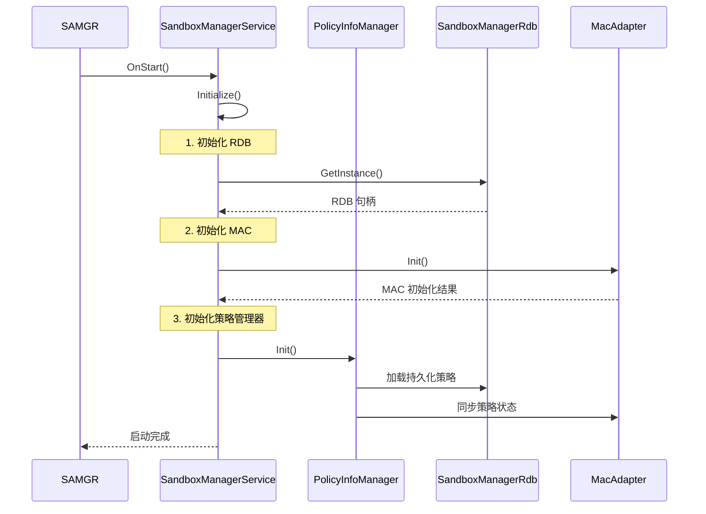
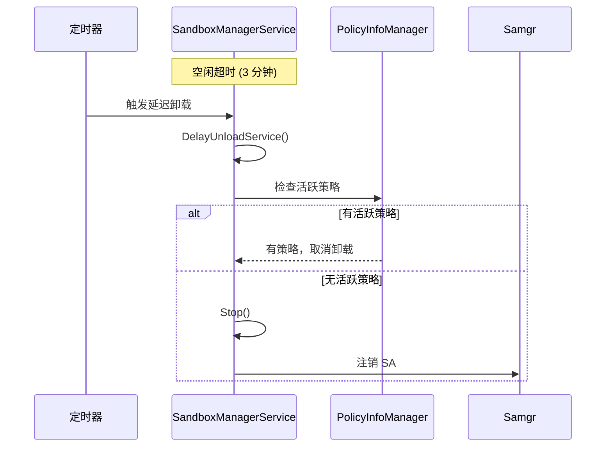
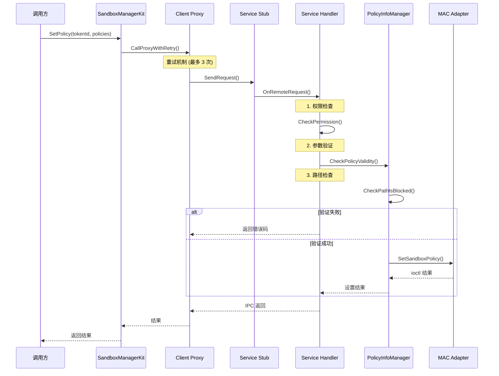

# 架构与数据流 (Architecture)

> Sandbox Manager 系统架构、组件关系与数据流转详解

---

## 2.1 整体架构

### 三层架构设计

Sandbox Manager 采用经典的三层架构设计，从上到下依次为：



### 各层职责

| 层级 | 组件 | 职责 |
|-----|------|-----|
| **接口层** | SDK Header 文件 | 定义对外 API、数据结构、错误码 |
| **框架层** | Kit + Client | SDK 实现、IPC 通信封装、序列化 |
| **服务层** | Service + Manager | 业务逻辑、数据库操作、MAC 交互 |

### 组件依赖关系

```mermaid
graph LR
    subgraph "Interface"
        Kit["SandboxManagerKit"]
        Err["sandbox_manager_err_code"]
        Policy["policy_info.h"]
    end
    
    subgraph "Framework"
        Client["SandboxManagerClient"]
        Stub["SandboxManagerStub"]
        Parcel["Parcel Classes"]
    end
    
    subgraph "Service"
        Service["SandboxManagerService"]
        PolicyMgr["PolicyInfoManager"]
        RDB["SandboxManagerRdb"]
        Mac["MacAdapter"]
    end
    
    Kit --> Err
    Kit --> Policy
    Kit --> Client
    Client --> Stub
    Client --> Parcel
    Service --> PolicyMgr
    PolicyMgr --> RDB
    PolicyMgr --> Mac
```

**证据来源**：
- 接口层：`interfaces/inner_api/sandbox_manager/include/`
- 框架层：`frameworks/inner_api/sandbox_manager/src/`
- 服务层：`services/sandbox_manager/main/cpp/src/`

---

## 2.2 核心组件详解

### SandboxManagerService

**职责**：系统服务主类，继承自 `SystemAbility`，处理所有 IPC 请求。

```cpp
class SandboxManagerService final : public SystemAbility, public SandboxManagerStub {
    // 继承关系：
    // SystemAbility → SA 基类，处理生命周期
    // SandboxManagerStub → IPC 存根，处理请求分发
};
```

**关键方法**：

| 方法 | 行号 | 职责 |
|-----|------|-----|
| `OnStart()` | 107 | 服务启动初始化 |
| `OnStop()` | 134 | 服务停止清理 |
| `CheckPermission()` | 829 | 权限验证 |
| `SetPolicy()` | 384 | 设置临时策略 |
| `PersistPolicy()` | 262 | 持久化策略 |

**证据来源**：`services/sandbox_manager/main/cpp/include/service/sandbox_manager_service.h`

### PolicyInfoManager

**职责**：策略管理核心类，处理所有策略相关的业务逻辑。

```cpp
class PolicyInfoManager {
    // 单例模式
    static PolicyInfoManager &GetInstance();
    
    // 核心功能
    int32_t AddPolicy(...);      // 添加策略
    int32_t RemovePolicy(...);   // 删除策略
    int32_t SetPolicy(...);      // 设置策略到 MAC
    int32_t CheckPolicy(...);    // 检查策略
};
```

**关键方法**：

| 方法 | 行号 | 职责 |
|-----|------|-----|
| `CheckPolicyValidity()` | 1138 | 验证策略合法性 |
| `CheckPathIsBlocked()` | 1341 | 检查路径是否被阻止 |
| `FilterValidPolicyInBatch()` | 337 | 批量验证策略 |
| `GetDepth()` | 1079 | 计算路径深度 |

**证据来源**：`services/sandbox_manager/main/cpp/include/service/policy_info_manager.h`

### MacAdapter

**职责**：与 MAC 内核层交互，通过 ioctl 命令操作内核策略。

```cpp
class MacAdapter {
    bool Init();                          // 初始化 MAC 连接
    bool IsMacSupport();                  // 检查 MAC 是否可用
    int32_t SetSandboxPolicy(...);        // 设置策略到内核
    int32_t UnSetSandboxPolicy(...);      // 从内核删除策略
    int32_t CheckSandboxPolicy(...);      // 检查内核策略
};
```

**证据来源**：`services/sandbox_manager/main/cpp/include/mac/mac_adapter.h`

### SandboxManagerRdb

**职责**：关系型数据库操作，持久化存储策略配置。

**关键方法**：

| 方法 | 职责 |
|-----|------|
| `Add()` | 添加策略记录 |
| `Remove()` | 删除策略记录 |
| `Find()` | 查询策略 |
| `FindSubPath()` | 按路径前缀查询 |

**证据来源**：`services/sandbox_manager/main/cpp/src/database/sandbox_manager_rdb.cpp`

---

## 2.3 数据流分析

### 持久化策略设置流程



### 临时策略设置流程



### 策略检查流程



---

## 2.4 IPC 接口定义

### ISandboxManager.idl

IDL 文件定义了所有 IPC 接口方法：

| IPC Code | 方法 | 描述 |
|----------|------|------|
| 0xffb0 | `PersistPolicy` | 持久化策略 |
| 0xffb1 | `UnPersistPolicy` | 取消持久化 |
| 0xffb2 | `SetPolicy` | 设置临时策略 |
| 0xffb3 | `UnSetPolicy` | 取消临时策略 |
| 0xffb4 | `SetPolicyAsync` | 异步设置策略 |
| 0xffb5 | `UnSetPolicyAsync` | 异步取消策略 |
| 0xffb6 | `CheckPolicy` | 检查策略 |
| 0xffb7 | `StartAccessingPolicy` | 激活策略 |
| 0xffb8 | `StopAccessingPolicy` | 停用策略 |
| 0xffb9 | `CheckPersistPolicy` | 检查持久化策略 |
| 0xffba | `StartAccessingByTokenId` | 按 Token 激活 |
| 0xffbb | `UnSetAllPolicyByToken` | 清除 Token 所有策略 |
| 0xffbc | `PersistPolicyByTokenId` | 指定 Token 持久化 |
| 0xffbd | `UnPersistPolicyByTokenId` | 指定 Token 取消持久化 |
| 0xffbe | `CleanPersistPolicyByPath` | 按路径清理 |
| 0xffbf | `CleanPolicyByUserId` | 按用户清理 |
| 0xffc0 | `SetPolicyByBundleName` | 按包名设置策略 |
| 0xffc1 | `SetDenyPolicy` | 设置拒绝策略 |
| 0xffc2 | `UnSetDenyPolicy` | 取消拒绝策略 |

**证据来源**：`frameworks/sandbox_manager/ISandboxManager.idl:24-44`

---

## 2.5 线程模型

### 服务线程模型



### 线程安全设计

| 组件 | 线程安全机制 | 说明 |
|-----|-------------|------|
| `PolicyInfoManager` | `g_instanceMutex` | 单例初始化的双重检查锁定 |
| `SandboxManagerService` | `stateMutex_` | 服务状态保护 |
| `SandboxManagerService` | `unloadMutex_` | 卸载操作保护 |

**证据来源**：
- 单例模式：`services/sandbox_manager/main/cpp/src/service/policy_info_manager.cpp:54-67`
- 状态锁：`services/sandbox_manager/main/cpp/include/service/sandbox_manager_service.h:87-89`

---

## 2.6 初始化与销毁流程

### 服务初始化



**证据来源**：`services/sandbox_manager/main/cpp/src/service/sandbox_manager_service.cpp:107-140`

### 服务延迟卸载



**证据来源**：`services/sandbox_manager/main/cpp/include/service/sandbox_manager_service.h:75`

---

## 2.7 关键时序图

### 策略设置完整时序



---

## 2.8 与外部系统的交互

### 依赖的外部服务

| 系统服务 | 交互方式 | 用途 |
|---------|---------|------|
| **SAMGR** | SystemAbility | 服务注册、生命周期管理 |
| **Bundle Manager** | IPC | 查询应用 Bundle 信息 |
| **Account Manager** | IPC | 获取当前用户 ID |
| **Access Token** | IPC | 权限验证、Token 查询 |
| **Media Library** | IPC | 媒体路径策略处理 |

### 交互示例：获取用户 ID

```cpp
// 证据来源：services/sandbox_manager/main/cpp/src/service/policy_info_manager.cpp:136
int32_t userId = 0;
int32_t ret = AccountSA::OsAccountManager::GetForegroundOsAccountLocalId(userId);
if (ret != 0) {
    SANDBOXMANAGER_LOG_ERROR(LABEL, "get user id failed error=%{public}d", ret);
    userId = 0;  // 设置默认值
}
```

---

*文档更新时间: 2025-02-07*
