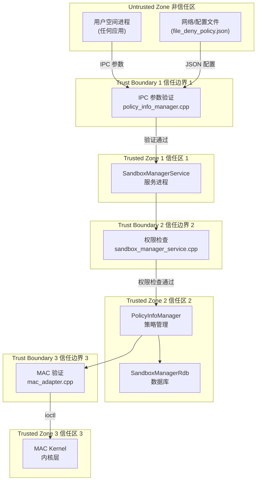
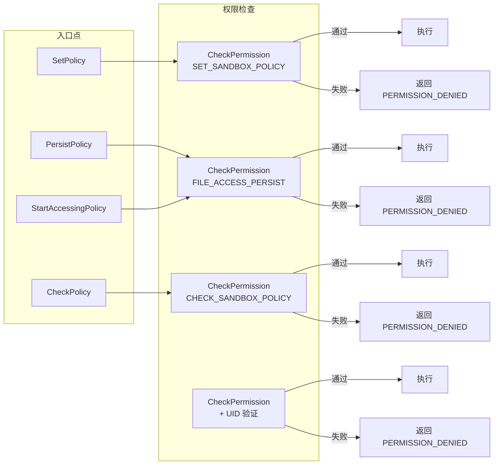

# 攻击面分析 (Attack Surface)

> Sandbox Manager 外部输入清单、信任边界与安全关键点识别

---

## 5.1 攻击面概述

### 什么是攻击面

攻击面是指系统中所有可能被攻击者利用的入口点。对于 Sandbox Manager，攻击面包括：
- IPC 接口参数（从其他进程传入的数据）
- 配置文件（JSON 拒绝策略配置）
- 内部接口（Framework 层到 Service 层的调用）

### 攻击面统计

| 攻击面类型 | 入口数量 | 风险等级 |
|-----------|---------|---------|
| **IPC 接口参数** | 20+ | 高 |
| **路径输入** | 无限（用户可控） | 高 |
| **bundleName 输入** | 无限（用户可控） | 中 |
| **权限验证** | 4 个检查点 | 关键 |
| **数据库查询** | 4 种查询方式 | 中 |
| **MAC ioctl** | 8 种操作 | 关键 |

---

## 5.2 外部输入清单

### 5.2.1 IPC 接口参数

所有通过 IPC 传入的参数都是不可信的，需要严格验证：

| IPC 方法 | 输入参数 | 风险说明 |
|---------|---------|---------|
| `SetPolicy` | `tokenId`, `policy[].path`, `policy[].mode`, `policy[].type` | 路径遍历、模式越权 |
| `PersistPolicy` | `policy[].path`, `policy[].mode`, `policy[].type` | 路径遍历、持久化注入 |
| `SetPolicyByBundleName` | `bundleName`, `policy[].path` | 包名欺骗、路径绑定绕过 |
| `CheckPolicy` | `tokenId`, `policy[].path` | Token 伪装、信息泄露 |
| `CleanPersistPolicyByPath` | `filePathList[]` | 路径遍历、拒绝服务 |
| `CleanPolicyByUserId` | `userId`, `filePathList[]` | 越权清理 |
| `SetPolicyAsync` | 同 `SetPolicy` | 同上（异步） |
| `SetDenyPolicy` | `policy[].path`, `policy[].mode` | 拒绝策略滥用 |

**证据来源**：`frameworks/sandbox_manager/ISandboxManager.idl`

### 5.2.2 路径输入 (最高风险)

**输入源**：所有 API 中的 `policy.path` 参数

**风险原因**：
- 用户可直接控制路径字符串
- 路径直接用于数据库查询
- 路径传递给内核 MAC 层

**路径约束**（代码强制）：

```cpp
// 证据来源：services/sandbox_manager/main/cpp/src/service/policy_info_manager.cpp:1289-1336

// 1. 必须以 /storage 开头
const std::string ROOT_PATH = "/storage";

// 2. 必须在 /storage/Users/*/appdata/ 子目录下
const std::string APPDATA_PATH = "/storage/Users/currentUser/appdata";

// 3. 路径长度限制
const uint32_t POLICY_PATH_LIMIT = 4095;

// 4. SELF_PATH 类型必须匹配 bundle name
```

### 5.2.3 bundleName 输入

**输入源**：`SetPolicyByBundleName(bundleName, ...)`

**风险原因**：
- 用于查询应用信息
- 用于验证路径所有权

**验证方式**：

```cpp
// 证据来源：services/sandbox_manager/main/cpp/src/service/policy_info_manager.cpp:1192-1236
bool PolicyInfoManager::CheckPathWithinBundleName(
    const std::string &path, 
    const std::string &bundleName,
    std::vector<std::string> &components)
```

---

### 5.2.4 Token ID 输入

**输入源**：所有接受 `tokenId` 参数的 API

**风险原因**：
- Token ID 标识应用身份
- 可用于绕过权限检查

**信任边界**：

```cpp
// 证据来源：services/sandbox_manager/main/cpp/src/service/sandbox_manager_service.cpp:829-839
bool SandboxManagerService::CheckPermission(
    const uint32_t tokenId, 
    const std::string &permission)
{
    int32_t ret = Security::AccessToken::AccessTokenKit::VerifyAccessToken(
        tokenId, permission);
    return (ret == Security::AccessToken::PermissionState::PERMISSION_GRANTED);
}
```

---

## 5.3 敏感操作清单

### 5.3.1 内核操作 (最高风险)

所有敏感操作都通过 `/dev/dec` 设备节点进行：

| 操作 | ioctl 命令 | 风险说明 |
|-----|-----------|---------|
| `SetSandboxPolicy` | `SET_POLICY_CMD` | 写入策略到内核 |
| `UnSetSandboxPolicy` | `UN_SET_POLICY_CMD` | 删除内核策略 |
| `CheckSandboxPolicy` | `CHECK_POLICY_CMD` | 查询内核策略 |
| `DestroySandboxPolicy` | `DESTROY_POLICY_CMD` | 销毁 Token 所有策略 |
| `SetDenyPolicy` | `DENY_DEC_RULE_CMD` | 设置拒绝规则 |
| `UnSetDenyPolicy` | `DEL_DENY_DEC_RULE_CMD` | 删除拒绝规则 |

**证据来源**：`services/sandbox_manager/main/cpp/src/mac/mac_adapter.cpp:59-76`

### 5.3.2 数据库操作

| 操作 | SQL 操作 | 风险说明 |
|-----|---------|---------|
| `AddPolicy` | INSERT | 持久化策略注入 |
| `RemovePolicy` | DELETE | 策略越权删除 |
| `Find` | SELECT | 信息泄露 |
| `FindSubPath` | SELECT LIKE | 路径遍历查询 |

**证据来源**：`services/sandbox_manager/main/cpp/src/database/sandbox_manager_rdb.cpp`

### 5.3.3 权限敏感操作

| 操作 | 权限要求 | 风险说明 |
|-----|---------|---------|
| `SetPolicy` | `SET_SANDBOX_POLICY` | 越权设置访问权 |
| `PersistPolicy` | `FILE_ACCESS_PERSIST` | 越权持久化 |
| `CheckPolicy` | `CHECK_SANDBOX_POLICY` 或同 Token | 信息探测 |
| `SetPolicyByBundleName` | `FILE_ACCESS_MANAGER` | 批量授权滥用 |

**证据来源**：`services/sandbox_manager/main/cpp/include/service/sandbox_manager_const.h:30-33`

```cpp
const std::string SET_POLICY_PERMISSION_NAME = "ohos.permission.SET_SANDBOX_POLICY";
const std::string CHECK_POLICY_PERMISSION_NAME = "ohos.permission.CHECK_SANDBOX_POLICY";
const std::string ACCESS_PERSIST_PERMISSION_NAME = "ohos.permission.FILE_ACCESS_PERSIST";
const std::string FILE_ACCESS_PERMISSION_NAME = "ohos.permission.FILE_ACCESS_MANAGER";
```

---

## 5.4 信任边界图

### 信任边界定义



### 边界跨越点

| 边界 | 跨越点 | 验证机制 |
|-----|-------|---------|
| 用户→服务 | IPC 参数 | `CheckPolicyValidity()`, `CheckPathIsBlocked()` |
| 服务→数据库 | SQL 参数 | Prepared Statement (由 RDB 框架处理) |
| 服务→内核 | ioctl | `VerifyAccessToken()` 权限验证 |

---

## 5.5 权限检查点

### 关键权限检查点



### CheckPermission 实现

```cpp
// 证据来源：services/sandbox_manager/main/cpp/src/service/sandbox_manager_service.cpp:829-839
bool SandboxManagerService::CheckPermission(
    const uint32_t tokenId, 
    const std::string &permission)
{
    int32_t ret = Security::AccessToken::AccessTokenKit::VerifyAccessToken(
        tokenId, permission);
    if (ret == Security::AccessToken::PermissionState::PERMISSION_GRANTED) {
        return true;
    }
    return false;
}
```

---

## 5.6 特权服务检查

### Foundation UID 特殊处理

```cpp
// 证据来源：services/sandbox_manager/main/cpp/src/service/sandbox_manager_service.cpp:318-330

// Foundation (UID 5523) 可以通过指定 tokenId 持久化策略
int32_t SandboxManagerService::PersistPolicyByTokenId(
    uint32_t tokenId, 
    const PolicyVecRawData &policyRawData, 
    Uint32VecRawData &resultRawData)
{
    // 检查调用者 UID
    auto callerUid = IPCSkeleton().GetCallingUid();
    if (callerUid != FOUNDATION_UID) {  // 5523
        return PERMISSION_DENIED;
    }
    // ... 继续处理
}
```

### Space Manager UID 特殊处理

```cpp
// 证据来源：services/sandbox_manager/main/cpp/src/service/sandbox_manager_service.cpp:423

int32_t SandboxManagerService::SetDenyPolicy(...)
{
    // 只有 Space Manager (UID 7013) 可以设置拒绝策略
    auto callerUid = IPCSkeleton().GetCallingUid();
    if (callerUid != SPACE_MGR_SERVICE_UID) {  // 7013
        return PERMISSION_DENIED;
    }
}
```

**证据来源**：`services/sandbox_manager/main/cpp/include/service/sandbox_manager_const.h:35-36`

```cpp
const int32_t SPACE_MGR_SERVICE_UID = 7013;
const int32_t FOUNDATION_UID = 5523;
```

---

## 5.7 攻击路径总结

### 高风险攻击路径

| 攻击路径 | 入口 | 利用条件 | 影响 |
|---------|-----|---------|------|
| **路径遍历** | `policy.path` | 路径验证绕过 | 访问任意文件 |
| **权限提升** | `tokenId` | Token 伪造 | 越权访问 |
| **策略注入** | `PersistPolicy` | 权限绕过 | 持久化恶意策略 |
| **拒绝服务** | `CleanPolicyByPath` | 权限伪造 | 清除合法策略 |

### 中风险攻击路径

| 攻击路径 | 入口 | 利用条件 | 影响 |
|---------|-----|---------|------|
| **信息探测** | `CheckPolicy` | 权限不足 | 枚举权限状态 |
| **Token 猜测** | `tokenId` | Token 可预测 | 定向攻击 |

---

## 5.8 安全边界建议

### 当前安全措施

| 措施 | 实现位置 | 有效性 |
|-----|---------|--------|
| 路径规范化 | `AdjustPath()` | 高 |
| 路径长度检查 | `POLICY_PATH_LIMIT` | 高 |
| 嵌入 null 检测 | `strlen() != length` | 高 |
| Bundle 名称绑定 | `CheckPathWithinBundleName()` | 中 |
| 权限验证 | `VerifyAccessToken()` | 高 |
| UID 白名单 | 硬编码 UID 检查 | 高 |

### 建议加强的措施

1. **路径规范化增强**：考虑使用 `realpath()` 进行标准化
2. **SQL 注入防护**：确保所有数据库操作使用参数化查询
3. **Token 随机化**：确保 Token ID 不可预测
4. **审计日志**：记录所有策略变更操作

---

*文档更新时间: 2025-02-07*
