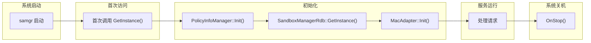
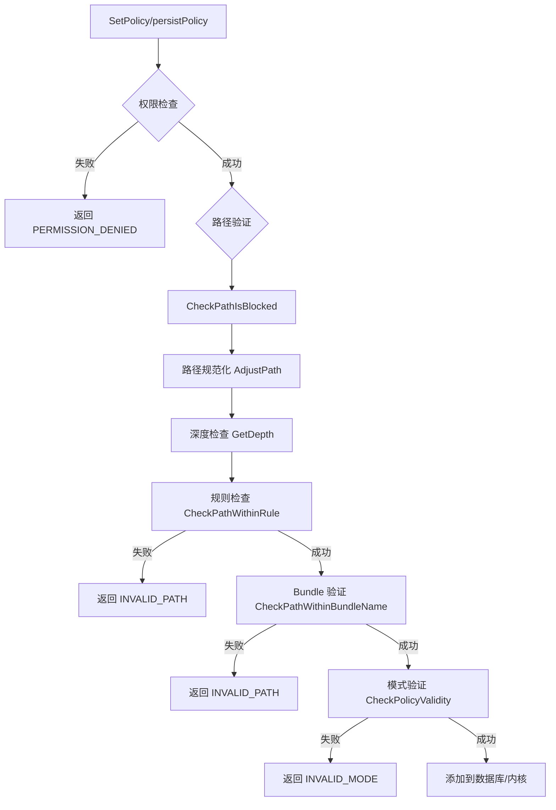

# 内部实现细节 (Internals)

> Sandbox Manager 核心类实现、资源生命周期与内部 API 契约

---

## 8.1 核心类职责

### PolicyInfoManager (策略管理器)

**职责**：策略管理核心类，处理所有策略相关的业务逻辑。

**单例模式实现**：

```cpp
// 证据来源：services/sandbox_manager/main/cpp/src/service/policy_info_manager.cpp:57-67

PolicyInfoManager &PolicyInfoManager::GetInstance()
{
    static PolicyInfoManager* instance = nullptr;
    if (instance == nullptr) {
        std::lock_guard<std::mutex> lock(g_instanceMutex);
        if (instance == nullptr) {
            instance = new PolicyInfoManager();
        }
    }
    return *instance;
}
```

**关键成员**：

| 成员 | 类型 | 职责 |
|-----|------|------|
| `macAdapter_` | `MacAdapter` | MAC 内核交互 |
| `g_userGrantMap_` | `std::map<std::string, std::string>` | 用户授权映射 |

**关键方法**：

| 方法 | 职责 | 线程安全 |
|-----|------|---------|
| `Init()` | 初始化 RDB、MAC、授权映射 | - |
| `AddPolicy()` | 添加策略到数据库 | 需要互斥 |
| `RemovePolicy()` | 从数据库删除策略 | 需要互斥 |
| `SetPolicy()` | 设置策略到 MAC | 需要互斥 |
| `CheckPolicy()` | 检查策略 | 需要互斥 |
| `CheckPathIsBlocked()` | 验证路径合法性 | - |

**证据来源**：`services/sandbox_manager/main/cpp/include/service/policy_info_manager.h`

---

### SandboxManagerService (系统服务)

**职责**：SystemAbility 服务主类，处理 IPC 请求分发。

**继承关系**：

```cpp
// 证据来源：services/sandbox_manager/main/cpp/include/service/sandbox_manager_service.h:34

class SandboxManagerService final : public SystemAbility, public SandboxManagerStub {
    // SystemAbility → SA 基类
    // SandboxManagerStub → IPC 存根
};
```

**生命周期方法**：

| 方法 | 行号 | 职责 |
|-----|------|------|
| `OnStart()` | 107 | 服务启动 |
| `OnStop()` | 134 | 服务停止 |
| `OnStart(const SystemAbilityOnDemandReason&)` | 42 | 按需启动 |
| `DelayUnloadService()` | 75 | 延迟卸载 |

**线程安全**：

```cpp
// 证据来源：services/sandbox_manager/main/cpp/include/service/sandbox_manager_service.h:87-92

std::mutex stateMutex_;                    // 状态保护
ServiceRunningState state_;                // 服务状态
static std::mutex unloadMutex_;            // 卸载保护
static std::shared_ptr<EventHandler> unloadHandler_;  // 卸载定时器
```

---

### MacAdapter (MAC 适配器)

**职责**：与 MAC 内核层交互，通过 ioctl 命令操作内核策略。

**关键成员**：

| 成员 | 类型 | 职责 |
|-----|------|------|
| `fd_` | `int` | `/dev/dec` 设备句柄 |
| `isMacSupport_` | `bool` | MAC 是否可用 |

**关键方法**：

| 方法 | 行号 | 职责 |
|-----|------|------|
| `Init()` | 36 | 打开设备、初始化 |
| `IsMacSupport()` | 37 | 检查 MAC 可用性 |
| `SetSandboxPolicy()` | 39 | 设置策略到内核 |
| `UnSetSandboxPolicy()` | 41 | 删除内核策略 |
| `CheckSandboxPolicy()` | 47 | 检查内核策略 |

**证据来源**：`services/sandbox_manager/main/cpp/include/mac/mac_adapter.h`

---

### SandboxManagerRdb (数据库操作)

**职责**：关系型数据库操作，持久化存储策略配置。

**单例模式**：

```cpp
// 证据来源：services/sandbox_manager/main/cpp/src/database/sandbox_manager_rdb.cpp

static SandboxManagerRdb* g_rdbInstance = nullptr;
static std::mutex g_rdbMutex;

SandboxManagerRdb &SandboxManagerRdb::GetInstance()
{
    if (g_rdbInstance == nullptr) {
        std::lock_guard<std::mutex> lock(g_rdbMutex);
        if (g_rdbInstance == nullptr) {
            g_rdbInstance = new SandboxManagerRdb();
        }
    }
    return *g_rdbInstance;
}
```

**关键方法**：

| 方法 | 职责 |
|-----|------|
| `Add()` | 添加策略记录 |
| `Remove()` | 删除策略记录 |
| `Find()` | 查询策略 |
| `FindSubPath()` | 按路径前缀查询 |
| `Modify()` | 修改策略记录 |

**证据来源**：`services/sandbox_manager/main/cpp/src/database/sandbox_manager_rdb.cpp`

---

## 8.2 内部 API 契约

### 稳定接口 (Stable API)

以下接口供框架层调用，稳定性有保证：

| 接口 | 头文件 | 稳定性 |
|-----|--------|-------|
| `SandboxManagerKit::*` | `sandbox_manager_kit.h` | Stable |
| `SandboxManagerClient::*` | `sandbox_manager_client.h` | Stable |

### 内部接口 (Internal API)

以下接口仅供内部模块使用，可能变化：

| 接口 | 头文件 | 使用范围 |
|-----|--------|---------|
| `PolicyInfoManager::*` | `policy_info_manager.h` | Service 层 |
| `SandboxManagerRdb::*` | `sandbox_manager_rdb.h` | Service 层 |
| `MacAdapter::*` | `mac_adapter.h` | Service 层 |

---

## 8.3 资源生命周期

### 单例生命周期



### 资源创建与释放

| 资源 | 创建时机 | 释放时机 | Owner |
|-----|---------|---------|-------|
| `PolicyInfoManager` | 首次 `GetInstance()` | 进程退出 | 单例 |
| `SandboxManagerRdb` | `Init()` 时 | 进程退出 | `PolicyInfoManager` |
| `MacAdapter` | `Init()` 时 | 进程退出 | `PolicyInfoManager` |
| `/dev/dec` fd | `MacAdapter::Init()` | `MacAdapter` 析构 | `MacAdapter` |

---

## 8.4 错误处理机制

### 错误码体系

**SandboxManagerErrCode**（服务级错误）：

| 错误码 | 值 | 说明 |
|-------|-----|------|
| `SANDBOX_MANAGER_OK` | 0 | 成功 |
| `PERMISSION_DENIED` | 1 | 权限被拒绝 |
| `INVALID_PARAMTER` | 2 | 参数错误 |
| `SANDBOX_MANAGER_DB_ERR` | 6 | 数据库错误 |
| `SANDBOX_MANAGER_MAC_IOCTL_ERR` | 9 | MAC ioctl 错误 |

**SandboxRetType**（操作级结果）：

| 结果码 | 值 | 说明 |
|-------|-----|------|
| `OPERATE_SUCCESSFULLY` | 0 | 操作成功 |
| `INVALID_MODE` | 2 | 无效模式 |
| `INVALID_PATH` | 3 | 无效路径 |
| `POLICY_MAC_FAIL` | 5 | MAC 操作失败 |

**证据来源**：
- `interfaces/inner_api/sandbox_manager/include/sandbox_manager_err_code.h`
- `interfaces/inner_api/sandbox_manager/include/policy_info.h:46-54`

---

## 8.5 日志系统

### 日志标签

```cpp
// 证据来源：services/sandbox_manager/main/cpp/src/service/policy_info_manager.cpp:51-53

static constexpr OHOS::HiviewDFX::HiLogLabel LABEL = {
    LOG_CORE, 
    ACCESSCONTROL_DOMAIN_SANDBOXMANAGER, 
    "SandboxPolicyInfoManager"
};
```

**日志级别**：

| 级别 | 宏 | 用途 |
|-----|-----|------|
| ERROR | `SANDBOXMANAGER_LOG_ERROR` | 错误日志 |
| WARN | `SANDBOXMANAGER_LOG_WARN` | 警告日志 |
| INFO | `SANDBOXMANAGER_LOG_INFO` | 信息日志 |
| DEBUG | `SANDBOXMANAGER_LOG_DEBUG` | 调试日志 |

---

## 8.6 序列化机制

### Parcel 类

**PolicyVecRawData**（策略向量序列化）：

```cpp
// 证据来源：frameworks/sandbox_manager/include/policy_vec_raw_data.h

struct PolicyVecRawData {
    std::vector<PolicyInfo> policyList;  // 策略列表
    
    // 序列化方法
    bool Marshalling(Parcel &parcel) const;
    static PolicyVecRawData Unmarshalling(Parcel &parcel);
};
```

**Uint32VecRawData**（结果向量序列化）：

```cpp
// 证据来源：frameworks/sandbox_manager/include/uint32_vec_raw_data.h

struct Uint32VecRawData {
    std::vector<uint32_t> resultList;  // 结果列表
    
    // 序列化方法
    bool Marshalling(Parcel &parcel) const;
    static Uint32VecRawData Unmarshalling(Parcel &parcel);
};
```

---

## 8.7 内部实现细节

### 策略验证流程



### 批量处理优化

```cpp
// 证据来源：services/sandbox_manager/main/cpp/src/mac/mac_adapter.cpp:306-344

// 每批最多处理 8 个策略
const size_t MAX_POLICY_NUM = 8;

int32_t MacAdapter::SetSandboxPolicy(
    const std::vector<PolicyInfo> &policy, 
    std::vector<uint32_t> &result,
    MacParams &macParams)
{
    size_t policyNum = policy.size();
    if (policyNum > MAX_POLICY_NUM) {
        // 分批处理
        for (size_t i = 0; i < policyNum; i += MAX_POLICY_NUM) {
            ProcessBatch(policy, i, std::min(i + MAX_POLICY_NUM, policyNum), ...);
        }
    } else {
        // 单批处理
        ProcessBatch(policy, 0, policyNum, ...);
    }
}
```

---

## 8.8 性能考量

### 热点操作

| 操作 | 性能影响 | 优化建议 |
|-----|---------|---------|
| `CheckPathWithinRule()` | 中 | 路径前缀匹配优化 |
| `FilterValidPolicyInBatch()` | 中 | 批量验证减少遍历 |
| `MacAdapter::ioctl()` | 高 | 批量减少调用次数 |

### 内存管理

```cpp
// 证据来源：services/sandbox_manager/main/cpp/src/mac/mac_adapter.cpp

// 使用智能指针管理资源
std::shared_ptr<EventHandler> unloadHandler_;

// 日志输出优化
#define LOGE_WITH_REPORT(...)
```

---

*文档更新时间: 2025-02-07*
