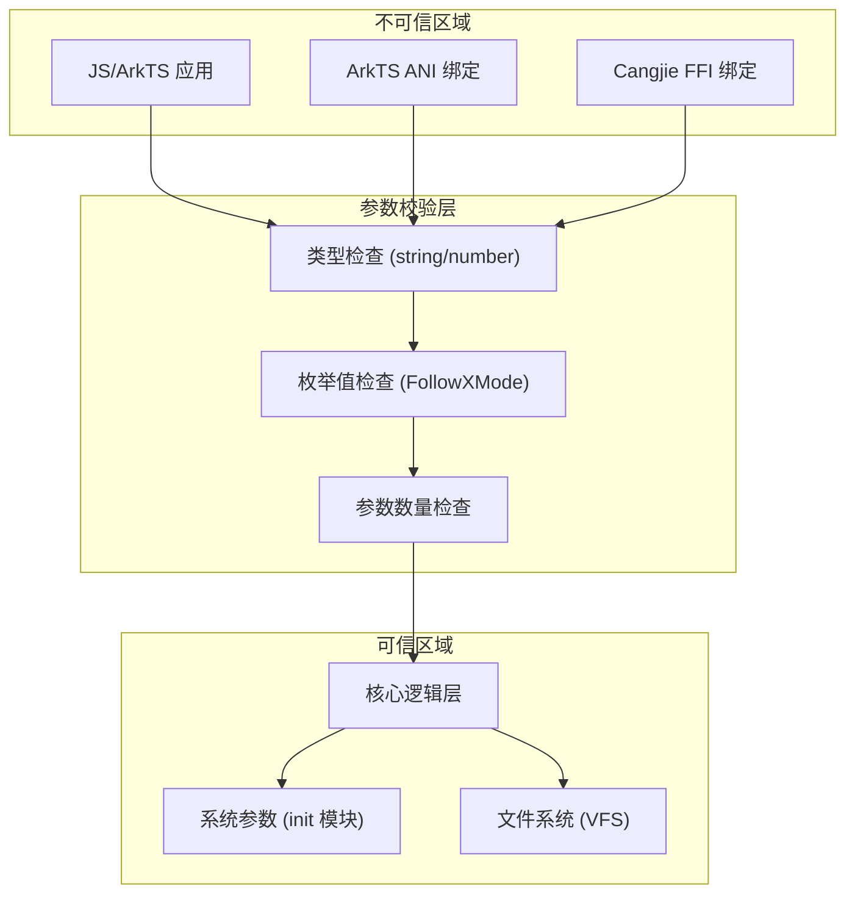

# 攻击面分析

## 文档目的

本文档从安全研究视角分析 config_policy 组件的攻击面，识别所有外部输入入口、敏感操作和信任边界，为安全审计和渗透测试提供参考。

**适用范围**：config_policy 组件的所有代码（包括核心实现、N-API 绑定、ANI 绑定、FFI 绑定）

**未评审范围**：测试代码、模糊测试代码

---

## 攻击面概览

config_policy 组件是一个**只读配置文件查询库**，不暴露 IPC 服务、网络端口或命令行工具。攻击面主要集中在**用户输入参数**和**系统参数读取**。

```
┌─────────────────────────────────────────────────────────────┐
│                      攻击面概览                            │
├─────────────────────────────────────────────────────────────┤
│                                                            │
│  ┌─────────────────────────────────────────────────────┐   │
│  │                外部输入入口                          │   │
│  │  ┌──────────────┐  ┌──────────────┐          │   │
│  │  │ JS N-API     │  │ ANI (ArkTS)│          │   │
│  │  │ relPath      │  │ relPath      │          │   │
│  │  │ followMode    │  │ followMode    │          │   │
│  │  │ extra         │  │ extra         │          │   │
│  │  └──────────────┘  └──────────────┘          │   │
│  │  ┌──────────────┐                               │   │
│  │  │ Cangjie FFI  │                               │   │
│  │  │ relPath      │                               │   │
│  │  │ followMode    │                               │   │
│  │  │ extra         │                               │   │
│  │  └──────────────┘                               │   │
│  └─────────────────────────────────────────────────────┘   │
│                           │                             │
│                           ▼                             │
│  ┌─────────────────────────────────────────────────────┐   │
│  │              参数校验层（N-API）                 │   │
│  │  - 类型检查                                      │   │
│  │  - 范围验证                                      │   │
│  │  - 枚举值检查                                    │   │
│  └─────────────────────────────────────────────────────┘   │
│                           │                             │
│                           ▼                             │
│  ┌─────────────────────────────────────────────────────┐   │
│  │           核心逻辑层（C 实现）                    │   │
│  │  - 路径拼接与验证                              │   │
│  │  - FollowX 规则解析                             │   │
│  │  - 系统参数读取                                  │   │
│  └─────────────────────────────────────────────────────┘   │
│                           │                             │
│                           ▼                             │
│  ┌─────────────────────────────────────────────────────┐   │
│  │          外部依赖（系统调用）                   │   │
│  │  ┌──────────────┐  ┌──────────────┐          │   │
│  │  │ SystemParam  │  │ File System   │          │   │
│  │  │ - CUST_*     │  │ - access()    │          │   │
│  │  │ - follow_x   │  │ - stat()      │          │   │
│  │  └──────────────┘  └──────────────┘          │   │
│  └─────────────────────────────────────────────────────┘   │
└─────────────────────────────────────────────────────────────┘
```

---

## 外部输入清单

### 1. JavaScript N-API 输入

| 输入参数 | 来源 | 数据类型 | 风险等级 | 代码位置 |
|----------|------|---------|----------|---------|
| `relPath` | 上层应用 | string | 高 | `config_policy_napi.cpp:119` |
| `followMode` | 上层应用 | number | 中 | `config_policy_napi.cpp:124` |
| `extra` | 上层应用 | string | 中 | `config_policy_napi.cpp:130` |

**攻击点说明**：

**`relPath` 参数（高风险）**：
- **功能**：指定要查询的配置文件相对路径
- **攻击场景**：路径遍历攻击（`../`）、绝对路径注入、超长路径
- **输入校验**：N-API 层检查类型（string），但未检查内容
- **代码证据**：
  ```cpp
  // config_policy_napi.cpp:119
  napi_value argv[ARGS_SIZE_THREE] = {nullptr};
  napi_get_cb_info(env, info, &argc, argv, &thisVar, &data);
  if (ParseRelPath(env, asyncContext->relPath_, argv[ARR_INDEX_ZERO]) == nullptr) {
      return nullptr;
  }
  ```
  ```cpp
  // config_policy_napi.cpp:464-474
  napi_value ConfigPolicyNapi::ParseRelPath(napi_env env, std::string ¶m, napi_value args)
  {
      bool matchFlag = MatchValueType(env, args, napi_string);
      if (!matchFlag) {
          return ThrowNapiError(env, PARAM_ERROR, "Parameter error. The type of relPath must be string.");
      }
      param = GetStringFromNAPI(env, args);
      napi_value result = nullptr;
      NAPI_CALL(env, napi_create_int32(env, NAPI_RETURN_ONE, &result));
      return result;
  }
  ```

**`followMode` 参数（中风险）**：
- **功能**：指定 FollowX 模式（0/1/10/11/12/100）
- **攻击场景**：枚举值注入、绕过模式限制
- **输入校验**：N-API 层检查枚举值范围
- **代码证据**：
  ```cpp
  // config_policy_napi.cpp:488-520
  napi_value ConfigPolicyNapi::ParseFollowMode(napi_env env, int32_t ¶m, napi_value args, bool hasExtra)
  {
      NAPI_CALL(env, napi_get_value_int32(env, args, ¶m));
      switch (param) {
          case FOLLOWX_MODE_DEFAULT: [[fallthrough]];
          case FOLLOWX_MODE_NO_RULE_FOLLOWED: [[fallthrough]];
          case FOLLOWX_MODE_SIM_DEFAULT: [[fallthrough]];
          case FOLLOWX_MODE_SIM_1: [[fallthrough]];
          case FOLLOWX_MODE_SIM_2: break;
          case FOLLOWX_MODE_USER_DEFINED:
              if (!hasExtra) {
                  return ThrowNapiError(env, PARAM_ERROR, "Parameter error. The followMode is USER_DEFINED, extra must be set.");
              }
              break;
          default:
              return ThrowNapiError(env, PARAM_ERROR, "Parameter error. The value of followMode should be in enumeration value of FollowXMode.");
      }
  }
  ```

**`extra` 参数（中风险）**：
- **功能**：指定 FollowX 模式的额外路径（仅当 followMode=USER_DEFINED 时使用）
- **攻击场景**：路径注入、绕过目录限制
- **输入校验**：N-API 层检查类型（string），但未检查路径格式
- **代码证据**：
  ```cpp
  // config_policy_napi.cpp:476-486
  napi_value ConfigPolicyNapi::ParseExtra(napi_env env, std::string ¶m, napi_value args)
  {
      bool matchFlag = MatchValueType(env, args, napi_string);
      if (!matchFlag) {
          return ThrowNapiError(env, PARAM_ERROR, "Parameter error. The type of extra must be string.");
      }
      param = GetStringFromNAPI(env, args);
      napi_value result = nullptr;
      NAPI_CALL(env, napi_create_int32(env, NAPI_RETURN_ONE, &result));
      return result;
  }
  ```

### 2. ArkTS ANI 输入

ANI（Ark Native Interface）与 N-API 使用相同的底层 C 函数，输入风险相同。

| 输入参数 | 数据类型 | 风险等级 | 代码位置 |
|----------|---------|----------|---------|
| `relPath` | string | 高 | `interfaces/ets/ani/src/config_policy_ani.cpp` |
| `followMode` | number | 中 | `interfaces/ets/ani/src/config_policy_ani.cpp` |
| `extra` | string | 中 | `interfaces/ets/ani/src/config_policy_ani.cpp` |

**代码证据**：`interfaces/ets/ani/src/config_policy_ani.cpp`

### 3. Cangjie FFI 输入

| 输入参数 | 数据类型 | 风险等级 | 代码位置 |
|----------|---------|----------|---------|
| `relPath` | string | 高 | `interfaces/kits/cj/src/config_policy_ffi.cpp` |
| `followMode` | int32 | 中 | `interfaces/kits/cj/src/config_policy_ffi.cpp` |
| `extra` | string | 中 | `interfaces/kits/cj/src/config_policy_ffi.cpp` |

**代码证据**：`interfaces/kits/cj/src/config_policy_ffi.cpp`

---

## 系统参数访问

config_policy 组件从系统参数（SystemParam）读取配置，这些参数由 init 模块管理。

### 系统参数清单

| 参数键 | 用途 | 风险等级 | 读取位置 |
|--------|------|----------|---------|
| `const.cust.config_dir_layer` | 配置层级定义 | 低 | `config_policy_utils.c:400` |
| `const.cust.follow_x_rules` | FollowX 规则配置 | 中 | `config_policy_utils.c:191` |
| `const.channelid.{bundleName}` | Channel ID 用于 customConfig | 低 | `custom_config_napi.cpp:33` |
| `persist.custom.preload.list` | 预加载列表 | 低 | `custom_config_napi.cpp:34` |
| `telephony.sim.opkey0` | SIM 1 运营商密钥 | 低 | `config_policy_utils.c:40` |
| `telephony.sim.opkey1` | SIM 2 运营商密钥 | 低 | `config_policy_utils.c:41` |

**攻击点说明**：

**`const.cust.follow_x_rules` 参数（中风险）**：
- **功能**：存储 FollowX 规则配置
- **攻击场景**：规则注入（通过系统参数）、参数扩展注入
- **输入校验**：无（信任系统参数来源）
- **代码证据**：
  ```c
  // config_policy_utils.c:191-192
  static char *GetFollowXRule(const char *relPath, int *mode)
  {
      char *followRule = CustGetSystemParam(CUST_FOLLOW_X_RULES);
      if (followRule == NULL) {
          return NULL;
      }
  ```

**`const.cust.config_dir_layer` 参数（低风险）**：
- **功能**：定义配置目录层级（用冒号分隔）
- **攻击场景**：层级覆盖、目录注入
- **输入校验**：无（信任系统参数来源）
- **代码证据**：
  ```c
  // config_policy_utils.c:385-406
  static void GetCfgDirRealPolicyValue(CfgDir *res)
  {
      res->realPolicyValue = CustGetSystemParam(CUST_KEY_POLICY_LAYER);
      if (res->realPolicyValue != NULL && res->realPolicyValue[0]) {
          return;
      }
      res->realPolicyValue = strdup(DEFAULT_LAYER);
  }
  ```

---

## 敏感操作清单

### 1. 路径拼接操作

| 操作 | 描述 | 风险等级 | 代码位置 |
|------|------|----------|---------|
| 路径拼接 | 将用户输入路径与配置目录拼接 | 高 | `config_policy_utils.c:463-467`, `config_policy_utils.c:502-510` |
| FollowX 路径构建 | 根据 FollowX 模式和 extra 参数构建路径 | 中 | `config_policy_utils.c:445-468`, `config_policy_utils.c:237-270` |

**攻击场景**：
- **路径遍历**：`relPath` 包含 `../`，拼接后访问上级目录
- **绝对路径注入**：`relPath` 以 `/` 开头，绕过相对路径限制
- **空字节注入**：`relPath` 包含 `\0`，提前终止字符串

**代码证据**：
```c
// config_policy_utils.c:463-467
for (size_t i = MAX_CFG_POLICY_DIRS_CNT; i > 0; i--) {
    if (dirs->paths[i - 1] == NULL) {
        continue;
    }
    // 直接拼接用户输入路径，无规范化检查
    if (snprintf_s(buf, bufLength, bufLength - 1, "%s/%s", dirs->paths[i - 1], pathSuffix) > 0 &&
        access(buf, F_OK) == 0) {
        break;
    }
}
```

### 2. 文件系统访问

| 操作 | 描述 | 风险等级 | 代码位置 |
|------|------|----------|---------|
| `access()` | 检查文件是否存在 | 低 | `config_policy_utils.c:463-467` |

**攻击场景**：
- **TOCTOU（Time-of-Check to Time-of-Use）**：文件在 `access()` 和实际读取之间被替换
- **符号链接攻击**：`access()` 检查的是符号链接，实际访问的是目标文件
- **竞态条件**：多线程同时访问相同文件

**代码证据**：
```c
// config_policy_utils.c:463-467
// 使用 access() 检查文件是否存在，存在 TOCTOU 风险
if (snprintf_s(buf, bufLength, bufLength - 1, "%s/%s", dirs->paths[i - 1], pathSuffix) > 0 &&
    access(buf, F_OK) == 0) {
    break;
}
```

### 3. 内存分配操作

| 操作 | 描述 | 风险等级 | 代码位置 |
|------|------|----------|---------|
| `malloc()` / `calloc()` | 动态分配内存 | 低 | `config_policy_utils.c:110`, `config_policy_utils.c:527`, `config_policy_utils.c:489` |
| `strdup()` | 复制字符串 | 低 | `config_policy_utils.c:231` |

**攻击场景**：
- **拒绝服务**：多次分配导致内存耗尽
- **内存泄漏**：分配后未释放
- **整数溢出**：分配大小计算溢出

**代码证据**：
```c
// config_policy_utils.c:110
value = (char *)calloc(len, sizeof(char));
if (value != NULL && SystemGetParameter(name, value, &len) == 0 && value[0]) {
    return value;
}
```

### 4. 参数扩展操作

| 操作 | 描述 | 风险等级 | 代码位置 |
|------|------|----------|---------|
| `ExpandStr()` | 扩展 FollowX 路径中的 `${key:-default}` 变量 | 中 | `config_policy_utils.c:334-377` |
| `CustGetSystemParam()` | 读取系统参数值 | 低 | `config_policy_utils.c:102-116` |

**攻击场景**：
- **参数注入**：`${key}` 被替换为恶意值
- **命令注入**：参数值包含特殊字符
- **逻辑绕过**：利用默认值机制

**代码证据**：
```c
// config_policy_utils.c:334-377
static char *ExpandStr(char *src, const char *def, QueryFunc queryFunc)
{
    // 查找 ${key} 模式并替换
    char *find = strchr(searchCur, '$');
    if ((varStart = strchr(find, '{')) && (varStart == find + 1) &&
        (varEnd = strchr(find, '}')) && varEnd - varStart > 0) {
        *find = *varEnd = 0;
        char *name = find + 2;
        char *defVal = strstr(name, SEP_FOR_X_VALUE);
        if (defVal) {
            *defVal = 0;
            defVal = TrimInplace(defVal + strlen(SEP_FOR_X_VALUE), false);
        }
        char *value = queryFunc(name);  // 读取系统参数
        if (value || defVal || def) {
            ok = ok && AppendStr(&sh, value ? value : (defVal ? defVal : def));
        }
    }
}
```

---

## 信任边界

### 边界定义

config_policy 组件的信任边界如下：



### 边界说明

| 边界 | 可信程度 | 说明 |
|------|---------|------|
| **不可信区域** | ❌ 不可信 | 用户提供的应用代码，完全不可信 |
| **参数校验层** | ⚠️ 半可信 | N-API 绑定层进行参数验证，但验证不完整 |
| **可信区域** | ✅ 可信 | 核心逻辑、系统参数、文件系统 |

### 安全假设

| 假设 | 可信度 | 说明 |
|------|--------|------|
| 系统参数来源可信 | ⚠️ 部分可信 | 假设 `const.cust.*` 参数由 init 模块安全设置，但未验证 |
| 文件系统可信 | ✅ 可信 | 假设 VFS 正确实现访问控制 |
| 应用调用者不可信 | ❌ 不可信 | 所有用户输入都不可信 |

---

## 攻击路径分析

### 攻击路径 1：路径遍历攻击

**触发路径**：
```
用户输入 "etc/../../system/etc/hosts"
  ↓
N-API 参数校验（仅检查类型）
  ↓
核心逻辑路径拼接："%s/%s", dirPath, relPath
  ↓
访问：/system/etc/hosts（预期外文件）
```

**影响**：读取系统任意配置文件，可能泄露敏感信息

**防护措施**：无（现有代码未进行路径规范化）

**代码证据**：`config_policy_utils.c:463-467`

### 攻击路径 2：FollowX 规则注入

**触发路径**：
```
攻击者通过系统参数设置 CUST_FOLLOW_X_RULES
  ↓
值为：":etc/xml/config.xml,100,etc/../../etc/passwd"
  ↓
解析规则时包含恶意路径
  ↓
访问：/etc/passwd（预期外文件）
```

**影响**：访问预期外的系统文件

**防护措施**：
- FollowX 规则存储在系统参数中，需系统权限修改
- 规则解析在核心逻辑中进行

**代码证据**：`config_policy_utils.c:189-235`

### 攻击路径 3：参数扩展注入

**触发路径**：
```
攻击者设置系统参数：const.channelid.attacker_app = "../../etc/passwd"
  ↓
FollowX 路径包含：${const.channelid.attacker_app:-default}
  ↓
扩展为：../../etc/passwd
  ↓
访问：/etc/passwd（预期外文件）
```

**影响**：通过参数扩展机制访问任意文件

**防护措施**：无（信任系统参数来源）

**代码证据**：`config_policy_utils.c:334-377`

### 攻击路径 4：缓冲区溢出（潜在）

**触发路径**：
```
用户输入超长的 relPath
  ↓
传递 bufLength < MAX_PATH_LEN (256)
  ↓
返回 NULL（拒绝服务）
```

**影响**：拒绝服务（非崩溃），但可能影响应用逻辑

**防护措施**：
- 检查 `bufLength < MAX_PATH_LEN`：`config_policy_utils.c:436`
- 使用 `snprintf_s` 防止溢出

**代码证据**：`config_policy_utils.c:434-438`

---

## 攻击面总结

| 攻击面类型 | 数量 | 最高风险 | 防护状态 |
|-----------|------|---------|---------|
| 用户输入参数 | 3 个 | 路径遍历（高） | ⚠️ 部分防护（类型检查） |
| 系统参数访问 | 6 个 | FollowX 规则注入（中） | ⚠️ 无防护（信任系统参数） |
| 文件系统访问 | 1 个 | TOCTOU（低） | ⚠️ 无防护 |
| 内存操作 | 3 个 | 拒绝服务（低） | ✅ 有防护（NULL 检查） |
| 参数扩展 | 1 个 | 参数注入（中） | ⚠️ 无防护 |

**关键发现**：
1. ✅ **优点**：N-API 层有类型和枚举值检查
2. ❌ **缺点**：未进行路径规范化（如去除 `../`、去除空字节）
3. ❌ **缺点**：未验证 FollowX 规则的安全性
4. ❌ **缺点**：未验证系统参数的来源和权限

---

## 相关文档

- [安全风险评审](./07_Security_Review.md) - 详细的风险分析和修复建议
- [C++ 内部 API](./05_Cpp_Inner_API.md) - 核心函数签名和数据结构
- [N-API 接口文档](./04_N-API_Reference.md) - N-API 接口详细说明
- [工作笔记](./_work/NOTES.md) - 代码证据汇总
