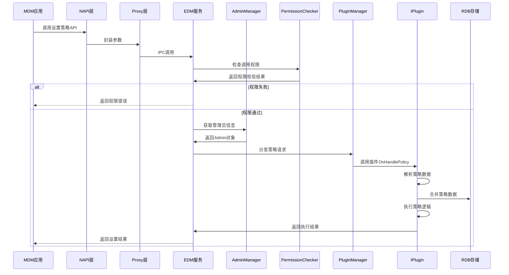
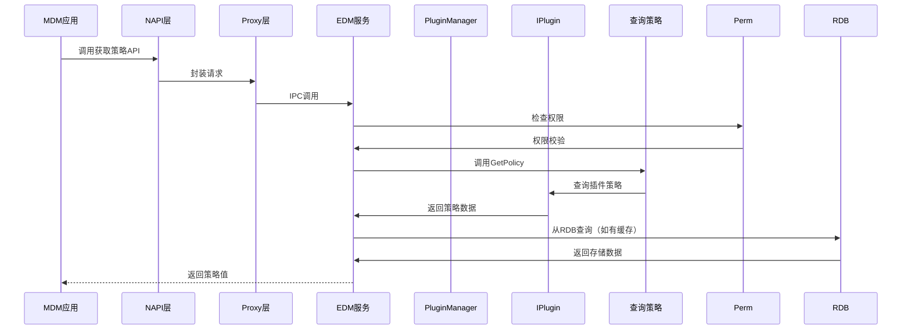
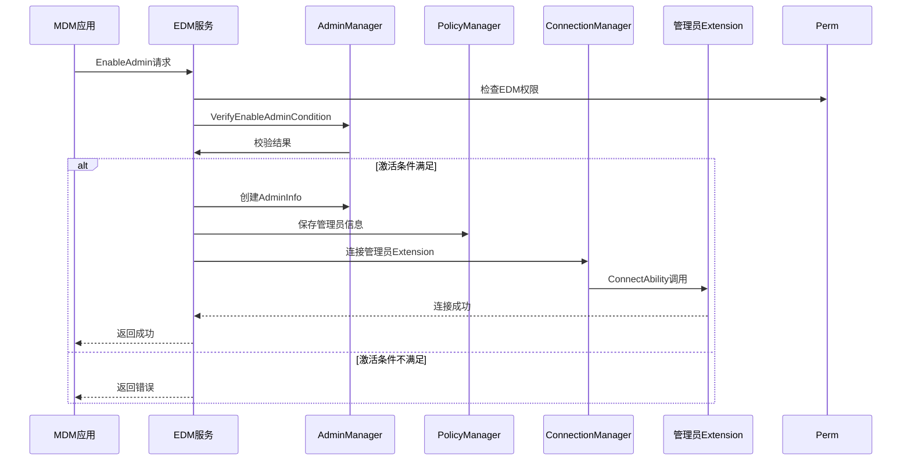
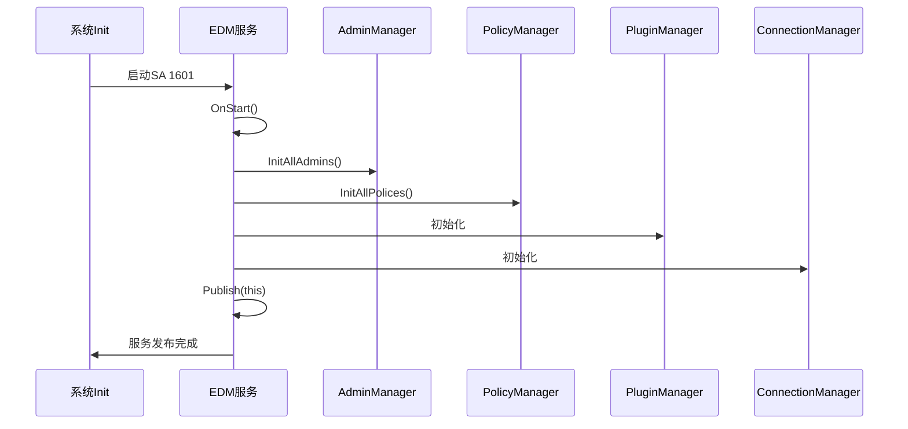
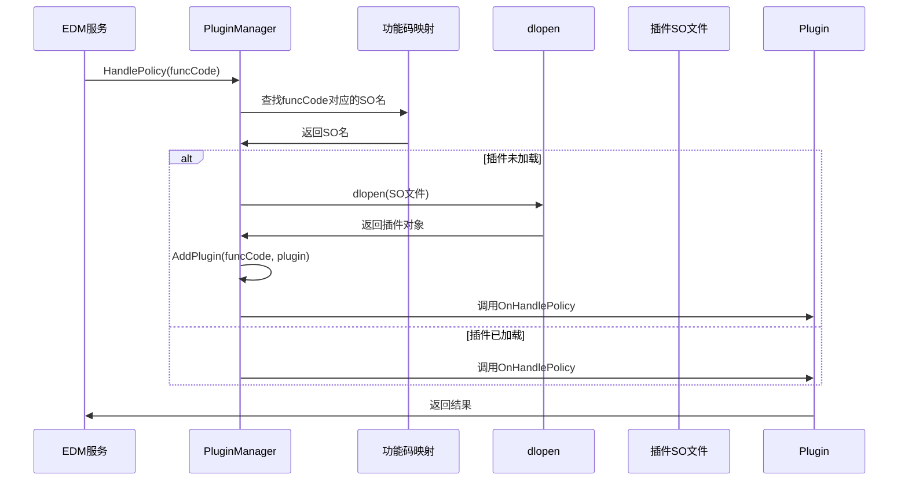
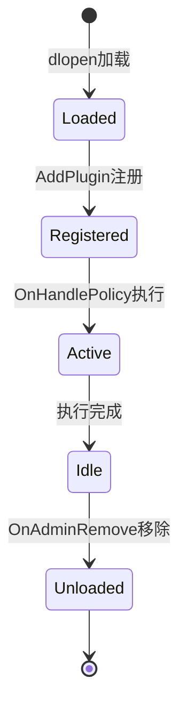

# 架构说明

## 目的

本文档详细说明EDM组件的架构设计、数据流、线程模型和关键时序。

## 适用范围

- 目标读者：架构师、开发者
- 覆盖内容：组件图、数据流、线程模型、时序图
- 不包含：详细实现

## 关键结论

- EDM采用分层插件化架构
- 服务端使用Manager模式管理不同职责
- IPC通信采用OpenHarmony的HDF/Binder机制
- 策略数据持久化到RDB数据库

## 相关跳转

- [02_Directory_Structure.md](02_Directory_Structure.md) - 模块组织
- [05_Internal_API.md](05_Internal_API.md) - 内部接口

---

## 架构层次图

```mermaid
graph TB
    subgraph "应用层"
        MDM应用[MDM应用<br/>JS/TS]
        命令行工具[edm命令行工具]
    end

    subgraph "接口层"
        NAPI[N-API模块<br/>17个Manager]
        ANI[ArkTS原生接口<br/>新一代]
    end

    subgraph "服务层"
        AdminMgr[AdminManager<br/>管理员管理]
        PolicyMgr[PolicyManager<br/>策略管理]
        PluginMgr[PluginManager<br/>插件管理]
        PermChecker[PermissionChecker<br/>权限检查]
        ConnMgr[ConnectionManager<br/>连接管理]
        RDBMgr[RDBDataManager<br/>数据存储]
    end

    subgraph "插件层"
        DeviceCore[device_core_plugin<br/>设备核心]
        CommPlugin[communication_plugin<br/>通信管理]
        SysService[sys_service_plugin<br/>系统服务]
        NeedExtra[need_extra_plugin<br/>额外功能]
    end

    subgraph "系统服务"
        BundleSvc[BundleManager]
        AppMgr[AppManager]
        WiFiSvc[WiFiManager]
        BTSvc[BluetoothManager]
        IAMSvc[用户认证]
        StorageSvc[StorageManager]
    end

    MDM应用 --> NAPI
    命令行工具 --> NAPI
    NAPI --> ANI
    NAPI -.IPC.-> |EnterpriseDeviceMgrAbility|
    ANI -.IPC.-> |EnterpriseDeviceMgrAbility|

    |EnterpriseDeviceMgrAbility| --> AdminMgr
    |EnterpriseDeviceMgrAbility| --> PolicyMgr
    |EnterpriseDeviceMgrAbility| --> PluginMgr
    |EnterpriseDeviceMgrAbility| --> PermChecker
    |EnterpriseDeviceMgrAbility| --> ConnMgr
    |EnterpriseDeviceMgrAbility| --> RDBMgr

    AdminMgr -.查询/保存.-> PolicyMgr
    PluginMgr -.加载/执行.-> DeviceCore
    PluginMgr -.加载/执行.-> CommPlugin
    PluginMgr -.加载/执行.-> SysService
    PluginMgr -.加载/执行.-> NeedExtra

    DeviceCore --> BundleSvc
    CommPlugin --> WiFiSvc
    CommPlugin --> BTSvc
    SysService --> IAMSvc
    SysService --> StorageSvc

    style DeviceCore fill:#e1f5e3
    style CommPlugin fill:#ff9800
    style SysService fill:#ffcd00
    style NeedExtra fill:#ffb6c1
```

---

## 核心组件职责

### 1. EnterpriseDeviceMgrAbility (主服务)

**位置**: `services/edm/src/enterprise_device_mgr_ability.cpp`
**职责**:
- 作为SystemAbility 1601运行
- 生命周期管理（OnStart、OnStop）
- IPC请求分发（OnRemoteRequest）
- 系统服务监听（OnAddSystemAbility）

**关键方法**:
- `OnStart()` - 服务启动，初始化各Manager
- `OnRemoteRequest()` - IPC请求入口
- `HandleDevicePolicy()` - 处理策略设置
- `GetDevicePolicy()` - 处理策略查询
- `EnableAdmin()` - 启用管理员
- `DisableAdmin()` - 禁用管理员

证据：`services/edm/include/enterprise_device_mgr_ability.h:42-60`

### 2. AdminManager (管理员管理)

**位置**: `services/edm/src/admin_manager.cpp`
**职责**:
- 管理管理员生命周期（启用、禁用、授权）
- 管理员类型区分（Super、Normal、BYOD、Virtual）
- 管理员信息存储（RDB）
- 跨用户管理员支持

**关键方法**:
- `EnableAdmin()` - 启用管理员
- `DisableAdmin()` - 禁用管理员
- `GetEnabledAdmin()` - 获取已启用管理员
- `GetSuperAdmin()` - 获取超级管理员
- `AuthorizeAdmin()` - 授权普通管理员
- `IsSuperAdmin()` - 检查是否超级管理员

证据：`services/edm/include/admin_manager.h:32-65`

### 3. PolicyManager (策略管理)

**位置**: `services/edm/src/policy_manager.cpp`
**职责**:
- 策略数据持久化（RDB存储）
- 策略查询和获取
- 多管理员策略合并
- 策略变更通知

**关键方法**:
- `SetPolicy()` - 设置策略
- `GetPolicy()` - 获取策略
- `RemoveAdminPolicy()` - 移除管理员的所有策略
- `MergePolicyData()` - 合并策略数据

证据：`services/edm/include/policy_manager.h:26-75`

### 4. PluginManager (插件管理)

**位置**: `services/edm/src/plugin_manager.cpp`
**职责**:
- 插件动态加载（dlopen）
- 插件查找和注册
- 策略分发到插件
- 扩展插件支持
- 插件生命周期管理

**关键方法**:
- `HandlePolicy()` - 执行策略设置
- `GetPolicy()` - 查询策略
- `LoadPlugin()` - 动态加载插件
- `AddExtensionPlugin()` - 添加扩展插件

证据：`services/edm/include/plugin_manager.h:29-85`

### 5. PermissionChecker (权限检查)

**位置**: `services/edm/src/permission_checker.cpp`
**职责**:
- 调用者权限验证
- UID和BundleName校验
- 系统应用/原生应用检查
- 管理员策略权限验证
- 特定系统服务UID检查

**关键方法**:
- `CheckCallerPermission()` - 检查调用者权限
- `CheckCallingUid()` - 校验调用者UID
- `CheckHandlePolicyPermission()` - 检查策略操作权限
- `VerifyCallingPermission()` - 验证调用权限

证据：`services/edm/include/permission_checker.h:33-77`

---

## 数据流

### 1. 策略设置流程



**关键检查点**：
1. 权限校验：调用者是否有EDM权限
2. 管理员检查：管理员是否存在且已启用
3. 跨账户检查：是否允许跨账户设置策略
4. 策略合并：多个管理员的策略如何合并

### 2. 策略查询流程



### 3. 管理员激活流程



**激活条件**（来自`admin_manager.cpp:1351-1394`）：
- 超级/普通管理员只能在默认用户激活
- 安全模式只能激活超级管理员
- 正式版超级管理员存在时不能激活debug管理员
- 同一应用不能以不同ability名称激活两次

---

## 线程模型

### 服务线程

EDM服务运行在独立进程中，内部使用以下线程模型：

| 组件 | 线程模型 | 说明 |
|--------|----------|------|
| EDM主服务 | 主线程 + 事件分发线程 | SystemAbility的主线程处理IPC |
| PluginManager | 单线程 + 插件执行线程 | 策略执行在同一线程 |
| ConnectionManager | 异步连接 | Ability连接异步进行 |
| RDB操作 | 独立线程 | 数据库操作使用事务 |

### 线程安全

- RDB操作使用事务保证一致性
- AdminManager使用互斥锁保护管理员列表
- PluginManager的插件映射使用线程安全容器

---

## 关键时序

### 1. 系统启动初始化



**初始化顺序**（来自`enterprise_device_mgr_ability.cpp:1080-1103`）：
1. 初始化所有管理员
2. 初始化所有策略
3. 移除调试管理员
4. 发布SystemAbility
5. 初始化水印观察器
6. 注册系统服务监听
7. 检查和更新BYOD设置
8. 注册管理员观察者
9. 初始化AG任务

### 2. 插件动态加载



**插件加载机制**：
- 按需加载（首次访问时）
- 使用dlopen动态加载共享库
- 4个插件库：device_core、communication、sys_service、need_extra
- 每个funcCode映射到特定插件

---

## 信任边界

### 权限边界

```
┌─────────────────────────────────────────┐
│        不可信环境                 │
│  (普通三方应用)                   │
└────────────┬──────────────────────────┘
             │ 权限检查
             ▼
┌─────────────────────────────────────────┐
│        EDM受控环境                 │
│  (MDM应用、EDM服务)             │
└────────────┬──────────────────────────┘
             │ 系统调用
             ▼
┌─────────────────────────────────────────┐
│        系统服务环境                 │
│  (BundleManager、WiFiManager等)     │
└─────────────────────────────────────────┘
```

### 系统UID特权

EDM服务进程UID（EDM_UID = 3057）拥有特殊权限：
- 可以访问所有系统服务
- 可以管理其他应用
- 可以修改系统设置
- 不受应用沙箱限制

---

## 插件扩展机制

### 插件生命周期



### 扩展插件

扩展插件（Extension Plugin）可以增强基础插件：
- 覆盖基础插件的行为（ReplaceExecuteStrategy）
- 增强基础插件（EnhanceExecuteStrategy）
- 支持第三方扩展策略实现

**证据**：`interfaces/inner_api/plugin_kits/include/iplugin.h:89-100`

---

## 相关跳转

- [04_External_API_NAPI.md](04_External_API_NAPI.md) - N-API调用方式
- [05_Internal_API.md](05_Internal_API.md) - 内部接口文档
- [appendix/Callgraphs.md](appendix/Callgraphs.md) - 完整调用链
