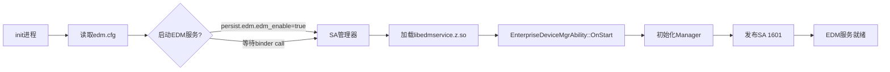
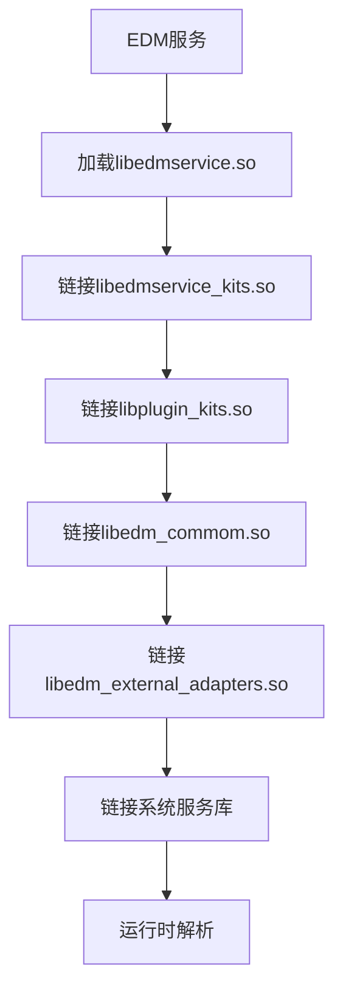

# 编译产物

## 目的

本文档详细说明EDM组件的所有编译产物、安装路径和运行时加载关系。

## 适用范围

- 目标读者：构建工程师、部署工程师
- 覆盖内容：产物清单、安装路径、运行时依赖
- 不包含：详细的符号表

## 关键结论

- EDM产生~30个共享库、4个可执行文件、若干配置文件
- 主要产物按层次安装：/system/lib/、/system/lib/edm_plugin/、/system/lib/module/enterprise/等
- EDM服务作为SystemAbility 1601运行

## 相关跳转

- [06_GN_Targets.md](06_GN_Targets.md) - GN目标和依赖

---

## 产物分类清单

### 1. 共享库（.so）

#### 系统库

| 库名 | Target | 安装路径 | 说明 |
|------|--------|----------|------|
| libedmservice.so | edmservice | `/system/lib/` 或 `/system/lib64/` | EDM主服务（SA 1601） |
| libedmservice_kits.so | edmservice_kits | `/system/lib/` 或 `/system/lib64/` | 内部API库 |
| libplugin_kits.so | plugin_kits | `/system/lib/` 或 `/system/lib64/` | 插件开发套件 |
| libedm_commom.so | edm_commom | `/system/lib/` 或 `/system/lib64/` | 原生工具库 |
| libedm_external_adapters.so | edm_external_adapters | `/system/lib/` 或 `/system/lib64/` | 外部适配器 |
| libenterprise_admin_extension.so | enterprise_admin_extension | `/system/lib/` 或 `/system/lib64/` | Extension框架 |

#### 插件库

| 库名 | Target | 安装路径 | 说明 |
|------|--------|----------|------|
| edm_plugin/libdevice_core_plugin.so | device_core_plugin | `/system/lib/edm_plugin/` | 设备核心插件 |
| edm_plugin/libcommunication_plugin.so | communication_plugin | `/system/lib/edm_plugin/` | 通信管理插件 |
| edm_plugin/libsys_service_plugin.so | sys_service_plugin | `/system/lib/edm_plugin/` | 系统服务插件 |
| edm_plugin/libneed_extra_plugin.so | need_extra_plugin | `/system/lib/edm_plugin/` | 额外功能插件 |

#### N-API模块库

| 库名 | Target | 安装路径 | 说明 |
|------|--------|----------|------|
| libadminmanager.so | adminmanager | `/system/lib/module/enterprise/` | 管理员管理 |
| libaccountmanager.so | accountmanager | `/system/lib/module/enterprise/` | 账户管理 |
| libapplicationmanager.so | applicationmanager | `/system/lib/module/enterprise/` | 应用管理 |
| libbluetoothmanager.so | bluetoothmanager | `/system/lib/module/enterprise/` | 蓝牙管理 |
| libbrowser.so | browser | `/system/lib/module/enterprise/` | 浏览器管理 |
| libbundlemanger.so | bundlemanger | `/system/lib/module/enterprise/` | Bundle管理 |
| libcommon_kits.so | common_kits | `/system/lib/module/enterprise/` | 通用接口 |
| libdatetimemanager.so | datetimemanager | `/system/lib/module/enterprise/` | 日期时间管理 |
| libdevicecontrol.so | devicecontrol | `/system/lib/module/enterprise/` | 设备控制 |
| libdeviceinfo.so | deviceinfo | `/system/lib/module/enterprise/` | 设备信息 |
| libdevicesettings.so | devicesettings | `/system/lib/module/enterprise/` | 设备设置 |
| liblocationmanager.so | locationmanager | `/system/lib/module/enterprise/` | 位置管理 |
| libnetworkmanager.so | networkmanager | `/system/lib/module/enterprise/` | 网络管理 |
| librestrictions.so | restrictions | `/system/lib/module/enterprise/` | 限制策略 |
| libsecuritymanager.so | securitymanager | `/system/lib/module/enterprise/` | 安全管理 |
| libsystemmanager.so | systemmanager | `/system/lib/module/enterprise/` | 系统管理 |
| libtelephonymanager.so | telephonymanager | `/system/lib/module/enterprise/` | 电话管理 |
| libusbmanager.so | usbmanager | `/system/lib/module/enterprise/` | USB管理 |
| libwifimanager.so | wifimanager | `/system/lib/module/enterprise/` | WiFi管理 |

#### ANI接口库（ArkTS Native Interface）

| 库名 | Target | 安装路径 | 说明 |
|------|--------|----------|------|
| libadminManager_ani.so | adminManager_ani | `/system/lib/` | 管理员ANI接口 |
| libnetworkManager_ani.so | networkManager_ani | `/system/lib/` | 网络管理ANI接口 |
| libsecurityManager_ani.so | securityManager_ani | `/system/lib/` | 安全管理ANI接口 |
| librestrictions_ani.so | restrictions_ani | `/system/lib/` | 限制ANI接口 |

证据：`interfaces/ets/ani/BUILD.gn` + `bundle.json:146`

### 2. 可执行文件

| 可执行文件 | Target | 安装路径 | 说明 |
|-----------|--------|----------|------|
| edm | edm | `/system/bin/` | EDM命令行工具 |

证据：`tools/edm/BUILD.gn:28-30`

### 3. ArkTS字节码文件（.abc）

| 文件 | Target | 安装路径 | 说明 |
|------|--------|----------|------|
| adminManager.abc | adminManager | `/system/framework/` | 管理员字节码 |
| networkManager.abc | networkManager | `/system/framework/` | 网络管理字节码 |
| securityManager.abc | securityManager | `/system/framework/` | 安全管理字节码 |
| restrictions.abc | restrictions | `/system/framework/` | 限制字节码 |

证据：`interfaces/ets/ani/BUILD.gn:46-73`

### 4. 配置文件

| 文件 | Target | 安装路径 | 说明 |
|------|--------|----------|------|
| 1601.json | edm_sa_profile | `/system/profile/` | SA 1601配置 |
| edm.cfg | edm.cfg | `/system/etc/init/` | EDM服务启动配置 |
| edm.para | edm.para | `/system/etc/param/` | EDM系统参数 |
| edm.para.dac | edm.para.dac | `/system/etc/param/` | EDM参数权限 |

证据：`sa_profile/BUILD.gn`, `etc/init/BUILD.gn`, `etc/param/BUILD.gn`

---

## 安装路径详解

### /system/lib/ 和 /system/lib64/

**EDM主库**：
```
/system/lib/
├── libedmservice.so              # EDM主服务（SA 1601）
├── libedmservice_kits.so         # 内部API库
├── libplugin_kits.so             # 插件套件
├── libedm_commom.so              # 原生工具
└── libedm_external_adapters.so    # 外部适配器
```

**Extension框架**：
```
/system/lib/
└── libenterprise_admin_extension.so  # EnterpriseAdmin Extension
```

### /system/lib/edm_plugin/

**插件库目录**：
```
/system/lib/edm_plugin/
├── libdevice_core_plugin.so      # 设备核心（~60个策略）
├── libcommunication_plugin.so     # 通信管理（~30个策略）
├── libsys_service_plugin.so       # 系统服务（~30个策略）
└── libneed_extra_plugin.so        # 额外功能（~6个策略）
```

### /system/lib/module/enterprise/

**N-API模块库**：
```
/system/lib/module/enterprise/
├── libadminmanager.so             # @ohos.enterprise.adminManager
├── libaccountmanager.so            # @ohos.enterprise.accountManager
├── libapplicationmanager.so        # @ohos.enterprise.applicationManager
├── libbluetoothmanager.so          # @ohos.enterprise.bluetoothManager
├── libbrowser.so                  # @ohos.enterprise.browser
├── libbundlemanger.so             # @ohos.enterprise.bundleManager
├── libcommon_kits.so              # @ohos.enterprise.commonManager
├── libdatetimemanager.so         # @ohos.enterprise.dateTimeManager
├── libdevicecontrol.so            # @ohos.enterprise.deviceControl
├── libdeviceinfo.so               # @ohos.enterprise.deviceInfo
├── libdevicesettings.so            # @ohos.enterprise.deviceSettings
├── liblocationmanager.so           # @ohos.enterprise.locationManager
├── libnetworkmanager.so            # @ohos.enterprise.networkManager
├── librestrictions.so             # @ohos.enterprise.restrictions
├── libsecuritymanager.so           # @ohos.enterprise.securityManager
├── libsystemmanager.so             # @ohos.enterprise.systemManager
├── libtelephonymanager.so          # @ohos.enterprise.telephonyManager
├── libusbmanager.so               # @ohos.enterprise.usbManager
└── libwifimanager.so               # @ohos.enterprise.wifiManager
```

### /system/framework/

**ArkTS字节码**：
```
/system/framework/
├── adminManager.abc              # 管理员模块
├── networkManager.abc            # 网络管理模块
├── securityManager.abc            # 安全管理模块
└── restrictions.abc             # 限制策略模块
```

### /system/bin/

**可执行文件**：
```
/system/bin/
└── edm                             # EDM命令行工具
```

### /system/profile/、/system/etc/

**配置文件**：
```
/system/profile/
└── 1601.json                    # SA配置：EDM服务ID、进程名、启动参数

/system/etc/init/
└── edm.cfg                        # EDM服务启动配置：进程权限、依赖服务

/system/etc/param/
├── edm.para                      # EDM参数：功能开关
└── edm.para.dac                  # EDM参数权限：读写权限
```

证据：从各BUILD.gn的install路径推导

---

## 运行时加载关系

### 1. EDM服务启动流程



**配置文件**：`etc/init/edm.cfg`
**SA配置**：`sa_profile/1601.json`

证据：`sa_profile/1601.json:5-19`

### 2. N-API模块加载


**证据**：`interfaces/kits/*/src/*_addon.cpp`中的napi_module_register调用

### 3. 插件动态加载


**证据**：`services/edm/src/plugin_manager.cpp`的LoadPluginByFuncCode函数

### 4. 依赖库加载



---

## 关键产物大小

### 存储占用（来自bundle.json）

| 类别 | 占用 | 说明 |
|------|-------|------|
| ROM | 1800KB | 只读存储占用 |
| RAM | 6293KB | 运行时内存占用 |

证据：`bundle.json:54-55`

---

## 相关跳转

- [06_GN_Targets.md](06_GN_Targets.md) - GN目标和编译配置
- [03_Architecture.md](03_Architecture.md) - 运行时架构
