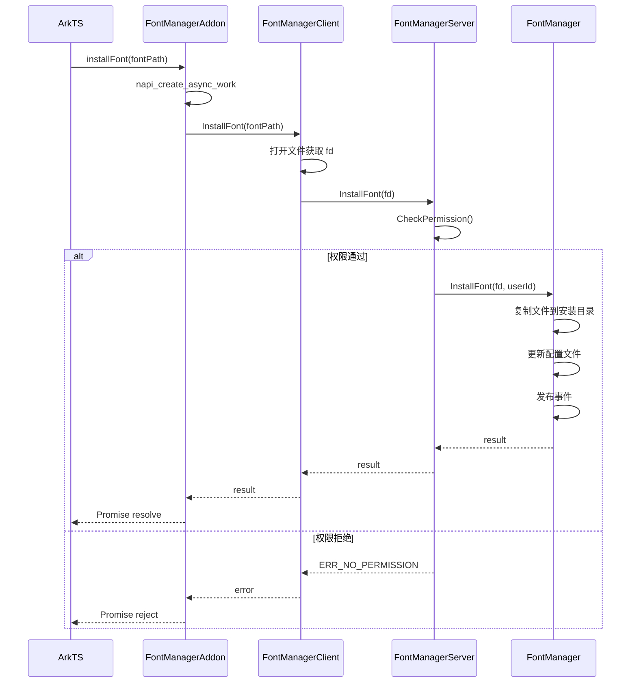

# 架构说明

## 整体架构

font_manager 采用分层架构设计，从上到下依次为：

```
┌─────────────────────────────────────────────────────────────┐
│                      ArkTS 层                               │
│              (interfaces/js/kits/)                          │
│  ┌─────────────────────────────────────────────────────┐   │
│  │  fontmanager.installFont()                         │   │
│  │  fontmanager.uninstallFont()                       │   │
│  │  fontmanager.dataMigration()                       │   │
│  └─────────────────────────────────────────────────────┘   │
└─────────────────────────────────────────────────────────────┘
                              ↓
┌─────────────────────────────────────────────────────────────┐
│                    N-API 层                                 │
│           (interfaces/js/kits/src/)                         │
│  ┌─────────────────────────────────────────────────────┐   │
│  │  FontManagerAddon::InstallFont()                   │   │
│  │  FontManagerAddon::UninstallFont()                 │   │
│  │  FontManagerAddon::DataMigration()                 │   │
│  │  napi_create_async_work + Promise                  │   │
│  └─────────────────────────────────────────────────────┘   │
└─────────────────────────────────────────────────────────────┘
                              ↓
┌─────────────────────────────────────────────────────────────┐
│                    客户端层                                 │
│              (service/client/)                              │
│  ┌─────────────────────────────────────────────────────┐   │
│  │  FontManagerClient::InstallFont()                  │   │
│  │  FontManagerClient::UninstallFont()                │   │
│  │  FontManagerClient::DataMigration()                │   │
│  │  FontServiceLoadManager (SA 加载管理)              │   │
│  └─────────────────────────────────────────────────────┘   │
└─────────────────────────────────────────────────────────────┘
                              ↓
                              IPC (Binder)
                              ↓
┌─────────────────────────────────────────────────────────────┐
│                    服务端层                                 │
│              (service/server/)                              │
│  ┌─────────────────────────────────────────────────────┐   │
│  │  FontManagerServer (SA ID: 66262)                  │   │
│  │  ├── CheckPermission() 权限校验                    │   │
│  │  ├── InstallFontInner() 安装实现                  │   │
│  │  ├── UninstallFontInner() 卸载实现                │   │
│  │  └── DataMigrationInner() 数据迁移               │   │
│  └─────────────────────────────────────────────────────┘   │
└─────────────────────────────────────────────────────────────┘
                              ↓
┌─────────────────────────────────────────────────────────────┐
│                    核心框架层                               │
│              (frameworks/fontmgr/)                          │
│  ┌─────────────────────────────────────────────────────┐   │
│  │  FontManager                                        │   │
│  │  ├── InstallFont() 文件复制、配置更新              │   │
│  │  └── UninstallFont() 文件删除、配置更新            │   │
│  │                                                     │   │
│  │  FontConfig                                         │   │
│  │  ├── 字体配置文件管理 (install_fontconfig.json)    │   │
│  │  └── 字体记录增删改查                             │   │
│  │                                                     │   │
│  │  DataMigrationManager                               │   │
│  │  └── 跨设备数据迁移                               │   │
│  │                                                     │   │
│  │  FontEventPublish                                   │   │
│  │  └── 字体事件发布 (Common Event)                  │   │
│  └─────────────────────────────────────────────────────┘   │
└─────────────────────────────────────────────────────────────┘
```

## 组件职责

| 组件 | 位置 | 职责 |
|------|------|------|
| FontManagerAddon | interfaces/js/kits | N-API 胶水层，JS → C++ 转换 |
| FontManagerClient | service/client | IPC 客户端代理，SA 加载管理 |
| FontManagerServer | service/server | SA 实现，权限校验，任务调度 |
| FontManager | frameworks/fontmgr | 字体安装卸载核心逻辑 |
| FontConfig | frameworks/fontmgr | 字体配置 JSON 文件管理 |
| DataMigrationManager | frameworks/fontmgr | 数据迁移逻辑 |

## 数据流

### 安装字体流程

```
1. JS 调用 fontmanager.installFont(path)
2. N-API 创建 Promise，调用 InstallFont()
3. FontManagerAddon 解析路径参数
4. FontManagerClient 打开文件获取 fd
5. 通过 IPC 调用 FontManagerServer
6. FontManagerServer.CheckPermission() 校验权限
7. FontManagerServer.InstallFontInner() 启动
8. FontManager.InstallFont(fd, userId) 执行安装
   8.1 复制字体文件到 /data/service/el1/{userId}/for-all-app/fonts/
   8.2 更新 install_fontconfig.json
   8.3 发布 FontEventPublish 事件
9. 返回结果 Promise resolve/reject
```

### 调用时序图



## 线程模型

| 组件 | 线程模型 |
|------|----------|
| N-API | ArkTS 线程，通过 `napi_queue_async_work_with_qos` 异步执行 |
| FontManagerClient | 调用线程，可能阻塞等待 IPC |
| FontManagerServer | SystemAbility 线程池，独立运行 |
| FontManager | 服务端线程执行 |
| 事件发布 | 通过 CommonEventService 异步发布 |

### 关键线程控制

```cpp
// service/server/src/font_manager_server.cpp:163-183
void FontManagerServer::AddUnloadFontServiceTask()
{
    // SA 空闲 10 秒后自动卸载
    auto task = [this]() {
        // UnloadFontService(FONT_SA_ID)
    };
    handler_->PostTask(task, UNLOAD_TASK, DELAY_MILLISECONDS_FOR_UNLOAD_SA);
}
```

## 依赖关系

```
fontmanager (N-API)
    └── font_manager_client
            ├── fontmgr (core)
            │   ├── font_config
            │   ├── font_manager_utils
            │   ├── font_event_publish
            │   ├── hisysevent_adapter
            │   └── data_migration_manager
            ├── ipc (IPC/Binder)
            ├── samgr (SA 框架)
            └── hilog (日志)

font_manager_server (SA)
    ├── font_manager_client
    │   └── fontmgr (同上)
    ├── safwk (SystemAbility 框架)
    ├── access_token (权限校验)
    └── 其他...
```

## 相关文档

- [项目概览](00_Overview.md)
- [N-API 参考](02_NAPI_Reference.md)
- [内部 API](03_Inner_API.md)
