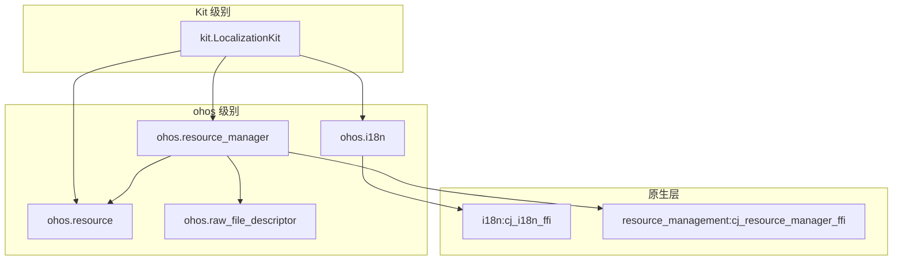

# 项目概览

> global_cangjie_wrapper 项目定位、核心能力、运行环境与关键概念

## 项目定位

**global_cangjie_wrapper** 是 OpenHarmony Globalization 子系统的 Cangjie API 封装层，为 Cangjie 应用提供国际化 (i18n) 和资源管理能力。

### 核心职责

| 能力 | 描述 | 代码位置 |
|------|------|----------|
| **日历管理** | 获取/设置日历属性（时间、时区等） | `ohos/i18n/calendar.cj` |
| **资源获取** | 应用资源获取（字符串、颜色、媒体等） | `ohos/resource_manager/resource_manager.cj` |
| **系统配置** | 获取应用首选语言 | `ohos/i18n/system.cj` |

### 目标设备

- ✅ **标准设备** (Standard Devices)
- ❌ 非标准设备（当前不支持）

> 证据: `bundle.json:42-44` - `adapted_system_type: ["standard"]`

## 目录结构

```
base/global/global_cangjie_wrapper/
├── figures/                     # 架构图
├── kit/                         # Kit 级别接口
│   └── LocalizationKit/         # LocalizationKit 聚合模块
│       ├── index.cj             # 模块入口
│       └── BUILD.gn
├── ohos/                        # Cangjie Global 代码
│   ├── BUILD.gn                # 包组定义
│   ├── i18n/                   # 国际化模块
│   │   ├── calendar.cj         # Calendar 接口
│   │   ├── system.cj           # System 接口
│   │   └── i18n_common.cj      # 公共类型
│   ├── resource_manager/       # 资源管理模块
│   │   ├── resource_manager.cj # ResourceManager 主类
│   │   ├── resource_manager_ffi.cj  # FFI 绑定
│   │   ├── resource_manager_common.cj
│   │   └── resource_manager_errors.cj
│   ├── resource/               # 资源模块
│   │   ├── app_resource.cj     # AppResource 类
│   │   └── resource_common.cj  # 公共类型
│   └── raw_file_descriptor/    # 文件描述符模块
│       └── raw_file_descriptor.cj
└── test/                       # 测试用例（不作为业务证据）
```

## 关键概念

### Cangjie FFI 架构

global_cangjie_wrapper 采用 **Foreign Function Interface (FFI)** 模式与原生代码交互：

```
Cangjie 应用层
    │
    ▼ (foreign 声明)
C++ 胶水层 (cj_i18n_ffi, cj_resource_manager_ffi)
    │
    ▼
原生服务层 (i18n, resource_management)
```

**证据**: `ohos/i18n/calendar.cj:24-58` - `foreign { func FfiOHOSGetCalendar... }`

### 模块聚合

`LocalizationKit` 是面向开发者的统一入口：

```cangjie
// kit/LocalizationKit/index.cj:20-22
public import ohos.i18n.*
public import ohos.resource.*
public import ohos.resource_manager.*
```

### API Level 注解

所有公开 API 使用 `@!APILevel` 注解：

```cangjie
@!APILevel[
    since: "22",
    syscap: "SystemCapability.Global.I18n"
]
public class Calendar <: RemoteDataLite { ... }
```

**证据**: `ohos/i18n/calendar.cj:L99`

## 运行环境

### 系统依赖

| 依赖组件 | 用途 | 来源 |
|----------|------|------|
| `cangjie_ark_interop` | FFI 绑定、业务异常 | arkcompiler |
| `hiviewdfx_cangjie_wrapper` | 日志 (HiLog) | hiviewdfx |
| `arkui_cangjie_wrapper` | ArkUI 基础类型 | arkui |
| `i18n:cj_i18n_ffi` | 原生日历 FFI | global_i18n |
| `resource_management:cj_resource_manager_ffi` | 原生资源管理 FFI | global_resource_management |

### 性能指标

| 指标 | 值 | 来源 |
|------|------|------|
| ROM | 400KB | `bundle.json:46` |
| RAM | 408KB | `bundle.json:47` |

### SysCap 要求

```json
{
  "syscap": ["SystemCapability.Global.I18n"]
}
```

> 证据: API 注解中指定，见 `ohos/i18n/calendar.cj`

## 能力边界

### 已提供能力

| 能力 | 描述 | 状态 |
|------|------|------|
| 日历操作 | 获取/设置时间、时区、首日等 | ✅ Beta |
| 资源获取 | 字符串、颜色、媒体、原始文件 | ✅ Beta |
| 系统配置 | 获取应用首选语言 | ✅ Beta |
| 资源描述符 | RawFileDescriptor 操作 | ✅ Beta |

### 暂未提供能力

| 能力 | 原因 |
|------|------|
| 日期/数字格式化 | 待开发 |
| 区域管理 | 待开发 |
| 电话号码处理 | 待开发 |
| 文本处理 | 待开发 |
| 时区/假期管理 | 待开发 |
| 跨线程资源传递 | 待开发 |

> 证据: `README.md:80-84`

## 模块依赖关系



## 版本信息

| 属性 | 值 |
|------|-----|
| 包名 | `@ohos/global_cangjie_wrapper` |
| 版本 | 6.1 |
| 子系统 | global |
| 组件 | global_cangjie_wrapper |
| License | Apache License 2.0 |

## 相关文档

- [架构设计](./02_Architecture.md)
- [API 参考](./03_NAPI_Reference.md)
- [构建系统](./05_Build_System.md)
- [安全评审](./07_Security_Review.md)
