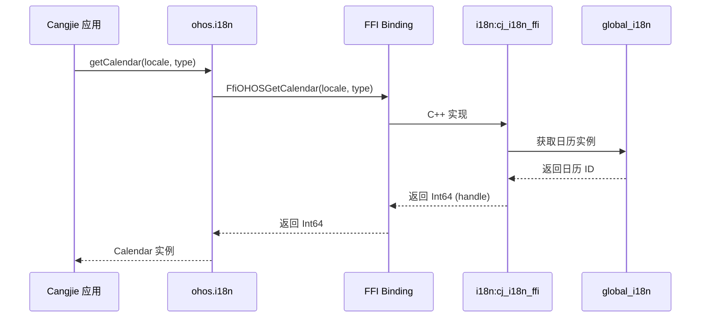
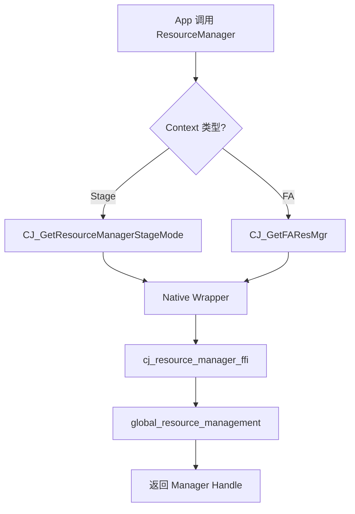
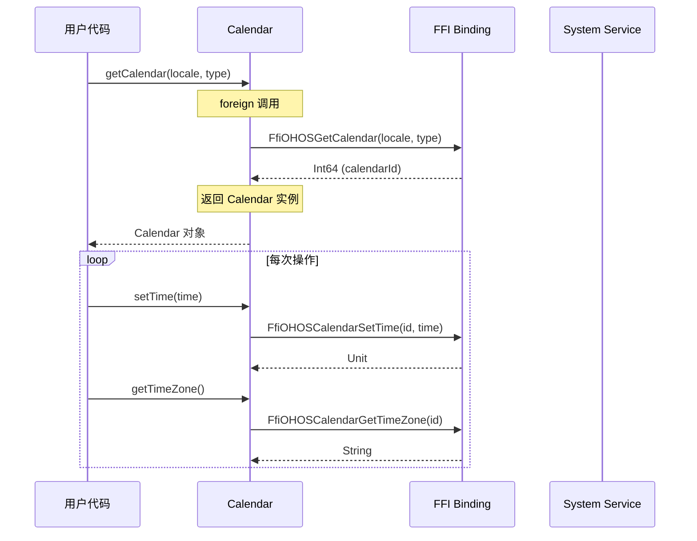

# 架构设计

> global_cangjie_wrapper 组件图、数据流、线程模型与关键时序

## 整体架构

### 架构图

```
┌─────────────────────────────────────────────────────────────────────────────┐
│                         Cangjie Application Layer                           │
│                                                                             │
│  import { Calendar, System, ResourceManager, AppResource } from            │
│    '@ohos/global_cangjie_wrapper'                                          │
└─────────────────────────────────────────────────────────────────────────────┘
                                      │
                                      ▼
┌─────────────────────────────────────────────────────────────────────────────┐
│                       kit/LocalizationKit (入口聚合)                         │
│                                                                             │
│  kit/LocalizationKit/index.cj                                               │
│  ├── public import ohos.i18n.*          (日历 + 系统配置)                  │
│  ├── public import ohos.resource.*      (应用资源)                         │
│  └── public import ohos.resource_manager.* (资源管理器)                    │
└─────────────────────────────────────────────────────────────────────────────┘
                    │                    │                    │
                    ▼                    ▼                    ▼
┌────────────────────────┐  ┌────────────────────────┐  ┌────────────────────────┐
│    ohos/i18n           │  │   ohos/resource        │  │  ohos/resource_manager  │
│                        │  │                        │  │                        │
│  ┌──────────────────┐  │  │  ┌──────────────────┐ │  │  ┌──────────────────┐  │
│  │ Calendar         │  │  │  │ AppResource       │ │  │  │ ResourceManager   │  │
│  │  - setTime()     │  │  │  │  - bundleName    │ │  │  │  - getString()    │  │
│  │  - setTimeZone() │  │  │  │  - moduleName     │ │  │  │  - getColor()     │  │
│  │  - getTimeZone() │  │  │  │  - id            │ │  │  │  - getMedia()     │  │
│  └──────────────────┘  │  │  │  - params        │ │  │  │  - getRawFd()     │  │
│  ┌──────────────────┐  │  │  └──────────────────┘ │  │  └──────────────────┘  │
│  │ System           │  │  │                      │  │  ┌──────────────────┐  │
│  │  - getAppPref... │  │  └──────────────────────┘  │  │ RawFileDescriptor│  │
│  └──────────────────┘  │                          │  │  │  - fd           │  │
│                        │                          │  │  │  - offset       │  │
│  foreign {             │                          │  │  │  - length       │  │
│    FfiOHOSGetCalendar  │                          │  │  └──────────────────┘  │
│    ...                 │                          │  │                        │
│  }                     │                          │  └────────────────────────┘
└────────────────────────┘                          │
         │                                          │
         ▼                                          ▼
┌─────────────────────────────────────────────────────────────────────────────┐
│                           FFI Binding Layer                                 │
│                                                                             │
│  ohos/i18n/calendar.cj         ohos/resource_manager/resource_manager_ffi.cj│
│  ─────────────────────        ─────────────────────────────────────────────│
│  foreign {                     foreign {                                    │
│    FfiOHOSGetCalendar()          CJ_GetResourceManagerStageMode()          │
│    FfiOHOSCalendarSetTime()      CJ_GetSystemResMgr()                       │
│    ...                           CJ_GetColor()                              │
│  }                              ...                                         │
└─────────────────────────────────────────────────────────────────────────────┘
         │                                          │
         ▼                                          ▼
┌─────────────────────────────────────────────────────────────────────────────┐
│                          Native Wrapper Layer                               │
│                                                                             │
│  i18n:cj_i18n_ffi              resource_management:cj_resource_manager_ffi │
│  (C++ 胶水层)                   (C++ 胶水层)                                 │
└─────────────────────────────────────────────────────────────────────────────┘
         │                                          │
         └────────────────────────┬─────────────────┘
                                  ▼
┌─────────────────────────────────────────────────────────────────────────────┐
│                          Core Service Layer                                 │
│                                                                             │
│  global_i18n                      global_resource_management               │
│  (日历服务)                       (资源管理服务)                            │
└─────────────────────────────────────────────────────────────────────────────┘
```

### 架构说明

| 层级 | 职责 | 示例 |
|------|------|------|
| **应用层** | Cangjie 应用调用 | `Calendar.getTimeZone()` |
| **Kit 聚合层** | 统一导出 | `kit/LocalizationKit/index.cj` |
| **模块层** | 业务逻辑封装 | `Calendar`, `ResourceManager` |
| **FFI 绑定层** | 声明外部函数 | `foreign { FfiOHOS* }` |
| **Native 封装层** | C++ 胶水代码 | `cj_i18n_ffi`, `cj_resource_manager_ffi` |
| **核心服务层** | 实际功能实现 | `global_i18n`, `global_resource_management` |

## 数据流

### 典型调用链：获取日历



### 资源获取流程



## 线程模型

### 线程假设

> **证据范围说明**: 当前代码分析未发现明确的线程模型文档。以下为基于代码结构的推断。

| 操作 | 可能线程 | 依据 |
|------|----------|------|
| FFI 调用 | 主线程/FFI 线程 | Cangjie 运行时调度 |
| Native 服务 | 独立线程池 | 系统服务通用模式 |
| 回调返回 | 主线程 | UI 线程安全要求 |

### 资源对象跨线程限制

```
⚠️  注意: 资源对象不支持跨线程传递

证据: README.md:83-84 - "Cross-thread transmission of resource objects."
```

## 模块边界

### 模块职责

| 模块 | 职责 | 稳定性 | 可替换点 |
|------|------|--------|----------|
| `ohos.i18n` | 日历和系统配置 | Beta | FFI 绑定 |
| `ohos.resource_manager` | 资源获取管理 | Beta | Native 服务 |
| `ohos.resource` | 应用资源封装 | Beta | 前端集成 |
| `ohos.raw_file_descriptor` | 文件描述符 | Beta | 无 |

### 依赖方向（无环）

```
kit.LocalizationKit
    ├──► ohos.i18n ──► external: i18n:cj_i18n_ffi
    ├──► ohos.resource ──► external: ace_engine:cj_frontend_ohos
    └──► ohos.resource_manager
            ├──► ohos.resource
            └──► ohos.raw_file_descriptor
```

## 关键时序图

### Calendar 创建与使用



## 接口稳定性标注

| 接口类型 | 位置 | 稳定性 | 依据 |
|----------|------|--------|------|
| `Calendar` | `ohos/i18n/calendar.cj:99` | Beta | `@!APILevel(since: "22")` |
| `System` | `ohos/i18n/system.cj:33` | Beta | `@!APILevel(since: "22")` |
| `ResourceManager` | `ohos/resource_manager/resource_manager.cj:35` | Beta | `@!APILevel` |
| `AppResource` | `ohos/resource/app_resource.cj:31` | Beta | `@!APILevel` |

## 相关文档

- [API 参考](./03_NAPI_Reference.md)
- [构建系统](./05_Build_System.md)
- [安全评审](./07_Security_Review.md)
