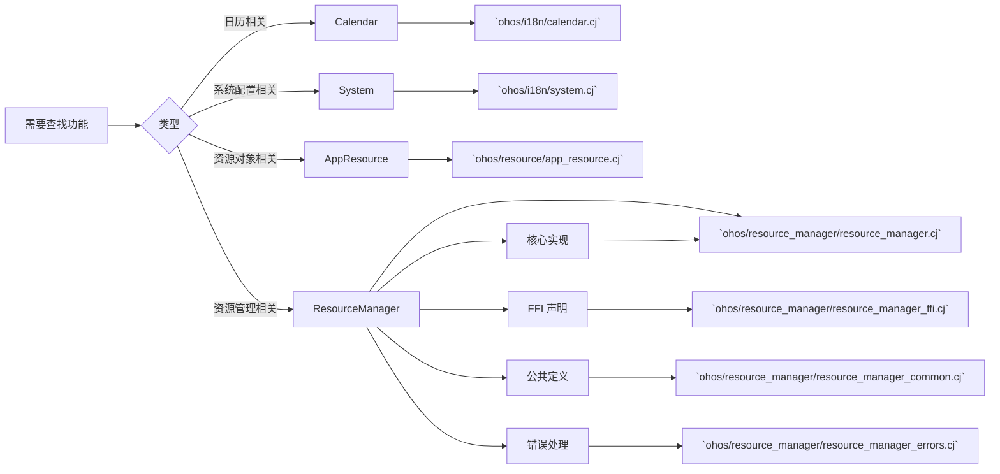
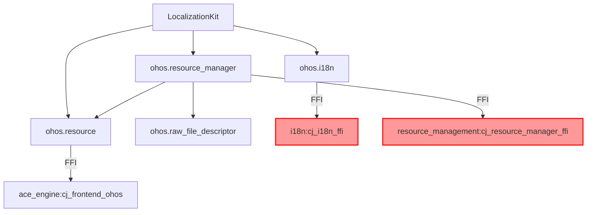

# 目录结构与代码地图

**目的**: 帮助开发者快速定位核心代码位置，理解项目组织结构

**适用范围**: `base/global/global_cangjie_wrapper` 非测试代码

---

## 顶层目录职责说明

| 目录 | 职责 | 主要内容 |
|------|------|----------|
| `figures/` | 架构图资源 | `global_cangjie_wrapper_architecture.png/en.png` |
| `kit/` | Kit 级别聚合入口 | `LocalizationKit/index.cj` - 统一导出所有公开 API |
| `ohos/` | 核心实现 | 所有 Cangjie API 实现（4 个子模块） |
| `test/` | 测试用例 | i18n 和 ResourceManager 测试工程 |
| `mock/` | 模拟实现 | 用于测试的 Mock 实现 |
| `wiki/` | 项目文档 | Wiki 文档（本目录） |

**排除目录**（不作为业务证据）:
- `test/` - 测试代码
- `mock/` - 模拟实现

---

## ohos/ 子目录详解

### ohos/i18n/ - 国际化模块

| 文件 | 行数 | 说明 |
|------|------|------|
| `calendar.cj` | 341 | Calendar 日历类实现，包含 12+ 个公开方法 |
| `system.cj` | 55 | System 系统配置类，提供 `getAppPreferredLanguage()` |
| `i18n_common.cj` | 200 | 公共定义：`CalendarType` 枚举、`CDate` 结构体、错误码 |

### ohos/resource_manager/ - 资源管理模块

| 文件 | 行数 | 说明 |
|------|------|------|
| `resource_manager.cj` | 695 | ResourceManager 主类，30+ 个公开方法，线程安全的单例实现 |
| `resource_manager_ffi.cj` | 100+ | FFI 外部函数声明（40+ 个 C 层接口） |
| `resource_manager_common.cj` | 553 | 公共定义：`Configuration`、`DeviceCapability`、枚举类型、`formatString()` |
| `resource_manager_errors.cj` | 63 | 错误处理：错误码定义、`getErrorMsg()`、异常抛出 |

### ohos/resource/ - 资源封装模块

| 文件 | 行数 | 说明 |
|------|------|------|
| `resource_common.cj` | 226 | 资源通用逻辑：`__GenerateResource__()`、`getResourceString()` 等 FFI 调用 |
| `app_resource.cj` | - | `AppResource` 类定义（TODO: 需读取验证） |

### ohos/raw_file_descriptor/ - 原始文件描述符模块

| 文件 | 行数 | 说明 |
|------|------|------|
| `raw_file_descriptor.cj` | - | `RawFileDescriptor` 类定义（TODO: 需读取验证） |

---

## kit/ 目录

### kit/LocalizationKit/ - Kit 聚合入口

| 文件 | 说明 |
|------|------|
| `index.cj` | 统一导出所有公开 API，应用开发者通过 `import kit.LocalizationKit` 使用所有功能 |

```cangjie
public import ohos.i18n.*
public import ohos.resource.*
public import ohos.resource_manager.*
```

---

## 核心文件定位

### 入口点

| 功能 | 文件路径 | 说明 |
|------|----------|------|
| Kit 入口 | `kit/LocalizationKit/index.cj` | 唯一对外的 Kit 入口 |
| Calendar 工厂 | `ohos/i18n/calendar.cj:77` | `getCalendar()` 函数 |
| ResourceManager 工厂 | `ohos/resource_manager/resource_manager.cj:48` | `getResourceManager()` 静态方法 |

### 核心类定义

| 类 | 文件路径 | 行号 | 说明 |
|----|----------|------|------|
| `Calendar` | `ohos/i18n/calendar.cj` | 99-340 | 继承 `RemoteDataLite`，提供日历操作 |
| `System` | `ohos/i18n/system.cj` | 33-54 | 提供 `getAppPreferredLanguage()` |
| `ResourceManager` | `ohos/resource_manager/resource_manager.cj` | 35-695 | 继承 `RemoteDataLite`，管理应用资源 |
| `Configuration` | `ohos/resource_manager/resource_manager_common.cj` | 34-113 | 设备配置（方向、locale、设备类型等） |
| `DeviceCapability` | `ohos/resource_manager/resource_manager_common.cj` | 122-147 | 设备能力（屏幕密度、设备类型） |
| `AppResource` | `ohos/resource/app_resource.cj` | - | 资源对象封装 |

### FFI 接口定义

| FFI 块 | 文件路径 | 行号范围 |
|----------|----------|----------|
| Calendar FFI | `ohos/i18n/calendar.cj` | 24-58 |
| System FFI | `ohos/i18n/system.cj` | 22-24 |
| ResourceManager FFI | `ohos/resource_manager/resource_manager_ffi.cj` | 24-100 |
| Resource FFI | `ohos/resource/resource_common.cj` | 62-84 |

### 错误处理

| 文件 | 职责 |
|------|------|
| `ohos/resource_manager/resource_manager_errors.cj` | 定义所有错误码（9001001-9001010, 401）和错误处理函数 |

### 公共定义

| 文件 | 职责 |
|------|------|
| `ohos/i18n/i18n_common.cj` | `CalendarType` 枚举、`CDate` 结构体、错误码 |
| `ohos/resource_manager/resource_manager_common.cj` | `Configuration`、`DeviceCapability`、枚举（`ColorMode`、`ScreenDensity`、`DeviceType`、`Direction`、`NumberValueType`、`ArgsValueType`） |

---

## 代码导航图

### 按功能查找



### 按模块查找

| 想要查找 | 跳转到 |
|----------|--------|
| 如何创建 Calendar 对象？ | `ohos/i18n/calendar.cj:77` |
| 如何获取 ResourceManager 实例？ | `ohos/resource_manager/resource_manager.cj:48` |
| 如何获取应用首选语言？ | `ohos/i18n/system.cj:45` |
| 如何获取字符串资源？ | `ohos/resource_manager/resource_manager.cj:565` |
| 如何获取颜色资源？ | `ohos/resource_manager/resource_manager.cj:186` |
| FFI 函数在哪里定义？ | 对应模块的 `*_ffi.cj` 文件 |
| 错误码含义？ | `ohos/resource_manager/resource_manager_errors.cj:41-54` |

---

## 关键代码片段定位

### ResourceManager 线程安全

```cangjie
// 位置: ohos/resource_manager/resource_manager.cj:36-37
private static let RES_MGR_MAP = HashMap<UIntNative, ResourceManager>()
private static let APP_MUTEX = Mutex()
```

### Calendar FFI 调用示例

```cangjie
// 位置: ohos/i18n/calendar.cj:87
id = unsafe { FfiOHOSGetCalendar(cLocale.value, cCalendarType.value) }
```

### 字符串格式化函数

```cangjie
// 位置: ohos/resource_manager/resource_manager_common.cj:496-541
func formatString(str: String, args: Array<ArgsValueType>) { ... }
```

---

## 模块依赖关系



---

## 编译产物对应关系

| 源文件 | 构建目标 | 产物 |
|----------|----------|------|
| `ohos/i18n/*.cj` | `ohos.i18n` | `libohos.i18n.so` |
| `ohos/resource_manager/*.cj` | `ohos.resource_manager` | `libohos.resource_manager.so` |
| `ohos/resource/*.cj` | `ohos.resource` | `libohos.resource.so` |
| `ohos/raw_file_descriptor/*.cj` | `ohos.raw_file_descriptor` | `libohos.raw_file_descriptor.so` |
| `kit/LocalizationKit/*.cj` | `kit.LocalizationKit` | `libkit.LocalizationKit.so` |

---

**相关文档**:
- [01_Overview](01_Overview.md) - 项目定位
- [02_Architecture](02_Architecture.md) - 架构设计
- [04_Interface](04_Interface.md) - 对外接口参考
