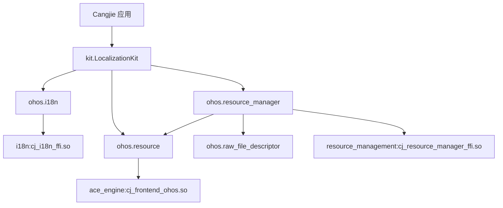
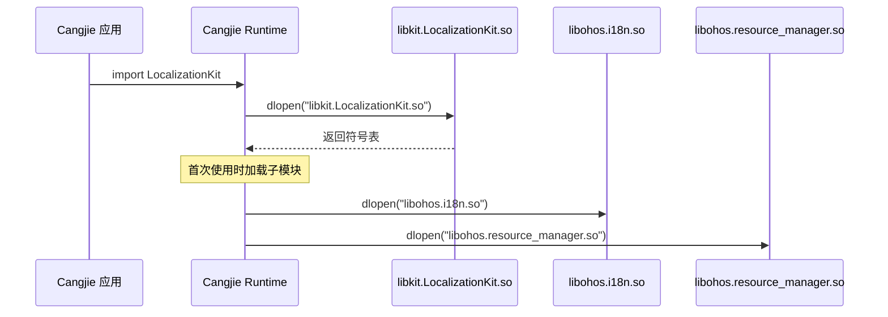

# 编译产物

> global_cangjie_wrapper .so 文件、安装路径、运行时加载关系

## 产物清单

### 共享库产物

| Target | 输出文件 | 大小 (估计) | 说明 |
|--------|----------|-------------|------|
| `ohos.i18n` | `libohos.i18n.so` | ~100KB | 日历和系统配置 |
| `ohos.resource_manager` | `libohos.resource_manager.so` | ~150KB | 资源管理 |
| `ohos.resource` | `libohos.resource.so` | ~80KB | 应用资源 |
| `ohos.raw_file_descriptor` | `libohos.raw_file_descriptor.so` | ~20KB | 文件描述符 |
| `kit.LocalizationKit` | `libkit.LocalizationKit.so` | ~50KB | Kit 聚合 |

### SDK 复制产物

| Target | 用途 |
|--------|------|
| `copy_sdk_global_cangjie_libs` | 复制 ohos SDK 库 |
| `copy_sdk_global_cangjie_libs_kit` | 复制 kit SDK 库 |

## 安装路径

### 系统安装路径

```
/system/lib/module/
├── libohos.i18n.so
├── libohos.resource_manager.so
├── libohos.resource.so
└── libohos.raw_file_descriptor.so

/system/lib/module/kit/
└── libkit.LocalizationKit.so
```

### SDK 输出路径

```
out/sdk/
├── libs/
│   ├── libohos.i18n.so
│   ├── libohos.resource_manager.so
│   ├── libohos.resource.so
│   ├── libohos.raw_file_descriptor.so
│   └── libkit.LocalizationKit.so
└── headers/
    └── (如适用)
```

## 运行时加载关系

### 模块加载依赖链



### 运行时库依赖

| 库 | 依赖 | 说明 |
|----|------|------|
| `libohos.i18n.so` | `libcj_i18n_ffi.so` | 原生日历 FFI |
| `libohos.resource_manager.so` | `libcj_resource_manager_ffi.so` | 原生资源管理 FFI |
| `libohos.resource.so` | `libcj_frontend_ohos.so` | ArkUI 前端集成 |
| `libkit.LocalizationKit.so` | `libohos.*.so` | 无独立依赖，仅聚合 |

### 加载顺序



## 符号导出

### kit.LocalizationKit 导出

> 位置: `kit/LocalizationKit/index.cj`

```cangjie
public import ohos.i18n.*
public import ohos.resource.*
public import ohos.resource_manager.*
```

### 主要导出符号

| 模块 | 导出类 | 导出函数 |
|------|--------|----------|
| i18n | `Calendar`, `System` | `getCalendar()` |
| resource | `AppResource` | - |
| resource_manager | `ResourceManager`, `Configuration`, `DeviceCapability` | `getResourceManager()` |
| raw_file_descriptor | `RawFileDescriptor` | - |

## 内存占用

### ROM 占用

| 指标 | 值 | 来源 |
|------|-----|------|
| ROM | 400KB | `bundle.json:46` |
| RAM | 408KB | `bundle.json:47` |

### 组件分解（估计）

| 组件 | ROM | RAM |
|------|-----|-----|
| i18n | ~100KB | ~100KB |
| resource_manager | ~150KB | ~150KB |
| resource | ~80KB | ~80KB |
| raw_file_descriptor | ~20KB | ~20KB |
| LocalizationKit | ~50KB | ~58KB |
| **总计** | **~400KB** | **~408KB** |

## SDK 分发

### SDK 包含内容

```
global_cangjie_wrapper-sdk/
├── libs/
│   ├── arm64-v8a/
│   │   ├── libohos.i18n.so
│   │   ├── libohos.resource_manager.so
│   │   ├── libohos.resource.so
│   │   ├── libohos.raw_file_descriptor.so
│   │   └── libkit.LocalizationKit.so
│   └── x86_64/  (如适用)
└── API/
    └── (API 头文件或声明)
```

### SDK 使用方式

```cangjie
// Cangjie 应用
import { Calendar, ResourceManager } from '@ohos.global.i18n'
import { AppResource } from '@ohos.global.resource'
```

## 相关文档

- [构建系统](./05_Build_System.md)
- [架构设计](./02_Architecture.md)
- [API 参考](./03_NAPI_Reference.md)
