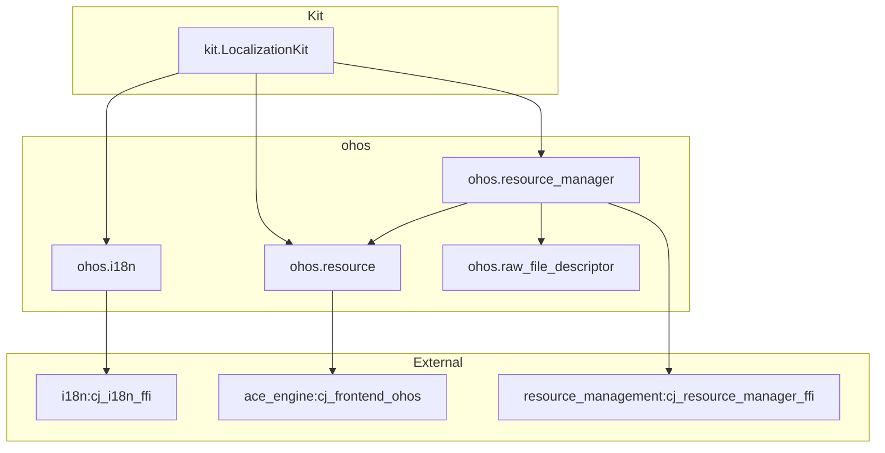

# 构建系统

> global_cangjie_wrapper GN Targets、依赖、编译配置

## GN 文件结构

```
base/global/global_cangjie_wrapper/
├── BUILD.gn                          # 根构建文件
├── bundle.json                       # 组件配置
├── ohos/
│   ├── BUILD.gn                      # 包组定义
│   ├── i18n/
│   │   └── BUILD.gn                  # i18n 模块
│   ├── resource_manager/
│   │   └── BUILD.gn                  # resource_manager 模块
│   ├── resource/
│   │   └── BUILD.gn                  # resource 模块
│   └── raw_file_descriptor/
│       └── BUILD.gn                  # raw_file_descriptor 模块
└── kit/
    └── LocalizationKit/
        └── BUILD.gn                  # LocalizationKit 模块
```

## Targets 清单

### 根目录 BUILD.gn

> 位置: `BUILD.gn`

| Target | 类型 | 输出 | 描述 |
|--------|------|------|------|
| `copy_sdk_global_cangjie_libs` | `copy_ohos_cangjie_sdk_api_lib` | SDK 库 | 复制 SDK 库用于分发 |

### ohos/BUILD.gn

> 位置: `ohos/BUILD.gn`

| Target | 类型 | 依赖 | 描述 |
|--------|------|------|------|
| `global_cangjie_wrapper_package` | `group` | i18n, raw_file_descriptor, resource, resource_manager | 聚合所有 ohos 子包 |

### ohos/i18n/BUILD.gn

> 位置: `ohos/i18n/BUILD.gn:18-41`

| Target | 类型 | 输出 |
|--------|------|------|
| `ohos.i18n` | `ohos_cangjie_shared_library` | `libohos.i18n.so` |

**Source Files**:

| 文件 | 用途 |
|------|------|
| `calendar.cj` | Calendar 接口实现 |
| `i18n_common.cj` | 公共类型 |
| `system.cj` | System 接口 |

**平台条件编译**:

```gn
if (is_mingw || is_mac) {
    sources = ["../../mock/ohos.i18n.cj"]  # Mock for host build
} else {
    sources = ["calendar.cj", "i18n_common.cj", "system.cj"]
}
```

**Dependencies**:

| 类型 | 依赖 |
|------|------|
| `cj_external_deps` | `cangjie_ark_interop:ohos.business_exception` |
| `cj_external_deps` | `cangjie_ark_interop:ohos.ffi` |
| `cj_external_deps` | `cangjie_ark_interop:ohos.labels` |
| `cj_external_deps` | `hiviewdfx_cangjie_wrapper:ohos.hilog` |
| `external_deps` | `i18n:cj_i18n_ffi` |

**Metadata**:

```gn
subsystem_name = "global"
part_name = "global_cangjie_wrapper"
```

### ohos/resource_manager/BUILD.gn

> 位置: `ohos/resource_manager/BUILD.gn:18-47`

| Target | 类型 | 输出 |
|--------|------|------|
| `ohos.resource_manager` | `ohos_cangjie_shared_library` | `libohos.resource_manager.so` |

**Source Files**:

| 文件 | 用途 |
|------|------|
| `resource_manager.cj` | ResourceManager 主类 |
| `resource_manager_common.cj` | 公共类型 |
| `resource_manager_errors.cj` | 错误码定义 |
| `resource_manager_ffi.cj` | FFI 绑定 |

**Dependencies**:

| 类型 | 依赖 |
|------|------|
| `cj_deps` | `../raw_file_descriptor:ohos.raw_file_descriptor` |
| `cj_deps` | `../resource:ohos.resource` |
| `cj_external_deps` | `cangjie_ark_interop:ohos.business_exception` |
| `cj_external_deps` | `cangjie_ark_interop:ohos.ffi` |
| `cj_external_deps` | `cangjie_ark_interop:ohos.labels` |
| `cj_external_deps` | `hiviewdfx_cangjie_wrapper:ohos.hilog` |
| `external_deps` | `resource_management:cj_resource_manager_ffi` |

### ohos/resource/BUILD.gn

> 位置: `ohos/resource/BUILD.gn:18-38`

| Target | 类型 | 输出 |
|--------|------|------|
| `ohos.resource` | `ohos_cangjie_shared_library` | `libohos.resource.so` |

**Source Files**:

| 文件 | 用途 |
|------|------|
| `app_resource.cj` | AppResource 类 |
| `resource_common.cj` | 公共类型与 FFI |

**Dependencies**:

| 类型 | 依赖 |
|------|------|
| `cj_external_deps` | `arkui_cangjie_wrapper:ohos.base` |
| `cj_external_deps` | `cangjie_ark_interop:ohos.encoding.json` |
| `cj_external_deps` | `cangjie_ark_interop:ohos.ffi` |
| `cj_external_deps` | `cangjie_ark_interop:ohos.labels` |
| `cj_external_deps` | `cangjie_ark_interop:ohos.business_exception` |
| `cj_external_deps` | `hiviewdfx_cangjie_wrapper:ohos.hilog` |
| `external_deps` | `ace_engine:cj_frontend_ohos` |

### ohos/raw_file_descriptor/BUILD.gn

> 位置: `ohos/raw_file_descriptor/BUILD.gn:18-33`

| Target | 类型 | 输出 |
|--------|------|------|
| `ohos.raw_file_descriptor` | `ohos_cangjie_shared_library` | `libohos.raw_file_descriptor.so` |

**Source Files**:

| 文件 | 用途 |
|------|------|
| `raw_file_descriptor.cj` | RawFileDescriptor 类 |

**Dependencies**:

| 类型 | 依赖 |
|------|------|
| `cj_external_deps` | `cangjie_ark_interop:ohos.ffi` |
| `cj_external_deps` | `cangjie_ark_interop:ohos.labels` |

### kit/LocalizationKit/BUILD.gn

> 位置: `kit/LocalizationKit/BUILD.gn:19-30`

| Target | 类型 | 输出 |
|--------|------|------|
| `kit.LocalizationKit` | `ohos_cangjie_shared_library` | `libkit.LocalizationKit.so` |

**Source Files**:

| 文件 | 用途 |
|------|------|
| `index.cj` | Kit 入口与导出 |

**Dependencies**:

| 类型 | 依赖 |
|------|------|
| `cj_deps` | `../../ohos/i18n:ohos.i18n` |
| `cj_deps` | `../../ohos/resource:ohos.resource` |
| `cj_deps` | `../../ohos/resource_manager:ohos.resource_manager` |

## bundle.json 配置

> 位置: `bundle.json`

### 组件元数据

| 字段 | 值 |
|------|-----|
| `name` | `@ohos/global_cangjie_wrapper` |
| `version` | `6.1` |
| `subsystem` | `global` |
| `component.name` | `global_cangjie_wrapper` |
| `adapted_system_type` | `standard` |
| `rom` | `400KB` |
| `ram` | `408KB` |

### 子组件

```json
"sub_component": [
  "//base/global/global_cangjie_wrapper/ohos:global_cangjie_wrapper_package",
  "//base/global/global_cangjie_wrapper/kit/LocalizationKit:kit.LocalizationKit"
]
```

### Inner Kits

```json
"inner_kits": [
  { "name": "//base/global/global_cangjie_wrapper/ohos/resource_manager:ohos.resource_manager" },
  { "name": "//base/global/global_cangjie_wrapper/ohos/resource:ohos.resource" },
  { "name": "//base/global/global_cangjie_wrapper/ohos/i18n:ohos.i18n" },
  { "name": "//base/global/global_cangjie_wrapper/ohos/raw_file_descriptor:ohos.raw_file_descriptor" },
  { "name": "//base/global/global_cangjie_wrapper:copy_sdk_global_cangjie_libs" },
  { "name": "//base/global/global_cangjie_wrapper:copy_sdk_global_cangjie_libs_kit" }
]
```

### 组件依赖

```json
"deps": {
  "components": [
    "cangjie_ark_interop",
    "hiviewdfx_cangjie_wrapper",
    "arkui_cangjie_wrapper",
    "resource_management",
    "ace_engine",
    "i18n"
  ]
}
```

## 模板导入

所有模块使用 Cangjie 构建模板：

```gn
import("//build/templates/cangjie/cjc.gni")
```

## 依赖关系图



## 编译配置

### 模板类型

| 模板 | 用途 |
|------|------|
| `ohos_cangjie_shared_library` | Cangjie 共享库 (.so) |
| `group` | 目标聚合 |
| `copy_ohos_cangjie_sdk_api_lib` | SDK 库复制 |

### 平台条件

所有模块支持跨平台构建：

```gn
if (is_mingw || is_mac) {
    sources = ["../../mock/<target>.cj"]  # Host 构建时使用 Mock
} else {
    sources = [ /* 实际源码 */ ]
}
```

### 无自定义 Feature Flags

- 无 `defines` 声明
- 无 `include_dirs` 声明
- 无 `configs` 或 `public_configs` 声明
- 配置从 `//build/templates/cangjie/cjc.gni` 继承

## 构建命令示例

```bash
# 构建整个 subsystem
hb build -p global

# 构建特定 part
hb build -p global -f global_cangjie_wrapper

# 构建 kit
hb build -p global -f kit.LocalizationKit
```

## 相关文档

- [编译产物](./06_Artifacts.md)
- [API 参考](./03_NAPI_Reference.md)
