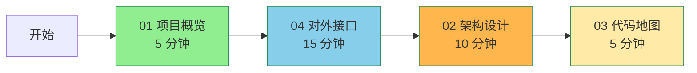
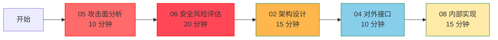

# global_cangjie_wrapper Wiki

> OpenHarmony 全球化子系统 Cangjie API 封装层 (Beta)

---

## 项目概述

本 Wiki 覆盖 OpenHarmony `base/global/global_cangjie_wrapper` 仓库的完整工程文档，包括：

- **项目定位与核心能力** - 项目是什么，能做什么
- **架构设计与模块边界** - 组件图、数据流、FFI 边界
- **对外接口参考** - 完整 API 清单、参数说明、使用示例
- **攻击面分析** - 外部输入、敏感操作、信任边界
- **安全风险评估** - 深度风险分析、利用路径、修复建议
- **构建与产物** - GN targets、依赖、编译产物
- **代码地图** - 目录结构、核心文件定位、功能-文件映射

---

## 覆盖范围

### 已覆盖

| 模块 | 状态 | 文件位置 |
|------|------|----------|
| Calendar (日历) | ✅ | `ohos/i18n/calendar.cj` |
| System (系统配置) | ✅ | `ohos/i18n/system.cj` |
| ResourceManager (资源管理) | ✅ | `ohos/resource_manager/resource_manager.cj` |
| AppResource (应用资源) | ✅ | `ohos/resource/app_resource.cj` |
| RawFileDescriptor (原始文件描述符) | ✅ | `ohos/raw_file_descriptor/raw_file_descriptor.cj` |
| LocalizationKit (Kit 入口) | ✅ | `kit/LocalizationKit/index.cj` |
| GN 构建系统 | ✅ | 所有 `BUILD.gn` 文件 |
| 攻击面分析 | ✅ | `05_AttackSurface.md` |
| 代码地图 | ✅ | `03_CodeMap.md` |

### 未覆盖

| 区域 | 原因 |
|------|------|
| 测试代码 | 根据 Wiki 生成规范，测试相关内容不作为业务证据 |
| C++ 底层实现 | 位于 `global_i18n` / `global_resource_management` 仓库（外部依赖） |
| Mock 实现 | `mock/` 目录仅为测试用途 |

---

## 文档结构（标准化）

| 文件 | 主题 | 受众 |
|------|------|--------|
| [README.md](README.md) | 项目概述与导航 | 新人 |
| [SUMMARY.md](SUMMARY.md) | 全站导航 + 双路线 | 新人/安全研究员 |
| [01_Overview.md](01_Overview.md) | 项目概览 | 新人 |
| [02_Architecture.md](02_Architecture.md) | 架构设计 | 新人/安全研究员 |
| [03_CodeMap.md](03_CodeMap.md) | 目录结构与代码地图 | 新人 |
| [04_Interface.md](04_Interface.md) | 对外接口文档 | 新人/安全研究员 |
| [05_AttackSurface.md](05_AttackSurface.md) | 攻击面分析 | 安全研究员 |
| [06_SecurityReview.md](06_SecurityReview.md) | 安全风险评估 | 安全研究员 |
| [07_Build.md](07_Build.md) | 构建与产物 | 工程师 |
| [08_Internals.md](08_Internals.md) | 内部实现细节 | 开发者 |

---

## 快速导航

### 新人学习路线（推荐顺序）

**总计时间**: 35 分钟

### 安全研究路线（推荐顺序）

**总计时间**: 70 分钟

---

## 文档更新方式

根据 [PLAN.md](PLAN.md) 的规范，当代码变更时需同步更新对应 Wiki 章节：

| 变更类型 | 需要更新的文档 | 查阅维护指南 |
|----------|--------------|--------------|
| **接口变更** | 04_Interface.md, 05_AttackSurface.md, 06_SecurityReview.md | [PLAN.md](PLAN.md#1-接口变更) |
| **模块增删** | 02_Architecture.md, 03_CodeMap.md, 07_Build.md | [PLAN.md](PLAN.md#2-模块增删) |
| **构建配置变更** | 07_Build.md, 06_SecurityReview.md | [PLAN.md](PLAN.md#3-构建配置变更) |
| **安全相关** | 05_AttackSurface.md, 06_SecurityReview.md, 04_Interface.md | [PLAN.md](PLAN.md#4-安全相关) |

---

## 生成信息

| 属性 | 值 |
|------|-----|
| 生成时间 | 2026-02-07 |
| 仓库路径 | `base/global/global_cangjie_wrapper` |
| 目标设备 | OpenHarmony Standard Devices |
| API 状态 | Beta |
| API Level | since 22 |
| 适用 SysCap | SystemCapability.Global.I18n, SystemCapability.Global.ResourceManager |

---

## 相关链接

### 官方文档
- **API 参考**: [Internationalization](https://gitcode.com/openharmony-sig/arkcompiler_cangjie_ark_interop/blob/master/doc/API_Reference/source_en/apis/LocalizationKit/cj-apis-i18n.md)
- **API 参考**: [Resource Management](https://gitcode.com/openharmony-sig/arkcompiler_cangjie_ark_interop/blob/master/doc/API_Reference/source_en/apis/LocalizationKit/cj-apis-resource_manager.md)
- **开发指南**: [Internationalization Development Guide](https://gitcode.com/openharmony-sig/arkcompiler_cangjie_ark_interop/tree/master/doc/Dev_Guide/source_en/internationalization)
- **开发指南**: [ResourceManager Development Guide](https://gitcode.com/openharmony-sig/arkcompiler_cangjie_ark_interop/blob/master/doc/Dev_Guide/source_en/resource-manager/cj-resource-manager.md)

### 相关仓库
| 仓库名 | 角色 |
|--------|------|
| [arkcompiler_cangjie_ark_interop](https://gitcode.com/openharmony-sig/arkcompiler_cangjie_ark_interop) | FFI 基础设施、异常处理、API 级别注解 |
| [global_i18n](https://gitcode.com/openharmony/global_i18n) | 底层国际化 C++ 库 |
| [global_resource_management](https://gitcode.com/openharmony/global_resource_management) | 底层资源管理 C++ 库 |
| [arkui_arkui_cangjie_wrapper](https://gitcode.com/openharmony-sig/arkui_cangjie_wrapper) | ArkUI 基础类型（Color, Length 等） |
| [hiviewdfx_cangjie_wrapper](https://gitcode.com/openharmony-sig/hiviewdfx_cangjie_wrapper) | HiLog 日志接口 |

---

## 版本历史

| 版本 | 日期 | 变更内容 |
|------|------|----------|
| v1.0 | 2026-02-07 | 初始版本，标准化文档结构，添加双路线导航 |
