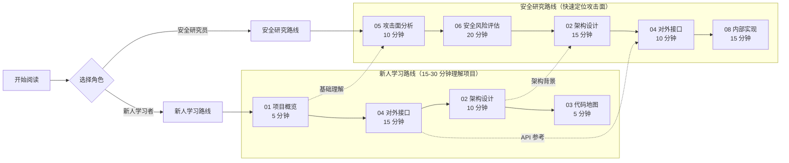

# 全站导航

> global_cangjie_wrapper Wiki 全站目录与双角色阅读路线

---

## 双路线导航图



---

## 新人学习路线（Newbie Learning Path）

**目标**: 在 30 分钟内理解项目定位、基本使用和架构设计

| 阶段 | 文档 | 时间 | 关键收获 |
|------|------|------|----------|
| **快速理解** | [01_Overview](01_Overview.md) | 5 min | 项目定位、核心能力、运行环境、快速开始 |
| **API 参考** | [04_Interface](04_Interface.md) | 15 min | 完整 API 清单、参数说明、使用示例 |
| **架构理解** | [02_Architecture](02_Architecture.md) | 10 min | 组件图、数据流、模块依赖、线程模型 |
| **代码定位** | [03_CodeMap](03_CodeMap.md) | 5 min | 目录结构、核心文件定位、功能-文件映射 |

**总计**: 35 分钟

**建议阅读顺序**:
```
1. 阅读 01_Overview.md 了解项目是什么
2. 阅读 01_Overview.md 中的快速开始，尝试运行示例
3. 阅读 04_Interface.md 查看完整 API 清单
4. 阅读 02_Architecture.md 理解整体架构
5. 使用 03_CodeMap.md 快速定位需要的代码
```

---

## 安全研究路线（Security Research Path）

**目标**: 快速识别所有攻击面、信任边界和安全风险

| 阶段 | 文档 | 时间 | 关键收获 |
|------|------|------|----------|
| **攻击面识别** | [05_AttackSurface](05_AttackSurface.md) | 10 min | 所有外部输入、敏感操作、信任边界 |
| **风险评估** | [06_SecurityReview](06_SecurityReview.md) | 20 min | 深度风险分析、利用路径、修复建议 |
| **架构背景** | [02_Architecture](02_Architecture.md) | 15 min | FFI 边界、数据流、依赖关系 |
| **API 参考** | [04_Interface](04_Interface.md) | 10 min | 所有 API 的输入验证、异常处理 |
| **内部实现** | [08_Internals](08_Internals.md) | 15 min | 核心类职责、FFI 契约、资源生命周期 |

**总计**: 70 分钟

**建议阅读顺序**:
```
1. 快速浏览 05_AttackSurface.md，识别所有攻击面
2. 深度阅读 06_SecurityReview.md，了解具体风险
3. 阅读 02_Architecture.md，理解 FFI 边界和信任边界
4. 使用 04_Interface.md，定位有风险的 API
5. 使用 08_Internals.md，深入理解内部实现
6. 使用 03_CodeMap.md，快速定位关键代码
```

---

## 按模块导航

### 快速查找 API

| 模块 | 文档 | 说明 |
|------|------|------|
| Calendar API | [04_Interface.md#calendar-日历-api](04_Interface.md) | 12+ 个方法 |
| System API | [04_Interface.md#system-api](04_Interface.md) | 1 个方法 |
| ResourceManager API | [04_Interface.md#resourcemanager-api](04_Interface.md) | 20+ 个方法 |
| 错误码参考 | [04_Interface.md#错误码参考](04_Interface.md) | 所有错误码清单 |

### 快速查找实现

| 功能 | 文档 | 位置 |
|------|------|------|
| 架构设计 | [02_Architecture](02_Architecture.md) | 组件图、数据流、FFI 边界 |
| 代码地图 | [03_CodeMap](03_CodeMap.md) | 目录结构、核心文件定位 |
| 内部实现 | [08_Internals](08_Internals.md) | 核心类职责、FFI 契约 |
| 构建系统 | [07_Build](07_Build.md) | GN targets、依赖、产物 |

### 安全相关

| 主题 | 文档 | 优先级 |
|------|------|--------|
| 攻击面 | [05_AttackSurface](05_AttackSurface.md) | P0 - 快速定位攻击面 |
| 安全风险评估 | [06_SecurityReview](06_SecurityReview.md) | P0 - 深度风险分析 |
| FFI 边界安全 | [08_Internals](08_Internals.md#ffi-边界安全) | P1 - 跨语言风险 |

---

## 进阶内容

| 文档 | 主题 | 适合场景 |
|------|------|----------|
| [01_Overview](01_Overview.md) | 项目概览 | 快速上手 |
| [02_Architecture](02_Architecture.md) | 架构设计 | 深度理解 |
| [03_CodeMap](03_CodeMap.md) | 代码地图 | 快速定位 |
| [04_Interface](04_Interface.md) | 对外接口 | API 参考 |
| [05_AttackSurface](05_AttackSurface.md) | 攻击面分析 | 安全研究 |
| [06_SecurityReview](06_SecurityReview.md) | 安全风险评估 | 安全审计 |
| [07_Build](07_Build.md) | 构建系统 | 构建/CI |
| [08_Internals](08_Internals.md) | 内部实现 | 源码理解 |

---

## 文档索引

### 按关键字查找

| 关键词 | 跳转至 |
|--------|--------|
| Calendar | [04_Interface.md](04_Interface.md) |
| ResourceManager | [04_Interface.md](04_Interface.md) |
| 错误码 | [04_Interface.md](04_Interface.md) |
| FFI | [02_Architecture.md](02_Architecture.md) |
| 路径遍历 | [05_AttackSurface.md](05_AttackSurface.md) |
| 资源注入 | [05_AttackSurface.md](05_AttackSurface.md) |
| 线程安全 | [05_AttackSurface.md](05_AttackSurface.md) |

### 按行号定位

| 模块 | 文件 | 关键行号 |
|------|------|----------|
| Calendar | `ohos/i18n/calendar.cj` | L77-L340 |
| System | `ohos/i18n/system.cj` | L45 |
| ResourceManager | `ohos/resource_manager/resource_manager.cj` | L35-L695 |
| FFI 声明 | 对应模块的 `*_ffi.cj` | L24-L100 |

---

## 版本信息

| 属性 | 值 |
|------|-----|
| 最后更新 | 2026-02-07 |
| 适用版本 | global_cangjie_wrapper 6.1 |
| API Level | since 22 |
| SysCap | SystemCapability.Global.I18n, SystemCapability.Global.ResourceManager |

---

**更新日志**:
- 2026-02-06: 初始版本，基础文档结构
- 2026-02-07: 添加双路线导航（新人学习路线 + 安全研究路线），更新文档结构