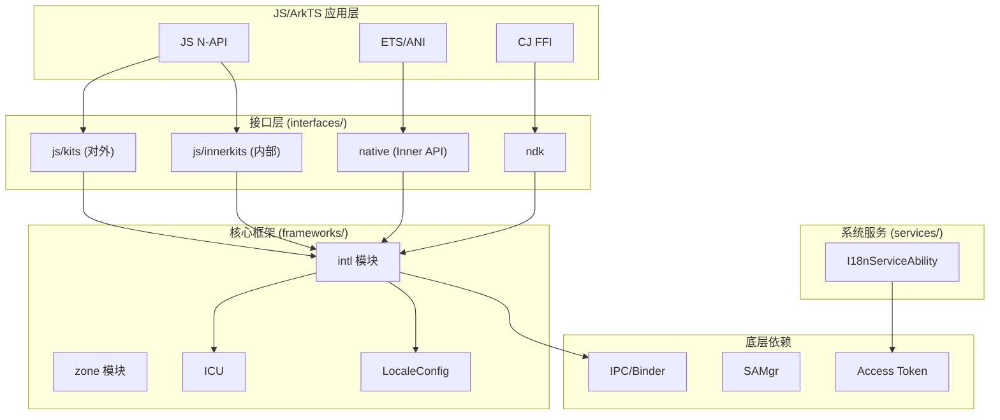
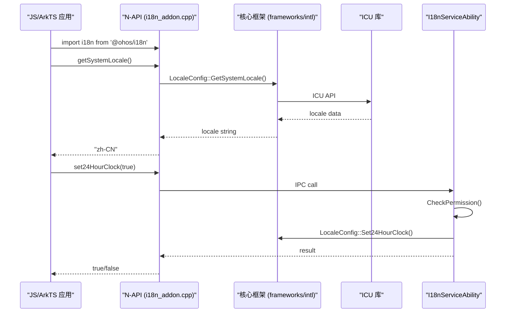

# 架构说明

## 整体架构



## 模块职责

### interfaces/js/kits

**对外 JS API**，通过 N-API 暴露给应用开发者。

- `@ohos/i18n`: 系统区域、时区、首选语言等配置管理
- `@ohos/intl`: `Intl` 对象及其 `DateTimeFormat`, `Collator` 等类

### interfaces/js/innerkits

**内部 JS API**，供系统应用使用。

- `replace_intl_module`: 替换系统 `Intl` 实现
- `collator`, `displaynames`, `number_format` 等

### interfaces/native

**Native Inner API**，供其他模块调用。

- `i18n`: 通用工具类
- `preferred_language`: 首选语言管理
- `zone`: 时区工具

### frameworks/intl

**核心实现**，包含所有 i18n 功能类。

- **格式化**: `DateTimeFormat`, `NumberFormat`, `SimpleDateTimeFormat`, `StyledDateTimeFormat`
- **区域**: `LocaleInfo`, `LocaleConfig`, `LocaleMatcher`
- **日历**: `I18nCalendar`, `LunarCalendar`
- **时区**: `I18nTimeZone`
- **工具**: `IndexUtil`, `I18nNormalizer`, `PhoneNumberFormat`
- **识别**: `EntityRecognizer` (日期/时间/电话号码)

### frameworks/zone

**时区工具**，提供时区数据查询。

### services/

**系统能力**，管理全局 i18n 配置。

- `I18nServiceAbility`: 系统语言/区域配置
- `I18nServiceAbilityClient`: 客户端调用

## 关键调用链

### JS API 调用路径



### N-API 绑定结构

```
JS Import
    |
    v
napi_module_register(g_i18nModule)
    |
    v
I18nAddon::Init(env, exports)
    |
    +-- napi_define_properties()
    |       |
    |       v
    |   I18nSystemAddon::GetSystemLanguage
    |   I18nSystemAddon::GetSystemRegion
    |   ...
    |
    +-- napi_define_class("I18NUtil")
            |
            v
        I18NUtil Constructor
            |
            v
        UnitConvert, GetDateOrder, ...
```

## 线程模型

### JS 线程

- N-API 调用在 JS 主线程执行
- 格式化操作同步完成
- 长时间操作可能阻塞 UI

### SA 调用

- 配置修改 (`set24HourClock`, `SetSystemLanguage`) 通过 IPC 跨进程
- `I18nServiceAbility` 运行在独立进程
- 权限检查在 SA 进程完成

### 资源生命周期

- **N-API 对象**: 通过 `napi_wrap` 绑定到 JS 对象
- **SA 连接**: 懒加载，按需连接
- **ICU 数据**: 单例，进程内共享

## 依赖方向

```
interfaces/js/kits --> frameworks/intl
interfaces/js/innerkits --> frameworks/intl
interfaces/native --> frameworks/intl
frameworks/intl --> ICU (third_party)
frameworks/intl --> services/ (optional)
services/ --> frameworks/intl
```

## 稳定性标注

| 组件 | 稳定性 | 说明 |
|------|--------|------|
| `@ohos/i18n` | 稳定 | 公开 API，版本兼容 |
| `@ohos/intl` | 稳定 | 公开 API，遵循 Web 标准 |
| `Intl.*` | 稳定 | ECMA-402 标准 |
| `frameworks/intl` | 稳定 | 内部实现，ABI 可能变更 |
| `services/I18nServiceAbility` | 稳定 | 系统能力，版本兼容 |
| `native Inner API` | 内部 | 仅供系统模块使用 |
