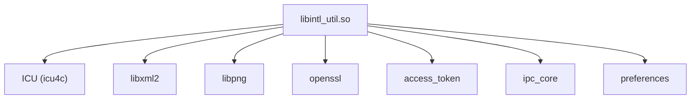

# 构建与产物

## GN 构建配置

### 根配置文件

- `i18n.gni`: 全局变量定义
- `bundle.json`: 模块元数据和子组件定义

### i18n.gni 变量

```gn
i18n_support_ui = true  # 是否支持 UI 相关功能
i18n_support_app_preferred_language = true  # 是否支持应用首选语言
i18n_ext_part_exists = false  # 扩展部分是否存在
```

## 主要 Targets

### frameworks/intl/BUILD.gn

| Target | 类型 | 输出 | 说明 |
|--------|------|------|------|
| `build_module` | group | - | 聚合所有子目标 |
| `intl_util` | ohos_shared_library | `libintl_util.so` | 核心 i18n 库 |
| `preferred_language` | ohos_shared_library | `libpreferred_language.so` | 首选语言管理 |
| `num_timezone_cfg` | ohos_prebuilt_etc | `num_timezone.cfg` | 时区编号配置 |
| `config_locales_xml` | ohos_prebuilt_etc | `supported_locales.xml` | 支持的区域列表 |
| `[lang/timezone/region]_xml` | ohos_prebuilt_etc | `*.xml` | 各语言/时区配置 |

### frameworks/zone/BUILD.gn

| Target | 类型 | 输出 | 说明 |
|--------|------|------|------|
| `zone_util` | ohos_shared_library | `libzone_util.so` | 时区工具库 |

### interfaces/js/kits/BUILD.gn

| Target | 类型 | 输出 | 说明 |
|--------|------|------|------|
| `i18n` | ohos_shared_library | `libi18n.so` | `@ohos/i18n` N-API |

### interfaces/js/innerkits/intl/BUILD.gn

| Target | 类型 | 输出 | 说明 |
|--------|------|------|------|
| `intl` | ohos_shared_library | `libintl.so` | `@ohos/intl` N-API |
| `intl_register` | ohos_shared_library | `libintl_register.so` | Intl 替换模块 |

### services/BUILD.gn

| Target | 类型 | 输出 | 说明 |
|--------|------|------|------|
| `i18n_sa_client` | ohos_shared_library | `libi18n_sa_client.so` | SA 客户端库 |
| `i18n_service_ability` | ohos_shared_library | `libi18n_service_ability.so` | SA 实现 |

### ndk/BUILD.gn

| Target | 类型 | 输出 | 说明 |
|--------|------|------|------|
| `native_i18n` | ohos_shared_library | `libnative_i18n.so` | NDK 接口 |

## 依赖关系

### intl_util 依赖



### 条件依赖

```gn
# i18n_support_ui = true 时
i18n_util --> ability_base
i18n_util --> ability_runtime

# i18n_support_app_preferred_language = true 时
preferred_language --> ability_runtime
preferred_language --> bundle_framework
preferred_language --> preferences
```

## 产物清单

### 系统镜像产物

| 产物 | 目标路径 | 说明 |
|------|----------|------|
| `libintl_util.so` | `system_base/platformsdk/` | 核心库 |
| `libpreferred_language.so` | `system_base/platformsdk/` | 首选语言 |
| `libi18n.so` | `system_base/platformsdk/` | JS N-API |
| `libintl.so` | `system_base/platformsdk/` | Intl N-API |
| `libi18n_sa_client.so` | `system_base/platformsdk/` | SA 客户端 |
| `libi18n_service_ability.so` | `system/` | SA 服务 |
| `libzone_util.so` | `system_base/platformsdk/` | 时区工具 |
| `libnative_i18n.so` | `system_base/platformsdk/` | NDK 接口 |

### 配置文件

| 产物 | 目标路径 | 说明 |
|------|----------|------|
| `i18n.para` | `system/etc/param/` | i18n 参数 |
| `supported_locales.xml` | `system/etc/ohos_locale_config/` | 支持的区域 |
| `*.xml` | `system/usr/ohos_locale_config/` | 语言/时区数据 |

## 编译命令

```bash
# 完整编译
./build.sh --product-name <product> --parts i18n

# 仅编译 i18n
hb build i18n

# 单独编译模块
cd frameworks/intl
gn gen out/default
ninja -C out/default intl_util
```
