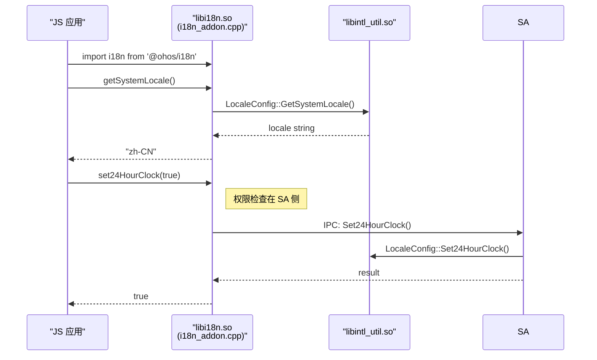
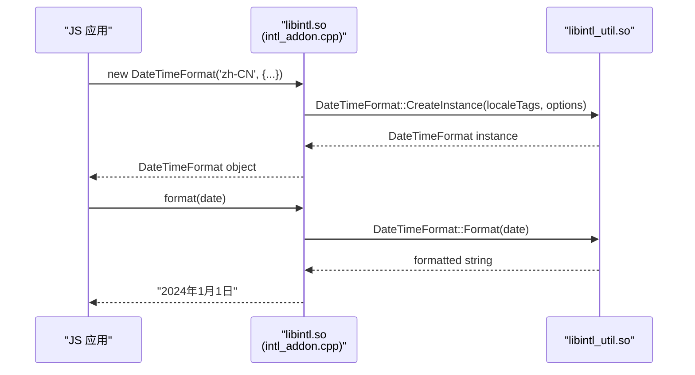
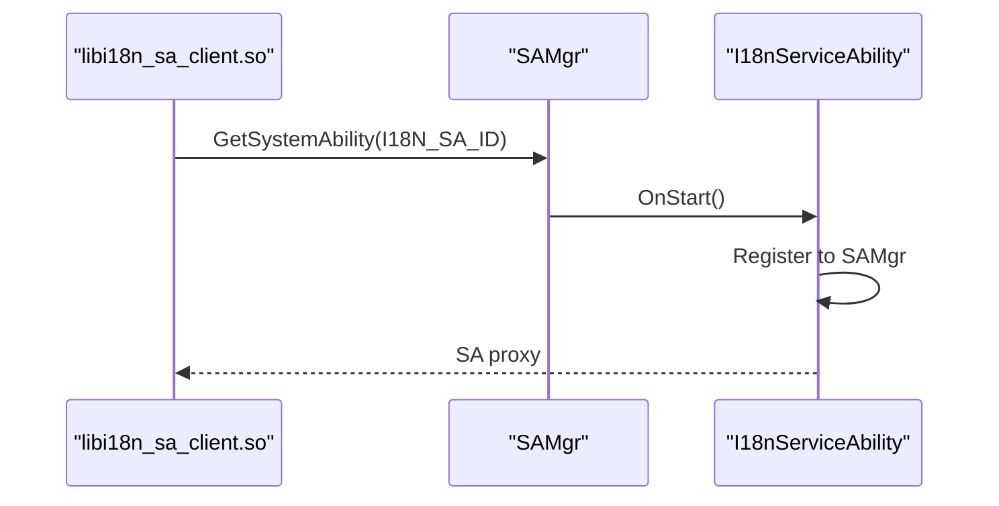
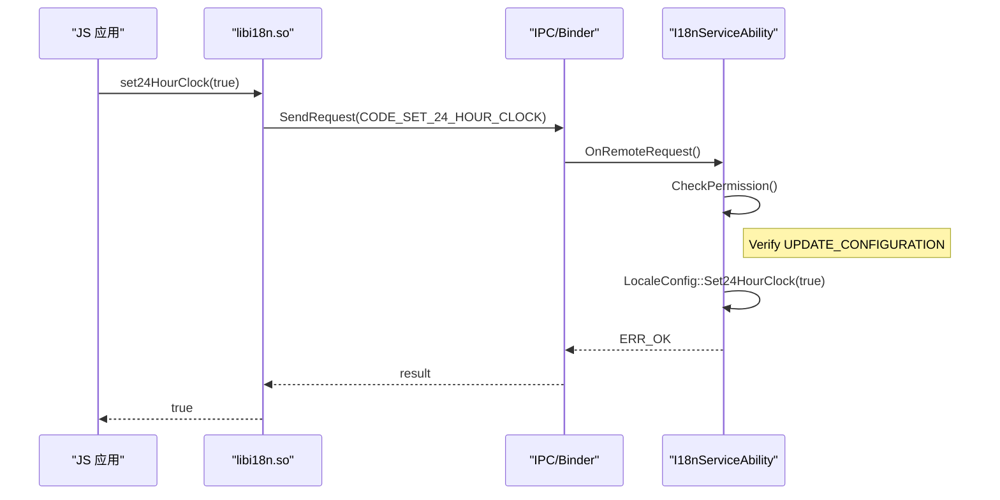
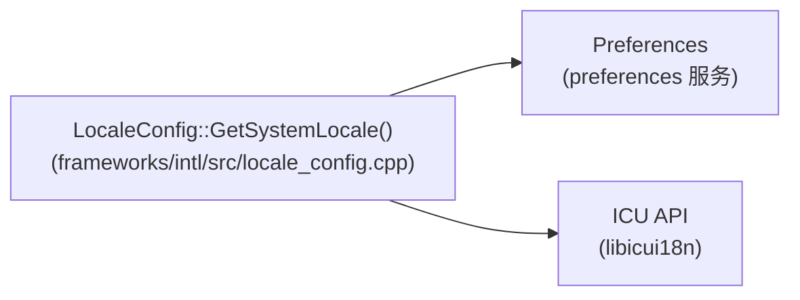
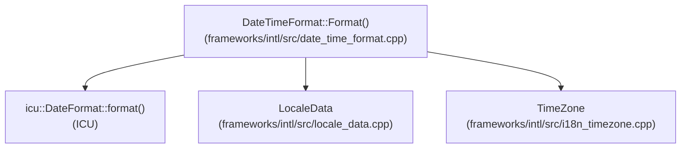
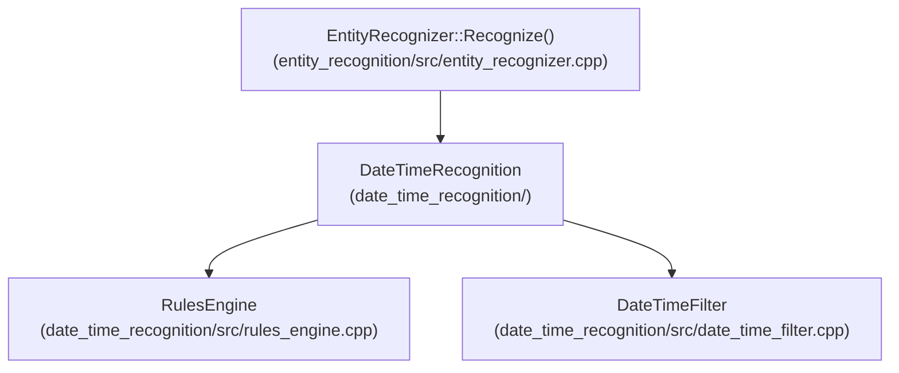
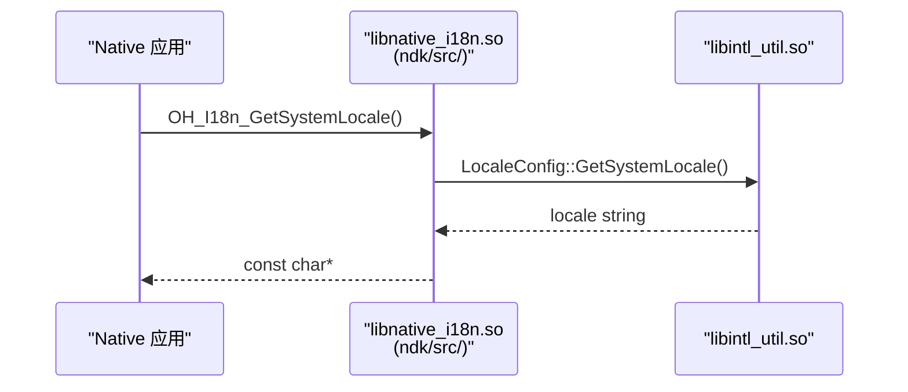

# 关键调用链

## 1. N-API 调用入口

### @ohos/i18n 模块

### @ohos/intl 模块

## 2. SA 服务调用链

### I18nServiceAbility 初始化

### 配置修改流程

## 3. 核心模块调用

### LocaleConfig 读写

### DateTimeFormat 格式化

## 4. 实体识别调用

### 日期时间识别

## 5. NDK 接口调用

