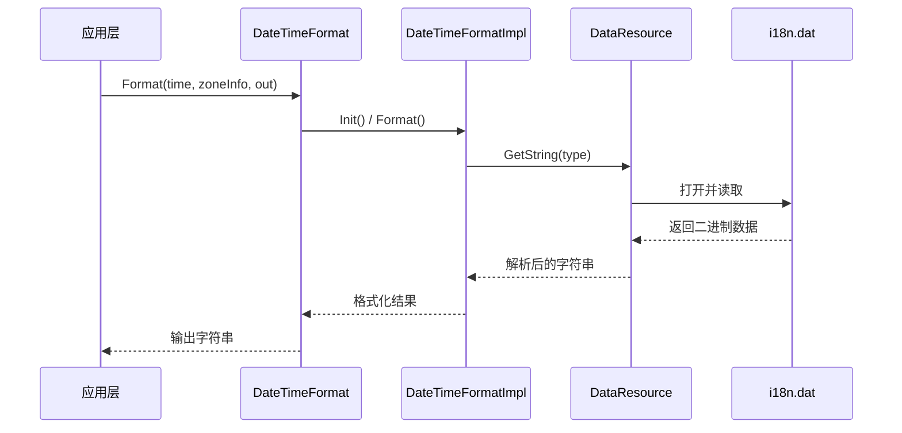

# 架构设计

## 3.1 架构概览

### 3.1.1 整体架构

i18n_lite 采用**分层架构**设计，从上到下分为四层：

```
┌─────────────────────────────────────────────────────────────────┐
│                      应用层 (Application)                        │
│  ┌─────────────────┐  ┌─────────────────┐  ┌─────────────────┐  │
│  │   JS 应用        │  │   C++ 应用      │  │   系统服务       │  │
│  │  (ACELite)      │  │  (Native)       │  │  (System)       │  │
│  └────────┬────────┘  └────────┬────────┘  └────────┬────────┘  │
└───────────┼────────────────────┼────────────────────┼───────────┘
            │                    │                    │
            ▼                    ▼                    ▼
┌─────────────────────────────────────────────────────────────────┐
│                    API 接口层 (Interfaces)                       │
│  ┌─────────────────────────────────────────────────────────────┐  │
│  │                    N-API / JSI                            │  │
│  │  ┌─────────────────┐  ┌─────────────────────────────────┐ │  │
│  │  │  LocaleModule   │  │   C++ Header Files              │ │  │
│  │  │  (JavaScript)   │  │   date_time_format.h           │ │  │
│  │  │                 │  │   number_format.h              │ │  │
│  │  │                 │  │   plural_format.h              │ │  │
│  │  │                 │  │   locale_info.h                │ │  │
│  │  └─────────────────┘  └─────────────────────────────────┘ │  │
└─────────────────────────────┬───────────────────────────────────┘
                              │
                              ▼
┌─────────────────────────────────────────────────────────────────┐
│                    框架实现层 (Frameworks)                        │
│  ┌─────────────────────────────────────────────────────────────┐  │
│  │                   i18n Core                                │  │
│  │  ┌────────────┐ ┌────────────┐ ┌────────────┐ ┌──────┐  │  │
│  │  │DateTime-   │ │Number-     │ │Plural-     │ │Locale│  │  │
│  │  │Format      │ │Format      │ │Format      │ │Info  │  │  │
│  │  └─────┬──────┘ └─────┬──────┘ └─────┬──────┘ └──┬───┘  │  │
│  │        │              │              │            │      │  │
│  │        └──────────────┴──────────────┴────────────┘      │  │
│  │                         │                                  │  │
│  │  ┌──────────────────────▼──────────────────────────────┐  │  │
│  │  │              DataResource Manager                    │  │  │
│  │  │  - 数据加载  - 回退机制  - 缓存管理                  │  │  │
│  │  └─────────────────────────────────────────────────────┘  │  │
└─────────────────────────────────────────────────────────────────┘
                              │
                              ▼
┌─────────────────────────────────────────────────────────────────┐
│                      数据层 (Data)                               │
│  ┌─────────────────────────────────────────────────────────────┐  │
│  │                    i18n.dat                               │  │
│  │  - 区域定义    - 日期格式  - 数字格式  - 复数规则          │  │
│  │  - 月份名称    - 周名称    - AM/PM 标记  - 时区数据        │  │
│  └─────────────────────────────────────────────────────────────┘  │
└─────────────────────────────────────────────────────────────────┘
```

### 3.1.2 模块职责

| 模块 | 职责 | 关键类 |
|------|------|--------|
| **LocaleModule** | JS API 绑定 | `LocaleModule` |
| **DateTimeFormat** | 日期时间格式化 | `DateTimeFormat`, `DateTimeFormatImpl` |
| **NumberFormat** | 数字格式化 | `NumberFormat`, `NumberFormatImpl` |
| **PluralFormat** | 复数规则 | `PluralFormat`, `PluralFormatImpl` |
| **LocaleInfo** | 区域信息管理 | `LocaleInfo` |
| **MeasureFormat** | 度量单位格式化 | `MeasureFormat`, `MeasureFormatImpl` |
| **DataResource** | 区域数据加载 | `DataResource` |

## 3.2 数据流分析

### 3.2.1 格式化请求流程

```
┌──────────┐     ┌──────────────┐     ┌──────────────────┐     ┌─────────────┐
│  应用层  │────▶│  API 接口层  │────▶│  框架实现层      │────▶│  数据层    │
└──────────┘     └──────────────┘     └──────────────────┘     └─────────────┘
      │                  │                      │                     │
      │ 1. 调用 API      │ 2. 参数校验         │ 3. 加载数据        │ 4. 读取 i18n.dat
      │                  │                      │                     │
      ▼                  ▼                      ▼                     ▼
┌──────────┐     ┌──────────────┐     ┌──────────────────┐     ┌─────────────┐
│Format()  │     │DateTime-     │     │DataResource::   │     │ 解析数据   │
│请求      │     │Format::      │     │GetString()       │     │ 返回格式化 │
│         │     │Format()      │     │                  │     │ 结果       │
└──────────┘     └──────────────┘     └──────────────────┘     └─────────────┘
```

### 3.2.2 区域数据加载流程



### 3.2.3 区域回退机制

i18n_lite 实现智能回退机制，当指定区域不存在时自动回退：

```
请求: zh-Hans-CN (简体中文)
    │
    ▼
┌─────────────────┐
│ 查找 zh-Hans-CN  │ ──存在──▶ 使用该区域数据
└────────┬────────┘
         │ 不存在
         ▼
┌─────────────────┐
│   查找 zh-Hans   │ ──存在──▶ 使用该区域数据
└────────┬────────┘
         │ 不存在
         ▼
┌─────────────────┐
│    查找 zh       │ ──存在──▶ 使用该区域数据
└────────┬────────┘
         │ 不存在
         ▼
┌─────────────────┐
│  默认 (en-US)   │ ──最终回退──▶ 使用默认区域数据
└─────────────────┘
```

**源码位置**：`frameworks/i18n/src/data_resource.cpp:35-54`

```cpp
DataResource::DataResource(const LocaleInfo *localeInfo)
{
    uint32_t enMask = LocaleInfo("en", "US").GetMask();
    if (localeInfo == nullptr) {
        localeMask = enMask;
    } else {
        localeMask = localeInfo->GetMask();
        if (localeInfo->IsDefaultLocale()) {
            fallbackMask = 0;
        } else {
            fallbackMask = GetFallbackMask(*localeInfo);
        }
        // ... 设置回退掩码
    }
}
```

## 3.3 线程模型

### 3.3.1 线程使用说明

**设计决策**：i18n_lite **不是线程安全的**。

### 3.3.2 使用约束

| 约束 | 说明 |
|------|------|
| **单线程使用** | 所有 API 必须在同一线程调用 |
| **禁止跨线程传递** | 不可将 Formatter 对象跨线程传递 |
| **初始化线程安全** | `Init()` 方法可在任意线程调用一次 |

### 3.3.3 建议使用模式

```cpp
// 推荐：在同一线程创建和使用
void ProcessDateTime()
{
    LocaleInfo locale("zh", "CN");
    DateTimeFormat formatter(AvailableDateTimeFormatPattern::HOUR_MINUTE, locale);
    formatter.Init();  // 可选
    
    // 同一线程内多次调用
    formatter.Format(time1, zoneInfo, out1, status);
    formatter.Format(time2, zoneInfo, out2, status);
}

// 不推荐：跨线程使用
DateTimeFormat* sharedFormatter = nullptr;  // 避免！
```

### 3.3.4 内部线程假设

i18n_lite 内部实现假设：

- **无并发访问**：内部状态无锁保护
- **同步调用**：API 调用在发起线程完成
- **内存顺序**：无内存屏障依赖

## 3.4 内部 API

### 3.4.1 内部类清单

| 类名 | 头文件 | 稳定性 | 说明 |
|------|--------|--------|------|
| `DateTimeFormatImpl` | `date_time_format_impl.h` | 不稳定 | DateTimeFormat 实现类 |
| `NumberFormatImpl` | `number_format_impl.h` | 不稳定 | NumberFormat 实现类 |
| `PluralFormatImpl` | `plural_format_impl.h` | 不稳定 | PluralFormat 实现类 |
| `MeasureFormatImpl` | `measure_format_impl.h` | 不稳定 | MeasureFormat 实现类 |
| `DataResource` | `data_resource.h` | 不稳定 | 资源数据管理 |
| `DateTimeData` | `date_time_data.h` | 不稳定 | 日期时间数据 |
| `NumberData` | `number_data.h` | 不稳定 | 数字格式数据 |
| `PluralRules` | `plural_rules.h` | 不稳定 | 复数规则 |

### 3.4.2 DataResource 类

资源数据管理类，负责加载和缓存区域数据。

#### 类图

```
DataResource
├── 成员变量
│   ├── localeMask: uint32_t      // 当前区域掩码
│   ├── fallbackMask: uint32_t    // 回退区域掩码
│   ├── defaultMask: uint32_t      // 默认区域掩码
│   ├── resource: char**          // 资源数据指针
│   └── resourceCount: int        // 资源数量
│
└── 方法
    ├── GetString(type): char*    // 获取字符串资源
    ├── GetDateTimeData(): DateTimeData*
    └── GetNumberData(): NumberData*
```

#### 关键方法

**GetString()**

```cpp
// 源码位置: frameworks/i18n/src/data_resource.cpp:95-99
char *DataResource::GetString(DataResourceType type) const
{
    uint32_t index = static_cast<uint32_t>(type);
    return GetString(index);
}
```

**资源类型枚举**：

```cpp
enum DataResourceType {
    RESOURCE_TYPE_TIME_SEPARATOR,      // 时间分隔符
    RESOURCE_TYPE_DECIMAL_SEPARATOR,   // 小数分隔符
    RESOURCE_TYPE_GROUPING_SEPARATOR,   // 分组分隔符
    RESOURCE_TYPE_MINUS_SIGN,          // 负号
    // ... 更多类型
};
```

### 3.4.3 稳定性标注

根据头文件位置和命名，内部 API 按以下规则标注稳定性：

| 证据来源 | 稳定性 |
|----------|--------|
| `interfaces/kits/i18n/include/` | **稳定** - 公共 API |
| `frameworks/i18n/include/` | **不稳定** - 内部实现 |
| `frameworks/i18n/src/` | **不稳定** - 实现细节 |

## 3.5 依赖方向

### 5.1 模块依赖图

```
                    ┌─────────────────┐
                    │   应用层         │
                    └────────┬────────┘
                             │
                             ▼
┌─────────────────────────────────────────────────────────────────┐
│                        依赖关系                                  │
│                                                                  │
│   LocaleModule ──────┬─────────────────────────┐                │
│                      │                         │                │
│                      ▼                         ▼                │
│   DateTimeFormat ───────▶  DataResource ─────▶ i18n.dat        │
│        │                      │                                  │
│        │                      ▼                                  │
│   NumberFormat ──────────▶  LocaleInfo                           │
│        │                                                         │
│        ▼                                                         │
│   PluralFormat                                                   │
│                                                                  │
└─────────────────────────────────────────────────────────────────┘
```

### 5.2 关键依赖

| 依赖源 | 目标 | 依赖类型 | 说明 |
|--------|------|----------|------|
| `DateTimeFormat` | `DataResource` | 功能依赖 | 获取格式化数据 |
| `NumberFormat` | `DataResource` | 功能依赖 | 获取数字格式 |
| `PluralFormat` | `DataResource` | 功能依赖 | 获取复数规则 |
| `DataResource` | `LocaleInfo` | 参数依赖 | 确定加载哪个区域数据 |
| `LocaleModule` | `GLOBAL_*` | 系统依赖 | 获取系统区域设置 |

### 5.3 外部依赖

| 依赖项 | 来源 | 用途 |
|--------|------|------|
| `bounds_checking_function` | 第三方 | 内存安全函数 (memcpy_s, memset_s 等) |
| `utils_lite` | 内部组件 | 基础工具函数 |
| `i18n.dat` | 本地文件 | 区域数据文件 |

## 3.6 资源管理

### 3.6.1 内存管理策略

i18n_lite 使用自定义内存适配器进行内存管理：

**头文件**：`frameworks/i18n/include/i18n_memory_adapter.h`

```cpp
// 内存分配
void* I18nMalloc(size_t size);
// 内存释放
void I18nFree(void* ptr);
// 内存复制
errno_t I18nMemcpy_s(void* dest, size_t destMax, 
                      const void* src, size_t count);
```

### 3.6.2 资源生命周期

```mermaid
graph TD
    A[创建 Formatter] --> B[构造函数]
    B --> C{Init()}
    C -->|成功| D[加载数据]
    C -->|跳过| E[惰性加载]
    D --> F[使用 Formatter]
    E --> F
    F --> G[析构函数]
    G --> H[释放资源]
    
    style A fill:#e1f5fe
    style H fill:#ffebee
```

### 3.6.3 资源释放示例

```cpp
// 正确的资源管理
{
    LocaleInfo locale("zh", "CN");
    DateTimeFormat formatter(AvailableDateTimeFormatPattern::HOUR_MINUTE, locale);
    
    // 使用 formatter
    formatter.Format(time, zoneInfo, out, status);
    
    // 离开作用域时自动释放
}
```

## 3.7 扩展点

### 3.7.1 可替换组件

| 组件 | 替换方式 | 注意事项 |
|------|----------|----------|
| **数据源** | 修改 `DataResource` 实现 | 需保持接口兼容 |
| **区域回退** | 重写 `GetFallbackMask()` | 需符合 CLDR 规范 |
| **格式化逻辑** | 派生 `*FormatImpl` 类 | 需保持公开接口不变 |

### 3.7.2 新增格式化类型

要添加新的格式化类型，需：

1. 在 `types.h` 添加枚举值
2. 在 `i18n.dat` 添加对应数据
3. 实现对应的 `*Format` 和 `*FormatImpl` 类
4. 更新 `DataResource::GetString()` 支持新类型

---

*最后更新：2026-02-06*
