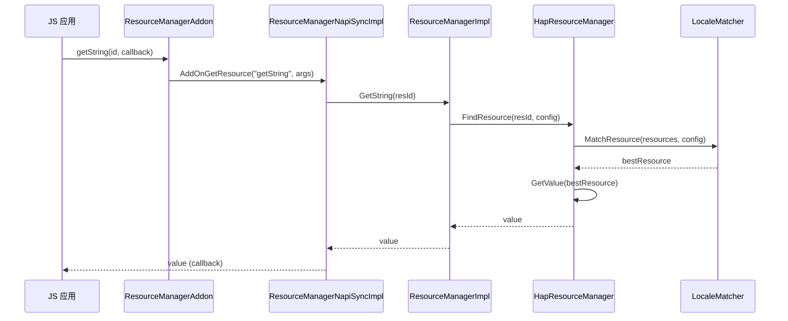
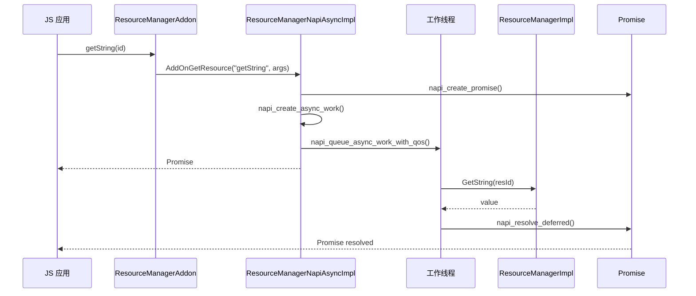
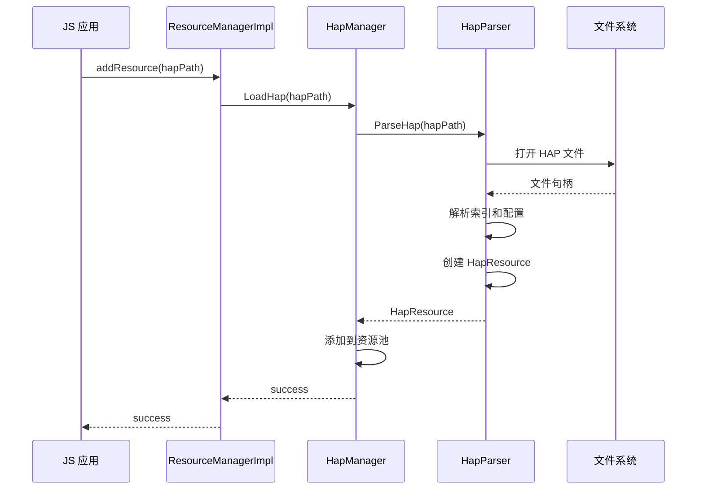
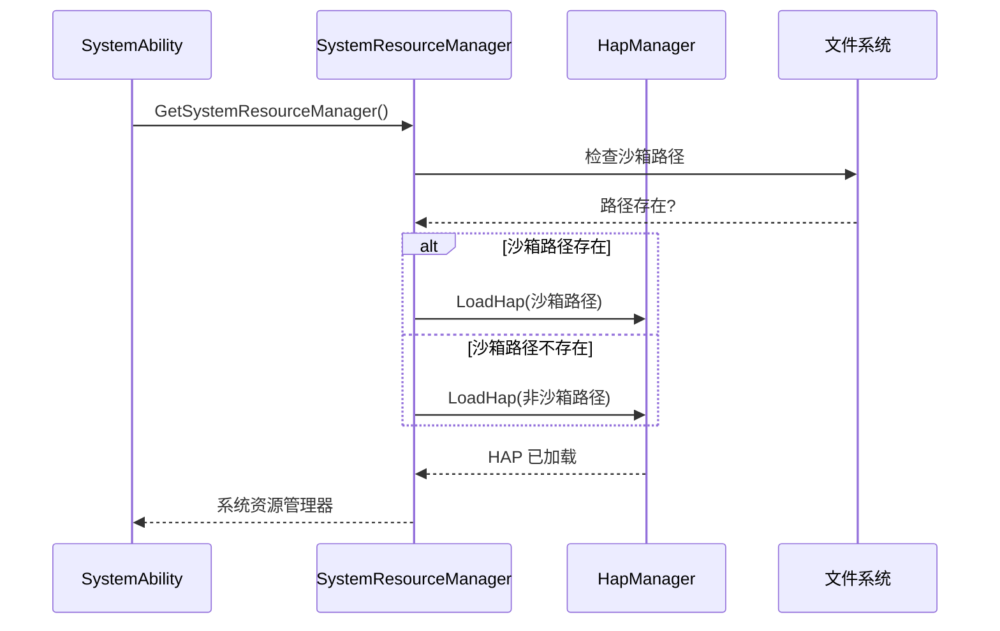

# 架构设计

## 目的

本文档说明 OpenHarmony 资源管理组件的架构设计，包括组件图、数据流、线程模型和关键时序。

## 适用范围

本文档覆盖资源管理组件的完整架构，包括核心框架层和接口层。

## 关键结论

| 架构特征 | 说明 |
|----------|------|
| **分层架构** | 接口层 → 核心框架层 → 基础库层 |
| **本地组件** | 不使用 IPC/ServiceAbility，所有操作在调用进程内完成 |
| **多语言绑定** | 5 种语言 API 绑定 (JS/ETS/C/CJ) |
| **资源匹配** | 基于 Configuration 的多维度资源匹配 |
| **异步支持** | 支持同步和异步两种调用模式 |

## 整体架构

### 组件层级图

```
┌─────────────────────────────────────────────────────────────────────────────┐
│                              应用层                                      │
│  ┌──────────────┐  ┌──────────────┐  ┌──────────────┐  ┌──────────────┐  │
│  │  JS/ArkTS    │  │    C/C++     │  │    ArkTS     │  │   Cangjie    │  │
│  │   应用       │  │   应用       │  │   应用       │  │   应用       │  │
│  └──────┬───────┘  └──────┬───────┘  └──────┬───────┘  └──────┬───────┘  │
└─────────┼──────────────────┼──────────────────┼──────────────────┼──────────┘
          │                  │                  │                  │
┌─────────┼──────────────────┼──────────────────┼──────────────────┼──────────┐
│    接口层 (interfaces/)    │                  │                  │          │
│  ┌──────────┐   ┌──────────┐   ┌──────────┐   ┌──────────┐             │
│  │ JS/N-API │   │ Native   │   │  ETS/ANI │   │CJ/FFI    │             │
│  │  绑定    │   │  API     │   │  绑定    │   │ 绑定     │             │
│  └────┬─────┘   └────┬─────┘   └────┬─────┘   └────┬─────┘             │
└───────┼──────────────┼──────────────┼──────────────┼─────────────────────┘
        │              │              │              │
┌───────┼──────────────┼──────────────┼──────────────┼─────────────────────┐
│    核心框架层 (frameworks/resmgr/)                              │
│  ┌──────────────────────────────────────────────────────────────────┐  │
│  │                    ResourceManagerImpl                         │  │
│  │  ┌──────────────┐  ┌──────────────┐  ┌──────────────┐       │  │
│  │  │ HapManager   │  │ LocaleMatch  │  │ ResConfigImpl│       │  │
│  │  │ (HAP 管理)   │  │ (资源匹配)   │  │ (配置管理)   │       │  │
│  │  └──────┬───────┘  └──────┬───────┘  └──────┬───────┘       │  │
│  │         │                  │                  │                │  │
│  │  ┌──────▼──────────────────▼──────────────────▼───────┐  │  │
│  │  │           HapResourceManager                       │  │  │
│  │  │  ┌──────────┐  ┌──────────┐  ┌──────────┐       │  │  │
│  │  │  │ HapParser │  │HapParserV1│  │HapParserV2│       │  │  │
│  │  │  └──────────┘  └──────────┘  └──────────┘       │  │  │
│  │  └───────────────────────────────────────────────────┘  │  │
│  └──────────────────────────────────────────────────────────┘  │
│  ┌──────────────────────────────────────────────────────────┐  │
│  │           RawFileManager / ThemePackManager             │  │
│  │           (原始文件/主题包管理)                        │  │
│  └──────────────────────────────────────────────────────────┘  │
└──────────────────────────────────────────────────────────────────┘
        │
        ▼
┌──────────────────────────────────────────────────────────────────┐
│                    基础库层                                 │
│  ┌──────────┐  ┌──────────┐  ┌──────────┐  ┌──────────┐  │
│  │   ICU    │  │   ZLIB   │  │  cJSON   │  │  HiLog   │  │
│  │ (国际化) │  │  (压缩)   │  │ (JSON)   │  │  (日志)   │  │
│  └──────────┘  └──────────┘  └──────────┘  └──────────┘  │
└──────────────────────────────────────────────────────────────────┘
        │
        ▼
┌──────────────────────────────────────────────────────────────────┐
│                  文件系统 (HAP 资源文件)                       │
└──────────────────────────────────────────────────────────────────┘
```

## 模块职责

### 1. 接口层

#### 1.1 JS/N-API 绑定

**职责**: JavaScript 与 C++ 之间的桥接

**核心类**:
- `ResourceManagerAddon` - JS 对象包装类
- `ResourceManagerNapiSyncImpl` - 同步方法实现
- `ResourceManagerNapiAsyncImpl` - 异步方法实现

**证据**: `interfaces/js/innerkits/core/include/resource_manager_addon.h`

#### 1.2 Native API

**职责**: C 语言原生接口

**核心接口**:
- `OhosResourceManager` - Native 资源管理器
- `OhosRawFile` - 原始文件接口

**证据**: `interfaces/native/resource/include/ohresmgr.h`

#### 1.3 ETS/ANI 绑定

**职责**: ArkTS 与 Native 代码的桥接

**核心类**:
- `ResourceManagerAni` - ANI 桥接实现

**证据**: `interfaces/ets/ani/resourceManager/include/resourceManager.h`

#### 1.4 Cangjie/FFI 绑定

**职责**: Cangjie 语言的 FFI 接口

**核心类**:
- `ResourceManagerFFI` - FFI 接口

**证据**: `interfaces/cj/src/resource_manager_ffi.h`

### 2. 核心框架层

#### 2.1 ResourceManagerImpl

**职责**: 资源管理器的核心实现

**核心功能**:
- 资源加载和缓存
- 资源查询和匹配
- 配置管理
- 资源覆盖

**证据**: `frameworks/resmgr/include/resource_manager_impl.h`

#### 2.2 HapManager

**职责**: HAP 包生命周期管理

**核心功能**:
- HAP 包加载
- HAP 包解析
- 资源索引管理

**证据**: `frameworks/resmgr/include/hap_manager.h`

#### 2.3 LocaleMatcher

**职责**: 语言/区域匹配

**核心功能**:
- 最佳语言匹配算法
- 区域回退策略

**证据**: `frameworks/resmgr/include/locale_matcher.h`

#### 2.4 RawFileManager

**职责**: 原始文件访问

**核心功能**:
- 原始文件列表
- 原始文件读取
- 原始文件描述符

**证据**: `frameworks/resmgr/src/raw_file_manager.cpp`

## 数据流

### 资源加载流程

```
应用调用 JS API
    ↓
ResourceManagerAddon::AddOnGetResource (NAPI 路由)
    ↓
ResourceManagerNapiSyncImpl::GetResource (同步) 或
ResourceManagerNapiAsyncImpl::GetResource (异步)
    ↓
ResourceManagerImpl::GetString / GetMedia / etc.
    ↓
HapResourceManager::FindResource (资源查找)
    ↓
LocaleMatcher::MatchResource (资源匹配)
    ↓
HapResource::GetValue (获取资源值)
    ↓
返回资源值
```

### 资源匹配流程

```
用户配置 (Configuration)
    │
    ├── 语言 (locale)
    ├── 区域 (region)
    ├── 方向 (direction)
    ├── 设备类型 (device type)
    ├── 屏幕密度 (screen density)
    ├── 颜色模式 (color mode)
    └── MCC/MNC
    ↓
LocaleMatcher::MatchResource
    ↓
遍历所有候选资源
    ↓
根据配置计算匹配分数
    ↓
选择分数最高的资源
    ↓
返回最佳资源
```

### HAP 加载流程

```
HAP 包路径
    ↓
HapManager::LoadHap
    ↓
HapParser::ParseHap (解析 HAP 包)
    │
    ├── 解析索引文件 (resources.index)
    ├── 解析资源配置 (config.json)
    └── 解析资源文件
    ↓
HapResourceManager::LoadResource (加载资源)
    ↓
HapResource::Initialize (初始化资源)
    ↓
资源可用
```

## 线程模型

### 同步调用

**线程**: 调用线程 (通常是主线程)

**流程**:
```
调用线程
    ↓
NAPI 同步调用
    ↓
直接调用 ResourceManagerImpl
    ↓
阻塞等待结果
    ↓
返回结果
```

**证据**: `interfaces/js/innerkits/core/src/resource_manager_napi_sync_impl.cpp`

### 异步调用

**线程**: 调用线程 + 工作线程池

**流程**:
```
调用线程
    ↓
创建 Promise
    ↓
创建 napi_async_work
    ↓
队列异步工作 (napi_queue_async_work_with_qos)
    ↓
┌─────────────────┐
│  工作线程池     │
└─────────────────┘
    ↓
执行核心逻辑 (ResourceManagerImpl)
    ↓
napi_resolve_deferred (resolve Promise)
    ↓
返回 Promise (调用线程)
```

**证据**: `interfaces/js/innerkits/core/src/resource_manager_napi_async_impl.cpp`

## 关键时序

### 1. getString 调用时序 (同步)



**证据**: `interfaces/js/innerkits/core/src/resource_manager_napi_sync_impl.cpp:344`

### 2. getString 调用时序 (异步)



**证据**: `interfaces/js/innerkits/core/src/resource_manager_napi_async_impl.cpp`

### 3. HAP 包加载时序



**证据**: `frameworks/resmgr/src/hap_manager.cpp`, `frameworks/resmgr/src/hap_parser.cpp`

### 4. 系统资源管理器初始化时序



**证据**: `frameworks/resmgr/src/system_resource_manager.cpp:65-77`

## 组件交互

### 内部模块依赖

```
ResourceManagerImpl
    ↓ 依赖
HapManager
HapResourceManager
LocaleMatcher
ResConfigImpl
RawFileManager
ThemePackManager
```

**证据**: `frameworks/resmgr/include/resource_manager_impl.h`

### 外部依赖

| 模块 | 依赖 | 用途 |
|------|------|------|
| N-API 层 | `napi:ace_napi` | N-API 框架 |
| 核心框架 | `icu:shared_icui18n` | 国际化支持 |
| 核心框架 | `zlib:shared_libz` | 压缩解压 |
| 核心框架 | `cJSON:cjson` | JSON 解析 |
| 所有模块 | `hilog:libhilog` | 日志系统 |
| 所有模块 | `hisysevent:libhisysevent` | 系统事件 |

**证据**: `frameworks/resmgr/BUILD.gn`

## 资源管理器生命周期

### 应用资源管理器

```
应用启动
    ↓
getResourceManager() 获取实例
    ↓
ResourceManagerImpl::Init(false)
    ↓
加载应用 HAP 包
    ↓
资源可用
    ↓
应用销毁
    ↓
ResourceManagerImpl::Release()
```

**证据**: `frameworks/resmgr/src/resource_manager_impl.cpp:81-97`

### 系统资源管理器

```
SystemAbility 启动
    ↓
getSystemResourceManager() 获取实例
    ↓
SystemResourceManager::Init(true)
    ↓
加载系统 HAP 包
    ├─ 沙箱路径优先
    └─ 非沙箱路径备用
    ↓
系统资源可用
    ↓
SystemAbility 销毁
    ↓
SystemResourceManager::Release()
```

**证据**: `frameworks/resmgr/src/system_resource_manager.cpp`

## 性能优化

### 1. 资源缓存

**机制**: 已加载的资源缓存在内存中，避免重复解析

**证据**: `frameworks/resmgr/include/hap_resource_manager.h`

### 2. 资源索引

**机制**: HAP 包中的 `resources.index` 文件提供快速查找索引

**证据**: `frameworks/resmgr/include/hap_parser.h`

### 3. 异步加载

**机制**: 支持异步调用，避免阻塞主线程

**证据**: `interfaces/js/innerkits/core/src/resource_manager_napi_async_impl.cpp`

## 相关文档

- [概述](01_Overview.md) - 组件定位和核心能力
- [目录结构](02_DirectoryStructure.md) - 代码组织和模块职责
- [N-API 接口](04_NAPI.md) - JavaScript API 详细文档

---

**生成时间**: 2026-02-06
**证据来源**: frameworks/resmgr/include/, interfaces/js/innerkits/core/src/
