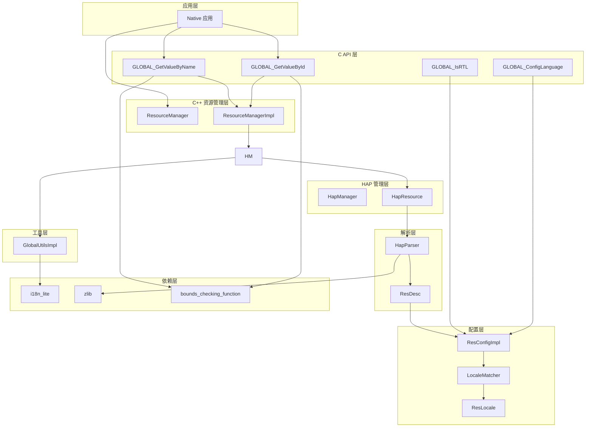
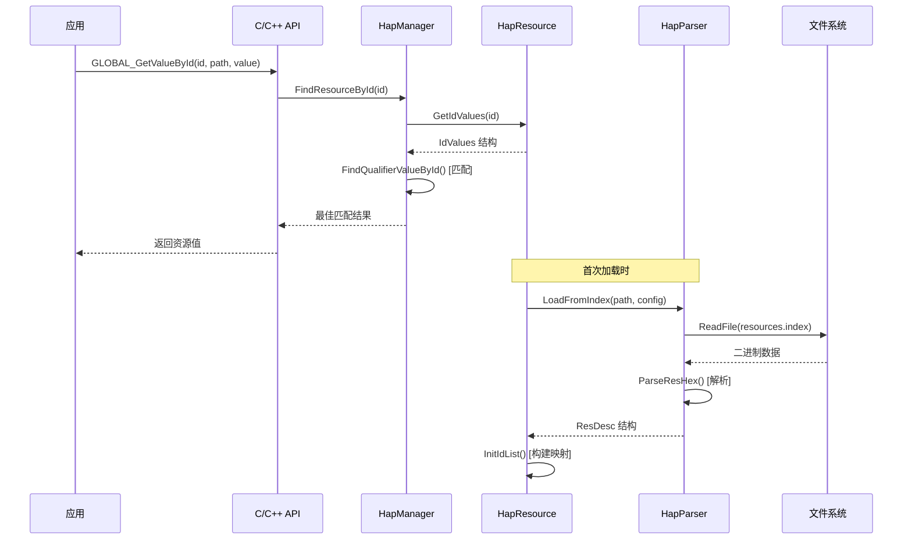
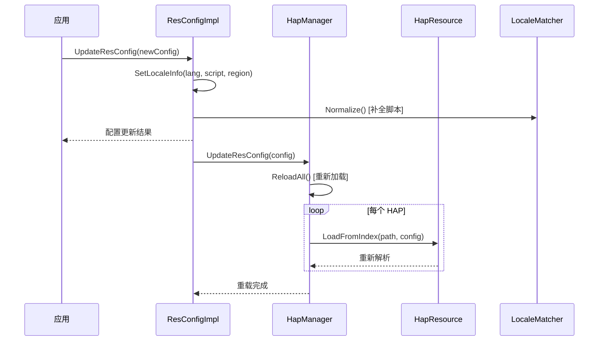
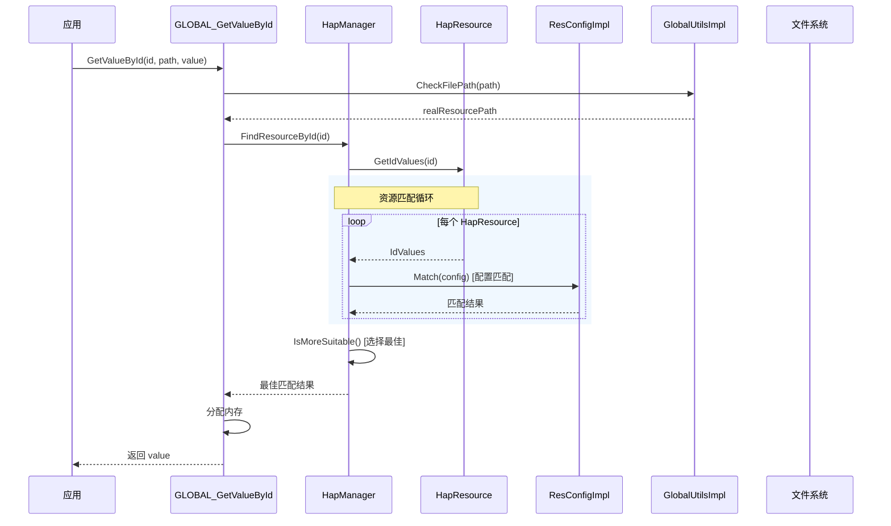
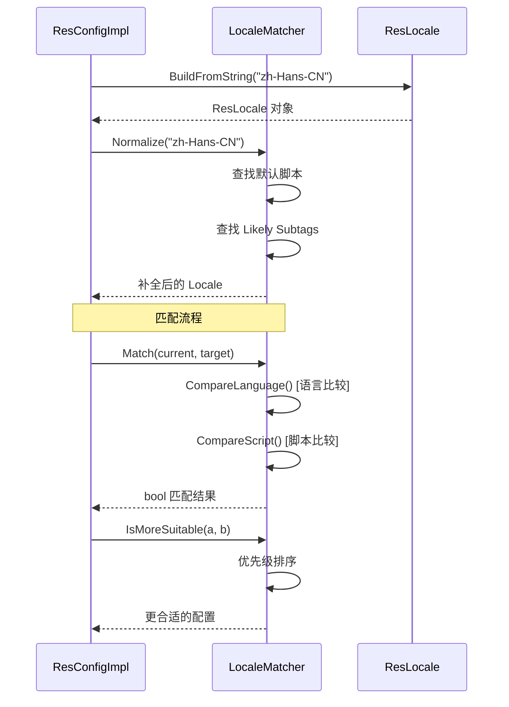
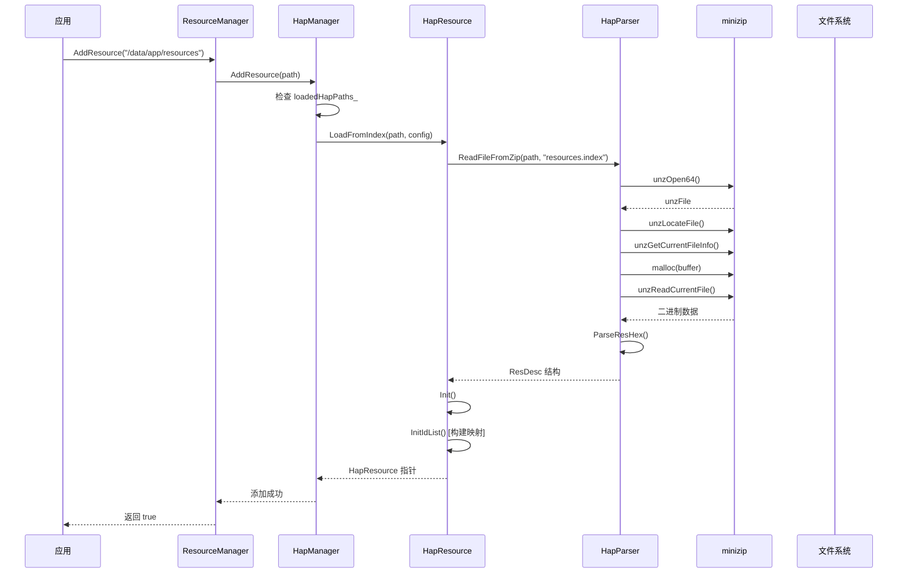
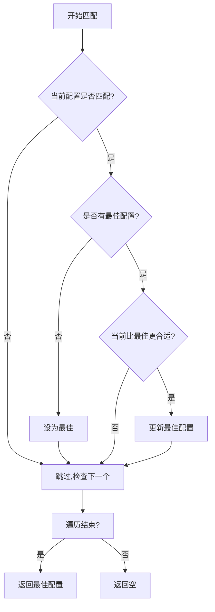

# 架构设计

## 1. 组件架构概览

### 1.1 整体架构图



### 1.2 模块职责矩阵

| 层级 | 模块 | 输入 | 输出 | 主要职责 |
|------|------|------|------|----------|
| **应用层** | Native 应用 | API 调用 | 资源值 | 调用资源管理 API |
| **C API 层** | GLOBAL_* 函数 | 资源 ID/名称 | 字符串值 | 提供 C 接口封装 |
| **资源管理层** | ResourceManagerImpl | API 调用 | 资源数据 | 资源查询、引用解析 |
| **HAP 管理层** | HapManager | HAP 路径 | 资源对象 | 管理 HAP 包生命周期 |
| **解析层** | HapParser | resources.index | ResDesc | 解析二进制资源索引 |
| **配置层** | ResConfigImpl/LocaleMatcher | Locale 信息 | 匹配结果 | 区域匹配、资源筛选 |
| **工具层** | GlobalUtilsImpl | 文件描述符 | 解析数据 | ID 解析、文件读取 |

---

## 2. 数据流设计

### 2.1 资源加载数据流



### 2.2 资源配置更新数据流



### 2.3 核心数据结构流

```
┌─────────────────────────────────────────────────────────────────────┐
│                          数据流向图                                  │
├─────────────────────────────────────────────────────────────────────┤
│                                                                      │
│  文件系统 ──► ResHeader ──► ResKey[] ──► ResId[] ──► IdItem[]      │
│                 │              │             │           │          │
│                 ▼              ▼             ▼           ▼          │
│            version[128]    KeyParam[]   IdParam[]   value/name      │
│            length          type         id          resType         │
│            keyCount        value        offset      valueLen        │
│                                                                      │
│  内存映射 ──► idValuesMap_<uint32_t, IdValues*>                     │
│                 │                                                    │
│                 ├── ValueUnderQualifierDir[最佳匹配]                 │
│                 │         └── IdItem (资源值)                        │
│                 │                                                    │
│                 └── idValuesNameMap_[ResType][name]                 │
│                            └── IdValues                             │
│                                                                      │
└─────────────────────────────────────────────────────────────────────┘
```

---

## 3. 线程模型

### 3.1 线程安全设计

#### HapManager 互斥保护

```cpp
// hap_manager.h
class HapManager {
private:
    Lock lock_;  // 互斥锁保护所有成员
    std::vector<HapResource*> hapResources_;
    std::vector<std::string> loadedHapPaths_;
    ResConfigImpl *resConfig_;
    std::vector<std::pair<std::string, PluralFormat*>> plurRulesCache_;
};

// 使用方式
std::string HapManager::GetPluralRulesAndSelect(int quantity)
{
    AutoMutex mutex(this->lock_);  // RAII 自动加锁/解锁
    // ... 临界区操作
}
```

#### 保护范围

| 成员 | 保护方式 | 说明 |
|------|----------|------|
| `hapResources_` | `AutoMutex` | 读写都加锁 |
| `loadedHapPaths_` | `AutoMutex` | 读写都加锁 |
| `resConfig_` | `AutoMutex` | 读写都加锁 |
| `plurRulesCache_` | `AutoMutex` | 读写都加锁 |

### 3.2 线程使用建议

```
┌─────────────────────────────────────────────────────────────────────┐
│                          线程使用模型                                │
├─────────────────────────────────────────────────────────────────────┤
│                                                                      │
│  ┌───────────────────────────────────────────────────────────────┐  │
│  │                       主线程                                   │  │
│  │   • 初始化 ResourceManager                                    │  │
│  │   • 调用 AddResource() 添加 HAP                               │  │
│  │   • 调用 UpdateResConfig() 更新配置                          │  │
│  │   • 调用 GetString*() 获取资源                                │  │
│  └───────────────────────────────────────────────────────────────┘  │
│                              │                                     │
│                              ▼                                     │
│  ┌───────────────────────────────────────────────────────────────┐  │
│  │                    建议：单线程访问                           │  │
│  │   • 资源管理器设计为单线程使用                                │  │
│  │   • 如需多线程，请确保串行访问                                │  │
│  │   • 互斥锁仅保护内部状态一致性                                │  │
│  └───────────────────────────────────────────────────────────────┘  │
│                                                                      │
└─────────────────────────────────────────────────────────────────────┘
```

### 3.3 锁粒度说明

| 锁类型 | 粒度 | 适用场景 |
|--------|------|----------|
| `AutoMutex` | 类级别 | 保护整个 HapManager 实例的所有成员 |

---

## 4. 关键时序图

### 4.1 资源查询时序



### 4.2 区域匹配时序



### 4.3 HAP 加载时序



---

## 5. 资源匹配算法

### 5.1 限定符匹配优先级

```cpp
// 匹配优先级（从高到低）
enum QualifierPriority {
    PRIORITY_1 = 0,  // 完全匹配 (lang + script + region)
    PRIORITY_2 = 1,  // lang + region 匹配
    PRIORITY_3 = 2,  // lang + script 匹配
    PRIORITY_4 = 3,  // 仅 lang 匹配
};
```

### 5.2 最佳匹配选择流程



### 5.3 区域继承路径

```cpp
// FindTrackPath() 生成的继承链示例
std::vector<std::string> trackPath = {
    "en-GB",      // 具体区域
    "en-001",     // 大区域
    "en",         // 语言
    "ROOT"        // 根区域
};
```

---

## 6. 错误传播机制

### 6.1 错误码定义

```cpp
// rstate.h
enum RState {
    SUCCESS = 0,                      // 成功
    NOT_SUPPORT_SEP = 1,              // 不支持的分隔符
    INVALID_BCP47_STR_LEN_TOO_SHORT = 2,  // BCP 47 字符串过短
    INVALID_BCP47_LANGUAGE_SUBTAG = 3,     // 无效语言子标签
    INVALID_BCP47_SCRIPT_SUBTAG = 4,       // 无效脚本子标签
    INVALID_BCP47_REGION_SUBTAG = 5,       // 无效区域子标签
    HAP_INIT_FAILED = 6,             // HAP 初始化失败
    NOT_FOUND = 7,                   // 未找到
    INVALID_FORMAT = 8,              // 无效格式
    LOCALEINFO_IS_NULL = 9,          // LocaleInfo 为空
    NOT_ENOUGH_MEM = 10,             // 内存不足
    ERROR = 10000                    // 通用错误
};
```

### 6.2 错误传播流程

```
┌─────────────────────────────────────────────────────────────────────┐
│                          错误传播链                                   │
├─────────────────────────────────────────────────────────────────────┤
│                                                                      │
│  HapParser ──► RState ──► HapResource ──► HapManager               │
│       │                              │                               │
│       ▼                              ▼                               │
│  二进制解析错误                    资源查找错误                       │
│                                    │                                 │
│                                    ▼                                 │
│                          ResourceManagerImpl                         │
│                                    │                                 │
│                                    ▼                                 │
│                          GLOBAL_* (C API)                           │
│                                    │                                 │
│                                    ▼                                 │
│                          应用层 (int32_t 返回值)                     │
│                                                                      │
└─────────────────────────────────────────────────────────────────────┘
```

### 6.3 内存清理保证

```cpp
// global.c - 错误时内存清理示例
static int32_t GLOBAL_GetValueByIdInternal(...)
{
    // ... 文件操作 ...
    int32_t result = MC_FAILURE;
    IdItem idItem = {0, INVALID_RES_TYPE, 0, 0, NULL, 0, NULL};
    
    for (uint32_t i = 0; i < idHeader.count; i++) {
        if (idHeader.idParams[i].id == id) {
            ret = utilsImpl->GetIdItem(file, idHeader.idParams[i].offset, &idItem);
            if (ret != MC_SUCCESS) {
                close(file);
                free(idHeader.idParams);
                return ret;  // 错误时清理资源
            }
            // ... 成功路径 ...
        }
    }
    
    close(file);
    free(idHeader.idParams);
    FreeIdItem(&idItem);
    return result;
}
```

---

## 7. 文档链接

| 主题 | 文档 |
|------|------|
| 项目概览 | [00_Overview.md](./00_Overview.md) |
| 目录结构 | [01_Directory_Structure.md](./01_Directory_Structure.md) |
| C API | [03_C_API.md](./03_C_API.md) |
| C++ API | [04_Cpp_API.md](./04_Cpp_API.md) |
| 构建系统 | [05_Build_System.md](./05_Build_System.md) |
| 安全分析 | [06_Security_Analysis.md](./06_Security_Analysis.md) |
| 常见问题 | [07_Troubleshooting.md](./07_Troubleshooting.md) |
