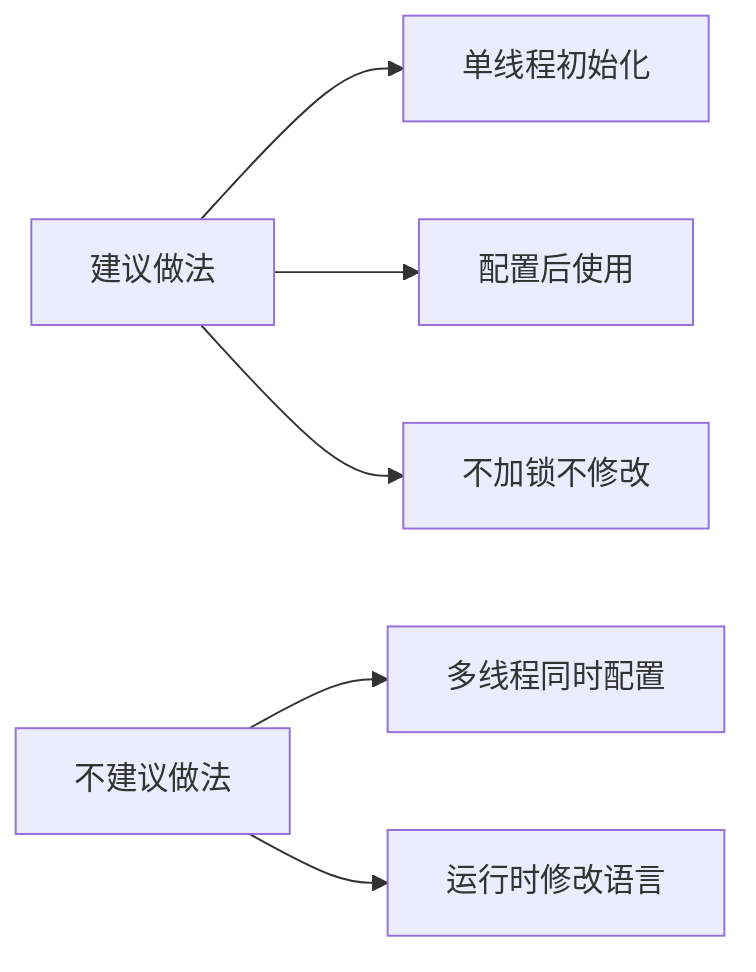

# C API 接口文档

## 1. 概述

本文档描述 `resource_management_lite` 组件对外暴露的 **C 接口**，供 Native 应用直接调用。

**接口特点**：
- 纯 C 接口，兼容 C 和 C++ 调用
- 同步 API，无异步回调
- 基于 HAP 包的资源索引文件访问
- 支持多语言、多区域资源匹配

**适用场景**：
- 系统服务层
- 底层 Native 组件
- 性能敏感的资源访问

---

## 2. API 清单

### 2.1 头文件位置

```
interfaces/inner_api/include/global.h
```

### 2.2 函数列表

| 函数名 | 用途 | 同步/异步 | 线程安全 |
|--------|------|----------|----------|
| `GLOBAL_GetValueById` | 根据资源 ID 获取资源值 | 同步 | 否 |
| `GLOBAL_GetValueByName` | 根据资源名称获取资源值 | 同步 | 否 |
| `GLOBAL_ConfigLanguage` | 配置应用当前语言 | 同步 | 否 |
| `GLOBAL_GetLanguage` | 获取当前配置的语言 | 同步 | 否 |
| `GLOBAL_GetRegion` | 获取当前配置的地区 | 同步 | 否 |
| `GLOBAL_IsRTL` | 判断是否 RTL 布局 | 同步 | 否 |

**证据来源**：
- `interfaces/inner_api/include/global.h` (lines 36-41)

---

## 3. API 详细说明

### 3.1 GLOBAL_GetValueById

#### 函数签名

```c
int32_t GLOBAL_GetValueById(uint32_t id, const char *path, char **value);
```

#### 参数说明

| 参数 | 类型 | 方向 | 说明 |
|------|------|------|------|
| `id` | `uint32_t` | 输入 | 资源 ID（32 位整数） |
| `path` | `const char *` | 输入 | HAP 资源索引文件路径 |
| `value` | `char **` | 输出 | 指向资源值指针的指针 |

#### 返回值

| 返回值 | 说明 |
|--------|------|
| `MC_SUCCESS` (0) | 成功获取资源 |
| `MC_FAILURE` (-1) | 获取失败（资源不存在或路径无效） |

#### 使用示例

```c
#include "global.h"
#include <stdio.h>
#include <stdlib.h>

uint32_t id = 0x16777216;  // 示例资源 ID
char *value = NULL;
int32_t ret = GLOBAL_GetValueById(id, "/system/data/resources.index", &value);
if (ret == MC_SUCCESS) {
    printf("Resource value: %s\n", value);
    free(value);  // 调用方负责释放内存
} else {
    printf("Failed to get resource\n");
}
```

#### 调用链

```
GLOBAL_GetValueById
    ├── 参数校验 (path != NULL, value != NULL)
    ├── GLOBAL_GetValueByIdInternal(id, path, g_locale, value)
    │   ├── GlobalUtilsImpl::CheckFilePath(path)  [路径校验]
    │   ├── GlobalUtilsImpl::GetOffsetByLocale(path, locale)
    │   ├── GlobalUtilsImpl::GetIdHeaderByOffset(file, offset)
    │   ├── 遍历 IdHeader.idParams[] 匹配 ID
    │   └── GlobalUtilsImpl::GetIdItem(file, offset)
    └── 返回结果
```

**证据来源**：
- `frameworks/resmgr_lite/src/global.c` (lines 197-216)

---

### 3.2 GLOBAL_GetValueByName

#### 函数签名

```c
int32_t GLOBAL_GetValueByName(const char *name, const char *path, char **value);
```

#### 参数说明

| 参数 | 类型 | 方向 | 说明 |
|------|------|------|------|
| `name` | `const char *` | 输入 | 资源名称（字符串） |
| `path` | `const char *` | 输入 | HAP 资源索引文件路径 |
| `value` | `char **` | 输出 | 指向资源值指针的指针 |

#### 返回值

| 返回值 | 说明 |
|--------|------|
| `MC_SUCCESS` (0) | 成功获取资源 |
| `MC_FAILURE` (-1) | 获取失败（资源不存在或路径无效） |

#### 使用示例

```c
#include "global.h"
#include <stdio.h>
#include <stdlib.h>

char *value = NULL;
int32_t ret = GLOBAL_GetValueByName("app_name", "/system/data/resources.index", &value);
if (ret == MC_SUCCESS) {
    printf("Resource value: %s\n", value);
    free(value);
} else {
    printf("Failed to get resource\n");
}
```

#### 调用链

```
GLOBAL_GetValueByName
    ├── 参数校验 (name != NULL, strlen > 0, path != NULL, value != NULL)
    ├── GLOBAL_GetValueByNameInternal(name, path, g_locale, value)
    │   ├── GlobalUtilsImpl::CheckFilePath(path)  [路径校验]
    │   ├── GlobalUtilsImpl::GetOffsetByLocale(path, locale)
    │   ├── GlobalUtilsImpl::GetIdHeaderByOffset(file, offset)
    │   ├── 遍历 IdHeader.idParams[] 匹配 name
    │   ├── GlobalUtilsImpl::GetIdItem(file, offset)
    │   └── strcmp(name, idItem.name)  [名称匹配]
    └── 返回结果
```

**证据来源**：
- `frameworks/resmgr_lite/src/global.c` (lines 268-287)

---

### 3.3 GLOBAL_ConfigLanguage

#### 函数签名

```c
void GLOBAL_ConfigLanguage(const char *appLanguage);
```

#### 参数说明

| 参数 | 类型 | 方向 | 说明 |
|------|------|------|------|
| `appLanguage` | `const char *` | 输入 | 语言标签（如 "zh-Hans-CN"） |

#### 说明

- 配置当前应用的语言设置
- 影响后续 `GLOBAL_GetValueById/Name` 的资源匹配
- 语言格式：`language_script_region`（使用 `-` 或 `_` 分隔）
- 最大长度：`MAX_LOCALE_LENGTH` (13 字节)

#### 使用示例

```c
#include "global.h"

GLOBAL_ConfigLanguage("zh-Hans-CN");  // 设置为简体中文
GLOBAL_ConfigLanguage("en-Latn-US");  // 设置为美式英语
```

#### 内部实现

```c
void GLOBAL_ConfigLanguage(const char *appLanguage)
{
    if (appLanguage == NULL) {
        return;
    }
    // 相同语言无需重复配置
    if (strcmp(appLanguage, g_locale) == 0) {
        return;
    }
    if (strcpy_s(g_locale, MAX_LOCALE_LENGTH, appLanguage) != EOK) {
        return;
    }
}
```

**证据来源**：
- `frameworks/resmgr_lite/src/global.c` (lines 41-53)

---

### 3.4 GLOBAL_GetLanguage

#### 函数签名

```c
int32_t GLOBAL_GetLanguage(char *language, uint8_t len);
```

#### 参数说明

| 参数 | 类型 | 方向 | 说明 |
|------|------|------|------|
| `language` | `char *` | 输出 | 语言代码输出缓冲区 |
| `len` | `uint8_t` | 输入 | 缓冲区长度 |

#### 返回值

| 返回值 | 说明 |
|--------|------|
| `MC_SUCCESS` (0) | 成功获取 |
| `MC_FAILURE` (-1) | 失败（参数无效或解析失败） |

#### 使用示例

```c
#include "global.h"

char language[4] = {0};  // MAX_LANGUAGE_LENGTH = 4
int32_t ret = GLOBAL_GetLanguage(language, sizeof(language));
if (ret == MC_SUCCESS) {
    printf("Current language: %s\n", language);  // 如 "zh"
}
```

---

### 3.5 GLOBAL_GetRegion

#### 函数签名

```c
int32_t GLOBAL_GetRegion(char *region, uint8_t len);
```

#### 参数说明

| 参数 | 类型 | 方向 | 说明 |
|------|------|------|------|
| `region` | `char *` | 输出 | 地区代码输出缓冲区 |
| `len` | `uint8_t` | 输入 | 缓冲区长度 |

#### 返回值

| 返回值 | 说明 |
|--------|------|
| `MC_SUCCESS` (0) | 成功获取 |
| `MC_FAILURE` (-1) | 失败（参数无效或解析失败） |

#### 使用示例

```c
#include "global.h"

char region[4] = {0};  // MAX_REGION_LENGTH = 4
int32_t ret = GLOBAL_GetRegion(region, sizeof(region));
if (ret == MC_SUCCESS) {
    printf("Current region: %s\n", region);  // 如 "CN"
}
```

---

### 3.6 GLOBAL_IsRTL

#### 函数签名

```c
int32_t GLOBAL_IsRTL(void);
```

#### 返回值

| 返回值 | 说明 |
|--------|------|
| 1 (true) | 是 RTL 布局语言 |
| 0 (false) | 不是 RTL 布局语言 |

#### RTL 语言列表

以下语言被认为是 RTL（从右到左）布局：

| 语言代码 | 语言名称 |
|----------|----------|
| `ar` | 阿拉伯语 |
| `fa` | 波斯语 |
| `ur` | 乌尔都语 |
| `ug` | 维吾尔语 |
| `he` | 希伯来语 |
| `iw` | 意第绪语（希伯来语旧代码） |

**注意**：RTL 检测基于脚本（Script）判断：
- 脚本为 `Arab`（阿拉伯文）或 `Hebr`（希伯来文）
- 或语言代码属于上述列表

#### 使用示例

```c
#include "global.h"

GLOBAL_ConfigLanguage("ar-SA");  // 设置为阿拉伯语
if (GLOBAL_IsRTL()) {
    printf("RTL layout required\n");
} else {
    printf("LTR layout\n");
}
```

**证据来源**：
- `frameworks/resmgr_lite/src/global.c` (lines 76-107)

---

## 4. 宏定义

### 4.1 常量定义

| 宏名 | 值 | 说明 |
|------|-----|------|
| `RES_CONFIG_NUM_OFFSET` | 132 | 资源配置数量偏移 |
| `INDEX_DEFAULT_OFFSET` | 4 | 索引默认偏移 |
| `VALUE_LENGTH_OFFSET` | 2 | 值长度偏移 |
| `OFFSET_VALUE_STEP` | 8 | 偏移值步长 |
| `ALL_PARAM_LENGTH` | 4 | 全参数长度 |
| `INVALID_OFFSET` | 0 | 无效偏移 |
| `MAX_LANGUAGE_LENGTH` | 4 | 最大语言代码长度 |
| `MAX_REGION_LENGTH` | 4 | 最大地区代码长度 |
| `MAX_LOCALE_LENGTH` | 13 | 最大区域字符串长度 |

### 4.2 错误码宏

| 宏名 | 值 | 说明 |
|------|-----|------|
| `MC_SUCCESS` | 0 | 成功 |
| `MC_FAILURE` | -1 | 失败 |

**证据来源**：
- `interfaces/inner_api/include/global.h` (lines 27-34)
- `frameworks/resmgr_lite/include/global_utils.h` (lines 117-118)

---

## 5. 数据结构

### 5.1 IdHeader

```c
typedef struct IdHeader {
    uint32_t count;      // ID 参数数量
    IdParam *idParams;  // ID 参数数组
} IdHeader;
```

### 5.2 IdParam

```c
typedef struct IdParam {
    uint32_t id;     // 资源 ID
    uint32_t offset;  // 偏移量
} IdParam;
```

### 5.3 IdItem

```c
typedef struct IdItem {
    uint32_t size;        // 项大小
    ResType resType;      // 资源类型
    uint32_t id;          // 资源 ID
    uint16_t valueLen;    // 值长度
    char *value;          // 值内容
    uint16_t nameLen;     // 名称长度
    char *name;          // 名称
} IdItem;
```

### 5.4 ResType 枚举

```c
typedef enum ResType {
    VALUES    = 0,
    ANIMATION = 1,
    DRAWABLE  = 2,
    LAYOUT    = 3,
    MENU      = 4,
    MIPMAP    = 5,
    RAW       = 6,
    XML       = 7,
    INTEGER   = 8,
    STRING    = 9,
    STRINGARRAY = 10,
    INTARRAY  = 11,
    BOOLEAN_  = 12,
    DIMEN     = 13,
    COLOR     = 14,
    ID        = 15,
    THEME     = 16,
    PLURALS   = 17,
    MY_FLOAT  = 18,
    MEDIA     = 19,
    PROF      = 20,
    SVG       = 21,
    INVALID_RES_TYPE = -1
} ResType;
```

**证据来源**：
- `frameworks/resmgr_lite/include/global_utils.h` (lines 78-96)

---

## 6. 线程安全说明

### 6.1 线程不安全因素

C API 使用全局变量 `g_locale` 存储当前语言配置：

```c
static char g_locale[MAX_LOCALE_LENGTH] = {0};
```

**风险**：在多线程环境下同时调用 `GLOBAL_ConfigLanguage` 和其他 API 可能导致数据竞争。

### 6.2 使用建议



**建议**：
1. 在应用启动时调用 `GLOBAL_ConfigLanguage` 完成语言配置
2. 后续资源访问在同一线程进行
3. 如需运行时切换语言，请确保串行访问

---

## 7. 内存管理

### 7.1 内存分配规则

| 操作 | 分配方 | 释放方 | 释放方式 |
|------|--------|--------|----------|
| `*value` | `GLOBAL_GetValueById/Name` | **调用方** | `free()` |

### 7.2 正确使用示例

```c
#include "global.h"
#include <stdlib.h>

char *value = NULL;
int32_t ret = GLOBAL_GetValueById(id, path, &value);
if (ret == MC_SUCCESS) {
    // 使用 value
    do_something(value);
    
    // 释放内存
    free(value);
    value = NULL;  // 释放后置空是好习惯
}
```

### 7.3 常见错误

```c
// 错误示例 1：忘记释放
GLOBAL_GetValueById(id, path, &value);
do_something(value);
// 内存泄漏！

// 错误示例 2：重复释放
free(value);
free(value);  // 双重释放，未定义行为！

// 错误示例 3：使用已释放内存
free(value);
do_something(value);  // Use-after-free！
```

---

## 8. 常见问题

### Q1: 返回 MC_FAILURE 如何排查？

1. 检查 `path` 是否为有效路径
2. 检查 `path` 对应的 `resources.index` 文件是否存在
3. 检查 `id` 是否存在于资源索引中
4. 检查当前语言配置是否有匹配资源

### Q2: 如何获取其他类型资源？

C API 底层支持多资源类型，但当前 C 接口仅返回字符串值。如需获取其他类型资源，请使用 C++ 接口（`ResourceManager`）。

### Q3: 资源 ID 如何生成？

资源 ID 由编译工具链生成，通常在 `.hap` 包的 `resources.index` 文件中定义。应用层通常使用工具生成的常量。

---

## 9. 文档链接

| 主题 | 文档 |
|------|------|
| 项目概览 | [00_Overview.md](./00_Overview.md) |
| 目录结构 | [01_Directory_Structure.md](./01_Directory_Structure.md) |
| 架构设计 | [02_Architecture.md](./02_Architecture.md) |
| C++ API | [04_Cpp_API.md](./04_Cpp_API.md) |
| 构建系统 | [05_Build_System.md](./05_Build_System.md) |
| 安全分析 | [06_Security_Analysis.md](./06_Security_Analysis.md) |
