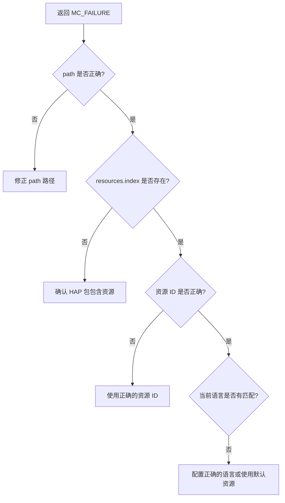

# 常见问题与调试

## 1. 概述

本文档收集 `resource_management_lite` 组件在构建、运行过程中常见的问题及解决方案。

**包含内容**：
- 构建问题与解决方案
- 运行时问题与调试方法
- 资源加载问题排查
- 性能问题定位

---

## 2. 构建问题

### 2.1 编译错误

#### 问题 1：缺少 i18n_lite 头文件

**错误信息**：

```
fatal error: 'locale_info.h' file not found
```

**原因**：`global_i18n_lite` 子模块未初始化或路径配置错误。

**解决方案**：

```bash
# 1. 初始化子模块
git submodule update --init --recursive

# 2. 检查路径配置
hb build -p global --info
```

**证据来源**：`BUILD.gn:56` - i18n include path 配置。

---

#### 问题 2：bounds_checking_function 链接失败

**错误信息**：

```
undefined reference to `strcpy_s'
```

**原因**：未链接安全字符串库。

**解决方案**：

```gn
# BUILD.gn 中确认依赖
deps = [ "//third_party/bounds_checking_function:libsec_shared" ]
```

或 CMake：

```cmake
target_link_libraries(global_resmgr sec_static)
```

---

#### 问题 3：liteos_m 编译缺少 HAP 相关文件

**错误信息**：

```
error: 'hap_manager.h' file not found
```

**原因**：liteos_m 使用 C 源码，不包含 HAP 解析模块。

**说明**：这是正常行为。liteos_m 仅支持基础 C API，HAP 解析仅在 liteos_a 可用。

---

#### 问题 4：CMake 配置失败

**错误信息**：

```
CMake Error: could not find CMakeLists.txt
```

**原因**：未在正确目录执行 cmake。

**解决方案**：

```bash
cd frameworks/resmgr_lite
mkdir -p build && cd build
cmake ../..
make -j4
```

---

### 2.2 链接错误

#### 问题 5：重复定义符号

**错误信息**：

```
multiple definition of `GLOBAL_GetValueById'
```

**原因**：源码文件重复编译（C 和 C++ 版本同时编译）。

**解决方案**：确认 BUILD.gn 中条件编译逻辑正确：

```gn
if (defined(ohos_lite) && ohos_kernel_type == "liteos_a") {
  # C++ 源码
} else {
  # C 源码
}
```

---

## 3. 运行时问题

### 3.1 资源加载失败

#### 问题 6：返回 MC_FAILURE（资源未找到）

**现象**：`GLOBAL_GetValueById` 或 `GLOBAL_GetValueByName` 返回失败。

**排查步骤**：



**代码位置**：`global.c:197-216` - `GLOBAL_GetValueById` 实现。

---

#### 问题 7：返回空字符串

**现象**：资源获取成功但返回空字符串。

**排查方法**：

1. 检查资源定义是否为空值
2. 检查 HAP 包编译工具链版本
3. 验证 resources.index 文件完整性

---

#### 问题 8：语言配置不生效

**现象**：调用 `GLOBAL_ConfigLanguage` 后资源语言未切换。

**排查步骤**：

```c
// 1. 确认配置成功
GLOBAL_ConfigLanguage("zh-Hans-CN");
char lang[4] = {0};
GLOBAL_GetLanguage(lang, sizeof(lang));
printf("Configured: %s\n", lang);  // 应输出 "zh"

// 2. 确认资源路径包含对应语言
//    /data/resource/zh/resources.index 应存在

// 3. 检查日志输出
//    查看 HILOG_DEBUG 日志
```

---

### 3.2 内存问题

#### 问题 9：内存泄漏

**现象**：长时间运行后内存持续增长。

**常见原因**：

| 原因 | 代码位置 | 修复方法 |
|------|----------|----------|
| `value` 未释放 | `global.c` | `free(value)` |
| HapResource 未清理 | `hap_manager.cpp` | `delete hapResource` |
| ResConfig 未删除 | `res_config_impl.cpp` | `delete config` |

**正确释放示例**：

```c
char *value = NULL;
int32_t ret = GLOBAL_GetValueById(id, path, &value);
if (ret == MC_SUCCESS) {
    // 使用 value
    do_something(value);
    
    // 释放内存
    free(value);
    value = NULL;
}
```

---

#### 问题 10：双重释放

**现象**：程序崩溃或未定义行为。

**原因**：`free()` 后再次调用 `free()`。

**修复**：释放后置空指针。

```c
free(value);
value = NULL;  // 防止双重释放
```

---

### 3.3 资源匹配问题

#### 问题 11：未匹配到预期资源

**现象**：配置了语言但返回其他语言的资源。

**排查方法**：

1. **检查配置文件**：
   ```c
   ResConfig *config = CreateResConfig();
   config->SetLocaleInfo("zh", "Hans", "CN");
   mgr->UpdateResConfig(*config);
   ```

2. **检查资源目录结构**：
   ```
   /data/resource/
   ├── zh/
   │   └── resources.index
   ├── en/
   │   └── resources.index
   └── default/
       └── resources.index
   ```

3. **检查日志**：
   ```
   HILOG_DEBUG: Matching locale: zh-Hans-CN
   HILOG_DEBUG: Found resource in: /data/resource/zh
   ```

---

#### 问题 12：RTL 检测不准确

**现象**：`GLOBAL_IsRTL()` 返回值不符合预期。

**排查步骤**：

```c
// 1. 确认配置了 RTL 语言
GLOBAL_ConfigLanguage("ar-SA");  // 阿拉伯语

// 2. 检查返回值
int32_t isRtl = GLOBAL_IsRTL();
// 应返回 1

// 3. 确认语言代码
// RTL 语言列表：ar, fa, ur, ug, he, iw
```

**RTL 语言列表**：

| 语言代码 | 语言名称 |
|----------|----------|
| `ar` | 阿拉伯语 |
| `fa` | 波斯语 |
| `ur` | 乌尔都语 |
| `ug` | 维吾尔语 |
| `he` | 希伯来语 |
| `iw` | 意第绪语 |

---

## 4. 调试方法

### 4.1 日志调试

#### 启用详细日志

```c
// 在代码中添加日志
#include "hilog_wrapper.h"

HILOG_DEBUG("Resource ID: 0x%08X", id);
HILOG_DEBUG("Path: %s", path);
HILOG_DEBUG("Result: %d", ret);
```

**日志标签**：`HILOG_TAG`（定义在 `hilog_wrapper.h`）

---

#### 日志级别

| 级别 | 用途 |
|------|------|
| `HILOG_DEBUG` | 调试信息 |
| `HILOG_INFO` | 普通信息 |
| `HILOG_WARN` | 警告 |
| `HILOG_ERROR` | 错误 |
| `HILOG_FATAL` | 致命错误 |

---

### 4.2 调试技巧

#### 打印资源配置

```cpp
void PrintResConfig(ResConfig *config)
{
    const LocaleInfo *locale = config->GetLocaleInfo();
    if (locale) {
        printf("Language: %s\n", locale->GetLanguage());
        printf("Script: %s\n", locale->GetScript());
        printf("Region: %s\n", locale->GetRegion());
    }
    printf("Direction: %d\n", config->GetDirection());
    printf("ScreenDensity: %d\n", config->GetScreenDensity());
    printf("DeviceType: %d\n", config->GetDeviceType());
}
```

---

#### 验证资源路径

```c
void DebugCheckPath(const char *path)
{
    char realPath[PATH_MAX];
    GlobalUtilsImpl *utils = GetGlobalUtilsImpl();
    
    int32_t ret = utils->CheckFilePath(path, realPath, PATH_MAX);
    if (ret == MC_SUCCESS) {
        printf("Validated path: %s\n", realPath);
    } else {
        printf("Path validation failed: %s\n", path);
    }
}
```

---

### 4.3 常用调试命令

#### 查看已加载资源

```bash
# 查看内存使用
adb shell dumpsys meminfo <package_name>

# 查看文件系统
adb shell ls -la /data/resource/

# 查看日志
adb shell hilog | grep -E "resmgr|Resource"
```

---

## 5. 性能问题

### 5.1 常见性能瓶颈

| 瓶颈 | 原因 | 解决方案 |
|------|------|----------|
| 首次加载慢 | 解析 large HAP 文件 | 异步预加载 |
| 频繁切换语言 | 重复解析 resources.index | 缓存已解析结果 |
| 资源查询慢 | 未使用 ID 索引 | 使用 ID 而非名称查询 |

---

### 5.2 性能优化建议

#### 1. 预加载资源

```cpp
// 应用启动时预加载
ResourceManager *mgr = CreateResourceManager();
mgr->AddResource("/data/resource");  // 预加载
```

#### 2. 优先使用 ID 查询

```cpp
// 较慢：按名称查询
mgr->GetStringByName("app_name", value);

// 较快：按 ID 查询
mgr->GetStringById(0x16777216, value);
```

#### 3. 避免频繁切换配置

```cpp
// 不推荐：频繁切换
for (auto &lang : languages) {
    config->SetLocaleInfo(lang);
    mgr->UpdateResConfig(*config);
    // 每次切换都会触发重载
}

// 推荐：批量查询后切换
for (auto &lang : languages) {
    mgr->GetStringById(id, value);  // 查询所有需要的资源
}
config->SetLocaleInfo(targetLang);
mgr->UpdateResConfig(*config);
```

---

## 6. 问题定位路径

### 6.1 问题排查流程

```
┌─────────────────────────────────────────────────────────────────────┐
│                          问题排查流程                                 │
├─────────────────────────────────────────────────────────────────────┤
│                                                                      │
│  1. 确认问题类型                                                    │
│     ├── 构建问题 ──► 查看编译错误日志                               │
│     ├── 运行问题 ──► 查看运行时日志 (hilog)                        │
│     └── 性能问题 ──► 使用性能分析工具                              │
│                                                                      │
│  2. 收集信息                                                        │
│     ├── 复现步骤                                                    │
│     ├── 错误日志                                                    │
│     └── 环境信息 (系统版本、配置)                                   │
│                                                                      │
│  3. 定位代码位置                                                    │
│     ├── API 层 ──► global.c / global.cpp                          │
│     ├── 管理层 ──► hap_manager.cpp / resource_manager_impl.cpp    │
│     ├── 解析层 ──► hap_parser.cpp / global_utils.c                 │
│     └── 配置层 ──► res_config_impl.cpp / locale_matcher.cpp       │
│                                                                      │
│  4. 修复并验证                                                      │
│     ├── 本地测试                                                    │
│     └── 回归测试                                                    │
│                                                                      │
└─────────────────────────────────────────────────────────────────────┘
```

---

### 6.2 关键代码位置索引

| 问题类型 | 相关文件 |
|----------|----------|
| C API 问题 | `src/global.c`, `src/global.cpp` |
| C++ API 问题 | `src/resource_manager_impl.cpp` |
| 资源加载问题 | `src/hap_manager.cpp`, `src/hap_resource.cpp` |
| 解析问题 | `src/utils/hap_parser.cpp`, `src/global_utils.c` |
| 区域匹配 | `src/res_config_impl.cpp`, `src/locale_matcher.cpp` |
| 构建配置 | `frameworks/resmgr_lite/BUILD.gn` |

---

## 7. 社区支持

### 7.1 反馈渠道

- **Issue 反馈**：在 Gitee 仓库提交 Issue
- **邮件列表**：openharmony@lists.openatom.cn
- **文档反馈**：对本 Wiki 的修改建议

### 7.2 相关仓库

| 仓库 | 用途 |
|------|------|
| [global_resource_management_lite](https://gitee.com/openharmony/global_resource_management_lite) | 本仓库 |
| [global_i18n_lite](https://gitee.com/openharmony/global_i18n_lite) | 国际化支持 |
| [docs](https://gitee.com/openharmony/docs) | 官方文档 |

---

## 8. 文档链接

| 主题 | 文档 |
|------|------|
| 项目概览 | [00_Overview.md](./00_Overview.md) |
| 目录结构 | [01_Directory_Structure.md](./01_Directory_Structure.md) |
| 架构设计 | [02_Architecture.md](./02_Architecture.md) |
| C API | [03_C_API.md](./03_C_API.md) |
| C++ API | [04_Cpp_API.md](./04_Cpp_API.md) |
| 构建系统 | [05_Build_System.md](./05_Build_System.md) |
| 安全分析 | [06_Security_Analysis.md](./06_Security_Analysis.md) |
