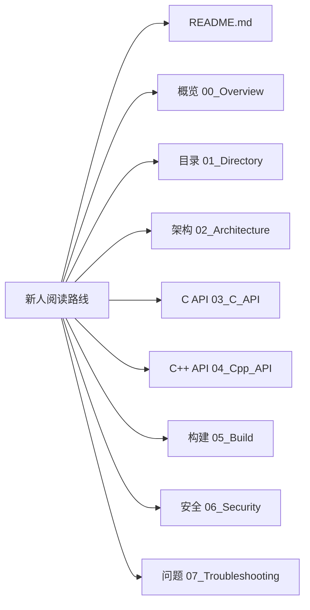

# Resource Management Lite - 工程 Wiki

## 文档说明

本文档为 OpenHarmony `resource_management_lite` 组件的完整工程文档，覆盖组件架构、API 接口、编译配置、安全分析等关键内容。

### 覆盖范围

| 模块 | 状态 | 说明 |
|------|------|------|
| 项目概述 | ✅ | 组件定位、核心能力、运行环境 |
| 目录结构 | ✅ | 模块职责划分、代码组织 |
| C API | ✅ | GLOBAL_* 接口完整清单 |
| C++ API | ✅ | ResourceManager 虚基类接口 |
| 架构设计 | ✅ | 组件图、数据流、关键时序 |
| 构建系统 | ✅ | GN targets、编译产物 |
| **安全分析** | ✅ | **攻击面、ZIP Slip、路径遍历、修复建议** |
| 常见问题 | ✅ | 构建/运行/调试问题 |

### 更新方式

本文档随代码变更手动更新。建议在以下场景后更新文档：

1. 新增/修改/删除 API 接口
2. 变更构建配置或产物
3. 新增安全相关代码
4. 重构模块依赖关系

### 生成信息

- **仓库**: `global_resource_management_lite`
- **组件名**: `@ohos/resource_management_lite`
- **文档版本**: 1.0.0
- **最后更新**: 2024
- **子仓库依赖**: `global_i18n_lite`

### 快速导航

#### 新人阅读路线

#### 安全研究员快速入口

| 主题 | 文档 | 关键内容 |
|------|------|----------|
| **攻击面** | [06_Security_Analysis.md](./06_Security_Analysis.md#2-攻击面分析) | 外部输入点、信任边界 |
| **ZIP漏洞** | [06_Security_Analysis.md#R1](./06_Security_Analysis.md#41-高风险点) | ZIP Slip、元数据溢出 |
| **路径遍历** | [06_Security_Analysis.md#R3](./06_Security_Analysis.md#42-中风险点) | 文件操作风险点 |
| **修复建议** | [06_Security_Analysis.md#5](./06_Security_Analysis.md#5-安全建议) | 代码级修复方案 |

### 相关链接

- [OpenHarmony Globalization 子系统](https://gitee.com/openharmony/docs/blob/master/zh-cn/readme/全球化子系统.md)
- [global_i18n_lite 仓库](https://gitee.com/openharmony/global_i18n_lite)
- [OpenHarmony 官方文档](https://gitee.com/openharmony/docs)

---

*本文档由工程 Wiki 生成器自动生成*
