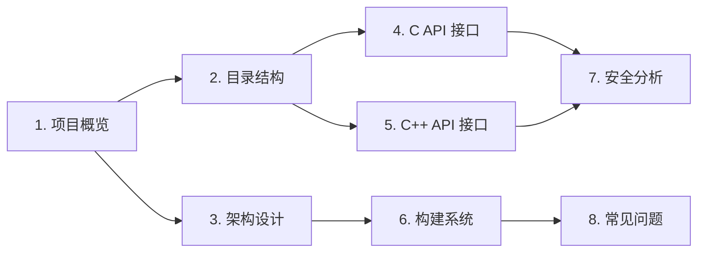
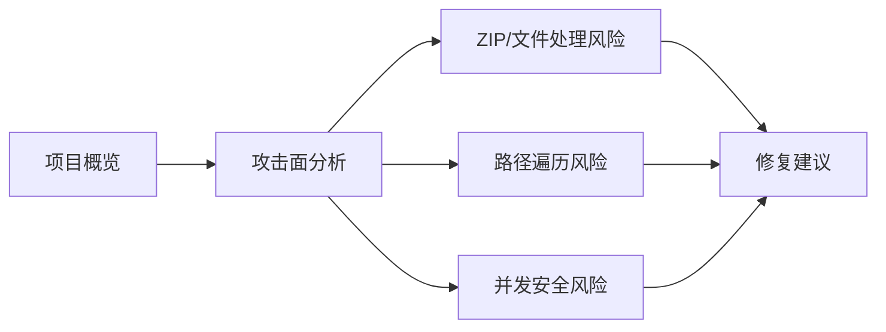

# 文档导航

本文档为 OpenHarmony `resource_management_lite` 组件的完整工程 Wiki，提供新人可快速完整理解项目的多篇 Markdown 文档。

## 新人阅读路线

建议按照以下顺序阅读：

1. **[README.md](./README.md)** - 文档说明、更新方式、覆盖范围
2. **[00_Overview.md](./00_Overview.md)** - 项目定位、核心能力、运行环境、关键概念
3. **[01_Directory_Structure.md](./01_Directory_Structure.md)** - 目录结构与模块职责
4. **[02_Architecture.md](./02_Architecture.md)** - 组件图、数据流、线程模型、关键时序
5. **[03_C_API.md](./03_C_API.md)** - 对外 C 接口 (GLOBAL_*)
6. **[04_Cpp_API.md](./04_Cpp_API.md)** - C++ ResourceManager 接口
7. **[05_Build_System.md](./05_Build_System.md)** - GN targets 与编译产物
8. **[06_Security_Analysis.md](./06_Security_Analysis.md)** - 安全风险评审
9. **[07_Troubleshooting.md](./07_Troubleshooting.md)** - 常见构建/运行/调试问题

## 安全研究员路线

专注攻击面、漏洞分析和安全风险评估的快速路径：

**快速入口**：
- **[06_Security_Analysis.md#攻击面分析](./06_Security_Analysis.md#21-外部输入点)** - 外部输入点与信任边界
- **[06_Security_Analysis.md#高风险点](./06_Security_Analysis.md#41-高风险点)** - ZIP Slip、整数溢出等
- **[06_Security_Analysis.md#中风险点](./06_Security_Analysis.md#42-中风险点)** - 路径遍历、竞争条件
- **[06_Security_Analysis.md#敏感操作清单](./06_Security_Analysis.md#23-敏感操作清单)** - 关键函数定位

**关键漏洞速查**：
| 风险 | 位置 | 严重程度 |
|------|------|----------|
| ZIP Slip | `hap_parser.cpp:50` | 🔴 高危 |
| 整数溢出 | `hap_parser.cpp:72` | 🔴 高危 |
| 路径遍历 | `hap_resource.cpp:88` | 🟡 中危 |
| 竞争条件 | `global.c:39` | 🟡 中危 |

## 文档索引

### 快速参考

| 主题 | 文档 | 关键内容 |
|------|------|----------|
| 项目定位 | 00_Overview | 组件职责、依赖关系 |
| 代码组织 | 01_Directory_Structure | 模块划分、头文件/源文件 |
| 核心流程 | 02_Architecture | 资源加载流程、匹配算法 |
| C 接口 | 03_C_API | GLOBAL_* 函数清单、参数说明 |
| C++ 接口 | 04_Cpp_API | ResourceManager 方法列表 |
| 编译配置 | 05_Build_System | GN targets、依赖关系、产物 |
| 安全分析 | 06_Security_Analysis | 攻击面、风险点、修复建议 |
| 问题排查 | 07_Troubleshooting | 常见错误、调试方法 |

### API 快速查找

#### C API (GLOBAL_*)
- `GLOBAL_GetValueById` - 根据 ID 获取资源 → [03_C_API.md](./03_C_API.md)
- `GLOBAL_GetValueByName` - 根据名称获取资源 → [03_C_API.md](./03_C_API.md)
- `GLOBAL_ConfigLanguage` - 配置语言 → [03_C_API.md](./03_C_API.md)
- `GLOBAL_GetLanguage` - 获取语言 → [03_C_API.md](./03_C_API.md)
- `GLOBAL_GetRegion` - 获取地区 → [03_C_API.md](./03_C_API.md)
- `GLOBAL_IsRTL` - RTL 判断 → [03_C_API.md](./03_C_API.md)

#### C++ API (ResourceManager)
- `AddResource` - 添加资源 → [04_Cpp_API.md](./04_Cpp_API.md)
- `GetStringById/Name` - 获取字符串 → [04_Cpp_API.md](./04_Cpp_API.md)
- `GetBooleanById/Name` - 获取布尔值 → [04_Cpp_API.md](./04_Cpp_API.md)
- `GetIntegerById/Name` - 获取整数值 → [04_Cpp_API.md](./04_Cpp_API.md)
- `GetColorById/Name` - 获取颜色值 → [04_Cpp_API.md](./04_Cpp_API.md)
- 更多方法 → [04_Cpp_API.md](./04_Cpp_API.md)

### 关键数据结构

| 类型 | 定义位置 | 说明 |
|------|----------|------|
| `RState` | rstate.h | 错误码枚举 |
| `ResType` | res_common.h | 资源类型枚举 |
| `KeyType` | res_common.h | 限定符类型枚举 |
| `DeviceType` | res_common.h | 设备类型枚举 |
| `ScreenDensity` | res_common.h | 屏幕密度枚举 |
| `Direction` | res_common.h | 布局方向枚举 |
| `IdItem` | global_utils.h | 资源项结构 |
| `IdHeader` | global_utils.h | ID 头部结构 |

### 编译配置快速参考

| Target | 类型 | 产物 | 位置 |
|--------|------|------|------|
| `global_resmgr` (liteos_m) | static_library | .a | 见 BUILD.gn |
| `global_resmgr` (liteos_a) | shared_library | .so | 见 BUILD.gn |
| `global_resmgr_simulator` | ohos_static_library | .a | 模拟器 |

## 外部链接

- [OpenHarmony 官方文档](https://gitee.com/openharmony/docs)
- [Globalization 子系统说明](https://gitee.com/openharmony/docs/blob/master/zh-cn/readme/全球化子系统.md)
- [global_i18n_lite 仓库](https://gitee.com/openharmony/global_i18n_lite)
- [OpenHarmony Gitee 仓库](https://gitee.com/openharmony)
