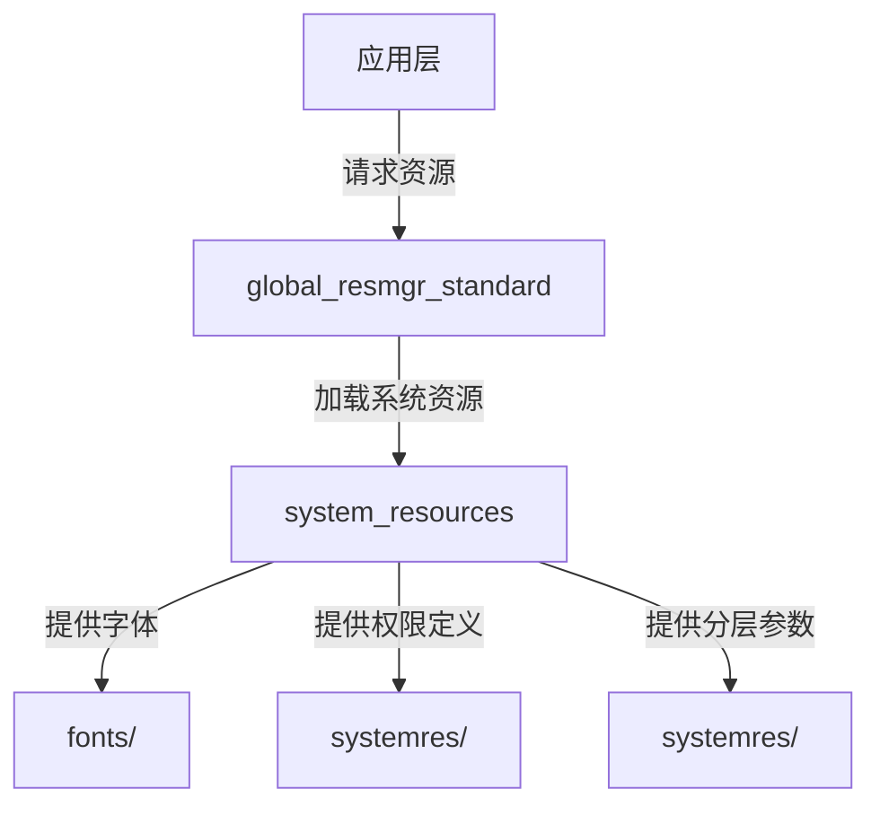

# 项目概览

## 目的

本文档介绍 OpenHarmony `system_resources` 模块的项目定位、核心能力、运行环境与关键概念，帮助开发者快速理解该模块在 OpenHarmony 系统中的角色与职责。

## 适用范围

- **仓库路径**: `/base/global/system_resources`
- **所属子系统**: Globalization (全球化子系统)
- **部件名称**: `system_resources`
- **适用版本**: OpenHarmony 4.0+
- **目标读者**: 系统开发者、UI 设计师、资源管理维护者

## 项目定位

### 角色定义

`system_resources` 是 OpenHarmony Globalizatoin 子系统的核心部件，负责**定义和管理系统级全局资源**。



### 与其他模块的关系

| 依赖模块 | 关系类型 | 说明 |
|----------|----------|------|
| global_resmgr_standard | 下游消费者 | 资源管理服务，消费本模块资源 |
| global_i18n | 依赖 | 国际化能力依赖本模块的字符串资源 |
| aafwk | 依赖 | 应用框架依赖权限定义 |

## 核心能力

### 1. 系统字体管理

| 能力 | 说明 | 证据 |
|------|------|------|
| HarmonyOS Sans 字体族 | 默认系统字体，支持 6 种字重 | README.md:9-13 |
| 多语言支持 | 覆盖 105 种语言 | README.md:15 |
| 符号图标 | HMSymbolVF 系统图标字体 | systemres.gni:138-142 |
| Emoji 支持 | 彩色表情符号兼容 | systemres.gni:120-136 |

### 2. 系统资源包

| 资源类型 | 说明 | 证据 |
|----------|------|------|
| 分层参数 | 系统级 UI 统一参数 | README.md:19 |
| 权限定义 | 100+ 权限名称与描述 | module.json:17-1301 |
| 多语言字符串 | 40+ 语言本地化 | systemres/main/resources/*/ |
| 设备适配 | default/watch/car/tablet 等 | module.json:7-14 |

### 3. 构建产物分发

| 产物类型 | 说明 | 证据 |
|----------|------|------|
| SystemResources.hap | 系统资源安装包 | BUILD.gn:28-42 |
| 字体 .ttf 文件 | 可变字体文件 | BUILD.gn:28-36 |
| 头文件 | 字体配置头文件 | BUILD.gn:41-49 |

## 运行环境

### 构建环境

| 依赖项 | 版本要求 | 说明 |
|--------|----------|------|
| Python | 3.8+ | GN 构建脚本 |
| GN | 最新版 | 生成 Ninja 构建文件 |
| Ninja | 最新版 | 执行构建 |
| HCC | - | OpenHarmony 编译工具链 |

### 运行时依赖

| 依赖项 | 说明 |
|--------|------|
| global_resmgr_standard | 资源管理服务 |
| OpenHarmony 系统 | 4.0+ 版本 |

### 产品适配

| 产品类型 | 支持状态 | 说明 |
|----------|----------|------|
| default | ✅ 支持 | 默认手机/平板产品 |
| watch | ✅ 支持 | 手表产品 |
| car | ✅ 支持 | 车机产品 |
| tv | ✅ 支持 | 电视产品 |
| wearable | ✅ 支持 | 可穿戴产品 |

## 关键概念

### HarmonyOS Sans

华为开发的可变字体（Variable Font），用于全场景体验。

**特性**:
- 6 种字重: Thin, Light, Regular, Medium, Bold, Black
- 105 种语言支持
- 免费商业使用

**字体文件位置**: `fonts/` 目录

### 系统资源包 (SystemResources.hap)

包含系统级资源的 HAP 安装包。

**包含内容**:
- 分层参数 (color_sys.json, float_sys.json)
- 权限定义 (module.json)
- 多语言字符串 (40+ 语言)
- 设备适配资源

**安装路径**: `systemres/main/module.json:32`
```
app/ohos.global.systemres/
```

### 权限定义

系统级权限的元数据定义。

**分级**:
- **normal**: 普通权限 (如 INTERNET, BLUETOOTH)
- **system_basic**: 系统基础权限 (如 READ_CONTACTS, LOCATION)
- **system_core**: 系统核心权限 (如 POWER_MANAGER, INSTALL_BUNDLE)

**授权模式**:
- **system_grant**: 系统自动授予
- **user_grant**: 需要用户授权

### GN 构建配置

使用 GN (Generate Ninja) 作为构建系统配置语言。

**关键配置变量**:
```gn
system_resources_support_ext = false
system_resources_font_feature_product = "default"
```

## 模块边界

### 职责范围 (In Scope)

- ✅ 系统字体文件管理
- ✅ 系统资源包打包
- ✅ 权限定义元数据
- ✅ 多语言字符串资源
- ✅ 分层参数定义
- ✅ 设备适配配置

### 职责范围外 (Out of Scope)

- ❌ 资源解析运行时逻辑 (属于 global_resmgr_standard)
- ❌ 权限检查与鉴权 (属于权限管理服务)
- ❌ 字体渲染 (属于图形子系统)
- ❌ N-API 接口 (本模块不提供 JS API)

## 版本信息

| 属性 | 值 |
|------|-----|
| 模块版本 | 4.0 |
| ROM 占用 | 792KB |
| RAM 占用 | 700KB |
| bundle.json | bundle.json:3 |

## 相关文档

| 文档 | 链接 |
|------|------|
| 全局导航 | [SUMMARY.md](SUMMARY.md) |
| 目录结构 | [01_Directory_Structure.md](01_Directory_Structure.md) |
| 架构设计 | [02_Architecture.md](02_Architecture.md) |
| 构建系统 | [03_Build_System.md](03_Build_System.md) |
| 系统资源 | [04_Resources.md](04_Resources.md) |
| 安全评审 | [05_Security.md](05_Security.md) |
| 常见问题 | [06_FAQ.md](06_FAQ.md) |

## 更新日志

| 日期 | 变更 | 负责人 |
|------|------|--------|
| 2026-02-06 | 初始版本 | Wiki Generator |
