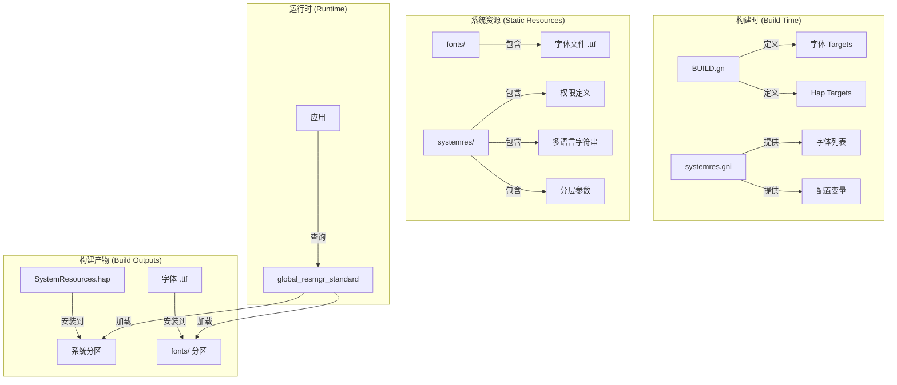
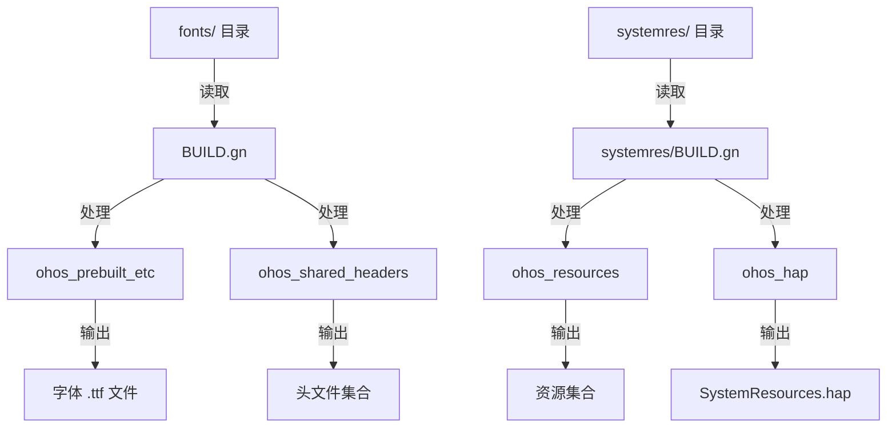
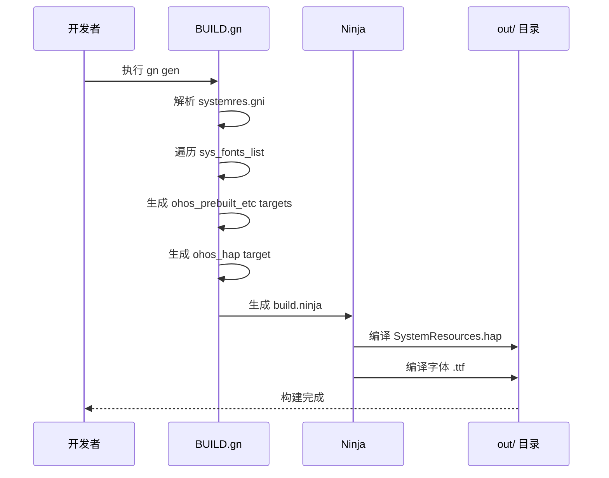
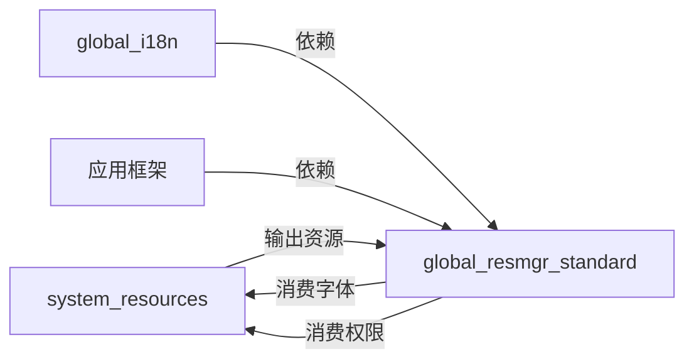

# 架构说明

## 目的

本文档描述 `system_resources` 模块的架构设计，包括组件关系、数据流、线程模型和关键时序，帮助开发者理解系统资源在 OpenHarmony 中的定位与流转。

## 适用范围

- **模块**: `/base/global/system_resources`
- **关注点**: 静态资源包的架构设计
- **不包含**: 运行时逻辑（由 global_resmgr_standard 实现）

## 架构概览

### 组件图



### 模块职责

| 组件 | 职责 | 类型 |
|------|------|------|
| `fonts/` | 存储系统字体文件 | 静态资源 |
| `systemres/` | 存储系统资源包源文件 | 静态资源 |
| `BUILD.gn` | 定义构建 targets | 构建配置 |
| `systemres.gni` | 定义构建变量 | 构建配置 |
| `bundle.json` | 定义模块元信息 | 模块配置 |

## 数据流

### 构建时数据流



### 字体加载数据流

```
fonts/*.ttf
    │
    ▼
BUILD.gn (ohos_prebuilt_etc)
    │
    ▼
out/fonts/*.ttf
    │
    ▼
系统分区 fonts/ 目录
    │
    ▼
global_resmgr_standard (加载并注册)
    │
    ▼
应用通过资源 ID 获取字体
```

## 线程模型

### 关键说明

**本模块为静态资源包，不涉及运行时线程模型。**

资源加载的线程模型由 `global_resmgr_standard` 实现：

| 阶段 | 线程 | 说明 |
|------|------|------|
| 构建时 | 主线程 | GN/Ninja 构建执行 |
| 系统启动 | 主线程 | 资源管理服务初始化 |
| 资源加载 | UI 线程/IO 线程 | 按需加载字体和资源 |

## 关键时序

### 构建时序



### 资源加载时序 (运行时)

```
Note: 本模块不涉及运行时逻辑
以下由 global_resmgr_standard 处理:

1. 系统启动时
   └── global_resmgr_standard 初始化
       └── 解析 SystemResources.hap
       └── 注册字体资源
       └── 注册权限定义

2. 应用请求时
   └── 应用调用资源 API
       └── global_resmgr_standard 定位资源
       └── 返回资源引用/数据
```

## 依赖关系

### 模块间依赖



### 构建依赖

| 依赖项 | 类型 | 说明 |
|--------|------|------|
| `//build/ohos.gni` | 导入 | OpenHarmony GN 模板 | BUILD.gn:13 |
| `//vendor/.../SystemResources.p7b` | 证书 | Hap 签名证书 | systemres.gni:19-20 |
| `//third_party/skia/.../fontconfig.json` | 配置 | 字体配置文件 | systemres.gni:23-26 |

### 被依赖项

| 依赖方 | 依赖内容 | 说明 |
|--------|----------|------|
| global_resmgr_standard | 字体文件、权限定义 | 资源管理服务 |
| 系统框架 | 权限元数据 | 权限校验 |

## 稳定性评估

### 模块稳定性

| 组件 | 稳定性 | 说明 |
|------|--------|------|
| `fonts/` | 高 | 字体文件几乎不变 |
| `systemres/` | 中 | 权限定义可能随版本更新 |
| `BUILD.gn` | 高 | 构建配置稳定 |
| `systemres.gni` | 中 | 字体列表可能更新 |
| `bundle.json` | 高 | 模块元信息稳定 |

### 接口稳定性

| 接口 | 稳定性 | 说明 |
|------|--------|------|
| Hap 包格式 | 高 | 系统级资源包格式稳定 |
| 字体文件格式 | 高 | TTF 格式稳定 |
| 权限定义格式 | 中 | JSON Schema 可能演进 |

## 相关文档

| 文档 | 链接 |
|------|------|
| 全局导航 | [SUMMARY.md](SUMMARY.md) |
| 项目概览 | [00_Overview.md](00_Overview.md) |
| 目录结构 | [01_Directory_Structure.md](01_Directory_Structure.md) |
| 构建系统 | [03_Build_System.md](03_Build_System.md) |
| 系统资源 | [04_Resources.md](04_Resources.md) |
| 安全评审 | [05_Security.md](05_Security.md) |

## 更新日志

| 日期 | 变更 | 负责人 |
|------|------|--------|
| 2026-02-06 | 初始版本 | Wiki Generator |
