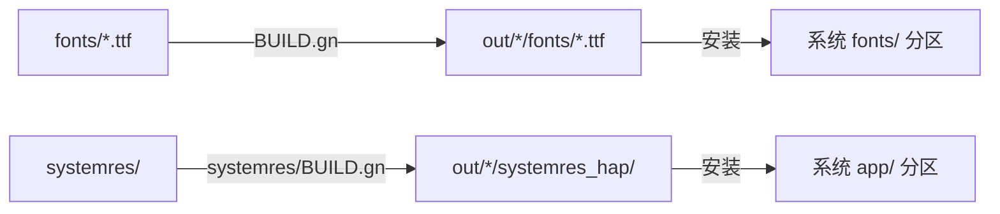

# 构建系统

## 目的

本文档描述 `system_resources` 模块的 GN 构建配置、Targets 定义、编译产物以及产物映射关系，帮助开发者理解构建流程并进行定制。

## 适用范围

- **构建系统**: GN (Generate Ninja)
- **构建工具**: Ninja
- **模块路径**: `/base/global/system_resources`

## 关键构建文件

| 文件 | 路径 | 用途 | 证据 |
|------|------|------|------|
| `BUILD.gn` | `/base/global/system_resources/BUILD.gn` | 根构建配置 | line 1-79 |
| `systemres.gni` | `/base/global/system_resources/systemres.gni` | GN 变量定义 | line 1-174 |
| `systemres/BUILD.gn` | `/base/global/system_resources/systemres/BUILD.gn` | Hap 构建配置 | line 1-43 |

## Targets 清单

### 根 BUILD.gn Targets

#### 1. 字体预构建 Targets

针对 `sys_fonts_list` 中的每个字体文件，生成对应的 `ohos_prebuilt_etc` target。

| Target 模式 | 类型 | 输出 | 证据 |
|-------------|------|------|------|
| `HarmonyOS_Sans` | ohos_prebuilt_etc | fonts/HarmonyOS_Sans.ttf | BUILD.gn:28-36 |
| `HarmonyOS_Sans_Italic` | ohos_prebuilt_etc | fonts/HarmonyOS_Sans_Italic.ttf | BUILD.gn:28-36 |
| `HarmonyOS_Sans_SC` | ohos_prebuilt_etc | fonts/HarmonyOS_Sans_SC.ttf | BUILD.gn:28-36 |
| ... | ohos_prebuilt_etc | ... | systemres.gni:28-173 |

**Target 配置示例**:
```gn
ohos_prebuilt_etc("HarmonyOS_Sans") {
  source = "fonts/HarmonyOS_Sans.ttf"
  module_install_dir = "fonts"
  subsystem_name = "global"
  part_name = "system_resources"
}
```

**条件逻辑**:
```gn
foreach(font, sys_fonts_list) {
  isLoadFont = false
  foreach(device, font.support_devices) {
    if (system_resources_font_feature_product == device) {
      isLoadFont = true
    }
  }
  if (isLoadFont) {
    # 生成 target
  }
}
```

#### 2. ohos_fonts (头文件 Target)

| 属性 | 值 | 证据 |
|------|-----|------|
| 类型 | ohos_shared_headers | BUILD.gn:41 |
| 依赖 | 所有启用的字体 target | BUILD.gn:43-45 |
| subsystem_name | global | BUILD.gn:47 |
| part_name | system_resources | BUILD.gn:48 |

**用途**: 暴露字体配置头文件供其他模块引用

#### 3. copy_preview_fonts (预览器字体)

| 属性 | 值 | 证据 |
|------|-----|------|
| 类型 | ohos_copy | BUILD.gn:51 |
| 输出目录 | target_out_dir + "/previewer/common/bin/fonts/" | BUILD.gn:56-57 |
| subsystem_name | global | BUILD.gn:60 |
| part_name | system_resources | BUILD.gn:61 |

#### 4. copy_preview_fonts_ext (扩展预览器字体)

| 属性 | 值 | 证据 |
|------|-----|------|
| 类型 | ohos_copy | BUILD.gn:64 |
| 输出目录 | target_out_dir + "/previewer/resources/fonts/" | BUILD.gn:72-73 |
| 额外源 | fontconfig.json, fontconfig_ohos.json | BUILD.gn:65-68 |
| subsystem_name | global | BUILD.gn:76 |
| part_name | system_resources | BUILD.gn:77 |

### systemres/BUILD.gn Targets

#### 1. main_app_res (应用范围资源)

| 属性 | 值 | 证据 |
|------|-----|------|
| 类型 | ohos_app_scope | BUILD.gn:17 |
| app_profile | AppScope/app.json | BUILD.gn:18 |
| sources | AppScope/resources | BUILD.gn:19 |

#### 2. main_res (主资源)

| 属性 | 值 | 证据 |
|------|-----|------|
| 类型 | ohos_resources | BUILD.gn:22 |
| sources | main/resources | BUILD.gn:23 |
| deps | :main_app_res | BUILD.gn:24 |
| hap_profile | ./main/module.json | BUILD.gn:25 |

#### 3. systemres_hap (系统资源 Hap)

| 属性 | 值 | 证据 |
|------|-----|------|
| 类型 | ohos_hap | BUILD.gn:28 |
| hap_name | SystemResources | BUILD.gn:31 |
| module_install_dir | app/ohos.global.systemres | BUILD.gn:32 |
| hap_profile | ./main/module.json | BUILD.gn:30 |
| certificate_profile | ./SystemResources.p7b | BUILD.gn:33 |
| subsystem_name | global | BUILD.gn:34 |
| part_name | system_resources | BUILD.gn:35 |

**签名配置**:
```gn
certificate_profile = "${certificate_profile_path}"
key_alias = "OHSystemResources"
private_key_path = "OHSystemResources"
compatible_version = "9"
```

## 配置变量

### systemres.gni 全局变量

| 变量 | 类型 | 默认值 | 说明 | 证据 |
|------|------|--------|------|------|
| `system_resources_support_ext` | bool | false | 是否支持扩展 | systemres.gni:15 |
| `system_resources_font_feature_product` | string | "default" | 产品字体特性 | systemres.gni:16 |
| `certificate_profile_path` | string | vendor 路径 | 证书路径 | systemres.gni:19-20 |
| `fontconfig_path` | string | skia 路径 | 字体配置 | systemres.gni:23-24 |
| `fontconfig_ohos_path` | string | skia 路径 | Ohos 字体配置 | systemres.gni:25-26 |
| `sys_fonts_list` | list | [...] | 字体列表 | systemres.gni:28-173 |

### 字体列表配置

```gn
sys_fonts_list = [
  {
    font_name = "HarmonyOS_Sans"
    font_path = "fonts/HarmonyOS_Sans.ttf"
    support_devices = ["default", "watch"]
    alias_name = ""
  },
  # ... 更多字体
]
```

**字体属性说明**:
| 属性 | 类型 | 说明 |
|------|------|------|
| `font_name` | string | GN target 名称 |
| `font_path` | string | 源文件路径 |
| `support_devices` | list | 支持的设备类型 |
| `alias_name` | string | 输出别名 |

### 设备类型支持

| 设备类型 | 支持状态 | 说明 |
|----------|----------|------|
| default | ✅ | 默认手机/平板 |
| watch | ✅ | 手表 |
| tv | ⚠️ | 需额外配置 |
| car | ⚠️ | 需额外配置 |
| wearable | ⚠️ | 需额外配置 |

## 编译产物

### 产物清单

| 产物 | 类型 | 路径 | 用途 |
|------|------|------|------|
| SystemResources.hap | Hap 包 | out/.../systemres_hap/ | 系统资源安装 |
| *.ttf | 字体文件 | out/.../fonts/ | 字体运行时加载 |
| 头文件 | .h | out/.../headers/ | 模块间引用 |

### 产物映射



### 运行时加载关系

```
SystemResources.hap
    │
    ▼
/system/app/ohos.global.systemres/
├── module.json          # 权限定义
└── resources/           # 字符串/参数资源
    ├── default/
    ├── zh_CN/
    └── ...

字体文件
    │
    ▼
/system/fonts/
├── HarmonyOS_Sans.ttf
├── HMSymbolVF.ttf
└── ...
```

## 定制指南

### 新增字体

1. 将字体文件放入 `fonts/` 目录
2. 在 `systemres.gni` 的 `sys_fonts_list` 中添加配置
3. 提交变更

### 新增设备支持

1. 修改 `font.support_devices` 列表
2. 或设置 `system_resources_font_feature_product` 变量

### 新增权限定义

在 `systemres/main/module.json` 的 `definePermissions` 数组中添加:
```json
{
  "name": "ohos.permission.NEW_PERMISSION",
  "grantMode": "system_grant",
  "availableLevel": "system_basic",
  "since": X,
  "provisionEnable": true,
  "distributedSceneEnable": false
}
```

## 相关文档

| 文档 | 链接 |
|------|------|
| 全局导航 | [SUMMARY.md](SUMMARY.md) |
| 项目概览 | [00_Overview.md](00_Overview.md) |
| 目录结构 | [01_Directory_Structure.md](01_Directory_Structure.md) |
| 系统资源 | [04_Resources.md](04_Resources.md) |
| 安全评审 | [05_Security.md](05_Security.md) |

## 更新日志

| 日期 | 变更 | 负责人 |
|------|------|--------|
| 2026-02-06 | 初始版本 | Wiki Generator |
