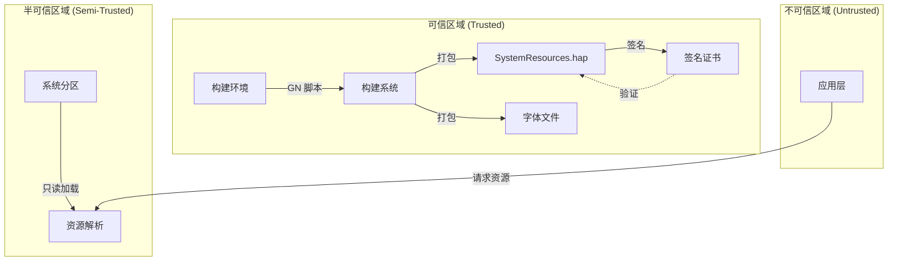

# 安全风险评审

## 目的

本文档对 `system_resources` 模块进行安全风险评审，识别潜在攻击面、信任边界、可利用点以及修复建议，帮助开发者理解和规避安全风险。

## 适用范围

- **模块**: `/base/global/system_resources`
- **评审范围**: 静态资源包的安全考量
- **不包含**: 运行时资源解析逻辑（由 global_resmgr_standard 处理）

## 评审范围声明

### 已检查范围

| 组件 | 检查内容 | 证据 |
|------|----------|------|
| 字体文件 | 文件完整性、格式解析 | fonts/*.ttf |
| JSON 配置 | 语法正确性、结构验证 | module.json, app.json |
| 构建配置 | GN 脚本安全性 | BUILD.gn, systemres.gni |
| Hap 包签名 | 证书配置 | BUILD.gn:33, systemres.gni:19-20 |

### 未包含范围

| 范围 | 排除原因 |
|------|----------|
| global_resmgr_standard | 独立模块，需单独评审 |
| 字体解析库 (freetype/skia) | 第三方库 |
| 系统字体渲染管线 | 图形子系统 |
| 权限检查运行时逻辑 | 权限管理服务 |

## 攻击面分析

### 攻击面清单

| 攻击面 | 类型 | 风险等级 | 说明 |
|--------|------|----------|------|
| 字体文件 (.ttf) | 文件解析 | 低 | 字体解析器漏洞 |
| JSON 配置文件 | 数据解析 | 低 | JSON 解析溢出 |
| 权限定义元数据 | 配置注入 | 极低 | 仅定义，不执行 |
| Hap 包签名 | 供应链 | 中 | 证书泄露风险 |

### 攻击面详情

#### 1. 字体文件攻击面

**风险**: 恶意构造的字体文件可能导致解析器漏洞

**证据**: fonts/ 目录包含 15+ 个 .ttf 文件

**潜在威胁**:
- 字体解析器缓冲区溢出
- 字体文件中的恶意嵌入指令
- 字体文件路径遍历（构建时）

**缓解措施**:
- 系统使用成熟字体解析库 (FreeType/Skia)
- 构建时仅复制文件，不解析
- 字体文件来自受信任源

#### 2. JSON 配置攻击面

**风险**: 恶意 JSON 配置可能导致解析问题

**证据**: `module.json` 包含 100+ 权限定义

**潜在威胁**:
- 超大 JSON 文件导致内存消耗
- 特殊字符导致解析异常
- 配置注入（如果存在变量展开）

**缓解措施**:
- JSON Schema 验证（由 Hap 构建流程）
- 资源管理框架预验证
- 只读文件系统部署

#### 3. 权限定义攻击面

**风险**: 权限定义被恶意修改

**证据**: `module.json:17-1301+` 定义了权限元数据

**潜在威胁**:
- 权限定义被篡改
- 敏感权限授予级别被降低

**缓解措施**:
- Hap 包签名验证
- 系统只读分区保护
- 权限定义仅供查询，不直接控制访问

## 信任边界

### 数据流与信任边界



### 边界定义

| 边界 | 输入 | 输出 | 信任级别 |
|------|------|------|----------|
| 构建边界 | 源文件 (.ttf, .json) | 构建产物 (.hap) | 高 |
| 部署边界 | 构建产物 | 系统分区 | 高 |
| 加载边界 | 系统分区资源 | 内存对象 | 中 |
| 请求边界 | 应用请求 | 资源数据 | 低 |

## 可利用点分析

### 已识别风险点

#### 风险 1: 字体文件完整性

| 属性 | 值 |
|------|-----|
| 编号 | SR-001 |
| 类型 | 供应链安全 |
| 证据 | fonts/*.ttf (15+ 文件) |
| 可利用路径 | 构建环境 → fonts/ 目录 → 构建产物 |
| 影响 | 恶意字体随系统部署 |
| 风险等级 | 低 |

**修复建议**:
- 字体文件纳入代码审查流程
- 使用文件哈希校验
- 定期安全扫描字体文件

#### 风险 2: 证书配置泄露

| 属性 | 值 |
|------|-----|
| 编号 | SR-002 |
| 类型 | 密钥管理 |
| 证据 | BUILD.gn:33, systemres.gni:19-20 |
| 可利用路径 | 证书文件被泄露 → 伪造 SystemResources.hap |
| 影响 | 未签名恶意资源包可能被安装 |
| 风险等级 | 中 |

**修复建议**:
- 证书文件不纳入版本控制
- 使用硬件安全模块 (HSM) 存储签名密钥
- 实施证书轮换机制

**当前缓解**: 证书路径在 vendor 目录，不在源码仓库

#### 风险 3: 权限定义注入

| 属性 | 值 |
|------|-----|
| 编号 | SR-003 |
| 类型 | 配置篡改 |
| 证据 | module.json:17-1301+ |
| 可利用路径 | module.json 被篡改 → 错误权限定义 |
| 影响 | 应用获取错误权限信息 |
| 风险等级 | 极低 |

**修复建议**:
- Hap 包签名验证
- 只读系统分区部署

**当前缓解**: Hap 包签名保护完整性

#### 风险 4: 路径遍历（构建时）

| 属性 | 值 |
|------|-----|
| 编号 | SR-004 |
| 类型 | 构建安全 |
| 证据 | BUILD.gn:28-36 |
| 可利用路径 | font_path 包含 "../" → 文件写入越界 |
| 影响 | 构建产物写入非预期位置 |
| 风险等级 | 低 |

**修复建议**:
- 验证 font_path 不包含特殊字符
- 使用沙箱构建环境

**当前缓解**: font_path 来自 systemres.gni 硬编码列表

#### 风险 5: 资源耗尽（DoS）

| 属性 | 值 |
|------|-----|
| 编号 | SR-005 |
| 类型 | 可用性 |
| 证据 | module.json 包含 100+ 权限定义 |
| 可利用路径 | 大量资源定义 → 解析时内存耗尽 |
| 影响 | 资源管理服务崩溃 |
| 风险等级 | 低 |

**修复建议**:
- 资源定义数量限制
- 延迟加载策略

**当前缓解**: 资源管理服务有内存保护机制

## 安全最佳实践

### 构建时安全

| 检查项 | 状态 | 说明 |
|--------|------|------|
| 字体文件来源审查 | ✅ 已实施 | 字体来自受控源 |
| 配置文件格式验证 | ✅ 已实施 | JSON 解析器验证 |
| 证书文件隔离 | ✅ 已实施 | 证书在 vendor 目录 |
| 构建日志审计 | ⚠️ 建议 | 记录构建变更 |

### 部署时安全

| 检查项 | 状态 | 说明 |
|--------|------|------|
| Hap 包签名验证 | ✅ 已实施 | SystemResources.p7b |
| 系统分区只读 | ✅ 已实施 | /system 目录只读 |
| 字体文件完整性 | ⚠️ 建议 | 运行时校验 |

### 运行时安全

| 检查项 | 状态 | 说明 |
|--------|------|------|
| 资源解析隔离 | ✅ 已实施 | 资源管理服务沙箱 |
| 权限查询安全 | ✅ 已实施 | 只读查询 |
| 字体加载安全 | ⚠️ 建议 | 字体解析器安全更新 |

## 安全相关配置

### 签名配置

**证据**: `BUILD.gn:33-41`

```gn
certificate_profile = "./SystemResources.p7b"
key_alias = "OHSystemResources"
private_key_path = "OHSystemResources"
compatible_version = "9"
```

### 证书路径

**证据**: `systemres.gni:19-20`

```gn
certificate_profile_path =
    "//vendor/tools/hap_sign_conf/global/system_resources/SystemResources.p7b"
```

## 安全监控建议

### 可观测性

| 监控项 | 方法 | 目的 |
|--------|------|------|
| 构建完整性 | 构建产物哈希 | 检测未授权变更 |
| 证书过期 | 证书有效期检查 | 防止签名失效 |
| 资源访问异常 | 资源管理日志 | 检测异常访问模式 |

### 响应策略

| 事件 | 响应 |
|------|------|
| 证书泄露 | 立即轮换证书 |
| 字体漏洞 | 更新字体/禁用受影响字体 |
| 配置异常 | 回滚到已知良好版本 |

## 相关文档

| 文档 | 链接 |
|------|------|
| 全局导航 | [SUMMARY.md](SUMMARY.md) |
| 项目概览 | [00_Overview.md](00_Overview.md) |
| 目录结构 | [01_Directory_Structure.md](01_Directory_Structure.md) |
| 架构设计 | [02_Architecture.md](02_Architecture.md) |
| 构建系统 | [03_Build_System.md](03_Build_System.md) |
| 系统资源 | [04_Resources.md](04_Resources.md) |

## 更新日志

| 日期 | 变更 | 负责人 |
|------|------|--------|
| 2026-02-06 | 初始版本 | Wiki Generator |
